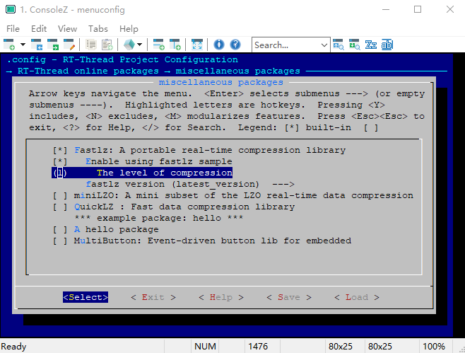

# FastLZ

中文页 | [English](README.md)

## 1、介绍

FastLZ 是一个快速无损压缩库， 仅包含两个文件， 使用简单， 易于集成。 这个 [FastLZ](https://github.com/RT-Thread-packages/fastlz) 库是 RT-thread 针对官方[FastLZ](http://fastlz.org/download.htm)的C库的移植， 有关 fastlz 的更多信息，请参阅[http://fastlz.org/index.html](http://fastlz.org/index.html) 。

## 2、获取方式

- 使用 menuconfig
```
  RT-Thread online packages --->
      miscellaneous packages --->
          [*] Fastlz: A portable real-time compression library
```

## 3、示例介绍

### 3.1 获取示例

- 配置使能示例选项 `Enable using fastlz sample`;
- 配置压缩等级选项，配置为level 1（有两种等级 1 or 2，level 1 压缩速度最快， level 2 压缩比大）;
- 配置包版本选为最新版 `latest_version` .



### 3.2 运行示例
该示例为一个简单的文件压缩和解压的例程，需要依赖文件系统，用到的命令有两个` -c`和 `-d`， `-c`命令压缩一个文件到另一个文件，`-d`命令解压一个文件到另一个文件。   
使用方式：  
msh cmd 压缩： `fastlz_test -c /file.bin /file.cmprs.bin`  
msh cmd 解压： `fastlz_test -d /file.cmprs.bin /file_dcmprs.bin`  

    msh />fastlz_test -c /file.bin /file.cmprs.bin
    [fastlz]compress start : >>>>>>>>>>>>>>>>>>>>>>>>>>>>>>>>>>>>>>>>>>>>>>>>>>>>>>>>>>>>>>>>>>>>>>>>
    [fastlz]compressed 469848 bytes into 363495 bytes , compression ratio is 77%!
    msh />
    msh />fastlz_test -d /file.cmprs.bin /file_dcmprs.bin
    [fastlz]decompress start : >>>>>>>>>>>>>>>>>>>>>>>>>>>>>>>>>>>>>>>>>>>>>>>>>>>>>>>>>>>>>>>>>>>>>>>>
    [fastlz]decompressed 363495 bytes into 469848 bytes !

## 4、注意事项

### 4.1 与官方源码差异

  FastLZ 源码中使用了静态内存分配，预置了一个 32Kbytes 大小的 buffer，占用堆栈资源过大，修改了源码，使用动态内存分配替换原有的静态内存分配。

  对源码 `fastlz.c` 进行如下变动，移植官方代码的时候需要注意：

  1. 添加动态内存分配定义
  ```C
#include <rtthread.h>

#define malloc     rt_malloc
#define free       rt_free
  ```

  2. 使用 `malloc` 为 `htab` 分配内存
  ```C
const flzuint8* htab[HASH_SIZE];
  ```
替换为
  ```C
const flzuint8** htab = (const flzuint8**)malloc(sizeof(flzuint8*) * HASH_SIZE);
  ```

  3. 在 `return` 前使用 `free` 释放内存

## 5、参考资料

- FastLZ 官方网站：[http://fastlz.org/index.html](http://fastlz.org/support.htm)

