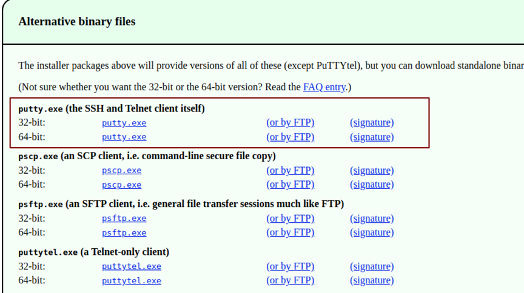
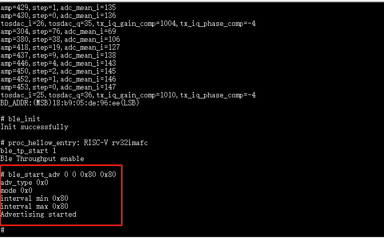
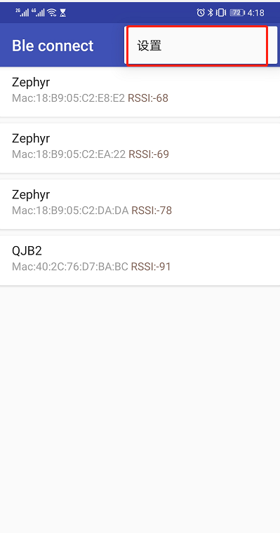
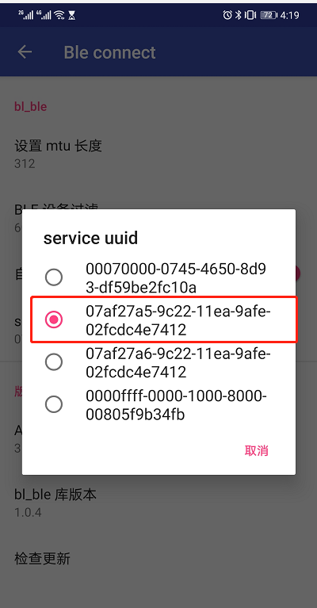
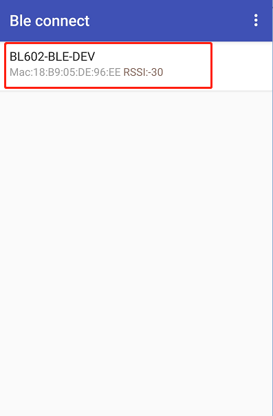
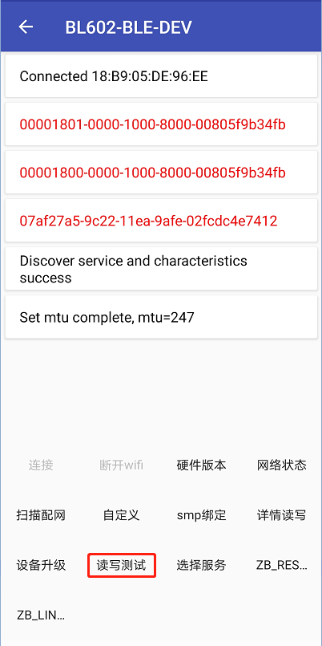
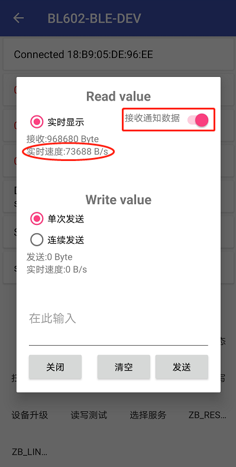

==============
准备
==============
1. 硬件：BL602模块一个，Windows PC一台，USB转串口线一根，安卓手机一台（本文档中测试手机型号：Mate30 pro 5g,系统版本：11.0.0.168(C00E160R5P11)）
2. 软件：烧写工具，烧录bl602_demo_event.bin文件，
路径：bouffalolab_release_bl_iot_sdk.zip/App_Demos/bl602_demo_event/build_out/bl602_demo_event.bin ,串口工具putty。
（\ `下载链接 <https://www.chiark.greenend.org.uk/~sgtatham/putty/latest.html>`__\）

   Putty下载
   
3. 安装App ble connect 版本号为3.3(此APK在评估包内)

==================
烧录
==================

连接
========
BL602模块正面图，如图所示。用USB线连接PC和模块，此时模块上的电源灯常亮，表明模块通电正常。

.. figure:: picture/image2.png
   :align: center

   正面

软件下载
==========
1. 用USB线连接PC和模块，长按框2中的Boot按键，然后短按框1中的Rst按键，最后释放框2中的Boot按键，使芯片进入下载模式

.. figure:: picture/image3.png
   :align: center

   正面

2. 打开解压后文件中的烧写工具flash_tool目录，双击BLDevCube.exe，chip type选择BL602/604，打开后界面参数参考下图配置：

.. figure:: picture/image4.png
   :align: center

   烧写工具界面

其中上图框1中COM Port选项根据实际串口情况选择（右击我的电脑->管理->设备管理器->端口，查看端口号，模块是双串口，选择端口号较小的），框2中的相关路径依据实际情况选择。配置完成后点击Download按钮下载。

串口工具配置
===============
重新上电，打开串口工具，设置对应的端口号，波特率设定为2000000 bps。

.. figure:: picture/image5.png
   :align: center

   串口工具

==================
App与bl602设备连接,测试throughput
==================

1. 重启板子，在putty中运行ble相关命令：

   #stack_ble
   
   #ble_init
   
   #ble_tp_start 1
   
   #ble_start_adv 0 0 0x80 0x80
  

   
   Ble开始广播
 
2. 打开APP,设置相应的参数：

   设置按钮
   

   选择服务   
 
3. APP中连接相应的设备
 

   
   选择设备
   
4. 在putty中运行更新BLE连接参数命令：
	
   #ble_conn_update  0x14 0x14 0x0 0x1f4
   
.. figure:: picture/image68.png
   :align: center 
   
   更新BLE连接参数
   
4. App界面中选择读写测试选项:

	APP中读写测试
     
5. App中点击接收通知数据选项，查看BLE速率：

   
   Ble速率
   