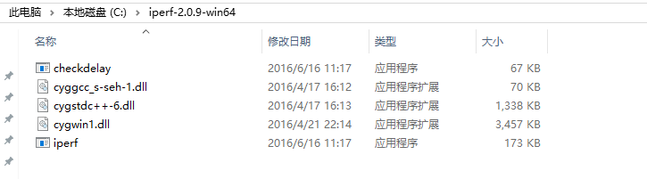
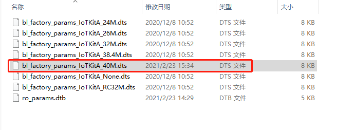
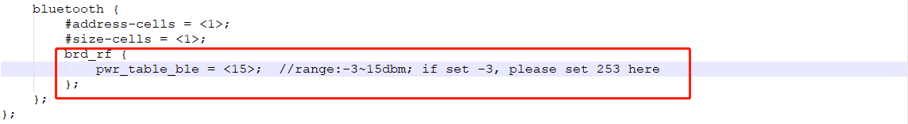

==============
准备
==============
1. 硬件：BL602模块一个，Windows PC一台，USB转串口线一根。
2. 软件：烧写工具，烧录bl602_demo_event.bin文件，
路径：bouffalolab_release_bl_iot_sdk_1.5.12-5-g6a078b47_bins.zip/App_Demos/bl602_demo_event/build_out/bl602_demo_event.bin，串口工具putty。
（\ `下载链接 <https://www.chiark.greenend.org.uk/~sgtatham/putty/latest.html>`__\）

.. figure:: picture/image1.png
   :align: center

   Putty下载
   
3. 安装App ble connect 版本号为3.3(此APK在评估包内)

==================
烧录
==================

连接
========
BL602模块正面图，如图所示。用USB线连接PC和模块，此时模块上的电源灯常亮，表明模块通电正常。

.. figure:: picture/image2.png
   :align: center

   正面

软件下载
==========

1. 用USB线连接PC和模块，长按框2中的Boot按键，然后短按框1中的Rst按键，最后释放框2中的Boot按键，使芯片进入下载模式

.. figure:: picture/image3.png
   :align: center

   正面
   
2. 打开解压后文件中的烧写工具flash_tool目录，双击BLDevCube.exe，chip type选择BL602/604，打开后界面参数参考下图配置：

.. figure:: picture/image4.png
   :align: center

   烧写工具界面
   
其中上图中的框1中COM Port选项根据实际串口情况选择（右击我的电脑->管理->设备管理器->端口，查看端口号，模块是双串口，选择端口号较小的），框2中的相关路径依据实际情况选择。配置完成后点击Download按钮下载。

putty配置
===============
重新上电，打开putty工具，设置对应的端口号，波特率设定为2000000 bps。

.. figure:: picture/image5.png
   :align: center

   Putty

===================
功耗测量环境
===================

软件下载成功后，对iot模块进行电流测试需要进行以下的硬件改动，默认情况下BL602 iot模块的双排插针上不需要装配跳帽;

1. 去掉底板给模组供电的0ohm电阻R12，如下图所示

.. figure:: /picture/image73.png
   :align: center

2. 用**电流表**串接到底板的以下两根插针VDD33MOD和VDD33，即可测量BL602模组的电流

  说明：电流表量程建议>500mA

.. figure:: /picture/image74.png
   :align: center

.. figure:: /picture/image75.png
   :align: center

3. 电流测量完毕后，移走电流表，继续使用模块需要在VDD33MOD和VDD33两根插针上装配一个跳帽，或者恢复之前去掉的0ohm电阻R12

.. figure:: /picture/image76.png
   :align: center

===================
iperf测试准备
===================
1. Window PC安装iperf工具：
\ `Iperf下载链接 <https://iperf.fr/iperf-download.php#windows>`__\，（下载的2.0.9版本）下载完之后解压得到iperf-2.0.9-win64文件，使用快捷键WIN + R ，启动运行窗口，输入cmd，点击确定按钮，进入iperf工具所在的目录（本示例iperf工具放在c盘的根目录下）。

   解压后的文件

.. figure:: picture/image7.png
   :align: center

   cmd界面

2.PC与路由器通过有线连接。

==================
测试步骤
==================
连接好电流测量仪器

Wi-Fi关闭模式电流测试
==========================
板子上电后不需要输入任何命令直接测试平均电流和最大电流即可。

连接AP模式电流测试
====================
重启板子，在putty中输入依次命令“stack_wifi”，“wifi_sta_connect ssid passwd”(ssid:需要连接的ap名，passwd:密码)；测试平均电流和最大电流，最大值每30s出现一次。

连接AP并发UDP包模式电流测试
=============================
重启板子，bl602作为client，PC作为server。

1. router ssid: bl_test_008，passwd: 12345678
2. 在PC 的cmd界面运行命令：$iperf.exe -s -u -i 1

.. figure:: picture/image8.png
   :align: center

   PC端Iperf开启sever模式

3. 在putty中运行命令：

   #stack_wifi

   #wifi_sta_connect bl_test_008 12345678   (连接成功后会获取IP地址)

.. figure:: picture/image9.png
   :align: center

   模块成功连接WiFi

#ipu 192.168.8.101			(192.168.8.101是PC的IP地址)

.. figure:: picture/image10.png
   :align: center

   模块开启ipu

.. figure:: picture/image11.png
   :align: center

   Sever端数据

SoftAP模式电流测试
=======================
重启板子，在putty中依次输入命令“stack_wifi”，“wifi_ap_start”,用手机连接此AP后开始测试平均电流和最大电流。

Easylink模式电流测试
=======================
重启板子，在putty中输入依次命令“stack_wifi”，“wifi_sniffer_on”后开始测试平均电流和最大电流。

BLE TX模式电流测试(15dBm)
=======================

1. 在烧录工具中找到dts文件，其路径在评估包的 bl602/device_tree目录下，修改TX Power为15dBm,然后烧录相应的Bin文件

   
   DTS路径
   

   
   修改为15dbm

2. 重启板子，在putty中依次输入命令

   #stack_ble
   
   #ble_init
   
   #ble_tp_start 1
   
   #ble_start_adv 0 0 0x80 0x80
   
.. figure:: picture/image64.png
   :align: center
   
3. 打开APP,设置相应的参数

.. figure:: picture/image65.png
   :align: center 
   
   设置选项
   
.. figure:: picture/image66.png
   :align: center 
   
   选择相应服务
   
4. APP中连接相应的设备
   
.. figure:: picture/image67.png
   :align: center 
   
   选择设备

5. App界面中选择读写测试选项:

.. figure:: picture/image69.png
	:align: center 

	读写测试选项
     
6. App中点击接收通知数据选项，查看BLE速率：

.. figure:: picture/image70.png
   :align: center 
   
   Ble速率
   
6. 测试此时设备的平均电流和最大电流

BLE RX模式电流测试
=======================
重启板子，在putty中依次输入命令“stack_ble”，“ble_start_scan 0 0 0x80 0x80”,后测试平均电流和最大电流。