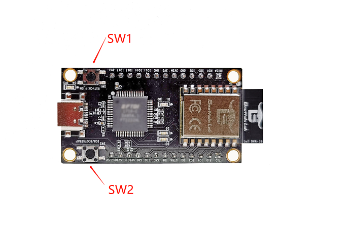
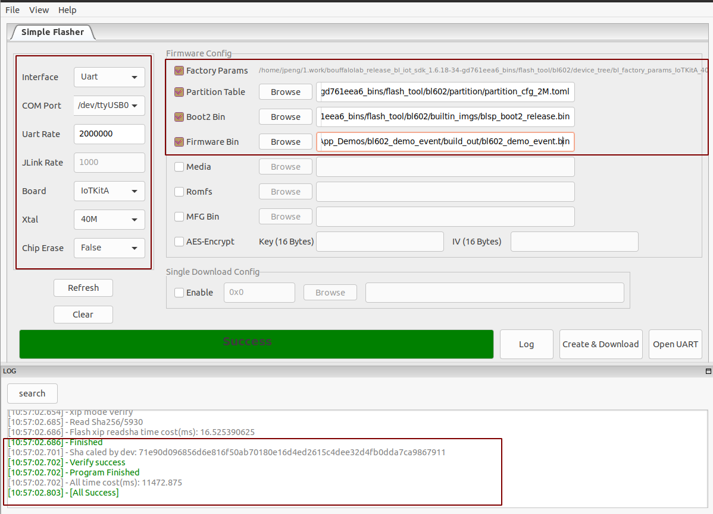
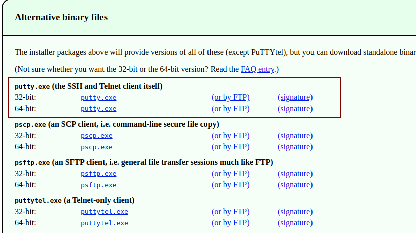
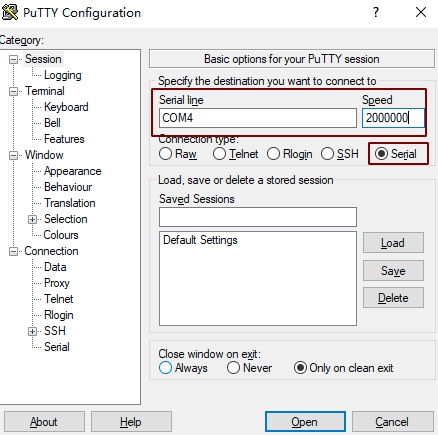
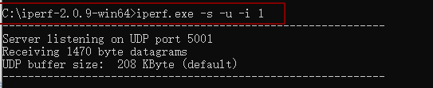

==============
iperf测试准备
==============
1. Window PC安装iperf工具：

\ `Iperf下载链接 <https://iperf.fr/iperf-download.php#windows>`__\ ，（下载的2.0.9版本）下载完之后解压得到\ ``iperf-2.0.9-win64``\文件，使用快捷键\ ``WIN + R``\ ，启动运行窗口，输入\ ``cmd``\，点击确定按钮，进入\ ``iperf``\工具所在的目录（本示例\ ``iperf``\工具放在c盘的根目录下）。

.. figure:: picture/image51.png
   :align: center

   解压后的文件

.. figure:: picture/image52.png
   :align: center

   cmd界面

2. PC与路由器通过有线连接

3. 烧录：将BL602模组用串口线与电脑连接，打开烧写工具\ ``Bouffalo Lab Dev Cube``\中的\ ``BLFlashEnv.exe``\，\ ``chip type``\选择\ ``BL602/604``\，打开后设置界面参数，配置完后，按住模组上的按键SW2不松，同时按一下按键SW1，松开SW1和SW2，点击烧录工具上的\ ``Creat&Download``\，配置及下载完成效果如下图所示：

   模组

   烧写工具界面

其中烧写工具的左框中COM Port选项根据实际串口情况选择（右击我的电脑->管理->设备管理器->端口，查看端口号，模块是双串口，选择端口号较小的），右框中的相关路径依据实际情况选择。

4. 串口工具\ ``putty``\的使用：

\ `下载链接 <https://www.chiark.greenend.org.uk/~sgtatham/putty/latest.html>`__\

   putty下载界面

将BL602模组用串口线与电脑连接，右击我的电脑->管理->设备管理器->端口，查看端口号，一般选择较小的端口号用来配置\ ``putty``\。

.. figure:: picture/image58.png
   :align: center

   查看串口号

打开\ ``putty``\工具，设置对应的端口号，波特率设定为2000000 bps。按一下按键SW1可以重启模组。

   putty配置

==================
ipu/UDP Tx测试
==================
bl602作为\ ``client``\，PC作为\ ``server``\

1. router ssid: \ ``bl_test_008``\，passwd: \ ``12345678``\
2. 在PC 的cmd界面运行命令：\ ``$iperf.exe -s -u -i 1``\

   PC端Iperf开启sever模式

3. 在putty中运行命令：

   - \ ``#wifi_sta_connect bl_test_008 12345678``\   (连接成功后会获取IP地址)

   .. figure:: picture/image61.png
      :align: center

      模块成功连接WiFi

   - \ ``#ipu 192.168.8.101``\  (192.168.8.101是PC的IP地址)

   .. figure:: picture/image62.png
      :align: center

      模块开启ipu

   .. figure:: picture/image63.png
      :align: center

      Sever端数据

===============
ipc/TCP Tx测试
===============
bl602作为\ ``client``\，PC作为\ ``server``\

1. router ssid: \ ``bl_test_008``\，passwd: \ ``12345678``\
2. PC运行命令： \ ``$iperf -s -i 1``\
3. 启动bl602模组，运行命令：

   - \ ``#wifi_sta_connect bl_test_008 12345678``\   (连接成功后会获取IP地址)
   - \ ``#ipc 192.168.8.101``\  (192.168.8.101是PC的IP地址)

===================
ips/TCP Rx测试
===================
bl602作为\ ``server``\，PC作为\ ``client``\

1. router ssid: \ ``bl_test_008``\，passwd: \ ``12345678``\
2. 启动\ ``bl602``\模组，运行命令：

   - \ ``#wifi_sta_connect bl_test_008 12345678``\   (连接成功后会获取IP地址)
   - \ ``#ips``\
3. PC运行命令：\ ``$iperf.exe -c 192.168.8.100 -t 360 -i 1``\   (192.168.8.100是模组的IP地址)

=====================
ipus/UDP Rx测试
=====================
bl602作为\ ``server``\，PC作为\ ``client``\

1. router ssid: \ ``bl_test_008``\，passwd: \ ``12345678``\
2. 启动\ ``bl602``\模组，运行命令：

   - \ ``#wifi_sta_connect bl_test_008 12345678``\   (连接成功后会获取IP地址)
   - \ ``#ipus``\
3. PC运行命令：\ ``$iperf.exe -u -c 192.168.8.100 -t 360 -i 1``\   (192.168.8.100是模组的IP地址)