==============
准备
==============
1. 硬件：BL602模块一个，Windows PC一台，USB转串口线一根。
2. 软件：烧写工具，烧录bl602_demo_event.bin文件，
路径：bouffalolab_release_bl_iot_sdk.zip/App_Demos/bl602_demo_event/build_out/bl602_demo_event.bin ,选择任意一款串口工具
3. 手机上下载任意一款蓝牙调试APP.

==================
烧录
==================

连接
========
BL602模块正面图，如图所示。用USB线连接PC和模块，此时模块上的电源灯常亮，表明模块通电正常。

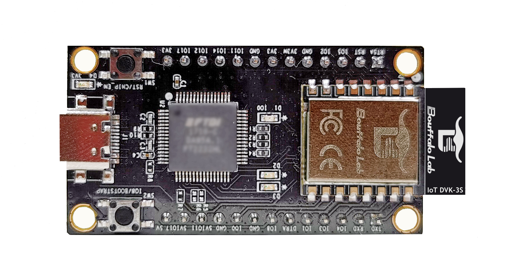

   正面

软件下载
==========
1. 用USB线连接PC和模块，长按框2中的Boot按键，然后短按框1中的Rst按键，最后释放框2中的Boot按键，使芯片进入下载模式

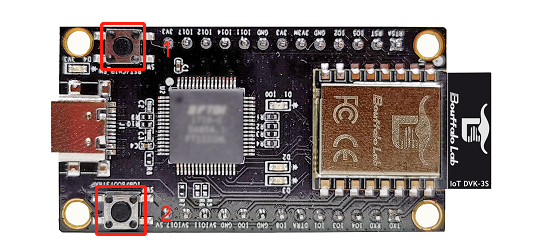

   正面

2. 打开解压后文件中的烧写工具flash_tool目录，双击BLDevCube.exe，chip type选择BL602/604，打开后界面参数参考下图配置：

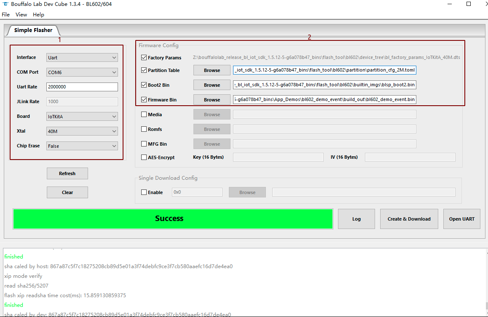

   烧写工具界面

其中上图的框1中COM Port选项根据实际串口情况选择（右击我的电脑->管理->设备管理器->端口，查看端口号，模块是双串口，选择端口号较小的），框2中的相关路径依据实际情况选择。配置完成后点击Download按钮下载。

串口工具配置
===============
重新上电，打开串口工具，设置对应的端口号，波特率设定为2000000 bps。

.. figure:: picture/image5.png
   :align: center

   串口工具

===================
测试准备
===================
1.PC与路由器通过有线连接。

==================
测试评估一：wifi ping + ble adv 
==================

重启板子，bl602作为client，PC作为server，APP以nRF Master Control Panel / nRF Connect为例

1. router ssid: bl_test_081，passwd: 12345678

2. 在串口中运行wifi相关命令：

   #stack_wifi

   #wifi_sta_connect bl_test_081 12345678   (连接成功后会获取IP地址)

.. figure:: picture/image9.png
   :align: center

   模块成功连接WiFi
   
3. 在PC 的cmd界面运行命令：$ping 192.168.81.103 -t (默认1s ping一次,192.168.81.103是设备端获取的IP地址)

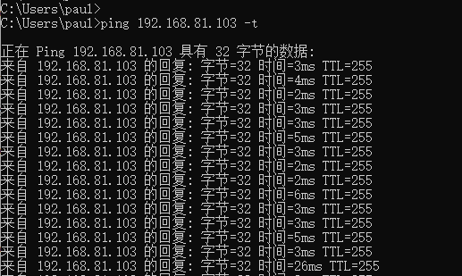

   模块开启ping
   
4. 在串口中运行ble相关命令：  
	
   #stack_ble
   
   #ble_init

   #ble_start_adv 0 0 0xa0 0xa0  (发起adv,interval为100ms)

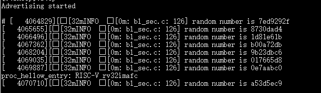

5. 手机端打开APP,查看是否扫描到设备BL602-BLE-DEV,如果扫描到说明测试成功：

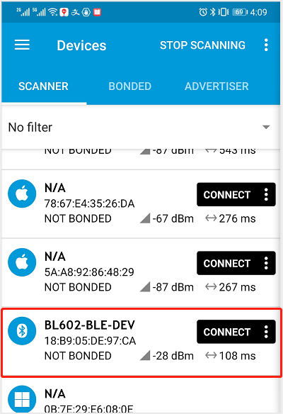

==================
测试评估二：wifi ping + ble connect(1s发送5次数据包，长度为23bytes)
==================

重启板子，bl602作为client，PC作为server，APP以BLE调试助手为例。

1-3. 步骤如同测试评估一中所示:

4. 在串口中运行ble相关命令:

   #stack_ble
   
   #ble_init

   #ble_start_adv 0 0 0xa0 0xa0  (发起adv,interval为100ms)
   
5. 打开APP,扫描到BL602-BLE-DEV并连接: 

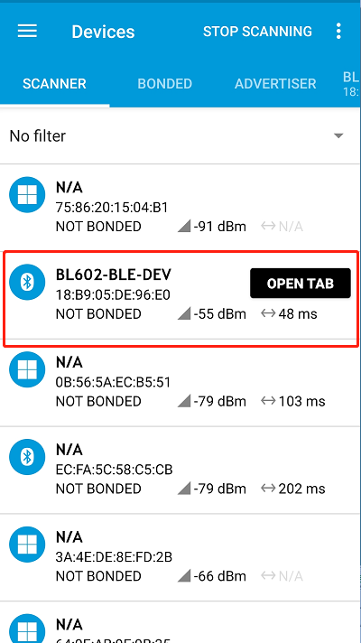

   APP扫描到BLE
   
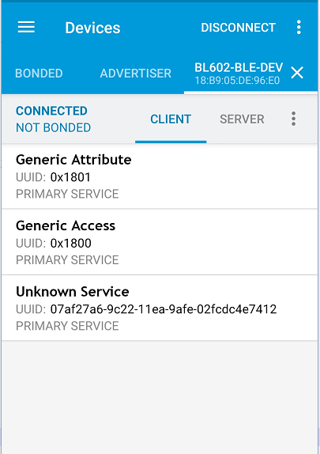
   
   BLE连接成功

6. 在串口中运行ble相关命令:
	
   #ble_conn_update 0x6 0x6 0x0 0x1f4 (连接interval为7.5ms)
	
7. 在串口中查看连接参数已更新:

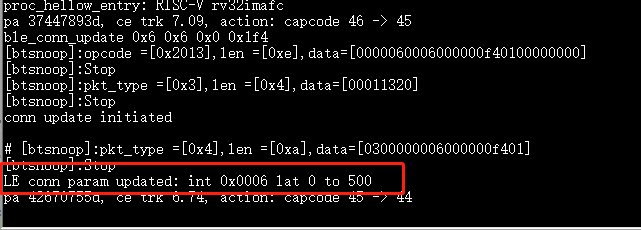

8. 在APP中找到服务特性，并且写入相应的数据：

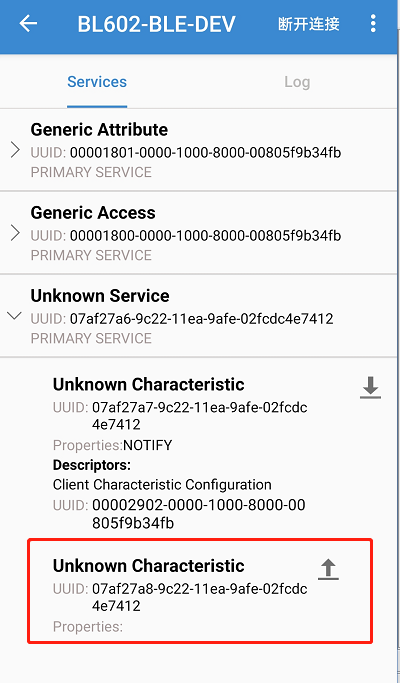
   
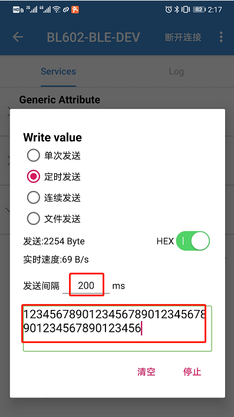
   
9. 查看wifi与ble是否稳定连接
   
==================
测试评估三: wifi running iperf + ble connect(1s发送5次数据包，长度为23bytes)
==================

重启板子，bl602作为client，PC作为server，APP以BLE调试助手为例。

1-2. 步骤如同测试评估一中所示:

3. 在串口中运行命令：$ipc 192.168.81.101 (192.168.81.101是PC的IP地址)

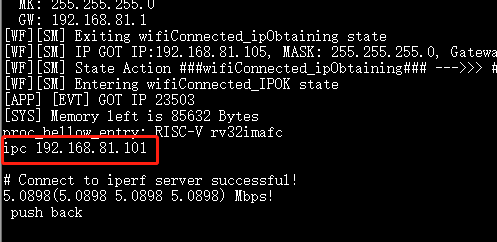

   模块开启ipc

4. 在PC 的cmd界面运行命令: $iperf.exe -s -u -i 1

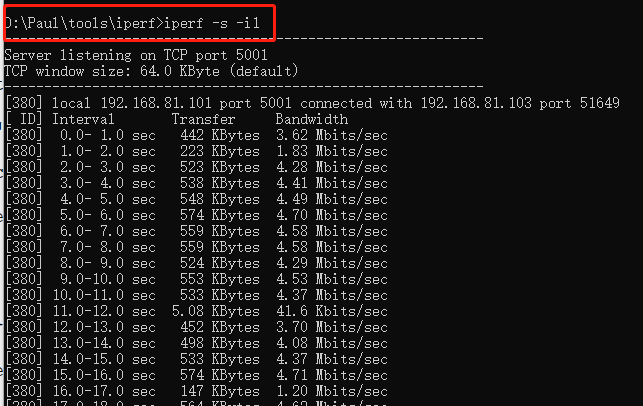

   PC端Iperf开启sever模式	

5. 在串口中运行ble相关命令:
	
   #stack_ble
   
   #ble_init

   #ble_start_adv 0 0 0xa0 0xa0  (发起adv,interval为100ms)
   
   .. figure:: picture/image18.png
   :align: center
   
   Ble开启ADV
	

6. 手机打开APP，扫描到设备BL602-BLE-DEV并连接:

	
   APP扫描到BLE
	

   BLE连接成功

7. 连接成功后，在串口中运行ble连接参数更新命令：
	
	#ble_conn_update 0x28 0x28 0x0 0x1f4 (连接interval为50ms)

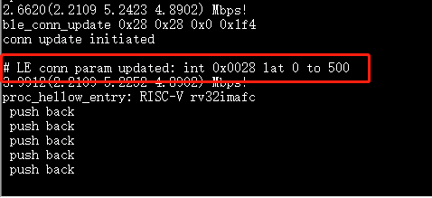

    ble连接参数

8. 在APP中找到服务特性，并且写入相应的数据：

   

9. 查看ble是否稳定连接，iperf的速率是否正常
