==========
准备
==========

1. 硬件：BL602模块一个，Windows PC一台，装有配网app(app目录：Bouffalolab_BL602_Evaluation_Package\\App_Demos\\sdk_app_ble_sync\\bleapp.apk)的安卓手机一台，USB转串口线一根。
2. 软件：烧写工具，烧录的sdk_app_ble_sync.bin文件，路径：Bouffalolab_BL602_Evaluation_Package\\App_Demos\\sdk_app_ble_sync\\build_out\\sdk_app_ble_sync.bin，串口工具putty。(\ `下载链接 <https://www.chiark.greenend.org.uk/~sgtatham/putty/latest.html>`__\)

.. figure:: picture/image1.png
   :align: center

   Putty下载

===========
烧录
===========

将BL602模组用串口线与电脑连接，打开烧写工具\ ``Bouffalo Lab Dev Cube``\中的\ ``BLFlashEnv.exe``\，\ ``chip type``\选择\ ``BL602/604``\，打开后设置界面参数，配置完后，按住模组上的按键SW2不松，同时按一下按键SW1，松开SW1和SW2，点击烧录工具上的\ ``Creat&Download``\，配置及下载完成效果如下图所示：

.. figure:: picture/image2.png
   :align: center

   模组

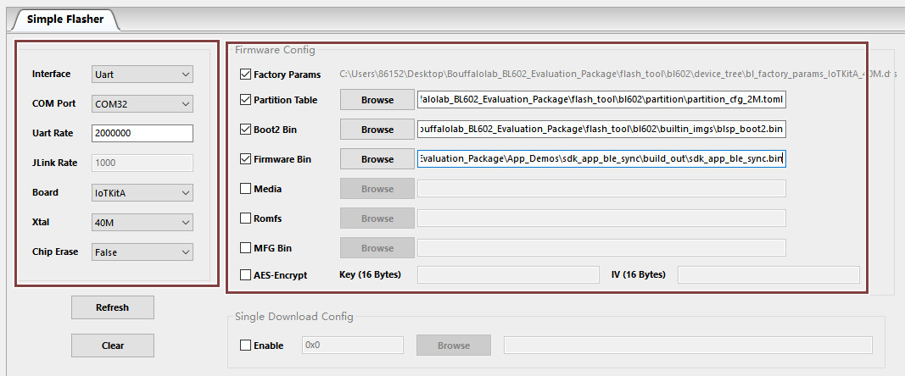

   配置

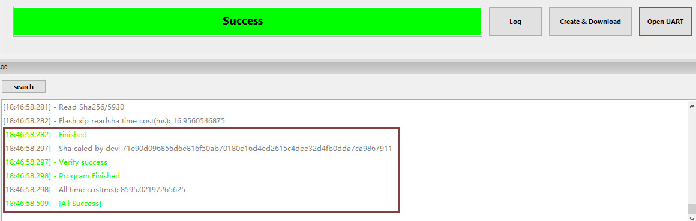

  烧写成功

其中烧写工具的左框中COM Port选项根据实际串口情况选择（右击我的电脑->管理->设备管理器->端口，查看端口号，模块是双串口，选择端口号较小的），右框中的相关路径依据实际情况选择。

putty配置
=============

打开putty工具，设置对应的端口号，波特率设定为2000000 bps，按一下SW1按键可以重启模组。

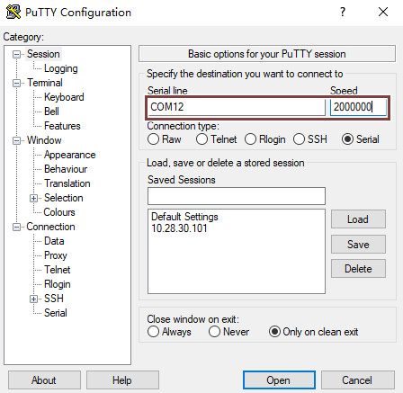

   Putty

==============
App配网步骤
==============
1. 在putty中输入“reboot”命令重启模块，模块上电后会自动开启ble广播，等待手机APP连接配网，串口打印如下所示：

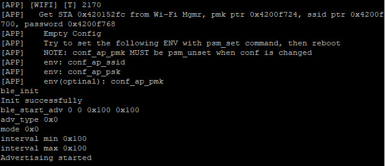

   开启ble广播log

2. 打开配网APP，APP自动搜索蓝牙设备（需手机蓝牙已开启)，搜索到设备名“BL602-BLE-DEV”；

.. figure:: picture/image8.png
   :align: center

   手机搜索到的蓝牙设备

3. 点击该设备名，然后点击APP中的“连接”，APP会显示连接模块蓝牙的状态，串口中会打印设备连接成功的log；

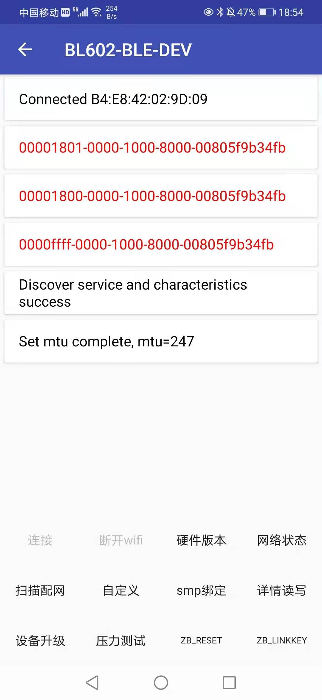

   APP显示的蓝牙状态

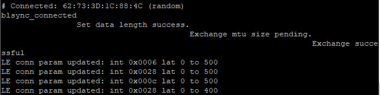

   蓝牙连接成功log

4. 点击“扫描配网”，等待数秒后APP会显示模块扫描到的WiFi设备列表，用户可以通过扫描出来的设备列表选择相应的WiFi进行连接，连接成功后页面红色字体部分为模块的WiFi相关信息。用户可以点击“断开wifi”选项使模块断开WiFi连接。

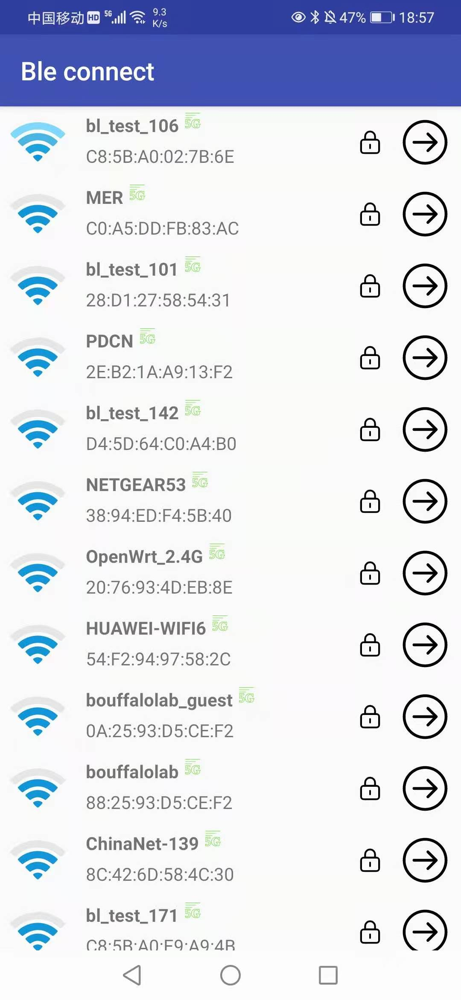

   APP显示模块扫描到的WiFi列表

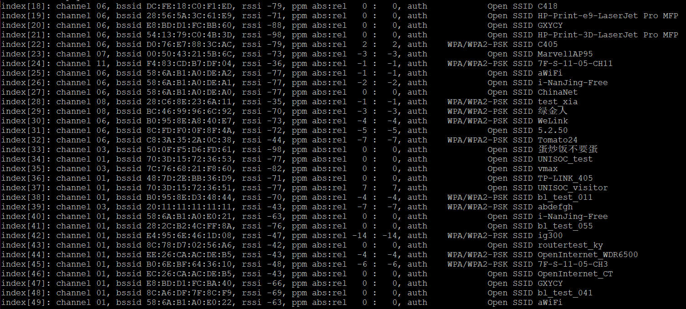

   模块扫描的WiFi列表log

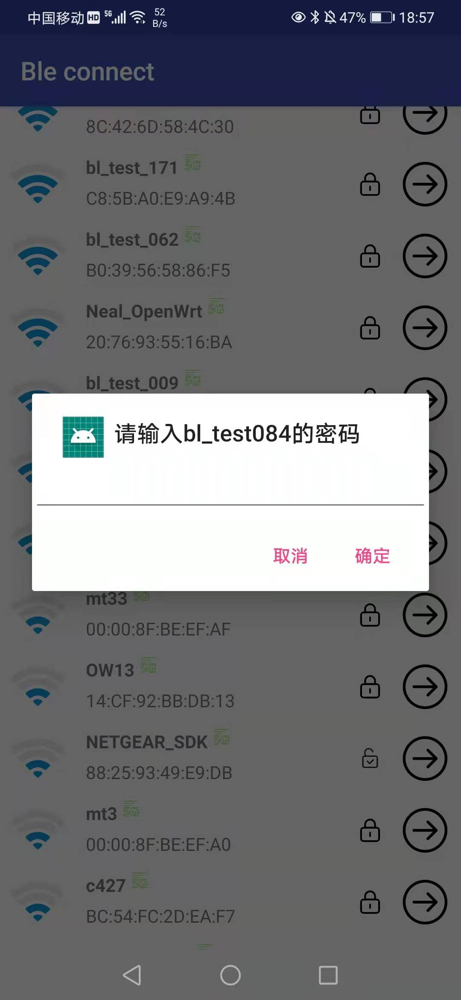

   连接WiFi

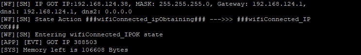

   模块成功连接WiFi的log

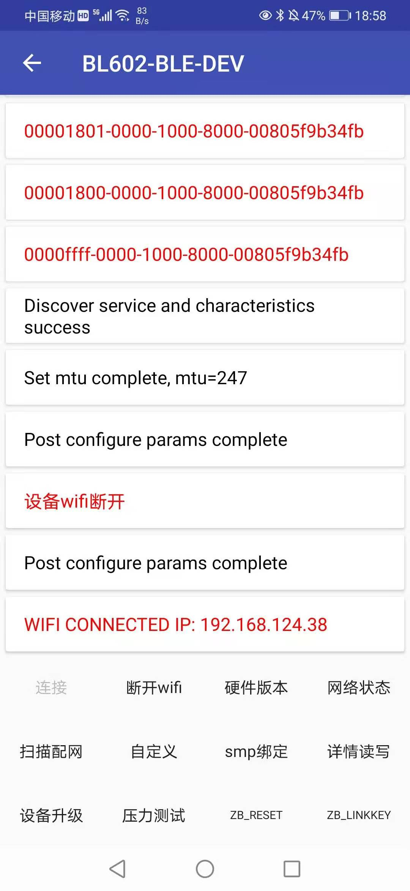

   APP显示WiFi连接成功

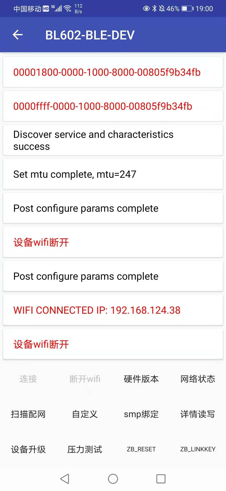

   断开WiFi连接

   模块断开WiFi连接log

5. 当用户确定配网完成时，不需要再使用配网功能，可以使用“blsync_ble_stop”命令将其关闭，如需重新配网请重复步骤1-5。

.. figure:: picture/image18.png
   :align: center

   关闭BLE

========================
微信小程序配网步骤
========================
1. 在putty中输入“reboot”命令重启模块，模块上电运行会自动开启ble广播，串口打印如下所示：

.. figure:: picture/image19.png
   :align: center

   开启ble广播log

2. 打开微信扫描下图二维码，点击“搜索”（需手机蓝牙已开启)，搜索到设备名“BL602-BLE-DEV”，点击“BL602-BLE-DEV”连接设备，连接成功后界面上出现操作WiFi相关的功能；

   配网二维码

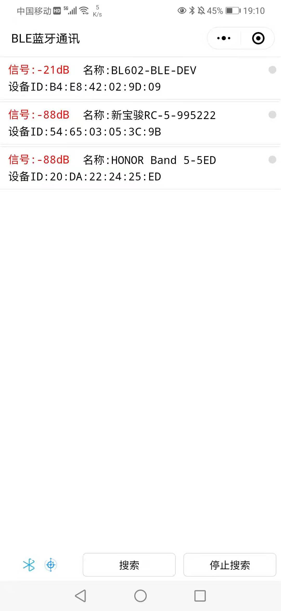

   搜到的设备

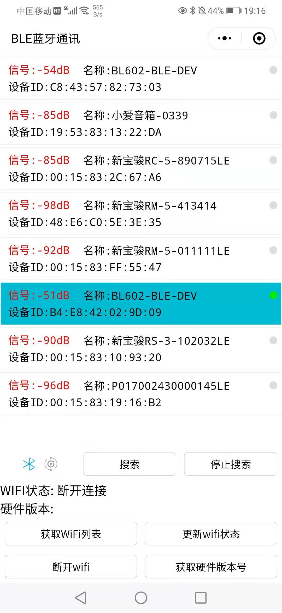

   连接设备成功

   蓝牙连接成功log

3. 点击小程序中的“获取WiFi列表”，小程序会回显获取到的WiFi列表，用户可以通过扫描出来的设备列表对需要配网的WiFi进行连接，点击需要连接的WiFi名称，接着在输入框输入WiFi密码，点击“发送密码”，即可连接WiFi；

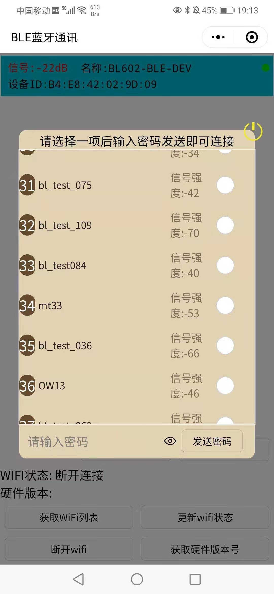

   模块扫描到的WiFi列表

.. figure:: picture/image25.png
   :align: center

   连接WiFi成功

.. figure:: picture/image26.png
   :align: center

   模块成功连接WiFi的log

4. 点击小程序中的“更新WiFi状态”按钮，获取WiFi当前的连接状态；

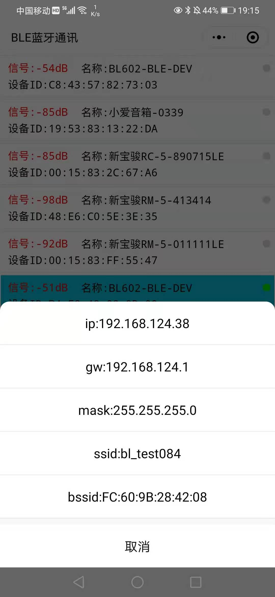

   更新WiFi连接状态

5. 点击断开WiFi按钮，即可断开WiFi，再次点击”获取状态“按钮可以获取当前WiFi已经断开；

.. figure:: picture/image28.png
   :align: center

   断开WiFi

.. figure:: picture/image29.png
   :align: center

   模块断开WiFi连接log

6. 当用户确定配网完成时，不需要再使用配网功能，可以使用“blsync_ble_stop”命令将其关闭，如需重新配网请重复步骤1-6。

.. figure:: picture/image30.png
   :align: center

   关闭BLE

