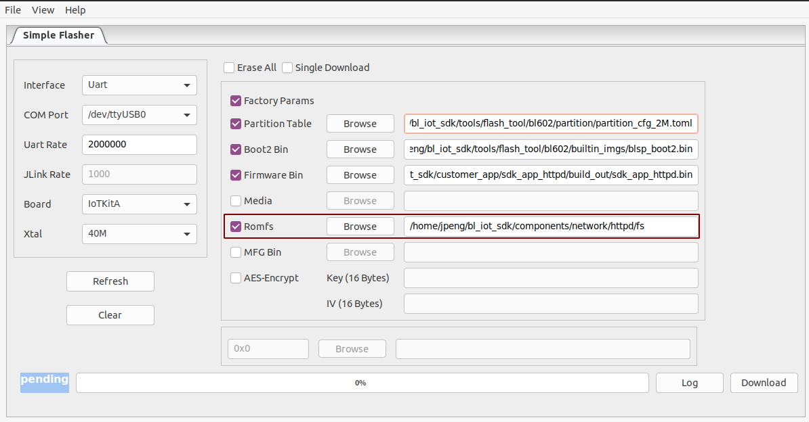

README
=========

- 在 ``components/network/httpd/fs`` 文件中生成certificate和privateKey，命令： ``yes ""|openssl req -x509 -sha256 -nodes -days 365 -newkey rsa:2048 -keyout privateKey.key -out certificate.crt``
- 分别在certificate和privateKey两个文件的末尾添加结束符'\0' ，命令： ``cat certificate.crt <(echo -n '\0') > tmp``， ``mv tmp certificate.crt`` , 然后通过 ``xxd certificate.crt`` 命令查看文件最后是00结尾，此时添加'\0'成功，privateKey文件也是类似操作。
- 将fs中的文件烧录在Romfs中，如下图所示：

- 上电后连接wifi，然后输入 ``httpd`` 命令启动server，如在浏览器中输入 https://192.168.8.114 ,访问server。链接中的ip地址为模块的ip地址。
