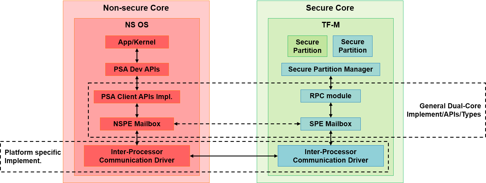

##########################################
Mailbox Design in TF-M on Dual-core System
##########################################

:Authors: David Hu
:Organization: Arm Limited
:Contact: david.hu@arm.com
:Status: Accepted

************
Introduction
************

This document proposes a generic design of the mailbox communication for Trusted
Firmware-M (TF-M) on a dual-core system. The mailbox functionalities transfer
PSA Client requests and results between Non-secure Processing Environment (NSPE)
and Secure Processing Environment (SPE).

The dual-core system should satisfy the following requirements

- NSPE and SPE are properly isolated and protected following PSA specifications.
- An Arm M-profile core locates in SPE and acts as the Secure core.
- TF-M runs on the Secure core with platform specific drivers support.
- Inter-Processor Communication hardware module in system for communication
  between Secure core and Non-secure core. Mailbox communication calls the
  Inter-Processor Communication to transfer notifications.
- Non-secure memory shared by NSPE and SPE.

Scope
=====

This design document focuses on the mailbox functionalities in NSPE and SPE on a
dual-core system. The mailbox functionalities include the initialization of
mailbox in NSPE and SPE, and the transfer of PSA client requests and replies
between NSPE and SPE.

Data types and mailbox APIs are defined in this document.

Some details of interactions between mailbox and other modules are specified in
other documents.
Communication prototype design [1]_ defines a general communication prototype
between NSPE and SPE on a dual-core system. It describes how TF-M interacts with
mailbox functionalities and the general requirements on mailbox.
Dual-core booting sequence [2]_ describes a synchronization step of mailbox
between NSPE and SPE during system booting.

Organization of the document
============================

- `Mailbox architecture`_ provides an overview on the mailbox architecture.
- `Mailbox communication for PSA Client calls`_ discusses about the mailbox
  communication for PSA Client calls.
- `Mailbox initialization`_ introduces the initialization of mailbox.
- `Mailbox APIs and data structures`_ lists mailbox data types and APIs.

********************
Mailbox architecture
********************

The mailbox consists of two parts sitting in NSPE and SPE respectively.
NSPE mailbox provides mailbox functionalities in NSPE and SPE mailbox provides
mailbox functionalities in TF-M in SPE.

PSA Client APIs called in NSPE are implemented by NSPE mailbox functions on
dual-core systems, to send PSA Client request and receive the result. The
implementation can vary in diverse NSPE OSs or use cases.

TF-M provides a reference implementation of NSPE mailbox. The NSPE mailbox
delivers the PSA client requests to SPE mailbox. After the PSA Client result is
replied from SPE, NSPE mailbox fetches the result and returns it to PSA Client
APIs.

NSPE mailbox objects are managed by NSPE mailbox in non-secure memory to hold
PSA Client call parameters, return result and other mailbox data.
NSPE mailbox relies on platform specific Inter-Process Communication to process
notifications between NSPE and SPE.

The SPE mailbox in TF-M receives PSA Client requests from NSPE mailbox. It
parses the requests and invokes TF-M Remote Procedure Call (RPC) module.
RPC module delivers the requests to TF-M core/Secure Partition Manager (SPM).
After the PSA Client call is completed, TF-M core/SPM invokes RPC module to
return results to NSPE, via SPE mailbox.
SPE mailbox objects are managed by SPE mailbox in secure memory.
SPE mailbox relies on platform specific Inter-Process Communication to process
notifications between SPE and NSPE.

The architecture is showed in following figure.

******************************************
Mailbox communication for PSA Client calls
******************************************

This section describes the transfer of PSA Client request and reply between NSPE
and SPE via mailbox.

Mailbox objects
===============

This section lists the mailbox objects required in NSPE and SPE.

NSPE mailbox objects are managed by NSPE mailbox in non-secure memory. But NSPE
mailbox objects can be accessed by both NSPE mailbox and SPE mailbox.

SPE mailbox objects are managed by SPE mailbox in secure memory. SPE mailbox
objects should be protected from NSPE accesses by system specific isolation.

NSPE Mailbox queue
------------------

NSPE mailbox maintains a mailbox queue in non-secure memory. Please refer to the
structure definition in `NSPE mailbox queue structure`_.

NSPE mailbox queue contains one or more slots. The number of slots should be
aligned with that in SPE mailbox queue.

Each slot in NSPE mailbox queue consists of a pair of a mailbox message
structure and a mailbox reply structure. Each slot might contain additional
fields, such as identification of non-secure task which initiates the PSA Client
request. Each slot serves a PSA Client call from non-secure task.

The parameters of PSA Client request are hosted in the mailbox message inside
the slot. `Mailbox messages`_ describes the details of mailbox message.

The mailbox reply structure is used to receive the PSA Client result from SPE.
`Mailbox replies`_ describes the details of mailbox reply.

Mailbox messages
----------------

A mailbox message contains the parameters of a PSA Client request from a
non-secure task. Please refer to the structure definition in
`Mailbox message structure`_.

Inside PSA Client API implementation, NSPE mailbox selects an empty mailbox
queue slot for the PSA Client request. The parameters of that PSA Client request
is organized into the mailbox message belonging to the selected slot.
SPE mailbox will parse those parameters from the mailbox message.

More fields can be defined in mailbox message to transfer additional
information from NSPE to SPE for processing in TF-M.

Mailbox replies
---------------

A mailbox reply structure in non-secure memory receives the PSA Client result
replied from SPE mailbox. Please refer to the structure definition in
`Mailbox reply structure`_.

SPE Mailbox queue
-----------------

SPE mailbox maintains a mailbox queue to store SPE mailbox objects.
Please refer to the structure definition in `SPE mailbox queue structure`_.

SPE mailbox queue contains one or more slots. The number of slots should be
aligned with that in NSPE mailbox queue. After SPE is notified that a PSA Client
request is pending, SPE mailbox can

- either assign an empty slot, copy the corresponding mailbox message from
  non-secure memory to that slot and parse the message.
- or directly parse the corresponding mailbox message in non-secure memory

Each slot in SPE mailbox queue can contain the following fields

- An optional field to hold mailbox message content copied from non-secure
  memory.
- Index of NSPE mailbox queue slot containing the mailbox message.
- A handle to the mailbox message. Optional. Identify the owner slot of PSA
  Client result when multiple mailbox messages are under processing.

More fields can be defined in the slot structure to support mailbox processing
in SPE.

Overall workflow
================

The overall workflow of transferring PSA Client requests and results between
NSPE and SPE via mailbox is shown below.

#. Non-secure task initiates a service request by calling PSA Developer APIs,
   which eventually invoke PSA Client APIs.
   PSA Client APIs call NSPE mailbox functions to transmit PSA Client call to
   SPE.

#. NSPE mailbox assigns an empty slot from NSPE mailbox queue for that PSA
   Client call and returns the assignment result.

#. NSPE mailbox prepares the parameters of PSA Client call in the dedicated
   mailbox message inside the assigned slot.

#. After the mailbox message is ready, NSPE mailbox invokes platform specific
   Inter-Processor Communication driver to notify SPE.
   The notification mechanism of Inter-Processor Communication is platform
   specific.

#. After the notification is completed, non-secure task waits for the reply from
   SPE. The mechanism of waiting and waking may vary in different NSPE OS and on
   diverse platforms. Please refer to `Mechanism of waiting for PSA Client reply in NSPE (Informative)`_
   for more details.

#. Platform specific Inter-Processor Communication interrupt for mailbox is
   asserted in SPE. The interrupt handler activates SPE mailbox to process the
   request(s).

#. During mailbox processing in TF-M, if multiple ongoing mailbox messages are
   pending in the SPE, SPE mailbox can process mailbox messages one by one.
   The handling routine can include the following steps:

    #. SPE mailbox checks and validates NSPE mailbox queue status.
    #. If necessary, SPE mailbox can copy mailbox message(s) from non-secure
       memory, into SPE mailbox queue. If mailbox supports multiple outstanding
       NS PSA Client call requests, it is recommended to copy multiple mailbox
       message(s) together to save time consumption.
    #. SPE mailbox parses a mailbox message.
    #. SPE mailbox invokes the TF-M RPC APIs to deliver the PSA Client
       request to TF-M SPM.
    #. The PSA Client call is handled in TF-M SPM and target Secure Partition if
       necessary.

#. After the PSA Client call is completed, TF-M RPC module notifies SPE mailbox
   to reply PSA Client result to NSPE.

#. SPE mailbox writes the PSA Client result to the dedicated mailbox reply
   structure in non-secure memory. The related SPE mailbox objects should be
   invalidated or cleaned.

#. SPE mailbox notifies NSPE by invoking Inter-Processor Communication driver to
   send a notification to NSPE.
   The notification mechanism of Inter-Processor Communication is platform
   specific.

#. NSPE mailbox is activated to handle the PSA Client result in the mailbox
   reply structure. Related mailbox objects should be invalidated or cleaned by
   NSPE mailbox after the return results is extracted out.

#. NSPE mailbox returns the result to PSA Client API implementation.
   The result is eventually returned to the non-secure task.

The following sections discuss more details of key steps in above sequence.

Mailbox notifications between NSPE and SPE
==========================================

As shown in `Overall workflow`_, NSPE mailbox asserts mailbox notification to
trigger SPE to handle PSA Client request. SPE mailbox asserts mailbox
notification to notify NSPE that PSA Client result is written. The notification
implementation is based on platform specific Inter-Processor Communication.

It is recommended to assign one independent set of Inter-Processor Communication
channel to each notification routine respectively, to implement a *full-duplex*
notification mechanism between NSPE and SPE.
If both notification routines share the same Inter-Processor Communication
channel, proper synchronization should be implemented to prevent conflicts
between two notification routines.

In SPE, the Inter-Processor Communication interrupt handler should deal with the
incoming notification from NSPE and activate the subsequent mailbox handling in
SPE. Communication prototype design [1]_ defines the behavior of Inter-Processor
Communication interrupt handler.

NSPE OS can implement an interrupt handler or a polling of notification status
to handle Inter-Processor Communication notification from SPE.

Implement PSA Client API with NSPE Mailbox (Informative)
========================================================

PSA Client APIs are implemented with NSPE mailbox functions with NS software
specific support. The implementation is platform and NS OS specific.

The pseudo code of a reference implementation of a PSA Client API is shown below.

.. code-block:: c

  ... psa_xxx(...)
  {
      mailbox_msg_handle_t handle;

      ...

      /*
       * Select an empty slot from NSPE mailbox queue and send PSA Client
       * request to SPE.
       * When NSPE mailbox queue is full, a proper waiting mechanism should
       * block current non-secure thread until an empty slot is available.
       */
      handle = tfm_ns_mailbox_tx_client_req(...);

      /* Platform/NSPE OS specific waiting for PSA client call reply */
      wait_for_event(mailbox_reply_event, ...);
      /* Stop waiting after woken up or reply event is detectd */

      /* Fetch PSA client call return result */
      tfm_ns_mailbox_rx_client_reply(handle, ...);

      ...
  }

As PSA Firmware Framework requests, a PSA Client API function should be blocked
until the result is returned. To comply with PSA specs, the PSA Client APIs
implementation should include a proper mechanism to keep current caller
thread waiting for an empty mailbox queue slot when NSPE mailbox queue is full.
The caller thread can be switched out by NS OS scheduler to release CPU time to
dother threads. The waiting mechanism can be platform and NS OS specific or a
general implementation.

For example, PSA Client function can rely on a counting semaphore in which the
number of resource is the same as that of mailbox queue slots. Such a counting
semaphore can keep current non-secure thread waiting for an empty slot if the
queue is full.

A PSA Client function should invoke ``tfm_ns_mailbox_tx_client_req()`` to send
the request to SPE.
``tfm_ns_mailbox_tx_client_req()`` selects an empty NSPE mailbox queue slot,
fills the mailbox message and notifies SPE mailbox. The details are described
in `tfm_ns_mailbox_tx_client_req()`_.

After ``tfm_ns_mailbox_tx_client_req()`` completes, PSA Client function should
invoke platform and NS OS specific functions to wait for the reply. It is
recommended to force PSA Client function to exclusively wait for the reply
event. Other events irrelevant to mailbox or PSA Client call should be ignored,
unless the dual-core system has special requirements on thread management.
The mechanism to wait for result and wake the waiting thread is discussed in
`Mechanism of waiting for PSA Client reply in NSPE (Informative)`_.

If the implementation performs a simple polling on a single mailbox message, it
can call ``tfm_ns_mailbox_is_msg_replied()`` to wait for the deidcated message
result.
If the implementation performs a waiting/waking mechanism, it can call
``tfm_ns_mailbox_wait_reply()`` which calls ``tfm_ns_mailbox_hal_wait_reply()``
implemented by platform and NS OS specific mechanism.

After the reply is returned, the PSA Client function invokes
``tfm_ns_mailbox_rx_client_reply()`` to fetch return result and release NSPE
mailbox queue resource.
The details of the API will be described in `tfm_ns_mailbox_rx_client_reply()`_.

Mechanism of waiting for PSA Client reply in NSPE (Informative)
===============================================================

As discussed above, PSA Client function should wait for the mailbox reply event
after the PSA Client request is submit. When the result is returned to NSPE
mailbox, the waiting non-secure thread is triggered to handle the result.

To support multiple outstanding NS PSA Client calls feature on dual-core system,
NSPE software should be able to identify the owner thread of the incoming PSA
Client result. A field ``owner`` is defined in NSPE mailbox queue slot structure
to hold the handle to the non-secure thread owner. The ``owner`` filed maps a
mailbox queue slot containing the PSA Client result, to the non-secure task.

The following pseudo-code shows an example implementation.

After ``non_secure_task()`` calls PSA Client API ``psa_xxx()``, it falls into
sleep in ``psa_xxx()`` until the result is returned.

``tfm_ns_mailbox_tx_client_req()`` sets the owner non-secure thread handle in
the mailbox queue slot. Then ``tfm_ns_mailbox_wait_reply()`` calls
``tfm_ns_mailbox_hal_wait_reply()`` to let NS OS put current caller thread into
waiting state. ``tfm_ns_mailbox_hal_wait_reply()`` is implemented by platform or
NS OS specific thread management.

After SPE notifies NSPE that PSA Client result is replied,
``notification_handler()`` in NSPE determins the waiting non-secure owener
thread of the PSA Client result. Then the waiting non-secure thread is woken up
by NS OS.

The owener thread is woken up from ``tfm_ns_mailbox_wait_reply()`` and fetches
the result by calling ``tfm_ns_mailbox_rx_client_reply()``.

.. code-block:: c

  int32_t tfm_ns_mailbox_wait_reply(handle)
  {
      ...

      /*
       * Implemented by platform/NS OS specific waiting mechanism.
       * Woken up by ns_os_wake_task() below.
       */
      tfm_ns_mailbox_hal_wait_reply(handle);

      ...
  }

  ... psa_xxx(...)
  {
      ...

      /* The owner information is also set during filling mailbox message */
      handle = tfm_ns_mailbox_tx_client_req(...);

      /* Trapped in sleep and wait for reply */
      tfm_ns_mailbox_wait_reply(handle);
      /* Wake up and continue */

      tfm_ns_mailbox_rx_client_reply(handle, ...);

      ...
  }

  /* non-secure task requests secure services */
  void non_secure_task(...)
  {
      ...

      /*
       * Blocked and waiting in PSA Client API until the result is returned from
       * SPE
       */
      psa_xxx(...);

      ...
  }

  /* NSPE handler of Inter-Processor Communication notification interrupt */
  void notification_handler(...)
  {
      mailbox_msg_handle_t handle;
      void *task_handle;

      /* Deal with notification from SPE */
      ...

      /* Check and fetch the handle to the mailbox message replied */
      handle = tfm_ns_mailbox_fetch_reply_msg_isr();

      if (handle) {
          /*
           * Get the handle of non-secure task whose mailbox message is replied.
           * The owner information is set in tfm_ns_mailbox_tx_client_req().
           */
          task_handle = tfm_ns_mailbox_get_msg_owner(handle);

          /*
           * Wake up the waiting non-secure task from
           * tfm_ns_mailbox_hal_wait_reply() above.
           * Implemented by platform/NS OS specific mechanism.
           */
          ns_os_wake_task(task_handle);
      }

      ...
  }

NSPE mailbox APIs ``tfm_ns_mailbox_wait_reply()``,
``tfm_ns_mailbox_hal_wait_reply()`` and ``tfm_ns_mailbox_fetch_reply_msg_isr()``
are described in details `NSPE mailbox APIs`_ below.

Critical section protection of NSPE mailbox queue
=================================================

Proper protection should be implemented to protect the critical accesses to NSPE
mailbox queue. The critical sections can include atomic reading and modifying
slot status, and other critical operations on NSPE mailbox queue.

NSPE mailbox and SPE mailbox define corresponding critical section APIs. The
implementation of those APIs can be platform specific. Please see more details
in `NSPE mailbox APIs`_ and `SPE mailbox APIs`_.

The implementation should protect a critical access to NSPE mailbox queue from
corruptions caused by

- Other non-secure tasks or exception service routines in NS OS
- Accesses from the Secure core. SPE mailbox also accesses NSPE mailbox queue to
  parse mailbox message. Therefore, it is essential to implement synchronization
  or protection on NSPE mailbox queue between Secure core and Non-secure core.

It is recommended to rely on both hardware and software to implement the
synchronization and protection.

Mailbox handling in TF-M
========================

According to communication prototype design [1]_, mailbox implementation should
invoke ``tfm_rpc_register_ops()`` to hook its operations to TF-M RPC module
callbacks during initialization. Mailbox message handling should call TF-M RPC
PSA Client call handlers to deliver PSA client call request to TF-M SPM.

If multiple outstanding NS PSA Client calls should be supported, TF-M SPM can
store the mailbox message handle in a specific field in PSA message structure to
identify the mailbox message, while creating a PSA message. While replying the
PSA Client result, TF-M SPM can extract the mailbox message handle from PSA
message and pass it back to mailbox reply function. SPE mailbox can identify
which mailbox message is completed according to the handle and write the result
to corresponding NSPE mailbox queue slot.

**********************
Mailbox initialization
**********************

It should be guaranteed that NSPE mailbox should not initiate PSA Client request
until SPE mailbox initialization completes.
Refer to dual-core booting sequence [2]_ for more details on the synchronization
between NSPE and SPE during booting.

In current design, the base address of NSPE mailbox queue should be pre-defined
and shared between NSPE mailbox and SPE mailbox.

SPE mailbox initialization
==========================

The SPE mailbox queue memory should be allocated before calling
``tfm_mailbox_init()``. ``tfm_mailbox_init()`` initializes the memory and
variables.
``tfm_mailbox_init()`` calls ``tfm_mailbox_hal_init()`` to perform platform
specific initialization. The base address of NSPE mailbox queue can be
received via ``tfm_mailbox_hal_init()``.

SPE mailbox dedicated Inter-Processor Communication initialization can also be
enabled during SPE mailbox initialization.

After SPE mailbox initialization completes, SPE notifies NSPE that SPE mailbox
functionalities are ready.

NSPE mailbox initialization
===========================

The NSPE mailbox queue memory should be allocated before calling
``tfm_ns_mailbox_init()``. ``tfm_ns_mailbox_init()`` initializes the memory and
variables.
``tfm_ns_mailbox_init()`` calls ``tfm_ns_mailbox_hal_init()`` to perform
platform specific initialization. The base address of NSPE mailbox queue can be
passed to SPE mailbox via ``tfm_ns_mailbox_hal_init()``.

NSPE mailbox dedicated Inter-Processor Communication initialization can also be
enabled during NSPE mailbox initialization.

********************************
Mailbox APIs and data structures
********************************

Data types
==========

Constants
---------

``NUM_MAILBOX_QUEUE_SLOT``
^^^^^^^^^^^^^^^^^^^^^^^^^^

``NUM_MAILBOX_QUEUE_SLOT`` sets the number of slots in NSPE and SPE mailbox
queues.
In current design, both NSPE and SPE mailbox should refer to the same
``NUM_MAILBOX_QUEUE_SLOT`` definition.

The following example configures 4 slots in mailbox queues.

.. code-block:: c

  #define NUM_MAILBOX_QUEUE_SLOT      (4)

``MAILBOX_MSG_NULL_HANDLE``
^^^^^^^^^^^^^^^^^^^^^^^^^^^

``MAILBOX_MSG_NULL_HANDLE`` is a zero-value null handle of a mailbox message.

.. code-block:: c

  #define MAILBOX_MSG_NULL_HANDLE      ((mailbox_msg_handle_t)0)

``MAILBOX_SUCCESS``
^^^^^^^^^^^^^^^^^^^

``MAILBOX_SUCCESS`` is a generic return value to indicate success of mailbox
operation.

.. code-block:: c

  #define MAILBOX_SUCCESS        (0)

``MAILBOX_QUEUE_FULL``
^^^^^^^^^^^^^^^^^^^^^^

``MAILBOX_QUEUE_FULL`` is a return value from mailbox function if mailbox queue
is full.

.. code-block:: c

  #define MAILBOX_QUEUE_FULL     (INT32_MIN + 1)

``MAILBOX_INVAL_PARAMS``
^^^^^^^^^^^^^^^^^^^^^^^^

``MAILBOX_INVAL_PARAMS`` is a return value from mailbox function if any
parameter is invalid.

.. code-block:: c

  #define MAILBOX_INVAL_PARAMS   (INT32_MIN + 2)

``MAILBOX_NO_PERMS``
^^^^^^^^^^^^^^^^^^^^

``MAILBOX_NO_PERMS`` is a return value from mailbox function if the caller
doesn't own a proper permission to execute the operation.

.. code-block:: c

  #define MAILBOX_NO_PERMS       (INT32_MIN + 3)

``MAILBOX_NO_PEND_EVENT``
^^^^^^^^^^^^^^^^^^^^^^^^^

``MAILBOX_NO_PEND_EVENT`` is a return value from mailbox function if the
expected event doesn't occur yet.

.. code-block:: c

  #define MAILBOX_NO_PEND_EVENT  (INT32_MIN + 4)

``MAILBOX_CHAN_BUSY``
^^^^^^^^^^^^^^^^^^^^^

``MAILBOX_CHAN_BUSY`` is a return value from mailbox function if the underlying
Inter-Processor Communication resource is busy.

.. code-block:: c

  #define MAILBOX_CHAN_BUSY      (INT32_MIN + 5)

``MAILBOX_CALLBACK_REG_ERROR``
^^^^^^^^^^^^^^^^^^^^^^^^^^^^^^

``MAILBOX_CALLBACK_REG_ERROR`` is a return value from mailbox function if the
registration of mailbox callback functions failed.

.. code-block:: c

  #define MAILBOX_CALLBACK_REG_ERROR     (INT32_MIN + 6)

``MAILBOX_INIT_ERROR``
^^^^^^^^^^^^^^^^^^^^^^

``MAILBOX_INIT_ERROR`` is a return value from mailbox function if the mailbox
initialization failed.

.. code-block:: c

  #define MAILBOX_INIT_ERROR     (INT32_MIN + 7)

PSA Client API types
^^^^^^^^^^^^^^^^^^^^

The following constants define the PSA Client API type values shared between
NSPE and SPE

.. code-block:: c

  #define MAILBOX_PSA_FRAMEWORK_VERSION       (0x1)
  #define MAILBOX_PSA_VERSION                 (0x2)
  #define MAILBOX_PSA_CONNECT                 (0x3)
  #define MAILBOX_PSA_CALL                    (0x4)
  #define MAILBOX_PSA_CLOSE                   (0x5)

Mailbox message structure
-------------------------

``psa_client_params_t`` lists the parameters passed from NSPE to SPE required by
a PSA Client call.

.. code-block:: c

  struct psa_client_params_t {
      union {
          struct {
              uint32_t        sid;
          } psa_version_params;

          struct {
              uint32_t        sid;
              uint32_t        minor_version;
          } psa_connect_params;

          struct {
              psa_handle_t    handle;
              int32_t         type;
              const psa_invec *in_vec;
              size_t          in_len;
              psa_outvec      *out_vec;
              size_t          out_len;
          } psa_call_params;

          struct {
              psa_handle_t    handle;
          } psa_close_params;
      };
  };

The following structure describe a mailbox message and its members.

- ``call_type`` indicates the PSA Client API type.
- ``params`` stores the PSA Client call parameters.
- ``client_id`` records the client ID of the non-secure caller. Optional.
  It is used to identify the non-secure tasks in TF-M when NSPE OS enforces
  non-secure task isolation.

.. code-block:: c

  struct mailbox_msg_t {
      uint32_t                     call_type;
      struct psa_client_params_t   params;

      int32_t                      client_id;
  };

Mailbox reply structure
-----------------------

This structure describes a mailbox reply structure, which is managed by NSPE
mailbox in non-secure memory.

.. code-block:: c

  struct mailbox_reply_t {
      int32_t return_val;
  };

Mailbox message handle
----------------------

This data type is an opaque reference to an active mailbox message in use.

.. code-block:: c

  typedef int32_t    mailbox_msg_handle_t;

Mailbox queue status bitmask
----------------------------

``mailbox_queue_status_t`` defines a bitmask to indicate a status of slots in
mailbox queues.

.. code-block:: c

  typedef uint32_t   mailbox_queue_status_t;

NSPE mailbox queue structure
----------------------------

``ns_mailbox_slot_t`` defines a non-secure mailbox queue slot.

.. code-block:: c

  /* A single slot structure in NSPE mailbox queue */
  struct ns_mailbox_slot_t {
      struct mailbox_msg_t   msg;
      struct mailbox_reply_t reply;

      /* Identification of the owner task of this slot */
      const void             *owner;
  };

``ns_mailbox_queue_t`` describes the NSPE mailbox queue and its members in
non-secure memory.

- ``empty_slots`` is the bitmask of empty slots.
- ``pend_slots`` is the bitmask of slots whose PSA Client call is not replied
  yet.
- ``replied_slots`` is the bitmask of slots whose PSA Client result is returned
  but not extracted yet.
- ``queue`` is the NSPE mailbox queue of slots.

.. code-block:: c

  struct ns_mailbox_queue_t {
      mailbox_queue_status_t   empty_slots;
      mailbox_queue_status_t   pend_slots;
      mailbox_queue_status_t   replied_slots;

      struct ns_mailbox_slot_t queue[NUM_MAILBOX_QUEUE_SLOT];
  };

SPE mailbox queue structure
---------------------------

``secure_mailbox_slot_t`` defines a single slot structure in SPE mailbox queue.

- ``msg`` stores the mailbox message content copied from NSPE mailbox queue. It
  is optional if the actual SPE implementation skips the mailbox message copy
  operation to save time and memory consumption.
- ``ns_slot_idx`` records the index of NSPE mailbox slot containing the mailbox
  message under processing. SPE mailbox determines the reply structure address
  according to this index.
- ``msg_handle`` contains the handle to the mailbox message under processing.
  The handle can be delivered to TF-M SPM while creating PSA message to identify
  the mailbox message.

.. code-block:: c

  struct secure_mailbox_slot_t {
      struct mailbox_msg_t msg;

      uint8_t              ns_slot_idx;
      mailbox_msg_handle_t msg_handle;
  };

``secure_mailbox_queue_t`` describes the SPE mailbox queue in secure memory.

- ``empty_slots`` is the bitmask of empty slots.
- ``queue`` is the SPE mailbox queue of slots.
- ``ns_queue`` stores the address of NSPE mailbox queue structure.

.. code-block:: c

  struct secure_mailbox_queue_t {
      mailbox_queue_status_t       empty_slots;

      struct secure_mailbox_slot_t queue[NUM_MAILBOX_QUEUE_SLOT];
      /* Base address of NSPE mailbox queue in non-secure memory */
      struct ns_mailbox_queue_t    *ns_queue;
  };

Mailbox APIs
============

NSPE mailbox APIs
-----------------

This section describes a *reference design* of NSPE mailbox APIs. Vendor can
define and implement different NSPE mailbox APIs.

SPE must not invoke these NSPE mailbox APIs.

``tfm_ns_mailbox_tx_client_req()``
^^^^^^^^^^^^^^^^^^^^^^^^^^^^^^^^^^

This function sends the PSA Client request to SPE.

.. code-block:: c

  mailbox_msg_handle_t tfm_ns_mailbox_tx_client_req(uint32_t call_type,
                                       const struct psa_client_params_t *params,
                                       int32_t client_id);

**Parameters**

+---------------+--------------------------------------------------+
| ``call_type`` | Type of PSA client call                          |
+---------------+--------------------------------------------------+
| ``params``    | Address of PSA Client call parameters structure. |
+---------------+--------------------------------------------------+
| ``client_id`` | ID of non-secure task.                           |
+---------------+--------------------------------------------------+

**Return**

+------+----------------------------------------------------------+
| >= 0 | The handle to the mailbox message successfully assigned. |
+------+----------------------------------------------------------+
| < 0  | Operation failed with an error code.                     |
+------+----------------------------------------------------------+

**Usage**

``tfm_ns_mailbox_tx_client_req()`` executes the following tasks:

- Select an empty NSPE mailbox queue slot.
- receives the PSA client call parameters
- prepares the mailbox message.
- notifies SPE via Inter-Processor Communication

In ``tfm_ns_mailbox_tx_client_req()``, it can set the owner of the mailbox
message to identify the non-secure caller thread to support multiple outstanding
NS PSA Client calls.

``tfm_ns_mailbox_rx_client_reply()``
^^^^^^^^^^^^^^^^^^^^^^^^^^^^^^^^^^^^

This function fetches the PSA Client results returned from SPE.

.. code-block:: c

  int32_t tfm_ns_mailbox_rx_client_reply(mailbox_msg_handle_t handle,
                                         int32_t *reply);

**Parameters**

+------------+-----------------------------------------------+
| ``handle`` | The handle to the mailbox message replied.    |
+------------+-----------------------------------------------+
| ``reply``  | The address to be written with return result. |
+------------+-----------------------------------------------+

**Return**

+---------------------+--------------------------------------------+
| ``MAILBOX_SUCCESS`` | Successfully get PSA Client return result. |
+---------------------+--------------------------------------------+
| Other return codes  | Operation failed with an error code        |
+---------------------+--------------------------------------------+

**Usage**

A correct ``handle`` should be passed to ``tfm_ns_mailbox_rx_client_reply()`` to
determine the target mailbox message which sent the PSA Client request.

Before exiting ``tfm_ns_mailbox_rx_client_reply()``, the mailbox objects related
to that completed PSA Client call are invalidated or cleaned.

``tfm_ns_mailbox_is_msg_replied()``
^^^^^^^^^^^^^^^^^^^^^^^^^^^^^^^^^^^

This function checks if the PSA Client result is returned from SPE to a specific
mailbox message.

.. code-block:: c

  bool tfm_ns_mailbox_is_msg_replied(mailbox_msg_handle_t handle);

**Parameters**

+------------+-------------------------------------------+
| ``handle`` | The handle to the target mailbox message. |
+------------+-------------------------------------------+

**Return**

+-----------+-------------------------------------------------+
| ``true``  | The PSA Client return value is replied.         |
+-----------+-------------------------------------------------+
| ``false`` | The PSA Client return value is not replied yet. |
+-----------+-------------------------------------------------+

``tfm_ns_mailbox_get_task_handle()``
^^^^^^^^^^^^^^^^^^^^^^^^^^^^^^^^^^^^

This function gets the handle of the current non-secure task executing mailbox
functionalities.

.. code-block:: c

  void *tfm_ns_mailbox_get_task_handle(void);

**Return**

+-------------+-----------------------------------------------------------+
| Task handle | The non-secure task handle waiting for PSA Client result. |
+-------------+-----------------------------------------------------------+

**Usage**

``tfm_ns_mailbox_get_task_handle()`` is implemented by NS OS specific thread
management. If the dual-core system doesn't require multiple outstanding NS PSA
Client calls feature, ``tfm_ns_mailbox_get_task_handle()`` can return ``NULL``.

If NSPE OS enforces non-secure tasks isolation, it is recommended to invoke
``tfm_ns_mailbox_get_task_handle()`` in privileged mode to protect owner value
from disclosure or tampering.

``tfm_ns_mailbox_get_msg_owner()``
^^^^^^^^^^^^^^^^^^^^^^^^^^^^^^^^^^

This function returns the owner of the mailbox message.

.. code-block:: c

  void *tfm_ns_mailbox_get_msg_owner(mailbox_msg_handle_t handle);

**Parameters**

+------------+-------------------------------------------+
| ``handle`` | The handle to the target mailbox message. |
+------------+-------------------------------------------+

**Return**

+-------------------+--------------------------------------------------------+
| Owner task handle | The handle to the non-secure owner task of the mailbox |
|                   | message                                                |
+-------------------+--------------------------------------------------------+

**Usage**

The owner task handle is get via ``tfm_ns_mailbox_get_task_handle()`` and set
into NSPE mailbox queue slot inside ``tfm_ns_mailbox_tx_client_req()``.

If multiple outstanding NS PSA Client calls feature is not supported in a
dual-core system, ``tfm_ns_mailbox_get_msg_owner()`` can return ``NULL``.

If NSPE OS enforces non-secure tasks isolation, it is recommended to invoke
``tfm_ns_mailbox_get_msg_owner()`` in privileged mode to protect owner value
from disclosure or tampering.

``tfm_ns_mailbox_init()``
^^^^^^^^^^^^^^^^^^^^^^^^^

This function initializes NSPE mailbox.

.. code-block:: c

  int32_t tfm_ns_mailbox_init(struct ns_mailbox_queue_t *queue);

**Parameters**

+-----------+-----------------------------------------+
| ``queue`` | The base address of NSPE mailbox queue. |
+-----------+-----------------------------------------+

**Return**

+---------------------+------------------------------------------+
| ``MAILBOX_SUCCESS`` | Initialization succeeds.                 |
+---------------------+------------------------------------------+
| Other return codes  | Initialization fails with an error code. |
+---------------------+------------------------------------------+

**Usage**

``tfm_ns_mailbox_init()`` invokes ``tfm_ns_mailbox_hal_init()`` to complete
platform specific mailbox and Inter-Processor Communication initialization.
The non-secure memory area for NSPE mailbox queue structure should be statically
or dynamically pre-allocated before calling ``tfm_ns_mailbox_init()``.

``tfm_ns_mailbox_fetch_reply_msg_isr()``
^^^^^^^^^^^^^^^^^^^^^^^^^^^^^^^^^^^^^^^^

This function fetches the first mailbox message which got PSA Client results in
an IRQ handler.

.. code-block:: c

  mailbox_msg_handle_t tfm_ns_mailbox_fetch_reply_msg_isr(void);

**Return**

+-----------------------------+---------------------------------------------+
| ``MAILBOX_MSG_NULL_HANDLE`` | No mailbox message has been replied.        |
+-----------------------------+---------------------------------------------+
| Mailbox message handle      | The handle to the first mailbox message got |
|                             | PSA Client result.                          |
+-----------------------------+---------------------------------------------+

**Usage**

The Inter-Processor Communication notification interrupt handler can invoke
``tfm_ns_mailbox_fetch_reply_msg_isr()`` to fetch the first mailbox message
which receives the PSA Client result and then call
``tfm_ns_mailbox_get_msg_owner()`` to determine the waiting owner thread.
``tfm_ns_mailbox_hal_enter_critical_isr()`` and
``tfm_ns_mailbox_hal_exit_critical_isr()`` are called inside
``tfm_ns_mailbox_fetch_reply_msg_isr()``.

``tfm_ns_mailbox_wait_reply()``
^^^^^^^^^^^^^^^^^^^^^^^^^^^^^^^

This function forces current non-secure caller thread to sleep and wait for the
PSA Client result of the specified mailbox message.

.. code-block:: c

  int32_t tfm_ns_mailbox_wait_reply(mailbox_msg_handle_t handle);

**Parameters**

+------------+---------------------------------------------------+
| ``handle`` | The handle to mailbox message waiting for result. |
+------------+---------------------------------------------------+

**Return**

+---------------------+------------------------------------+
| ``MAILBOX_SUCCESS`` | Return from waiting successfully.  |
+---------------------+------------------------------------+
| Other return codes  | Failed to wait with an error code. |
+---------------------+------------------------------------+

**Usage**

The PSA Client API implementations call ``tfm_ns_mailbox_wait_reply()`` to fall
into sleep to wait for PSA Client result.

``tfm_ns_mailbox_wait_reply()`` calls ``tfm_ns_mailbox_hal_wait_reply()`` to
execute platform/NS OS specific sleeping operation.

``tfm_ns_mailbox_hal_init()``
^^^^^^^^^^^^^^^^^^^^^^^^^^^^^

This function executes platform-specific NSPE mailbox initialization.

.. code-block:: c

  int32_t tfm_ns_mailbox_hal_init(struct ns_mailbox_queue_t *queue);

**Parameters**

+-----------+-----------------------------------------+
| ``queue`` | The base address of NSPE mailbox queue. |
+-----------+-----------------------------------------+

**Return**

+---------------------+------------------------------------------+
| ``MAILBOX_SUCCESS`` | Initialization succeeds.                 |
+---------------------+------------------------------------------+
| Other return codes  | Initialization fails with an error code. |
+---------------------+------------------------------------------+

**Usage**

``tfm_ns_mailbox_hal_init()`` performs platform specific mailbox and
Inter-Processor Communication initialization. ``tfm_ns_mailbox_hal_init()`` can
also share the address of NSPE mailbox queue with SPE mailbox via platform
specific implementation.

``tfm_ns_mailbox_hal_notify_peer()``
^^^^^^^^^^^^^^^^^^^^^^^^^^^^^^^^^^^^

This function invokes platform specific Inter-Processor Communication drivers to
send notification to SPE.

.. code-block:: c

  int32_t tfm_ns_mailbox_hal_notify_peer(void);

**Return**

+---------------------+---------------------------------------+
| ``MAILBOX_SUCCESS`` | The operation completes successfully. |
+---------------------+---------------------------------------+
| Other return codes  | Operation fails with an error code.   |
+---------------------+---------------------------------------+

**Usage**

``tfm_ns_mailbox_hal_notify_peer()`` should be implemented by platform specific
Inter-Processor Communication drivers.

``tfm_ns_mailbox_hal_notify_peer()`` should not be exported outside NSPE
mailbox.

``tfm_ns_mailbox_hal_enter_critical()``
^^^^^^^^^^^^^^^^^^^^^^^^^^^^^^^^^^^^^^^

This function enters the critical section of NSPE mailbox queue access.

.. code-block:: c

  void tfm_ns_mailbox_hal_enter_critical(void);

**Usage**

NSPE mailbox invokes ``tfm_ns_mailbox_hal_enter_critical()`` before entering
critical section of NSPE mailbox queue.
``tfm_ns_mailbox_hal_enter_critical()`` implementation is platform specific.

``tfm_ns_mailbox_hal_enter_critical()`` should not be called in any interrupt
service routine.

``tfm_ns_mailbox_hal_exit_critical()``
^^^^^^^^^^^^^^^^^^^^^^^^^^^^^^^^^^^^^^

This function exits the critical section of NSPE mailbox queue access.

.. code-block:: c

  void tfm_ns_mailbox_hal_exit_critical(void);

**Usage**

NSPE mailbox invokes ``tfm_ns_mailbox_hal_exit_critical()`` after exiting
critical section of NSPE mailbox queue.
``tfm_ns_mailbox_hal_exit_critical()`` implementation is platform specific.

``tfm_ns_mailbox_hal_exit_critical()`` should not be called in any interrupt
service routine.

``tfm_ns_mailbox_hal_enter_critical_isr()``
^^^^^^^^^^^^^^^^^^^^^^^^^^^^^^^^^^^^^^^^^^^

This function enters the critical section of NSPE mailbox queue access in an
IRQ handler.

.. code-block:: c

  void tfm_ns_mailbox_hal_enter_critical(void);

**Usage**

NSPE mailbox invokes ``tfm_ns_mailbox_hal_enter_critical_isr()`` before entering
critical section of NSPE mailbox queue in an IRQ handler.
``tfm_ns_mailbox_hal_enter_critical_isr()`` implementation is platform specific.

``tfm_ns_mailbox_hal_exit_critical_isr()``
^^^^^^^^^^^^^^^^^^^^^^^^^^^^^^^^^^^^^^^^^^

This function exits the critical section of NSPE mailbox queue access in an IRQ
handler

.. code-block:: c

  void tfm_ns_mailbox_hal_exit_critical_isr(void);

**Usage**

NSPE mailbox invokes ``tfm_ns_mailbox_hal_exit_critical_isr()`` after exiting
critical section of NSPE mailbox queue in an IRQ handler.
``tfm_ns_mailbox_hal_exit_critical_isr()`` implementation is platform specific.

``tfm_ns_mailbox_hal_wait_reply()``
^^^^^^^^^^^^^^^^^^^^^^^^^^^^^^^^^^^

This function performs platform and NS OS specific waiting mechanism to wait for
PSA Client result of the specified mailbox message.

.. code-block:: c

  int32_t tfm_ns_mailbox_hal_wait_reply(mailbox_msg_handle_t handle);

**Parameters**

+------------+---------------------------------------------------+
| ``handle`` | The handle to mailbox message waiting for result. |
+------------+---------------------------------------------------+

**Return**

+---------------------+------------------------------------+
| ``MAILBOX_SUCCESS`` | Return from waiting successfully.  |
+---------------------+------------------------------------+
| Other return codes  | Failed to wait with an error code. |
+---------------------+------------------------------------+

SPE mailbox APIs
----------------

NSPE should not invoke these SPE mailbox APIs.

``tfm_mailbox_handle_msg()``
^^^^^^^^^^^^^^^^^^^^^^^^^^^^

This function completes the handling of mailbox messages from NSPE.

.. code-block:: c

  int32_t tfm_mailbox_handle_msg(void);

**Return**

+---------------------+---------------------------------------+
| ``MAILBOX_SUCCESS`` | The operation completes successfully. |
+---------------------+---------------------------------------+
| Other return codes  | Operation fails with an error code.   |
+---------------------+---------------------------------------+

**Usage**

``tfm_mailbox_handle_msg()`` is registered to RPC callback function
``handle_req``.

``tfm_mailbox_handle_msg()`` executes the following tasks:

- Check NSPE mailbox queue status.
- Copy mailbox message(s) from NSPE. Optional.
- Checks and validations if necessary
- Parse mailbox message
- Call TF-M RPC APIs to pass PSA Client request to TF-M SPM.

``tfm_mailbox_reply_msg()``
^^^^^^^^^^^^^^^^^^^^^^^^^^^

This function replies the PSA Client result to NSPE.

.. code-block:: c

  int32_t tfm_mailbox_reply_msg(mailbox_msg_handle_t handle, int32_t reply);

**Parameters**

+------------+-----------------------------------------------------------------+
| ``handle`` | The handle to mailbox message related to the PSA Client result. |
+------------+-----------------------------------------------------------------+
| ``reply``  | The PSA Client result value to be replied.                      |
+------------+-----------------------------------------------------------------+

**Return**

+---------------------+---------------------------------------+
| ``MAILBOX_SUCCESS`` | The operation completes successfully. |
+---------------------+---------------------------------------+
| Other return codes  | Operation fails with an error code.   |
+---------------------+---------------------------------------+

**Usage**

``tfm_mailbox_reply_msg()`` is registered to RPC callback ``reply``.
It is invoked inside handler of ``psa_reply()`` to return the PSA Client result
to NSPE.

``handle`` determines which mailbox message in SPE mailbox queue contains the
PSA Client call. If ``handle`` is set as ``MAILBOX_MSG_NULL_HANDLE``, the return
result is replied to the mailbox message in the first SPE mailbox queue slot.

``tfm_mailbox_init()``
^^^^^^^^^^^^^^^^^^^^^^

This function initializes SPE mailbox.

.. code-block:: c

  int32_t tfm_mailbox_init(void);

**Return**

+---------------------+-------------------------------------------+
| ``MAILBOX_SUCCESS`` | Initialization succeeds.                  |
+---------------------+-------------------------------------------+
| Other return codes  | Initialization failed with an error code. |
+---------------------+-------------------------------------------+

**Usage**

``tfm_mailbox_init()`` invokes ``tfm_mailbox_hal_init()`` to execute platform
specific initialization.

``tfm_mailbox_hal_notify_peer()``
^^^^^^^^^^^^^^^^^^^^^^^^^^^^^^^^^

This function invokes platform specific Inter-Processor Communication drivers to
send notification to NSPE.

.. code-block:: c

  int32_t tfm_mailbox_hal_notify_peer(void);

**Return**

+---------------------+---------------------------------------+
| ``MAILBOX_SUCCESS`` | The operation completes successfully. |
+---------------------+---------------------------------------+
| Other return codes  | Operation fails with an error code.   |
+---------------------+---------------------------------------+

**Usage**

``tfm_mailbox_hal_notify_peer()`` should be implemented by platform specific
Inter-Processor Communication drivers.

``tfm_mailbox_hal_notify_peer()`` should not be exported outside SPE mailbox.

``tfm_mailbox_hal_init()``
^^^^^^^^^^^^^^^^^^^^^^^^^^

This function is implemented by platform support in TF-M. It completes platform
specific mailbox initialization, including receiving the the address of NSPE
mailbox queue and Inter-Processor Communication initialization.

.. code-block:: c

  int32_t tfm_mailbox_hal_init(struct secure_mailbox_queue_t *s_queue);

**Parameters**

+-------------+----------------------------------------+
| ``s_queue`` | The base address of SPE mailbox queue. |
+-------------+----------------------------------------+

**Return**

+---------------------+-------------------------------------------+
| ``MAILBOX_SUCCESS`` | Initialization succeeds.                  |
+---------------------+-------------------------------------------+
| Other return codes  | Initialization failed with an error code. |
+---------------------+-------------------------------------------+

``tfm_mailbox_hal_enter_critical()``
^^^^^^^^^^^^^^^^^^^^^^^^^^^^^^^^^^^^

This function enters the critical section of NSPE mailbox queue access in SPE.

.. code-block:: c

  void tfm_mailbox_hal_enter_critical(void);

**Usage**

SPE mailbox invokes ``tfm_mailbox_hal_enter_critical()`` before entering
critical section of NSPE mailbox queue.
``tfm_mailbox_hal_enter_critical()`` implementation is platform specific.

``tfm_mailbox_hal_enter_critical()`` can be called in an interrupt service
routine.

``tfm_mailbox_hal_exit_critical()``
^^^^^^^^^^^^^^^^^^^^^^^^^^^^^^^^^^^

This function exits from the critical section of NSPE mailbox queue access in
SPE.

.. code-block:: c

  void tfm_mailbox_hal_exit_critical(void);

**Usage**

SPE mailbox invokes ``tfm_mailbox_hal_exit_critical()`` when exiting from
critical section of NSPE mailbox queue.
``tfm_mailbox_hal_exit_critical()`` implementation is platform specific.

``tfm_mailbox_hal_exit_critical()`` can be called in an interrupt service
routine.

*********
Reference
*********

.. [1] :doc:`Communication prototype between NSPE and SPE in Dual-core systems <./communication_prototype_between_nspe_and_spe_in_dual_core_systems>`

.. [2] :doc:`Botting a Dual-core system <booting_a_dual_core_system>`

--------------------

*Copyright (c) 2019-2020 Arm Limited. All Rights Reserved.*
