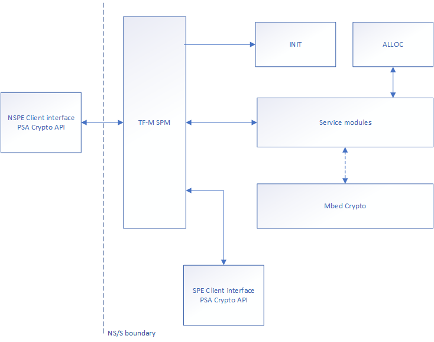

Crypto Service design
=====================

:Author: Antonio de Angelis
:Organization: Arm Limited
:Contact: Antonio de Angelis <antonio.deangelis@arm.com>
:Status: Accepted

.. contents:: Table of Contents

Abstract
--------

This document describes the design of the TF-M Cryptographic Secure Service
(in short, TF-M Crypto service).

Introduction
------------

The TF-M Crypto service provides an implementation of the PSA Crypto API
in a PSA RoT secure partition in TF-M. It is based on Mbed Crypto, which
is a reference implementation of the PSA Crypto API. For more details on
the PSA Crypto API or the Mbed Crypto implementation, please refer
directly to the ``mbed-crypto`` GitHub repository [1]_ .

The service can be used by other services running in the SPE, or by
applications running in the NSPE, to provide cryptographic
functionalities.

Components
----------

The TF-M Crypto service is implemented by a number of different software
components, which are listed below:

.. table:: Components table
   :widths: auto

   +-----------------------------+---------------------------------------------------------------+----------------------------------------------------------------------+
   | **Component name**          | **Description**                                               | **Location**                                                         |
   +=============================+===============================================================+======================================================================+
   | SPE client API interface    | This module exports the client API of PSA Crypto to the other | ``./secure_fw/services/crypto/tfm_crypto_secure_api.c``              |
   |                             | services available in TF-M.                                   |                                                                      |
   +-----------------------------+---------------------------------------------------------------+----------------------------------------------------------------------+
   | NSPE client API interface   | This module exports the client API of PSA Crypto to the NSPE  | ``./interface/src/tfm_crypto_api.c``                                 |
   |                             | (i.e. to the applications).                                   |                                                                      |
   +-----------------------------+---------------------------------------------------------------+----------------------------------------------------------------------+
   | Mbed Crypto                 | The Mbed Crypto library is used in the service as a           | Needed as dependency at the same level of the TF-M folder,           |
   |                             | cryptographic library exposing the PSA Crypto API interface.  | i.e. ``../mbed-crypto``                                              |
   +-----------------------------+---------------------------------------------------------------+----------------------------------------------------------------------+
   | Init module                 | This module handles the initialisation of the service objects | ``./secure_fw/services/crypto/crypto_init.c``                        |
   |                             | during TF-M boot and provides the infrastructure to service   |                                                                      |
   |                             | requests when TF-M is built for IPC mode.                     |                                                                      |
   |                             | Due to the fact that the functions available in the Service   |                                                                      |
   |                             | modules use the Uniform Signature prototype [2]_ , the        |                                                                      |
   |                             | dispatching mechanism of IPC requests is based on a look up   |                                                                      |
   |                             | table of function pointers.                                   |                                                                      |
   |                             | This design allows for better scalability and support of a    |                                                                      |
   |                             | higher number of Secure functions with minimal overhead and   |                                                                      |
   |                             | duplication of code.                                          |                                                                      |
   +-----------------------------+---------------------------------------------------------------+----------------------------------------------------------------------+
   | Alloc module                | This module handles the allocation of contexts for multipart  | ``./secure_fw/services/crypto/crypto_alloc.c``                       |
   |                             | operations in the Secure world.                               |                                                                      |
   +-----------------------------+---------------------------------------------------------------+----------------------------------------------------------------------+
   | Service modules             | These modules (AEAD, Asymmetric, Cipher, Key Deriv, Hash, Key,| ``./secure_fw/services/crypto/crypto_aead.c``                        |
   |                             | MAC) represent a thin layer which is in charge of servicing   | ``./secure_fw/services/crypto/crypto_asymmetric.c``                  |
   |                             | the calls from the SPE/NSPE client API interfaces.            | ``./secure_fw/services/crypto/crypto_cipher.c``                      |
   |                             | They provide parameter sanitation and context retrieval for   | ``./secure_fw/services/crypto/crypto_key_derivation.c``              |
   |                             | multipart operations, and dispatching to the corresponding    | ``./secure_fw/services/crypto/crypto_hash.c``                        |
   |                             | library function exposed by Mbed Crypto for the desired       | ``./secure_fw/services/crypto/crypto_key.c``                         |
   |                             | functionality.                                                | ``./secure_fw/services/crypto/crypto_mac.c``                         |
   |                             | All the functions in the Service modules are based on the     |                                                                      |
   |                             | Uniform Signature prototype [2]_ .                            |                                                                      |
   +-----------------------------+---------------------------------------------------------------+----------------------------------------------------------------------+
   | Manifest                    | The manifest file is a description of the service components  | ``./secure_fw/services/crypto/manifest.yaml``                        |
   |                             | for both library mode and IPC mode.                           |                                                                      |
   +-----------------------------+---------------------------------------------------------------+----------------------------------------------------------------------+
   | CMake files and headers     | The CMake files are used by the TF-M CMake build system to    | ``./secure_fw/services/crypto/CMakeLists.inc``                       |
   |                             | build the service as part of the Secure FW build. The service | ``./secure_fw/services/crypto/CMakeLists.txt``                       |
   |                             | is built as a static library (``tfm_crypto.a``).              | ``./interface/include/tfm_crypto_defs.h``                            |
   |                             | The build system allows to build as well the Mbed Crypto      | ``./secure_fw/services/crypto/tfm_crypto_api.h``                     |
   |                             | library as part of the Secure FW build process and archive it | ``./secure_fw/services/crypto/tfm_crypto_signal.h``                  |
   |                             | with the static library of the Crypto service.                | ``./secure_fw/services/crypto/spe_crypto.h``                         |
   |                             | The headers are used to export the public prototypes of the   |                                                                      |
   |                             | functions in the Service modules ``tfm_crypto_api.h``, and    |                                                                      |
   |                             | to provide the necessary defines (i.e. ``TFM_CRYPTO_SIG``).   |                                                                      |
   |                             | In particular ``TFM_CRYPTO_SIG`` identifies the signal on     |                                                                      |
   |                             | which the service handler waits for requests when the service |                                                                      |
   |                             | is built for IPC mode.                                        |                                                                      |
   |                             | The header available in the interface, ``tfm_crypto_defs.h``  |                                                                      |
   |                             | , contains types and defines for building the NSPE interface  |                                                                      |
   |                             | as part of a Non-Secure application.                          |                                                                      |
   |                             | Finally, the ``crypto_spe.h`` header is used during the       |                                                                      |
   |                             | build of the Mbed Crypto library, when the Mbed Crypto config |                                                                      |
   |                             | option ``MBEDTLS_PSA_CRYPTO_SPM`` is defined, to add a        |                                                                      |
   |                             | custom prefix to the PSA API symbols  so that duplication of  |                                                                      |
   |                             | symbol names is avoided.                                      |                                                                      |
   |                             | The prefix used for the PSA API symbols of the Mbed Crypto    |                                                                      |
   |                             | library is chosen to be ``mbedcrypto__``.                     |                                                                      |
   +-----------------------------+---------------------------------------------------------------+----------------------------------------------------------------------+
   | Documentation               | The integration guide contains the description of the TF-M    | ``./docs/user_guides/services/tfm_crypto_integration_guide.rst``     |
   |                             | Crypto service modules and interfaces.                        |                                                                      |
   +-----------------------------+---------------------------------------------------------------+----------------------------------------------------------------------+

The interaction between the different components is described by the
following block diagram:

   Block diagram of the different components of the TF-M Crypto service. A
   dotted line is used to indicate the interaction with a library.

Note: in IPC mode, the interaction between components is slightly
different, as the Service modules are not called directly through the
TF-M Secure Partition Manager but through the IPC handler which resides
in the Init module.

Service API description
-----------------------

Most of the APIs exported by the TF-M Crypto service (i.e. from the Service
modules) is based on the Uniform Signature prototypes [2]_ and have a direct
correspondence with the PSA Crypto API. The Alloc and Init modules instead
export some APIs which are specific to the TF-M Crypto service, and are
available only to the Service modules or the SPM. For a detailed description
of the prototypes please refer to the ``tfm_crypto_api.h`` header.

.. table:: Init and Alloc modules APIs
   :widths: auto

   +--------------------------------+--------------+-----------------+------------------------------------------------------+
   | **Function**                   | **Module**   | **Caller**      | **Scope**                                            |
   +================================+==============+=================+======================================================+
   | tfm_crypto_init()              | Init         | SPM             | Called during TF-M boot for initialisation. In IPC   |
   |                                |              |                 | mode, it calls the IPC service request handler.      |
   +--------------------------------+--------------+-----------------+------------------------------------------------------+
   | tfm_crypto_init_alloc()        | Alloc        | Init            | Called by tfm_crypto_init(), it initialises the      |
   |                                |              |                 | concurrent operation contexts storage area.          |
   +--------------------------------+--------------+-----------------+------------------------------------------------------+
   | tfm_crypto_operation_alloc()   | Alloc        | Service modules | It allocates a new operation context for a multipart |
   |                                |              |                 | operation. It returns an handle to the allocated     |
   |                                |              |                 | context in secure memory.                            |
   +--------------------------------+--------------+-----------------+------------------------------------------------------+
   | tfm_crypto_operation_lookup()  | Alloc        | Service modules | It retrieves a previously allocated operation context|
   |                                |              |                 | of a multipart operation, based on the handle given  |
   |                                |              |                 | as input.                                            |
   +--------------------------------+--------------+-----------------+------------------------------------------------------+
   | tfm_crypto_operation_release() | Alloc        | Service modules | It releases a previously allocated operation context |
   |                                |              |                 | of a multipart operation, based on the handle given  |
   |                                |              |                 | as input.                                            |
   +--------------------------------+--------------+-----------------+------------------------------------------------------+

Configuration parameters
------------------------

The TF-M Crypto service exposes some configuration parameters to tailor
the service configuration in terms of supported functionalities and
hence FLASH/RAM size to meet the requirements of different platforms and
use cases. These parameters can be provided via CMake parameters during
the CMake configuration step and as a configuration header to allow the
configuration of the Mbed Crypto library.

.. table:: Configuration parameters table
   :widths: auto

   +-------------------------------+---------------------------+----------------------------------------------------------------+-----------------------------------------+----------------------------------------------------+
   | **Parameter**                 | **Type**                  | **Description**                                                | **Scope**                               | **Default**                                        |
   +===============================+===========================+================================================================+=========================================+====================================================+
   | ``CRYPTO_ENGINE_BUF_SIZE``    | CMake build               | Buffer used by Mbed Crypto for its own allocations at runtime. | To be configured based on the desired   | 8096 (bytes)                                       |
   |                               | configuration parameter   | This is a buffer allocated in static memory.                   | use case and application requirements.  |                                                    |
   +-------------------------------+---------------------------+----------------------------------------------------------------+-----------------------------------------+----------------------------------------------------+
   | ``CRYPTO_CONC_OPER_NUM``      | CMake build               | This parameter defines the maximum number of possible          | To be configured based on the desire    | 8                                                  |
   |                               | configuration parameter   | concurrent operation contexts (cipher, MAC, hash and key deriv)| use case and platform requirements.     |                                                    |
   |                               |                           | for multi-part operations, that can be allocated simultaneously|                                         |                                                    |
   |                               |                           | at any time.                                                   |                                         |                                                    |
   +-------------------------------+---------------------------+----------------------------------------------------------------+-----------------------------------------+----------------------------------------------------+
   | ``CRYPTO_IOVEC_BUFFER_SIZE``  | CMake build               | This parameter applies only to IPC mode builds. In IPC mode,   | To be configured based on the desired   | 5120 (bytes)                                       |
   |                               | configuration parameter   | during a Service call, input and outputs are allocated         | use case and application requirements.  |                                                    |
   |                               |                           | temporarily in an internal scratch buffer whose size is        |                                         |                                                    |
   |                               |                           | determined by this parameter.                                  |                                         |                                                    |
   +-------------------------------+---------------------------+----------------------------------------------------------------+-----------------------------------------+----------------------------------------------------+
   | ``MBEDTLS_CONFIG_FILE``       | Configuration header      | The Mbed Crypto library can be configured to support different | To be configured based on the           | ``./platform/ext/common/tfm_mbedcrypto_config.h``  |
   |                               |                           | algorithms through the usage of a a configuration header file  | application and platform requirements.  |                                                    |
   |                               |                           | at build time. This allows for tailoring FLASH/RAM requirements|                                         |                                                    |
   |                               |                           | for different platforms and use cases.                         |                                         |                                                    |
   +-------------------------------+---------------------------+----------------------------------------------------------------+-----------------------------------------+----------------------------------------------------+

References
----------

.. [1] ``mbed-crypto`` repository which holds the PSA Crypto API specification and the Mbed Crypto reference implementation: \ https://github.com/ARMmbed/mbed-crypto

.. [2] Uniform Signature prototypes: \ https://developer.trustedfirmware.org/w/tf_m/design/uniform_secure_service_signature/

--------------

*Copyright (c) 2019-2020, Arm Limited. All rights reserved.*
