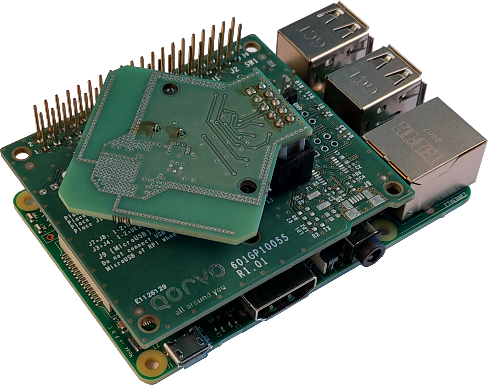
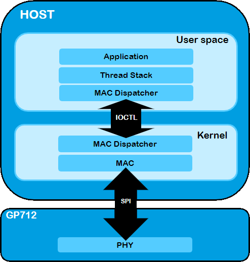

# GP712 User Manual

*OpenThread* is an open source implementation of Thread networking protocols developed by the Thread group. It allows 802.15.4-capable devices to build robust dynamic mesh networks. 
This document provides the reader with instructions on how to run a Thread application using the *OpenThread* stack with the GP712.

The Qorvo GP712 System-on-Chip ([controller specification](https://www.qorvo.com/products/p/GP712)) is an IEEE 802.15.4 multi-stack multi-channel communications controller for integration into a Zigbee® or Thread node. The GP712 interference robustness and antenna diversity offer superior performance in a crowded wireless 2.4 GHz environment.

---

- [GP712 User Manual](#gp712-user-manual)
  - [Prerequisites](#prerequisites)
    - [Hardware](#hardware)
    - [Software](#software)
  - [Building *OpenThread*](#building-openthread)
    - [Architecture](#architecture)
    - [Getting Qorvo *OpenThread*](#getting-qorvo-openthread)
    - [Command Line Interface (CLI) build for the GP712](#command-line-interface-cli-build-for-the-gp712)
  - [Programming the GP712](#programming-the-gp712)
  - [Interacting with the Thread Network through the CLI](#interacting-with-the-thread-network-through-the-cli)
  - [Additional resources](#additional-resources)

---

## Prerequisites

### Hardware

The GP712 Development Kit contains a Raspberry Pi (RPi), a GP712 module and an SD card with the necessary drivers.

### Software

Currently *OpenThread* can only be built using a Unix based system. In this manual we will use a *Debian* based environment (as does *OpenThread*)

Make sure the package repositories are up date

    sudo apt-get update

Next install *Git*

    sudo apt-get install git -y

Get a cross compiler toolchain for Raspberry Pi

    git clone https://github.com/raspberrypi/tools.git

The toolchain can now be found under

    tools/arm-bcm2708/arm-bcm2708hardfp-linux-gnueabi/bin

## Building *OpenThread*

### Architecture

Running Thread on a GP712 is split into two major blocks: the *Host* and the GP712 firmware. The latter is preprogrammed and requires no user interaction.

From top to bottom:  
**Note:** paths are relative to the [root of the ot-qorvo repository](https://github.com/openthread/ot-qorvo)

- The Application:  
  - location: [`openthread/example/apps`](https://github.com/openthread/openthread/tree/main/examples/apps)
  - what: For this example the *OpenThread CLI* application will be built. This application allows the manipulation of the Thread stack over a serial interface.
- OpenThread Stack:
  This block can be further split into three blocks (also top-down)
  - Thread
    - location: [`openthread/src/`](https://github.com/openthread/openthread/tree/main/src)
    - what: implements the [Thread specification](https://www.threadgroup.org/ThreadSpec). It can be configured through a set of [configure switches](https://github.com/openthread/openthread/tree/master/examples/common-switches.mk).
  - Platform glue code:
    - location: [`src/gp712`](https://github.com/openthread/ot-qorvo/tree/main/src/gp712)
    - what: code to interface *OpenThread* with platform specific things such as alarms, storage, random number generator, …
  - Drivers and platform interfaces
    - location: [`third_party/Qorvo/repo/gp712`](https://github.com/Qorvo/qpg-openthread/tree/master/gp712), but hosted in a [Qorvo repository](https://github.com/Qorvo/qpg-openthread)
    - what: Qorvo specific code, MAC Dispatcher client and libraries required to build for and interface with the GP712 kernel drivers.  
    specifically(relative to *location*):
      - `lib/libQorvoGP712_ftd.a`: library for *Full Thread Device* support
      - `lib/libQorvoGP712_mtd.a`: library for *Minimal Thread Device* support
- Kernel drivers
  - Driver `.ko` files, the necessary deploy instruction and other documentation need to be obtained through <LPW.support@qorvo.com> or through your business contact.

All the parts in _User space_ will be compiled into a single executable `.elf` file. This executable communicates with the RPi kernel drivers provided in the GP712 Development Kit.

To obtain the Development Kit and associated drivers contact us at <LPW.support@qorvo.com> or through your business contact.

### Getting Qorvo *OpenThread*

First get the latest version of *ot-qorvo* and its submodules

    git clone https://github.com/openthread/ot-qorvo
    cd ot-qorvo
    git submodule update --init --recursive

The `git submodule update` command will populate the `openthread` directory with the openthread core implementation and `third_party/Qorvo/repo` with pre-compiled libraries.

All commands and scripts are run from the openthread root directory.

To resolve any outstanding dependencies to build *OpenThread*, run the optional

    ./script/bootstrap

**Note 1:** The script will install a *gnu embedded toolchain*, but the one in [Prerequisites](#prerequisites) will be used in this example.  
**Note 2:** The final step of this script will fail if _Linuxbrew_ is not installed. The error can be ignored.

### Command Line Interface (CLI) build for the GP712

This is the most common build. It enables the user to control the thread stack parameters, to join/commission devices, etc. by connecting to a Command Line Interface (CLI) server.

**Note:** This guide will cross compile for the Raspberry Pi. It is possible to make the builds natively on a Raspberry Pi, but we found the cross compilation to be faster.

First, add the compiler to `$PATH`

    export PATH=<path-to-tools>/tools/arm-bcm2708/arm-bcm2708hardfp-linux-gnueabi/bin/:$PATH

The basic build command for the GP712 is:

    ./script/build gp712

This will build the CLI application for both the *Minimal Thread Device* and the *Full Thread Device* simultaneously. The output will be the following `.elf` files located in `./build/bin`

- `gp712-ot-cli-ftd.elf`
- `gp712-ot-cli-mtd.elf`

*OpenThread* provides a series of configuration switches to enable additional functionality in the build. For a list of the regular and the advanced features we refer you to [common-switches.mk](https://github.com/openthread/openthread/tree/master/examples/common-switches.mk) and the enhanced feature menu on the [build instructions landing page](https://openthread.io/guides/build), respectively.

For a *FTD* the following build command can be used

    ./script/build gp712 -DOT_COMMISSIONER=1 -DOT_DHCP6_CLIENT=1 -DOT_DHCP6_SERVER=1 -DOT_JOINER=ON

For a *MTD*, the following is sufficient

    ./script/build gp712 -DOT_DHCP6_CLIENT=1 -DOT_JOINER=ON

**Note:** both the above command will always build both the *FTD* and *MTD* executable. But it is unnecessary for a *MTD* device to support e.g. the *Commissioner* role or the DHCP server functionality.

## Programming the GP712

Programming the executable, means just copying it to a RPi and making sure it is executable.

    chmod +x gp712-ot-cli-ftd.elf

To run it, one first has to make sure the kernel drivers are loaded and have a communications channel with the `*.elf`. Instructions for this come with the GP712 Development Kit.

## Interacting with the Thread Network through the CLI

Run the executable

    ./gp712-ot-cli-ftd.elf

This launches the CLI client.

Validating the Thread operation can be done by running the scenarios [here](../../general/thread_validation.md).

## Additional resources

Please visit [www.qorvo.com](https://www.qorvo.com) for more information on our product line, or more specifically the [GP712 product page](https://www.qorvo.com/products/p/GP712) or contact us at
<LPW.support@qorvo.com>.

Additional generic information can be found on

- <https://github.com/openthread/openthread>
- <https://openthread.io>
- <https://groups.google.com/g/openthread-users>
