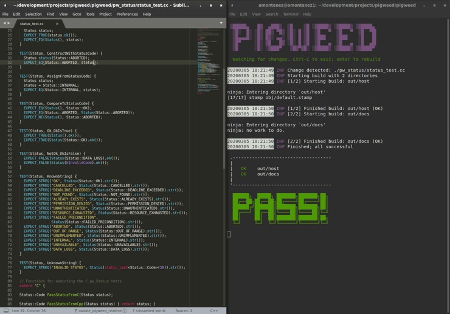
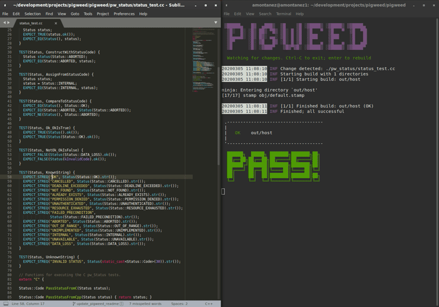
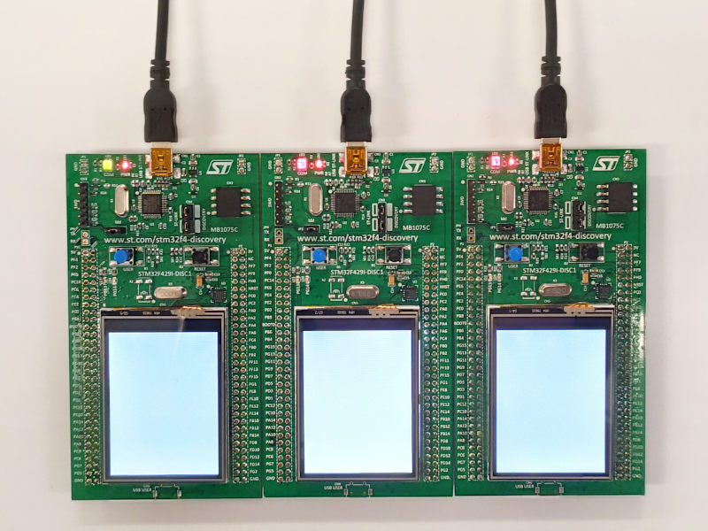
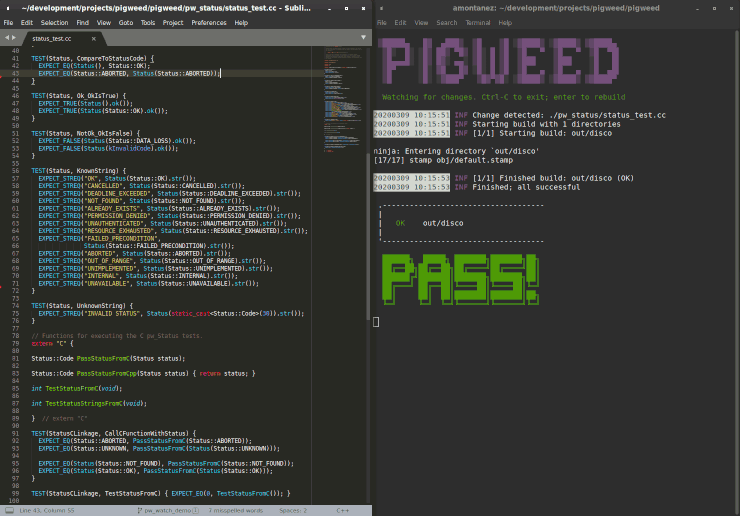

.. _docs-getting-started:

===============
Getting Started
===============
This guide will walk you through the typical upstream development workflow.

.. note::

  This documentation and the `sample project
  <https://pigweed.googlesource.com/pigweed/sample_project/+/main/README.md>`_
  show how to use Pigweed as a library in your existing project. Using Pigweed
  as the foundation for *new* projects is our intended use case, but you may
  need more guidance than this documentation provides to do that right now.

  We're happy to help you get your project setup; just drop in our `chat room
  <https://discord.gg/M9NSeTA>`_ or send a note to the `mailing list
  <https://groups.google.com/forum/#!forum/pigweed>`_.

Express setup
=============
If you'd like to skip the detailed explanations, below is the shorter version
of getting setup for Pigweed. If you run into trouble, look at the more
in-depth guide below, starting at :ref:`prerequisites`. The express setup
configures Pigweed's watcher for three targets to give a taste of Pigweed:

#. **Host** - Mac, Linux, or Windows. Builds and runs tests
#. **Device/STM32F429** - Build only; Optionally, the STM32F429I-DISC1 kit to
   follow along later in the guide to run tests directly on said device(s)
#. **Docs** - Builds the Pigweed docs

To get setup:

#. Make sure you have Git and Python installed and on your path.

#. Clone Pigweed and bootstrap the environment (compiler setup & more). **Be
   patient, this step downloads ~1GB of LLVM, GCC, and other tooling**.

   .. code:: bash

     $ cd ~
     $ git clone https://pigweed.googlesource.com/pigweed/pigweed
     ...
     $ cd pigweed
     $ source ./bootstrap.sh (On Linux & Mac)
     $ bootstrap.bat         (On Windows)
     ...

#. Configure the GN build.

   .. code:: bash

     $ gn gen out
     Done. Made 1047 targets from 91 files in 114ms

#. Start the watcher. The watcher will invoke Ninja to build all the targets

   .. code:: bash

     $ pw watch

      ▒█████▄   █▓  ▄███▒  ▒█    ▒█ ░▓████▒ ░▓████▒ ▒▓████▄
       ▒█░  █░ ░█▒ ██▒ ▀█▒ ▒█░ █ ▒█  ▒█   ▀  ▒█   ▀  ▒█  ▀█▌
       ▒█▄▄▄█░ ░█▒ █▓░ ▄▄░ ▒█░ █ ▒█  ▒███    ▒███    ░█   █▌
       ▒█▀     ░█░ ▓█   █▓ ░█░ █ ▒█  ▒█   ▄  ▒█   ▄  ░█  ▄█▌
       ▒█      ░█░ ░▓███▀   ▒█▓▀▓█░ ░▓████▒ ░▓████▒ ▒▓████▀

     20200707 17:24:06 INF Starting Pigweed build watcher
     20200707 17:24:06 INF Will build [1/1]: out
     20200707 17:24:06 INF Attaching filesystem watcher to $HOME/wrk/pigweed/...
     20200707 17:24:06 INF Triggering initial build...
     ...

#. **Congratulations, you're ready to go!** Now take Pigweed for a spin by
   making a test fail.

#. With the watcher running in a separate window, edit
   ``pw_status/status_test.cc`` to make an expectation fail; for example, add
   ``EXPECT_EQ(0, 1);`` in a test.

#. Save the file. Observe the watcher rebuild & retest, and fail. Restore the
   test if you feel like it.

#. Open the generated docs in ``out/docs/gen/docs/html/index.html`` in your
   browser.

#. Edit ``docs/getting_started.rst`` (this file!) and make any change. Save.
   See the watcher rebuild the docs. Reload your browser, and see the changes.

See below for equivalent Windows commands, and for more details on what each
part does.

**Note:** After running bootstrap once, use ``source ./activate.sh`` (or
``activate.bat`` on Windows) to re-activate the environment without
re-bootstrapping.

.. _prerequisites:

Prerequisites
-------------
**Linux**

Most Linux installations should work out of box, and not require any manual
installation of prerequisites beyond basics like ``git`` and
``build-essential`` (or the equivalent for your distro).

.. inclusive-language: disable

To flash devices using OpenOCD, you may need to extend your system udev rules
at ``/etc/udev/rules.d/``. The OpenOCD repository has a good
`example udev rules file <https://github.com/openocd-org/openocd/blob/master/contrib/60-openocd.rules>`_
that includes many popular hardware debuggers.

.. inclusive-language: enable

**macOS**

To start using Pigweed on MacOS, you'll need to install XCode. Download it
via the App Store, then install the relevant tools from the command line.

.. code:: none

  $ xcode-select --install

On macOS you may get SSL certificate errors with the system Python
installation. Run ``/Applications/Python <default_py_version>/Install Certificates.command``
to fix this. If you get SSL
errors with the Python from `Homebrew <https://brew.sh>`_ try running the
following commands to ensure Python knows how to use OpenSSL.

.. code:: none

  $ brew install openssl
  $ brew uninstall python
  $ brew install python

To flash firmware to a STM32 Discovery development board (and run ``pw test``)
from macOS, you will need to install OpenOCD. Install
`Homebrew <https://brew.sh>`_, then install OpenOCD with ``brew install openocd``.

**Windows**

To start using Pigweed on Windows, you'll need to do the following:

* Install `Git <https://git-scm.com/download/win>`_. Git must be installed to
  run from the command line and third-party software or be added to ``PATH``.
  Also, ensure that the **Enable symbolic links** option is selected.
* Install `Python <https://www.python.org/downloads/windows/>`_.
* Ensure that `Developer Mode
  <https://docs.microsoft.com/en-us/windows/apps/get-started/enable-your-device-for-development>`_
  is enabled.

If you plan to flash devices with firmware, you'll need to install OpenOCD and
ensure it's on your system path.

Bootstrap
=========

Once you satisfied the prerequisites, you will be able to clone Pigweed and
run the bootstrap that initializes the Pigweed virtual environment. The
bootstrap may take several minutes to complete, so please be patient.

**Linux & macOS**

.. code:: bash

  $ git clone https://pigweed.googlesource.com/pigweed/pigweed ~/pigweed
  $ cd ~/pigweed
  $ source ./bootstrap.sh

**Windows**

.. code:: batch

  :: Run git commands from the shell you set up to use with Git during install.
  > git clone https://pigweed.googlesource.com/pigweed/pigweed %HOMEPATH%\pigweed
  > cd %HOMEPATH%\pigweed
  > bootstrap.bat

Below is a real-time demo with roughly what you should expect to see as output:

Congratulations, you are now set up to start using Pigweed!

Pigweed Environment
===================
After going through the initial setup process, your current terminal will be in
the Pigweed development environment that provides all the tools you should need
to develop on Pigweed. If you leave that session, you can activate the
environment in a new session with the following command:

**Linux & macOS**

.. code:: bash

  $ source ./activate.sh

**Windows**

.. code:: batch

  > activate.bat

Some major changes may require triggering the bootstrap again, so if you run
into host tooling changes after a pull it may be worth re-running bootstrap.

Build Pigweed for Host
======================
Pigweed's primary build system is GN/Ninja based. There are CMake and Bazel
builds in-development, but they are incomplete and don't have feature parity
with the GN build. We strongly recommend you stick to the GN build system.

GN (Generate Ninja) just does what it says on the tin; GN generates
`Ninja <https://ninja-build.org/>`_ build files.

The default GN configuration generates build files that allow you to build host
binaries, device binaries, and upstream documentation all in one Ninja
invocation.

Run GN as seen below:

.. code:: bash

  $ gn gen out

Note that ``out`` is simply the directory the build files are saved to. Unless
this directory is deleted or you desire to do a clean build, there's no need to
run GN again; just rebuild using Ninja directly.

Now that we have build files, it's time to build Pigweed!

Now you *could* manually invoke the host build using ``ninja -C out`` every
time you make a change, but that's tedious. Instead, let's use ``pw_watch``.

Go ahead and start ``pw_watch``:

.. code:: bash

  $ pw watch

When ``pw_watch`` starts up, it will automatically build the directory we
generated in ``out``. Additionally, ``pw_watch`` watches source code files for
changes, and triggers a Ninja build whenever it notices a file has been saved.
You might be surprised how much time it can save you!

With ``pw watch`` running, try modifying
``pw_status/public/pw_status/status.h`` and watch the build re-trigger when you
save the file.

See below for a demo of this in action:

Running Unit Tests
==================
Fun fact, you've been running the unit tests already! Ninja builds targeting
the host automatically build and run the unit tests. Unit tests err on the side
of being quiet in the success case, and only output test results when there's a
failure.

To see a test failure, modify ``pw_status/status_test.cc`` to fail by changing
one of the strings in the "KnownString" test.

Running tests as part of the build isn't particularly expensive because GN
caches passing tests. Each time you build, only the tests that are affected
(whether directly or transitively) by the code changes since the last build
will be re-built and re-run.

Try running the ``pw_status`` test manually:

.. code:: bash

  $ ./out/pw_strict_host_{clang,gcc}_debug/obj/pw_status/test/status_test

Depending on your host OS, the compiler will default to either ``clang`` or
``gcc``.

Building for a Device
=====================
A Pigweed "target" is a build configuration that includes a toolchain, default
library configurations, and more to result in binaries that run natively on the
target. With the default build invocation, you're already building for a device
target (the STMicroelectronics STM32F429I-DISC1) in parallel with the host
build!

If you want to build JUST for the device, you can kick of watch with:

.. code:: bash

  $ pw watch stm32f429i

This is equivalent to the following Ninja invocation:

.. code:: bash

  $ ninja -C out stm32f429i

Running Tests on a Device
=========================
While tests run automatically on the host, it takes a few more steps to get
tests to run automatically on a device, too. Even though we've verified tests
pass on the host, it's crucial to verify the same with on-device testing. We've
encountered some unexpected bugs that can only be found by running the unit
tests directly on the device.

1. Connect Device(s)
--------------------
Connect any number of STM32F429I-DISC1 boards to your computer using the mini
USB port on the board (**not** the micro USB). Pigweed will automatically
detect the boards and distribute the tests across the devices. More boards =
faster tests! Keep in mind that you may have to make some environment specific
updates to ensure you have permissions to use the USB device. For example, on
Linux you may need to update your udev rules and ensure you're in the plugdev
and dialout groups.

2. Launch Test Server
---------------------
To allow Ninja to run tests on an arbitrary number of devices, Ninja will send
test requests to a server running in the background. Launch the server in
another window using the command below (remember, you'll need to activate the
Pigweed environment first).

.. code:: bash

  $ stm32f429i_disc1_test_server

**Note:** If you attach or detach any more boards to your workstation you'll
need to relaunch this server.

3. Configure GN
---------------
Tell GN to use the testing server by enabling a build arg specific to the
stm32f429i-disc1 target.

.. code:: bash

  $ gn args out
  # Append this line to the file that opens in your editor to tell GN to run
  # on-device unit tests.
  pw_use_test_server = true

**Note:** There are several additional dependencies required to test on device:
libusb-compat, libftdi, and hidapi at the time of writing. On MacOS, these
dependencies should be installed to the default homebrew location:
``/usr/local/opt/``.

Done!
-----
Whenever you make code changes and trigger a build, all the affected unit tests
will be run across the attached boards!

See the demo below for an example of what this all looks like put together:

Building the Documentation
==========================
In addition to the markdown documentation, Pigweed has a collection of
information-rich RST files that are used to generate HTML documentation. All
the docs are hosted at https://pigweed.dev/, and are built as a part of the
default build invocation. This makes it easier to make changes and see how they
turn out. Once built, you can find the rendered HTML documentation at
``out/docs/gen/docs/html``.

You can explicitly build just the documentation with the command below.

.. code:: bash

  $ ninja -C out docs

This concludes the introduction to developing for upstream Pigweed.

Building Tests Individually
===========================
Sometimes it's faster to incrementally build a single test target rather than
waiting for the whole world to build and all tests to run. GN has a built-in
tool, ``gn outputs``, that will translate a GN build step into a Ninja build
step. In order to build and run the right test, it's important to explicitly
specify which target to build the test under (e.g. host, SM32F529I-DISC1).
This can be done by appending the GN path to the target toolchain in parenthesis
after the desired GN build step label as seen in the example below.

.. code:: none

  $ gn outputs out "//pw_status:status_test.run(//targets/host/pigweed_internal:pw_strict_host_clang_debug)"
  pw_strict_host_clang_debug/gen/pw_status/status_test.run.pw_pystamp

  $ ninja -C out pw_strict_host_clang_debug/gen/pw_status/status_test.run.pw_pystamp
  ninja: Entering directory `out'
  [4/4] ACTION //pw_status:status_test.run(//targets/host/pigweed_internal:pw_strict_host_clang_debug)

The ``.run`` following the test target name is a sub-target created as part of
the ``pw_test`` GN template. If you remove ``.run``, the test will build but
not attempt to run.

In macOS and Linux, ``xargs`` can be used to turn this into a single command:

.. code:: bash

  $ gn outputs out "//pw_status:status_test.run(//targets/host/pigweed_internal:pw_strict_host_clang_debug)" | xargs ninja -C out

Next steps
==========

Check out other modules
-----------------------
If you'd like to see more of what Pigweed has to offer, dive into the
:ref:`docs-module-guides`.

Check out the sample project
----------------------------
We have a `sample project
<https://pigweed.googlesource.com/pigweed/sample_project/+/main/README.md>`_
that demonstrates how to use Pigweed in your own project. Note that there are
many ways to leverage Pigweed and the sample project is one approach.

Check out the Hackaday Supercon talk about Pigweed
--------------------------------------------------
We gave a talk at Hackaday's 2021 supercon, `Give Pigweed a Whirl
<https://hackaday.com/2021/01/13/remoticon-video-pigweed-brings-embedded-unit-testing-library-integration-to-commandline/>`_

We've made improvements since we gave the talk; for example, we now have RTOS
primitives.

Set up Pigweed for your own project
------------------------------------
We don't yet have thorough documentation for leveraging Pigweed in a separate
project (our intended use case!). The `sample project
<https://pigweed.googlesource.com/pigweed/sample_project/+/main/README.md>`_
shows how to use Pigweed as a library in your broader project, but you may need
further guidance.

Dropping into our `chat room <https://discord.gg/M9NSeTA>`_ is the most
immediate way to get help. Alternatively, you can send a note to the `mailing
list <https://groups.google.com/forum/#!forum/pigweed>`_.
