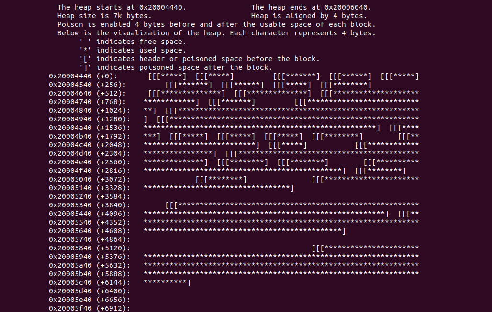

.. _module-pw_allocator:

------------
pw_allocator
------------

This module provides various building blocks
for a dynamic allocator. This is composed of the following parts:

- ``block``: An implementation of a linked list of memory blocks, supporting
  splitting and merging of blocks.
- ``freelist``: A freelist, suitable for fast lookups of available memory chunks
  (i.e. ``block`` s).

Heap Integrity Check
====================
The ``Block`` class provides two check functions:

- ``bool Block::IsValid()``: Returns ``true`` is the given block is valid and
  ``false`` otherwise.
- ``void Block::CrashIfInvalid()``: Crash the program and output the reason why
  the check fails using ``PW_DCHECK``.

Heap Poisoning
==============

By default, this module disables heap poisoning since it requires extra space.
User can enable heap poisoning by enabling the ``pw_allocator_POISON_HEAP``
build arg.

.. code:: sh

  $ gn args out
  # Modify and save the args file to use heap poison.
  pw_allocator_POISON_HEAP = true

When heap poisoning is enabled, ``pw_allocator`` will add ``sizeof(void*)``
bytes before and after the usable space of each ``Block``, and paint the space
with a hard-coded randomized pattern. During each check, ``pw_allocator``
will check if the painted space still remains the pattern, and return ``false``
if the pattern is damaged.

Heap Visualizer
===============

Functionality
-------------

``pw_allocator`` supplies a pw command ``pw heap-viewer`` to help visualize
the state of the heap at the end of a dump file. The heap is represented by
ASCII characters, where each character represents 4 bytes in the heap.

Usage
-----

The heap visualizer can be launched from a shell using the Pigweed environment.

.. code:: sh

  $ pw heap-viewer --dump-file <directory of dump file> --heap-low-address
  <hex address of heap lower address> --heap-high-address <hex address of heap
  lower address> [options]

The required arguments are:

- ``--dump-file`` is the path of a file that contains ``malloc/free``
  information. Each line in the dump file represents a ``malloc/free`` call.
  ``malloc`` is represented as ``m <size> <memory address>`` and ``free`` is
  represented as ``f <memory address>``. For example, a dump file should look
  like:

  .. code:: sh

    m 20 0x20004450  # malloc 20 bytes, the pointer is 0x20004450
    m 8 0x2000447c   # malloc 8 bytes, the pointer is 0x2000447c
    f 0x2000447c     # free the pointer at 0x2000447c
    ...

  Any line not formatted as the above will be ignored.

- ``--heap-low-address`` is the start of the heap. For example:

  .. code:: sh

    --heap-low-address 0x20004440

- ``--heap-high-address`` is the end of the heap. For example:

  .. code:: sh

    --heap-high-address 0x20006040

Options include the following:

- ``--poison-enable``: If heap poisoning is enabled during the
  allocation or not. The value is ``False`` if the option is not specified and
  ``True`` otherwise.

- ``--pointer-size <integer of pointer size>``: The size of a pointer on the
  machine where ``malloc/free`` is called. The default value is ``4``.

Note, this module, and its documentation, is currently incomplete and
experimental.
