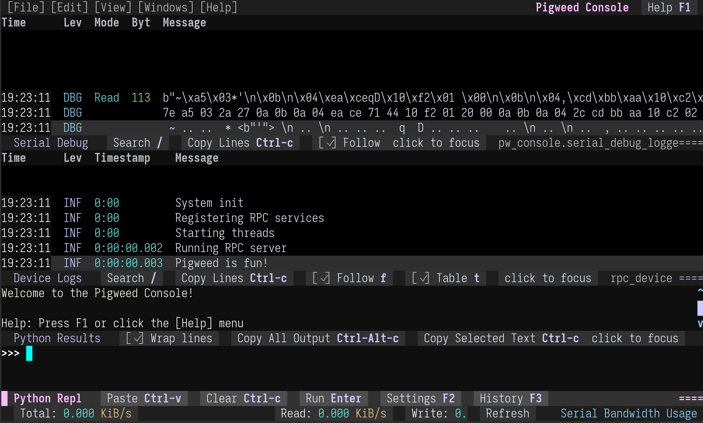

.. _module-pw_console:

----------
pw_console
----------

:bdg-primary:`host`
:bdg-secondary:`Python`
:bdg-success:`stable`

The Pigweed Console provides a Python repl (read eval print loop) using
`ptpython`_ and a log message viewer in a single-window terminal based
interface. It is designed to be a replacement for `IPython's embed()`_ function.

Features
========

``pw_console`` aims to be a complete solution for interacting with hardware
devices using :ref:`module-pw_rpc` over a :ref:`module-pw_hdlc` transport.

- Interactive Python repl and log viewer in a single terminal window. This
  provides interactive RPC sending while the log viewer provides immediate
  feedback on device status.

  .. figure:: images/python_completion.png
    :alt: Pigweed Console screenshot showing RPC Python repl completions.

- Easily embeddable within a project's own custom console. This should allow
  users to define their own transport layer.

- Log viewer with searching and filtering.

Contributing
============

- All code submissions to ``pw_console`` require running the
  :ref:`module-pw_console-testing`.

- Commit messages should include a ``Testing:`` line with the steps that were
  manually run.

Guides
======

.. toctree::
  :maxdepth: 1

  py/pw_console/docs/user_guide
  embedding
  plugins
  testing
  internals

.. _IPython's embed(): https://ipython.readthedocs.io/en/stable/interactive/reference.html#embedding
.. _IPython: https://ipython.readthedocs.io/
.. _prompt_toolkit: https://python-prompt-toolkit.readthedocs.io/
.. _ptpython: https://github.com/prompt-toolkit/ptpython/

