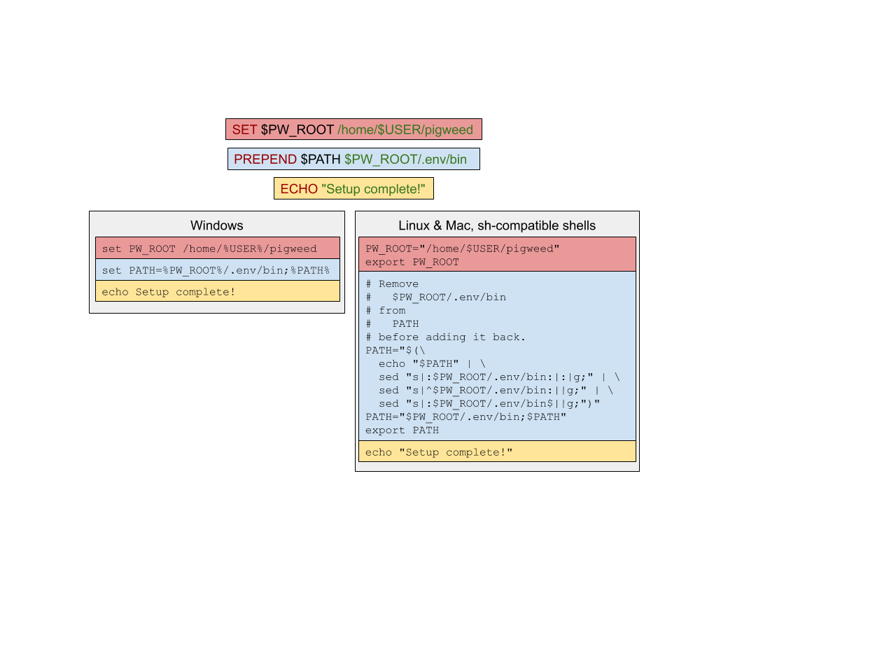

.. _module-pw_env_setup:

------------
pw_env_setup
------------
A classic problem in the embedded space is reducing the time from git clone
to having a binary executing on a device. The issue is that an entire suite
of tools is needed for non-trivial production embedded projects. For example:

 - A C++ compiler for your target device, and also for your host
 - A build system or three; for example, GN, Ninja, CMake, Bazel
 - A code formatting program like clang-format
 - A debugger like OpenOCD to flash and debug your embedded device (OpenOCD support removed for Windows)
 - A known Python version with known modules installed for scripting
 - A Go compiler for the Go-based command line tools

...and so on

In the server space, container solutions like Docker or Podman solve this;
however, in our experience container solutions are a mixed bag for embedded
systems development where one frequently needs access to native system
resources like USB devices, or must operate on Windows.

``pw_env_setup`` is our compromise solution for this problem that works on Mac,
Windows, and Linux. It leverages the Chrome packaging system `CIPD`_ to
bootstrap a Python installation, which in turn inflates a virtual
environment. The tooling is installed into your workspace, and makes no
changes to your system. This tooling is designed to be reused by any
project.

.. _CIPD: https://github.com/luci/luci-go/tree/HEAD/cipd

Users interact with  ``pw_env_setup`` with two commands: ``. bootstrap.sh`` and
``. activate.sh``. The bootstrap command always pulls down the current versions
of CIPD packages and sets up the Python virtual environment. The activate
command reinitializes a previously configured environment, and if none is found,
runs bootstrap.

.. note::
  On Windows the scripts used to set up the environment are ``bootstrap.bat``
  and ``activate.bat``. For simplicity they will be referred to with the ``.sh``
  endings unless the distinction is relevant.

.. warning::
  At this time ``pw_env_setup`` works for us, but isn’t well tested. We don’t
  suggest relying on it just yet. However, we are interested in experience
  reports; if you give it a try, please `send us a note`_ about your
  experience.

.. _send us a note: pigweed@googlegroups.com

On POSIX systems, the environment can be deactivated by running ``deactivate``.

==================================
Using pw_env_setup in your project
==================================

Downstream Projects Using Pigweed's Packages
********************************************

Projects using Pigweed can leverage ``pw_env_setup`` to install Pigweed's
dependencies or their own dependencies. Projects that only want to use Pigweed's
dependencies without modifying them can just source Pigweed's ``bootstrap.sh``
and ``activate.sh`` scripts.

An example of what your project's `bootstrap.sh` could look like is below. This
assumes `bootstrap.sh` is at the top level of your repository.

.. code-block:: bash

  # Do not include a "#!" line, this must be sourced and not executed.

  # This assumes the user is sourcing this file from it's parent directory. See
  # below for a more flexible way to handle this.
  PROJ_SETUP_SCRIPT_PATH="$(pwd)/bootstrap.sh"

  export PW_PROJECT_ROOT="$(_python_abspath "$(dirname "$PROJ_SETUP_SCRIPT_PATH")")"

  # You may wish to check if the user is attempting to execute this script
  # instead of sourcing it. See below for an example of how to handle that
  # situation.

  # Source Pigweed's bootstrap utility script.
  # Using '.' instead of 'source' for POSIX compatibility. Since users don't use
  # dash directly, using 'source' in most documentation so users don't get
  # confused and try to `./bootstrap.sh`.
  . "$PW_PROJECT_ROOT/third_party/pigweed/pw_env_setup/util.sh"

  pw_check_root "$PW_ROOT"
  _PW_ACTUAL_ENVIRONMENT_ROOT="$(pw_get_env_root)"
  export _PW_ACTUAL_ENVIRONMENT_ROOT
  SETUP_SH="$_PW_ACTUAL_ENVIRONMENT_ROOT/activate.sh"
  pw_bootstrap --args...  # See below for details about args.
  pw_finalize bootstrap "$SETUP_SH"


Bazel Usage
-----------
It is possible to pull in a CIPD dependency into Bazel using WORKSPACE rules
rather than using `bootstrap.sh`. e.g.

.. code:: python

  # WORKSPACE

  load("//pw_env_setup/bazel/cipd_setup:cipd_rules.bzl", "pigweed_deps")

  # Setup CIPD client and packages.
  # Required by: pigweed.
  # Used by modules: all.
  pigweed_deps()

  load("@cipd_deps//:cipd_init.bzl", "cipd_init")

  cipd_init()


This will make the entire set of Pigweeds remote repositories available
to your project. Though these repositories will only be donwloaded if
you use them. To get a full list of the remote repositories that this
configures, run:

.. code:: sh

  bazel query //external:all | grep cipd_

All files and executables in each CIPD remote repository is exported
and visible either directely (`@cipd_<dep>//:<file>`) or from 'all' filegroup
(`@cipd_<dep>//:all`).

From here it is possible to get access to the Bloaty binaries using the
following command. For example;

.. code:: sh

  bazel run @cipd_pigweed_third_party_bloaty_embedded_linux_amd64//:bloaty \
   -- --help

User-Friendliness
-----------------

You may wish to allow sourcing `bootstrap.sh` from a different directory. In
that case you'll need the following at the top of `bootstrap.sh`.

.. code-block:: bash

  _python_abspath () {
    python -c "import os.path; print(os.path.abspath('$@'))"
  }

  # Use this code from Pigweed's bootstrap to find the path to this script when
  # sourced. This should work with common shells. PW_CHECKOUT_ROOT is only used in
  # presubmit tests with strange setups, and can be omitted if you're not using
  # Pigweed's automated testing infrastructure.
  if test -n "$PW_CHECKOUT_ROOT"; then
    PROJ_SETUP_SCRIPT_PATH="$(_python_abspath "$PW_CHECKOUT_ROOT/bootstrap.sh")"
    unset PW_CHECKOUT_ROOT
  # Shell: bash.
  elif test -n "$BASH"; then
    PROJ_SETUP_SCRIPT_PATH="$(_python_abspath "$BASH_SOURCE")"
  # Shell: zsh.
  elif test -n "$ZSH_NAME"; then
    PROJ_SETUP_SCRIPT_PATH="$(_python_abspath "${(%):-%N}")"
  # Shell: dash.
  elif test ${0##*/} = dash; then
    PROJ_SETUP_SCRIPT_PATH="$(_python_abspath \
      "$(lsof -p $$ -Fn0 | tail -1 | sed 's#^[^/]*##;')")"
  # If everything else fails, try $0. It could work.
  else
    PROJ_SETUP_SCRIPT_PATH="$(_python_abspath "$0")"
  fi

You may also wish to check if the user is attempting to execute `bootstrap.sh`
instead of sourcing it. Executing `bootstrap.sh` would download everything
required for the environment, but cannot modify the environment of the parent
process. To check for this add the following.

.. code-block:: bash

  # Check if this file is being executed or sourced.
  _pw_sourced=0
  # If not running in Pigweed's automated testing infrastructure the
  # SWARMING_BOT_ID check is unnecessary.
  if [ -n "$SWARMING_BOT_ID" ]; then
    # If set we're running on swarming and don't need this check.
    _pw_sourced=1
  elif [ -n "$ZSH_EVAL_CONTEXT" ]; then
    case $ZSH_EVAL_CONTEXT in *:file) _pw_sourced=1;; esac
  elif [ -n "$KSH_VERSION" ]; then
    [ "$(cd $(dirname -- $0) && pwd -P)/$(basename -- $0)" != \
      "$(cd $(dirname -- ${.sh.file}) && pwd -P)/$(basename -- ${.sh.file})" ] \
      && _pw_sourced=1
  elif [ -n "$BASH_VERSION" ]; then
    (return 0 2>/dev/null) && _pw_sourced=1
  else  # All other shells: examine $0 for known shell binary filenames
    # Detects `sh` and `dash`; add additional shell filenames as needed.
    case ${0##*/} in sh|dash) _pw_sourced=1;; esac
  fi

  _pw_eval_sourced "$_pw_sourced"

Downstream Projects Using Different Packages
********************************************

Projects depending on Pigweed but using additional or different packages should
copy the Pigweed `sample project`'s ``bootstrap.sh`` and ``config.json`` and
update the call to ``pw_bootstrap``. Search for "downstream" for other places
that may require changes, like setting the ``PW_ROOT`` and ``PW_PROJECT_ROOT``
environment variables. Explanations of parts of ``config.json`` are described
here.

.. _sample project: https://pigweed.googlesource.com/pigweed/sample_project/+/HEAD

``root_variable``
  Variable used to point to the root of the source tree. Optional, can always
  use ``PW_PROJECT_ROOT`` instead. (That variable will be set regardless of
  whether this is provided.)

``cipd_package_files``
  CIPD package file. JSON file consisting of a list of additional CIPD package
  files to import and a list of dictionaries with "path", "platforms", "subdir",
  "tags", and "version_file" keys. Both top-level lists are optional. An
  example is below. Only "path", "platforms", and "tags" are required. If
  "version_file" is specified then ``pw doctor`` will fail if that version file
  is not present. If "subdir" is specified then this packages will be installed
  in a subdirectory of the directory created for packages in this file.

.. code-block:: json

  {
    "included_files": [
      "foo.json"
    ],
    "packages": [
      {
        "path": "infra/3pp/tools/go/${platform}",
        "platforms": [
            "linux-amd64",
            "linux-arm64",
            "mac-amd64",
            "windows-amd64"
        ],
        "subdir": "pa/th",
        "tags": [
          "version:2@1.16.3"
        ],
        "version_file": ".versions/go.cipd_version"
      }
    ]
  }

``virtualenv.gn_args``
  Any necessary GN args to be used when installing Python packages.

``virtualenv.gn_targets``
  Target for installing Python packages. Downstream projects will need to
  create targets to install their packages or only use Pigweed Python packages.

``virtualenv.gn_root``
  The root directory of your GN build tree, relative to ``PW_PROJECT_ROOT``.
  This is the directory your project's ``.gn`` file is located in. If you're
  only installing Pigweed Python packages, use the location of the Pigweed
  submodule.

``virtualenv.requirements``
  A list of Python Pip requirements files for installing into the Pigweed
  virtualenv. Each file will be passed as additional ``--requirement`` argument
  to a single ```pip install`` at the beginning of bootstrap's ``Python
  environment`` setup stage. See the `Requirements Files documentation`_ for
  details on what can be specified using requirements files.

``virtualenv.constraints``
  A list of Python Pip constraints files. These constraints will be passed to
  every ``pip`` invocation as an additional ``--constraint`` argument during
  bootstrap.  virtualenv. See the `Constraints Files documentation`_ for details
  on formatting.

``virtualenv.system_packages``
  A boolean value that can be used the give the Python virtual environment
  access to the system site packages. Defaults to ``false``.

``optional_submodules``
  By default environment setup will check that all submodules are present in
  the checkout. Any submodules in this list are excluded from that check.

``required_submodules``
  If this is specified instead of ``optional_submodules`` bootstrap will only
  complain if one of the required submodules is not present. Combining this
  with ``optional_submodules`` is not supported.

``pw_packages``
  A list of packages to install using :ref:`pw_package <module-pw_package>`
  after the rest of bootstrap completes.

``gni_file``
  Location to write a ``.gni`` file containing paths to many things within the
  environment directory. Defaults to
  ``build_overrides/pigweed_environment.gni``.

``json_file``
  Location to write a ``.json`` file containing step-by-step modifications to
  the environment, for reading by tools that don't inherit an environment from
  a sourced ``bootstrap.sh``.

``rosetta``
  Whether to use Rosetta to use amd64 packages on arm64 Macs. Accepted values
  are  ``never``, ``allow``, and ``force``. For now, ``allow`` means ``force``.
  At some point in the future ``allow`` will be changed to mean ``never``.

An example of a config file is below.

.. code-block:: json

  {
    "root_variable": "EXAMPLE_ROOT",
    "cipd_package_files": [
      "pigweed/pw_env_setup/py/pw_env_setup/cipd_setup/pigweed.json",
      "pigweed/pw_env_setup/py/pw_env_setup/cipd_setup/luci.json"
      "tools/myprojectname.json"
    ],
    "virtualenv": {
      "gn_root": ".",
      "gn_targets": [
        ":python.install",
      ],
      "system_packages": false
    },
    "pw_packages": [],
    "optional_submodules": [
      "optional/submodule/one",
      "optional/submodule/two"
    ],
    "gni_file": "tools/environment.gni",
    "json_file": "tools/environment.json",
    "rosetta": "allow"
  }

Only the packages necessary for almost all projects based on Pigweed are
included in the ``pigweed.json`` file. A number of other files are present in
that directory for projects that need more than the minimum. Internal-Google
projects using LUCI should at least include ``luci.json``.

In case the CIPD packages need to be referenced from other scripts, variables
like ``PW_${BASENAME}_CIPD_INSTALL_DIR`` point to the CIPD install directories,
where ``${BASENAME}`` is "PIGWEED" for
"pigweed/pw_env_setup/py/pw_env_setup/cipd_setup/pigweed.json" and "LUCI" for
"pigweed/pw_env_setup/py/pw_env_setup/cipd_setup/luci.json". This example would
set the following environment variables.

 - ``PW_LUCI_CIPD_INSTALL_DIR``
 - ``PW_MYPROJECTNAME_CIPD_INSTALL_DIR``
 - ``PW_PIGWEED_CIPD_INSTALL_DIR``

These directories are also referenced in the gni_file specified by the
environment config file as ``dir_cipd_${BASENAME}``. This allows the GN build to
reliably reference these directories without using GN ``getenv()`` calls or
hardcoding paths.

In addition, ``PW_${BASENAME}_CIPD_INSTALL_DIR`` and
``PW_${BASENAME}_CIPD_INSTALL_DIR/bin`` are both added to ``PATH`` for each
package directory.

If multiple packages install executables with the same name, the file mentioned
last topologically takes priority. For example, with the file contents below,
``d.json``'s entries will appear in ``PATH`` before ``c.json``'s, which will
appear before ``b.json``'s, which will appear before ``a.json``'s.

``config.json``
  ``{"cipd_package_files": ["a.json", "b.json", "d.json"], ...}``

``a.json``
  ``{"package_files": [...]}``

``b.json``
  ``{"included_files": ["c.json"], "package_files": [...]}``

``c.json``
  ``{"package_files": [...]}``

``d.json``
  ``{"package_files": [...]}``

Pinning Python Packages
***********************
Python modules usually express dependencies as ranges, which makes it easier to
install many Python packages that might otherwise have conflicting dependencies.
However, this means version of packages can often change underneath us and
builds will not be hermetic.

To ensure versions don't change without approval, Pigweed by default pins the
versions of packages it depends on using a `pip constraints file`_. To pin the
versions of additional packages your project depends on, run
``pw python-packages list <path/to/constraints/file>`` and then add
``pw_build_PIP_CONSTRAINTS = ["//path/to/constraints/file"]`` to your project's
``.gn`` file (see `Pigweed's .gn file`_ for an example).

.. _pip constraints file: https://pip.pypa.io/en/stable/user_guide/#constraints-files
.. _default constraints: https://cs.pigweed.dev/pigweed/+/main:pw_env_setup/py/pw_env_setup/virtualenv_setup/constraint.list
.. _Pigweed's .gn file: https://cs.pigweed.dev/pigweed/+/main:.gn

To update packages, set ``pw_build_PIP_CONSTRAINTS = []``, delete the
environment, and bootstrap again. Then run the ``list`` command from above
again, and run ``pw presubmit``.

Environment Variables
*********************
Input Variables
---------------
The following environment variables affect env setup behavior. Most users will
never need to set these.

``CIPD_CACHE_DIR``
  Location of CIPD cache dir. Read by CIPD, but if unset will be defaulted to
  ``$HOME/.cipd-cache-dir``.

``PW_ACTIVATE_SKIP_CHECKS``
  If set, skip running ``pw doctor`` at end of bootstrap/activate. Intended to
  be used by automated tools but not interactively.

``PW_BANNER_FUNC``
  Command to print a banner at the beginning of bootstrap.

``PW_BOOTSTRAP_PYTHON``
  Python executable to be used, for example "python2" or "python3". Defaults to
  "python".

``PW_CIPD_SERVICE_ACCOUNT_JSON``
  Value to pass as ``-service-account-json`` to CIPD invocations. This should
  point either to a service account JSON key file, or be the magical value
  ``:gce`` to tell the tool to fetch tokens from GCE metadata server.

``PW_ENVIRONMENT_ROOT``
  Location to which packages are installed. Defaults to ``environment`` folder
  within the checkout root.

``PW_ENVSETUP_DISABLE_SPINNER``
  Disable the spinner during env setup. Intended to be used when the output is
  being redirected to a log.

``PW_ENVSETUP_DISABLE_SPINNER``
  Disable the console spinner that runs when waiting for env setup steps to
  complete.

``PW_ENVSETUP_NO_BANNER``
  Skip printing the banner.

``PW_ENVSETUP_QUIET``
  Disables all non-error output.

``PW_PROJECT_ROOT``
  The absolute path of the project using Pigweed's env setup. For Pigweed this
  is the same as ``PW_ROOT``. This should be set by the project's bootstrap
  script.

``PW_ROOT``
  The absolute path to the Pigweed repository within ``PW_PROJECT_ROOT``. This
  should be set by the project's bootstrap script.

Output Variables
----------------
The following environment variables are set by env setup.

``PATH``
  System executable search path. Many of the environment variables below are
  also added to this variable.

``_PW_ACTUAL_ENVIRONMENT_ROOT``
  Location the environment was installed into. Separate from
  ``PW_ENVIRONMENT_ROOT`` because setting that implicitly and switching to
  another project directory causes unexpected behavior.

``PW_CIPD_INSTALL_DIR``
  Top-level CIPD install directory. This is where the ``cipd`` executable is.

``PW_*_CIPD_INSTALL_DIR``
  Each CIPD package file is installed into its own directory. This allows other
  tools to determine what those directories are. The ``*`` is replaced with an
  all-caps version of the basename of the package file, without the extension.
  (E.g., "path/foo.json" becomes ``PW_FOO_CIPD_INSTALL_DIR``.)

``PW_PACKAGE_ROOT``
  Location that packages installed by ``pw package`` will be installed to.

``VIRTUAL_ENV``
  Path to Pigweed's virtualenv.

Non-Shell Environments
**********************
If using this outside of bash—for example directly from an IDE or CI
system—users can process the ``actions.json`` file that's generated in the
location specified by the environment config. It lists variables to set, clear,
and modify. An example ``actions.json`` is shown below. The "append" and
"prepend" actions are listed in the order they should be applied, so the
``<pigweed-root>/out/host/host_tools`` entry should be at the beginning of
``PATH`` and not in the middle somewhere.

.. code-block:: json

  {
      "modify": {
          "PATH": {
              "append": [],
              "prepend": [
                  "<pigweed-root>/environment/cipd",
                  "<pigweed-root>/environment/cipd/pigweed",
                  "<pigweed-root>/environment/cipd/pigweed/bin",
                  "<pigweed-root>/environment/cipd/luci",
                  "<pigweed-root>/environment/cipd/luci/bin",
                  "<pigweed-root>/environment/pigweed-venv/bin",
                  "<pigweed-root>/out/host/host_tools"
              ],
              "remove": []
          }
      },
      "set": {
          "PW_PROJECT_ROOT": "<pigweed-root>",
          "PW_ROOT": "<pigweed-root>",
          "_PW_ACTUAL_ENVIRONMENT_ROOT": "<pigweed-root>/environment",
          "PW_CIPD_INSTALL_DIR": "<pigweed-root>/environment/cipd",
          "CIPD_CACHE_DIR": "<home>/.cipd-cache-dir",
          "PW_PIGWEED_CIPD_INSTALL_DIR": "<pigweed-root>/environment/cipd/pigweed",
          "PW_LUCI_CIPD_INSTALL_DIR": "<pigweed-root>/environment/cipd/luci",
          "VIRTUAL_ENV": "<pigweed-root>/environment/pigweed-venv",
          "PYTHONHOME": null,
          "__PYVENV_LAUNCHER__": null
      }
  }

Many of these variables are directly exposed to the GN build as well, through
the GNI file specified in the environment config file.

.. code-block::

  declare_args() {
    pw_env_setup_CIPD_PIGWEED = "<environment-root>/cipd/packages/pigweed"
    pw_env_setup_CIPD_LUCI = "<environment-root>/cipd/packages/luci"
    pw_env_setup_VIRTUAL_ENV = "<environment-root>/pigweed-venv"
    pw_env_setup_PACKAGE_ROOT = "<environment-root>/packages"
  }

It's straightforward to use these variables.

.. code-block:: cpp

    import("//build_overrides/pigweed_environment.gni")

    deps = [ "$pw_env_setup_CIPD_PIGWEED/..." ]

Implementation
**************

The environment is set up by installing CIPD and Python packages in
``PW_ENVIRONMENT_ROOT`` or ``<checkout>/environment``, and saving modifications
to environment variables in setup scripts in those directories. To support
multiple operating systems this is done in an operating system-agnostic manner
and then written into operating system-specific files to be sourced now and in
the future when running ``activate.sh`` instead of ``bootstrap.sh``. In the
future these could be extended to C shell and PowerShell. A logical mapping of
high-level commands to system-specific initialization files is shown below.



.. _Requirements Files documentation: https://pip.pypa.io/en/stable/user_guide/#requirements-files
.. _Constraints Files documentation: https://pip.pypa.io/en/stable/user_guide/#constraints-files
