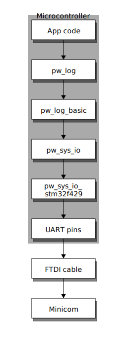

.. _module-pw_log:

======
pw_log
======
Pigweed's logging module provides facilities for applications to log
information about the execution of their application. The module is split into
two components:

1. The facade (this module) which is only a macro interface layer
2. The backend, provided elsewhere, that implements the low level logging

``pw_log`` also defines a logging protobuf, helper utilities, and an RPC
service for efficiently storing and transmitting log messages. See
:ref:`module-pw_log-protobuf` for details.

.. toctree::
  :hidden:

  protobuf

--------------
Usage examples
--------------
Here is a typical usage example, showing setting the module name, and using the
long-form names.

.. code-block:: cpp

  #define PW_LOG_MODULE_NAME "BLE"

  #include "pw_log/log.h"

  int main() {
    PW_LOG_INFO("Booting...");
    PW_LOG_DEBUG("CPU temp: %.2f", cpu_temperature);
    if (BootFailed()) {
      PW_LOG_CRITICAL("Had trouble booting due to error %d", GetErrorCode());
      ReportErrorsAndHalt();
    }
    PW_LOG_INFO("Successfully booted");
  }

In ``.cc`` files, it is possible to dispense with the ``PW_`` part of the log
names and go for shorter log macros. Include ``pw_log/short.h`` or
``pw_log/shorter.h`` for shorter versions of the macros.

.. code-block:: cpp

  #define PW_LOG_MODULE_NAME "BLE"

  #include "pw_log/shorter.h"

  int main() {
    INF("Booting...");
    DBG("CPU temp: %.2f", cpu_temperature);
    if (BootFailed()) {
      CRT("Had trouble booting due to error %d", GetErrorCode());
      ReportErrorsAndHalt();
    }
    INF("Successfully booted");
  }

Layer diagram example: ``stm32f429i-disc1``
===========================================
Below is an example diagram showing how the modules connect together for the
``stm32f429i-disc1`` target, where the ``pw_log`` backend is ``pw_log_basic``.
``pw_log_basic`` uses the ``pw_sys_io`` module to log in plaintext, which in
turn outputs to the STM32F429 bare metal backend for ``pw_sys_io``, which is
``pw_sys_io_baremetal_stm32f429i``.

Logging macros
==============
These are the primary macros for logging information about the functioning of a
system, intended to be used directly.

.. cpp:function:: PW_LOG(level, flags, fmt, ...)

  This is the primary mechanism for logging.

  *level* - An integer level as defined by ``pw_log/levels.h``.

  *flags* - Arbitrary flags the backend can leverage. The semantics of these
  flags are not defined in the facade, but are instead meant as a general
  mechanism for communication bits of information to the logging backend.
  ``pw_log`` reserves 2 flag bits by default, but log backends may provide for
  more or fewer flag bits.

  Here are some ideas for what a backend might use flags for:

  - Example: ``HAS_PII`` - A log has personally-identifying data
  - Example: ``HAS_DII`` - A log has device-identifying data
  - Example: ``RELIABLE_DELIVERY`` - Ask the backend to ensure the log is
    delivered; this may entail blocking other logs.
  - Example: ``BEST_EFFORT`` - Don't deliver this log if it would mean blocking
    or dropping important-flagged logs

  *fmt* - The message to log, which may contain format specifiers like ``%d``
  or ``%0.2f``.

  Example:

  .. code-block:: cpp

    PW_LOG(PW_LOG_FLAGS, PW_LOG_LEVEL_INFO, "Temp is %d degrees", temp);
    PW_LOG(UNRELIABLE_DELIVERY, PW_LOG_LEVEL_ERROR, "It didn't work!");

  .. note::

    ``PW_LOG()`` should not be used frequently; typically only when adding
    flags to a particular message to mark PII or to indicate delivery
    guarantees.  For most cases, prefer to use the direct ``PW_LOG_INFO`` or
    ``PW_LOG_DEBUG`` style macros, which are often implemented more efficiently
    in the backend.

.. cpp:function:: PW_LOG_DEBUG(fmt, ...)
.. cpp:function:: PW_LOG_INFO(fmt, ...)
.. cpp:function:: PW_LOG_WARN(fmt, ...)
.. cpp:function:: PW_LOG_ERROR(fmt, ...)
.. cpp:function:: PW_LOG_CRITICAL(fmt, ...)

  Shorthand for `PW_LOG(PW_LOG_FLAGS, <level>, fmt, ...)`.

--------------------
Module configuration
--------------------
This module has configuration options that globally affect the behavior of
pw_log via compile-time configuration of this module, see the
:ref:`module documentation <module-structure-compile-time-configuration>` for
more details.

.. c:macro:: PW_LOG_LEVEL_DEFAULT

  Controls the default value of ``PW_LOG_LEVEL``. Setting
  ``PW_LOG_LEVEL_DEFAULT`` will change the behavior of all source files that
  have not explicitly set ``PW_LOG_LEVEL``. Defaults to ``PW_LOG_LEVEL_DEBUG``.

.. c:macro:: PW_LOG_FLAGS_DEFAULT

  Controls the default value of ``PW_LOG_FLAGS``. Setting
  ``PW_LOG_FLAGS_DEFAULT`` will change the behavior of all source files that
  have not explicitly set ``PW_LOG_FLAGS``. Defaults to ``0``.

.. c:macro:: PW_LOG_ENABLE_IF_DEFAULT

  Controls the default value of ``PW_LOG_ENABLE_IF``. Setting
  ``PW_LOG_ENABLE_IF_DEFAULT`` will change the behavior of all source files that
  have not explicitly set ``PW_LOG_ENABLE_IF``. Defaults to
  ``((level) >= PW_LOG_LEVEL)``.

Per-source file configuration
=============================
This module defines macros that can be overridden to independently control the
behavior of ``pw_log`` statements for each C or C++ source file. To override
these macros, add ``#define`` statements for them before including headers.

The option macro definitions must be visible to ``pw_log/log.h`` the first time
it is included. To handle potential transitive includes, place these
``#defines`` before all ``#include`` statements. This should only be done in
source files, not headers. For example:

  .. code-block:: cpp

    // Set the pw_log option macros here, before ALL of the #includes.
    #define PW_LOG_MODULE_NAME "Calibration"
    #define PW_LOG_LEVEL PW_LOG_LEVEL_WARN

    #include <array>
    #include <random>

    #include "devices/hal9000.h"
    #include "pw_log/log.h"
    #include "pw_rpc/server.h"

    int MyFunction() {
      PW_LOG_INFO("hello???");
    }

.. c:macro:: PW_LOG_MODULE_NAME

  A string literal module name to use in logs. Log backends may attach this
  name to log messages or use it for runtime filtering. Defaults to ``""``. The
  ``PW_LOG_MODULE_NAME_DEFINED`` macro is set to ``1`` or ``0`` to indicate
  whether ``PW_LOG_MODULE_NAME`` was overridden.

.. c:macro:: PW_LOG_FLAGS

  Log flags to use for the ``PW_LOG_<level>`` macros. Different flags may be
  applied when using the ``PW_LOG`` macro directly.

  Log backends use flags to change how they handle individual log messages.
  Potential uses include assigning logs priority or marking them as containing
  personal information. Defaults to ``PW_LOG_FLAGS_DEFAULT``.

.. c:macro:: PW_LOG_LEVEL

   Filters logs by level. Source files that define ``PW_LOG_LEVEL`` will display
   only logs at or above the chosen level. Log statements below this level will
   be compiled out of optimized builds. Defaults to ``PW_LOG_LEVEL_DEFAULT``.

   Example:

   .. code-block:: cpp

     #define PW_LOG_LEVEL PW_LOG_LEVEL_INFO

     #include "pw_log/log.h"

     void DoSomething() {
       PW_LOG_DEBUG("This won't be logged at all");
       PW_LOG_INFO("This is INFO level, and will display");
       PW_LOG_WARN("This is above INFO level, and will display");
     }

.. c:macro:: PW_LOG_ENABLE_IF(level, flags)

   Filters logs by an arbitrary expression based on ``level`` and ``flags``.
   Source files that define ``PW_LOG_ENABLE_IF(level, flags)`` will display if
   the given expression evaluates true. Defaults to
   ``PW_LOG_ENABLE_IF_DEFAULT``.

   Example:

   .. code-block:: cpp

     // Pigweed's log facade will call this macro to decide to log or not. In
     // this case, it will drop logs with the PII flag set if display of PII is
     // not enabled for the application.
     #define PW_LOG_ENABLE_IF(level, flags) \
         (level >= PW_LOG_LEVEL_INFO && \
          !((flags & MY_PRODUCT_PII_MASK) && MY_PRODUCT_LOG_PII_ENABLED)

     #include "pw_log/log.h"

     // This define might be supplied by the build system.
     #define MY_PRODUCT_LOG_PII_ENABLED false

     // This is the PII mask bit selected by the application.
     #define MY_PRODUCT_PII_MASK (1 << 5)

     void DoSomethingWithSensitiveInfo() {
       PW_LOG_DEBUG("This won't be logged at all");
       PW_LOG_INFO("This is INFO level, and will display");

       // In this example, this will not be logged since logging with PII
       // is disabled by the above macros.
       PW_LOG(PW_LOG_LEVEL_INFO,
              MY_PRODUCT_PII_MASK,
              "Sensitive: %d",
              sensitive_info);
     }

.. attention::

  At this time, only compile time filtering is supported. In the future, we
  plan to add support for runtime filtering.

------------------
Logging attributes
------------------
The logging facade in Pigweed is designed to facilitate the capture of at least
the following attributes:

- *Level* - The log level; for example, INFO, DEBUG, ERROR, etc. Typically an
  integer
- *Flags* - Bitset for e.g. RELIABLE_DELIVERY, or HAS_PII, or BEST_EFFORT
- *File* - The file where the log was triggered
- *Line* - The line number in the file where the log line occured
- *Function* - What function the log comes from. This is expensive in binary
  size to use!
- *Module* - The user-defined module name for the log statement; e.g. “BLE” or
  “BAT”
- *Message* - The message itself; with % format arguments
- *Arguments* - The format arguments to message
- *Thread* - For devices running with an RTOS, capturing the thread is very
  useful
- *Others* - Processor security level? Maybe Thread is a good proxy for this

Each backend may decide to capture different attributes to balance the tradeoff
between call site code size, call site run time, wire format size, logging
complexity, and more.

.. _module-pw_log-circular-deps:

----------------------------------------------
Avoiding circular dependencies with ``PW_LOG``
----------------------------------------------
Because logs are so widely used, including in low-level libraries, it is
common for the ``pw_log`` backend to cause circular dependencies. Because of
this, log backends may avoid declaring explicit dependencies, instead relying
on include paths to access header files.

In GN, the ``pw_log`` backend's full implementation with true dependencies is
made available through the ``$dir_pw_log:impl`` group. When ``pw_log_BACKEND``
is set, ``$dir_pw_log:impl`` must be listed in the ``pw_build_LINK_DEPS``
variable. See :ref:`module-pw_build-link-deps`.

In the ``pw_log``, the backend's full implementation is placed in the
``$pw_log_BACKEND.impl`` target. ``$dir_pw_log:impl`` depends on this
backend target. The ``$pw_log_BACKEND.impl`` target may be an empty group if
the backend target can use its dependencies directly without causing circular
dependencies.

In order to break dependency cycles, the ``pw_log_BACKEND`` target may need
to directly provide dependencies through include paths only, rather than GN
``public_deps``. In this case, GN header checking can be disabled with
``check_includes = false``.

----------------------
Google Logging Adapter
----------------------
Pigweed provides a minimal C++ stream-style Google Log set of adapter
macros around PW_LOG under ``pw_log/glog_adapter.h`` for compatibility with
non-embedded code. While it is effective for porting server code to
microcontrollers quickly, we do not advise embedded projects use that approach
unless absolutely necessary.

Configuration
==============

.. c:macro:: PW_LOG_CFG_GLOG_BUFFER_SIZE_BYTES

  The size of the stack-allocated buffer used by the Google Logging (glog)
  macros. This only affects the glog macros provided through pw_log/glog.h.

  Pigweed strongly recommends sticking to printf-style logging instead
  of C++ stream-style Google Log logging unless absolutely necessary. The glog
  macros are only provided for compatibility with non-embedded code. See
  :ref:`module-pw_log-design-discussion` for more details.

  Undersizing this buffer will result in truncated log messages.

-----------------
Design discussion
-----------------

.. _module-pw_log-design-discussion:

Why not use C++ style stream logging operators like Google Log?
===============================================================
There are multiple reasons to avoid the C++ stream logging style in embedded,
but the biggest reason is that C++ stream logging defeats log tokenization. By
having the string literals broken up between ``<<`` operators, tokenization
becomes impossible with current language features.

Consider this example use of Google Log:

.. code-block:: cpp

  LOG(INFO) << "My temperature is " << temperature << ". State: " << state;

This log statement has two string literals. It might seem like one could convert
move to tokenization:

.. code-block:: cpp

  LOG(INFO) << TOKEN("My temperature is ") << temperature << TOKEN(". State: ") << state;

However, this doesn't work. The key problem is that the tokenization system
needs to allocate the string in a linker section that is excluded from the
final binary, but is in the final ELF executable (and so can be extracted).
Since there is no way to declare a string or array in a different section in
the middle of an experession in C++, it is not possible to tokenize an
expression like the above.

In contrast, the ``printf``-style version is a single statement with a single
string constant, which can be expanded by the preprocessor (as part of
``pw_tokenizer``) into a constant array in a special section.

.. code-block:: cpp

  // Note: LOG_INFO can be tokenized behind the macro; transparent to users.
  PW_LOG_INFO("My temperature is %d. State: %s", temperature, state);

Additionally, while Pigweed is mostly C++, it a practical reality that at times
projects using Pigweed will need to log from third-party libraries written in
C. Thus, we also wanted to retain C compatibility.

In summary, printf-style logging is better for Pigweed's target audience
because it:

- works with tokenization
- is C compatibile
- has smaller call sites

See also :ref:`module-pw_log_tokenized` for details on leveraging Pigweed's
tokenizer module for logging.

See also :ref:`module-pw_tokenizer` for details on Pigweed's tokenizer,
which is useful for more than just logging.

Why does the facade use header redirection instead of C functions?
==================================================================
Without header redirection, it is not possible to do sophisticated macro
transforms in the backend. For example, to apply tokenization to log strings,
the backend must define the handling macros. Additionally, compile-time
filtering by log level or flags is not possible without header redirection.
While it may be possible to do the filtering in the facade, that would imply
having the same filtering implementation for all log handling, which is a
restriction we want to avoid.

Why is the module name done as a preprocessor define rather than an argument?
=============================================================================
APIs are a balance between power and ease of use. In the practical cases we
have seen over the years, most translation units only need to log to one
module, like ``"BLE"``, ``"PWR"``, ``"BAT"`` and so on. Thus, adding the
argument to each macro call seemed like too much. On the other hand, flags are
something that are typically added on a per-log-statement basis, and is why the
flags are added on a per-call basis (though hidden through the high-level
macros).

--------------
pw_log in Java
--------------
``pw_log`` provides a thin Java logging class that uses Google's `Flogger
<https://google.github.io/flogger/>`_ API. The purpose of this wrapper is to
support logging on platforms that do not support Flogger. The main
implementation in ``pw_log/java/main`` simply wraps a
``com.google.common.flogger.FluentLogger``. An implementation that logs to
Android's ``android.util.Log`` instead is provided in
``pw_log/java/android_main``.
