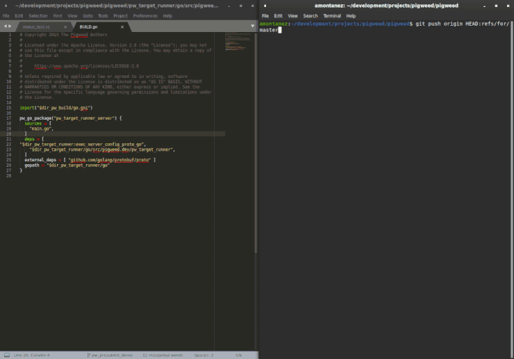

.. _module-pw_presubmit:

============
pw_presubmit
============
The presubmit module provides Python tools for running presubmit checks and
checking and fixing code format. It also includes the presubmit check script for
the Pigweed repository, ``pigweed_presubmit.py``.

Presubmit checks are essential tools, but they take work to set up, and
projects don’t always get around to it. The ``pw_presubmit`` module provides
tools for setting up high quality presubmit checks for any project. We use this
framework to run Pigweed’s presubmit on our workstations and in our automated
building tools.

The ``pw_presubmit`` module also includes ``pw format``, a tool that provides a
unified interface for automatically formatting code in a variety of languages.
With ``pw format``, you can format Bazel, C, C++, Python, GN, and Go code
according to configurations defined by your project. ``pw format`` leverages
existing tools like ``clang-format``, and it’s simple to add support for new
languages. (Note: Bazel formatting requires ``buildifier`` to be present on your
system. If it's not Bazel formatting passes without checking.)

The ``pw_presubmit`` package includes presubmit checks that can be used with any
project. These checks include:

* Check code format of several languages including C, C++, and Python
* Initialize a Python environment
* Run all Python tests
* Run pylint
* Run mypy
* Ensure source files are included in the GN and Bazel builds
* Build and run all tests with GN
* Build and run all tests with Bazel
* Ensure all header files contain ``#pragma once``

-------------
Compatibility
-------------
Python 3

-------------------------------------------
Creating a presubmit check for your project
-------------------------------------------
Creating a presubmit check for a project using ``pw_presubmit`` is simple, but
requires some customization. Projects must define their own presubmit check
Python script that uses the ``pw_presubmit`` package.

A project's presubmit script can be registered as a
:ref:`pw_cli <module-pw_cli>` plugin, so that it can be run as ``pw
presubmit``.

Setting up the command-line interface
=====================================
The ``pw_presubmit.cli`` module sets up the command-line interface for a
presubmit script. This defines a standard set of arguments for invoking
presubmit checks. Its use is optional, but recommended.

pw_presubmit.cli
----------------
.. automodule:: pw_presubmit.cli
   :members: add_arguments, run

Presubmit output directory
--------------------------
The ``pw_presubmit`` command line interface includes an ``--output-directory``
option that specifies the working directory to use for presubmits. The default
path is ``out/presubmit``.  A subdirectory is created for each presubmit step.
This directory persists between presubmit runs and can be cleaned by deleting it
or running ``pw presubmit --clean``.

Presubmit checks
================
A presubmit check is defined as a function or other callable. The function must
accept one argument: a ``PresubmitContext``, which provides the paths on which
to run. Presubmit checks communicate failure by raising an exception.

Presubmit checks may use the ``filter_paths`` decorator to automatically filter
the paths list for file types they care about.

Either of these functions could be used as presubmit checks:

.. code-block:: python

  @pw_presubmit.filter_paths(endswith='.py')
  def file_contains_ni(ctx: PresubmitContext):
      for path in ctx.paths:
          with open(path) as file:
              contents = file.read()
              if 'ni' not in contents and 'nee' not in contents:
                  raise PresumitFailure('Files must say "ni"!', path=path)

  def run_the_build(_):
      subprocess.run(['make', 'release'], check=True)

Presubmit checks functions are grouped into "programs" -- a named series of
checks. Projects may find it helpful to have programs for different purposes,
such as a quick program for local use and a full program for automated use. The
:ref:`example script <example-script>` uses ``pw_presubmit.Programs`` to define
``quick`` and ``full`` programs.

``PresubmitContext`` has the following members:

* ``root``: Source checkout root directory
* ``repos``: Repositories (top-level and submodules) processed by
  ``pw presubmit``
* ``output_dir``: Output directory for this specific presubmit step
* ``paths``: Modified files for the presubmit step to check (often used in
  formatting steps but ignored in compile steps)
* ``package_root``: Root directory for ``pw package`` installations
* ``override_gn_args``: Additional GN args processed by ``build.gn_gen()``
* ``luci``: Information about the LUCI build or None if not running in LUCI
* ``num_jobs``: Number of jobs to run in parallel
* ``continue_after_build_error``: For steps that compile, don't exit on the
  first compilation error

The ``luci`` member is of type ``LuciContext`` and has the following members:

* ``buildbucket_id``: The globally-unique buildbucket id of the build
* ``build_number``: The builder-specific incrementing build number, if
  configured for this builder
* ``project``: The LUCI project under which this build is running (often
  ``pigweed`` or ``pigweed-internal``)
* ``bucket``: The LUCI bucket under which this build is running (often ends
  with ``ci`` or ``try``)
* ``builder``: The builder being run
* ``swarming_task_id``: The swarming task id of this build

Additional members can be added by subclassing ``PresubmitContext`` and
``Presubmit``. Then override ``Presubmit._create_presubmit_context()`` to
return the subclass of ``PresubmitContext``. Finally, add
``presubmit_class=PresubmitSubClass`` when calling ``cli.run()``.

Existing Presubmit Checks
-------------------------
A small number of presubmit checks are made available through ``pw_presubmit``
modules.

Code Formatting
^^^^^^^^^^^^^^^
Formatting checks for a variety of languages are available from
``pw_presubmit.format_code``. These include C/C++, Java, Go, Python, GN, and
others. All of these checks can be included by adding
``pw_presubmit.format_code.presubmit_checks()`` to a presubmit program. These
all use language-specific formatters like clang-format or yapf.

These will suggest fixes using ``pw format --fix``.

Sorted Blocks
^^^^^^^^^^^^^
Blocks of code can be required to be kept in sorted order using comments like
the following:

.. code-block::

  # keep-sorted: start
  bar
  baz
  foo
  # keep-sorted: end

This can be included by adding ``pw_presubmit.keep_sorted.presubmit_check`` to a
presubmit program. Adding ``ignore-case`` to the start line will use
case-insensitive sorting.

By default, duplicates will be removed. Lines that are identical except in case
are preserved, even with ``ignore-case``. To allow duplicates, add
``allow-dupes`` to the start line.

Prefixes can be ignored by adding ``ignore-prefix=`` followed by a
comma-separated list of prefixes. The list below will be kept in this order.
Neither commas nor whitespace are supported in prefixes.

.. code-block::

  # keep-sorted: start ignore-prefix=',"
  'bar',
  "baz",
  'foo',
  # keep-sorted: end

Inline comments are assumed to be associated with the following line. For
example, the following is already sorted. This can be disabled with
``sticky-comments=no``.

.. todo-check: disable

.. code-block::

  # keep-sorted: start
  # TODO(b/1234) Fix this.
  bar,
  # TODO(b/5678) Also fix this.
  foo,
  # keep-sorted: end

.. todo-check: enable

By default, the prefix of the keep-sorted line is assumed to be the comment
marker used by any inline comments. This can be overridden by adding lines like
``sticky-comments=%,#`` to the start line.

The presubmit check will suggest fixes using ``pw keep-sorted --fix``.

Future versions may support additional multiline list items.

.gitmodules
^^^^^^^^^^^
Various rules can be applied to .gitmodules files. This check can be included
by adding ``pw_presubmit.gitmodules.create()`` to a presubmit program. This
function takes an optional argument of type ``pw_presubmit.gitmodules.Config``.
``Config`` objects have several properties.

* ``allow_non_googlesource_hosts: bool = False`` — If false, all submodules URLs
  must be on a Google-managed Gerrit server.
* ``allowed_googlesource_hosts: Sequence[str] = ()`` — If set, any
  Google-managed Gerrit URLs for submodules most be in this list. Entries
  should be like ``pigweed`` for ``pigweed-review.googlesource.com``.
* ``require_relative_urls: bool = False`` — If true, all submodules must be
  relative to the superproject remote.
* ``allow_sso: bool = True`` — If false, ``sso://`` and ``rpc://`` submodule
  URLs are prohibited.
* ``allow_git_corp_google_com: bool = True`` — If false, ``git.corp.google.com``
  submodule URLs are prohibited.
* ``require_branch: bool = False`` — If True, all submodules must reference a
  branch.
* ``validator: Callable[[PresubmitContext, Path, str, Dict[str, str]], None] = None``
  — A function that can be used for arbitrary submodule validation. It's called
  with the ``PresubmitContext``, the path to the ``.gitmodules`` file, the name
  of the current submodule, and the properties of the current submodule.

#pragma once
^^^^^^^^^^^^
There's a ``pragma_once`` check that confirms the first non-comment line of
C/C++ headers is ``#pragma once``. This is enabled by adding
``pw_presubmit.cpp_checks.pragma_once`` to a presubmit program.

.. todo-check: disable

TODO(b/###) Formatting
^^^^^^^^^^^^^^^^^^^^^^^^^
There's a check that confirms ``TODO`` lines match a given format. Upstream
Pigweed expects these to look like ``TODO(b/###): Explanation``, but makes it
easy for projects to define their own pattern instead.

To use this check add ``todo_check.create(todo_check.BUGS_OR_USERNAMES)`` to a
presubmit program.

.. todo-check: enable

Python Checks
^^^^^^^^^^^^^
There are two checks in the ``pw_presubmit.python_checks`` module, ``gn_pylint``
and ``gn_python_check``. They assume there's a top-level ``python`` GN target.
``gn_pylint`` runs Pylint and Mypy checks and ``gn_python_check`` runs Pylint,
Mypy, and all Python tests.

Inclusive Language
^^^^^^^^^^^^^^^^^^
.. inclusive-language: disable

The inclusive language check looks for words that are typical of non-inclusive
code, like using "master" and "slave" in place of "primary" and "secondary" or
"sanity check" in place of "consistency check".

.. inclusive-language: enable

These checks can be disabled for individual lines with
"inclusive-language: ignore" on the line in question or the line above it, or
for entire blocks by using "inclusive-language: disable" before the block and
"inclusive-language: enable" after the block.

.. In case things get moved around in the previous paragraphs the enable line
.. is repeated here: inclusive-language: enable.

pw_presubmit
------------
.. automodule:: pw_presubmit
   :members: filter_paths, FileFilter, call, PresubmitFailure, Programs

.. _example-script:

Git hook
--------
You can run a presubmit program or step as a `git hook
<https://git-scm.com/book/en/v2/Customizing-Git-Git-Hooks>`_ using
``pw_presubmit.install_hook``.  This can be used to run certain presubmit
checks before a change is pushed to a remote.

We strongly recommend that you only run fast (< 15 seconds) and trivial checks
as push hooks, and perform slower or more complex ones in CI. This is because,

* Running slow checks in the push hook will force you to wait longer for
  ``git push`` to complete, and
* If your change fails one of the checks at this stage, it will not yet be
  uploaded to the remote, so you'll have a harder time debugging any failures
  (sharing the change with your colleagues, linking to it from an issue
  tracker, etc).

Example
=======
A simple example presubmit check script follows. This can be copied-and-pasted
to serve as a starting point for a project's presubmit check script.

See ``pigweed_presubmit.py`` for a more complex presubmit check script example.

.. code-block:: python

  """Example presubmit check script."""

  import argparse
  import logging
  import os
  from pathlib import Path
  import re
  import sys
  from typing import List, Optional, Pattern

  try:
      import pw_cli.log
  except ImportError:
      print('ERROR: Activate the environment before running presubmits!',
            file=sys.stderr)
      sys.exit(2)

  import pw_presubmit
  from pw_presubmit import (
      build,
      cli,
      cpp_checks,
      environment,
      format_code,
      git_repo,
      inclusive_language,
      filter_paths,
      python_checks,
      PresubmitContext,
  )
  from pw_presubmit.install_hook import install_hook

  # Set up variables for key project paths.
  PROJECT_ROOT = Path(os.environ['MY_PROJECT_ROOT'])
  PIGWEED_ROOT = PROJECT_ROOT / 'pigweed'

  # Rerun the build if files with these extensions change.
  _BUILD_EXTENSIONS = frozenset(
      ['.rst', '.gn', '.gni', *format_code.C_FORMAT.extensions])

  #
  # Presubmit checks
  #
  def release_build(ctx: PresubmitContext):
      build.gn_gen(ctx, build_type='release')
      build.ninja(ctx)

  def host_tests(ctx: PresubmitContext):
      build.gn_gen(ctx, run_host_tests='true')
      build.ninja(ctx)

  # Avoid running some checks on certain paths.
  PATH_EXCLUSIONS = (
      re.compile(r'^external/'),
      re.compile(r'^vendor/'),
  )

  # Use the upstream pragma_once check, but apply a different set of path
  # filters with @filter_paths.
  @filter_paths(endswith='.h', exclude=PATH_EXCLUSIONS)
  def pragma_once(ctx: PresubmitContext):
      cpp_checks.pragma_once(ctx)

  #
  # Presubmit check programs
  #
  OTHER = (
      # Checks not ran by default but that should be available. These might
      # include tests that are expensive to run or that don't yet pass.
      build.gn_quick_check,
  )

  QUICK = (
      # List some presubmit checks to run
      pragma_once,
      host_tests,
      # Use the upstream formatting checks, with custom path filters applied.
      format_code.presubmit_checks(exclude=PATH_EXCLUSIONS),
      # Include the upstream inclusive language check.
      inclusive_language.presubmit_check,
      # Include just the lint-related Python checks.
      python_checks.gn_pylint.with_filter(exclude=PATH_EXCLUSIONS),
  )

  FULL = (
      QUICK,  # Add all checks from the 'quick' program
      release_build,
      # Use the upstream Python checks, with custom path filters applied.
      # Checks listed multiple times are only run once.
      python_checks.gn_python_check.with_filter(exclude=PATH_EXCLUSIONS),
  )

  PROGRAMS = pw_presubmit.Programs(other=OTHER, quick=QUICK, full=FULL)

  #
  # Allowlist of remote refs for presubmit. If the remote ref being pushed to
  # matches any of these values (with regex matching), then the presubmits
  # checks will be run before pushing.
  #
  PRE_PUSH_REMOTE_REF_ALLOWLIST = (
      'refs/for/main',
  )

  def run(install: bool, remote_ref: Optional[str],  **presubmit_args) -> int:
      """Process the --install argument then invoke pw_presubmit."""

      # Install the presubmit Git pre-push hook, if requested.
      if install:
          # '$remote_ref' will be replaced by the actual value of the remote ref
          # at runtime.
          install_git_hook('pre-push', [
              'python', '-m', 'tools.presubmit_check', '--base', 'HEAD~',
              '--remote-ref', '$remote_ref'
          ])
          return 0

      # Run the checks if either no remote_ref was passed, or if the remote ref
      # matches anything in the allowlist.
      if remote_ref is None or any(
              re.search(pattern, remote_ref)
              for pattern in PRE_PUSH_REMOTE_REF_ALLOWLIST):
          return cli.run(root=PROJECT_ROOT, **presubmit_args)

  def main() -> int:
      """Run the presubmit checks for this repository."""
      parser = argparse.ArgumentParser(description=__doc__)
      cli.add_arguments(parser, PROGRAMS, 'quick')

      # Define an option for installing a Git pre-push hook for this script.
      parser.add_argument(
          '--install',
          action='store_true',
          help='Install the presubmit as a Git pre-push hook and exit.')

      # Define an optional flag to pass the remote ref into this script, if it
      # is run as a pre-push hook. The destination variable in the parsed args
      # will be `remote_ref`, as dashes are replaced with underscores to make
      # valid variable names.
      parser.add_argument(
          '--remote-ref',
          default=None,
          nargs='?',  # Make optional.
          help='Remote ref of the push command, for use by the pre-push hook.')

      return run(**vars(parser.parse_args()))

  if __name__ == '__main__':
      pw_cli.log.install(logging.INFO)
      sys.exit(main())

---------------------
Code formatting tools
---------------------
The ``pw_presubmit.format_code`` module formats supported source files using
external code format tools. The file ``format_code.py`` can be invoked directly
from the command line or from ``pw`` as ``pw format``.

Example
=======
A simple example of adding support for a custom format. This code wraps the
built in formatter to add a new format. It could also be used to replace
a formatter or remove/disable a PigWeed supplied one.

.. code-block:: python

  #!/usr/bin/env python
  """Formats files in repository. """

  import logging
  import sys

  import pw_cli.log
  from pw_presubmit import format_code
  from your_project import presubmit_checks
  from your_project import your_check

  YOUR_CODE_FORMAT = CodeFormat('YourFormat',
                                filter=FileFilter(suffix=('.your', )),
                                check=your_check.check,
                                fix=your_check.fix)

  CODE_FORMATS = (*format_code.CODE_FORMATS, YOUR_CODE_FORMAT)

  def _run(exclude, **kwargs) -> int:
      """Check and fix formatting for source files in the repo."""
      return format_code.format_paths_in_repo(exclude=exclude,
                                              code_formats=CODE_FORMATS,
                                              **kwargs)

  def main():
      return _run(**vars(format_code.arguments(git_paths=True).parse_args()))

  if __name__ == '__main__':
      pw_cli.log.install(logging.INFO)
      sys.exit(main())
