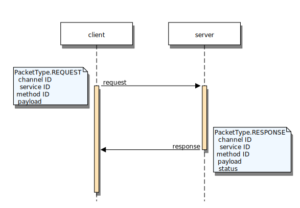
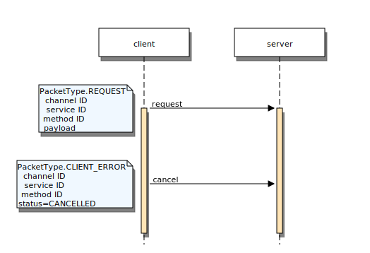
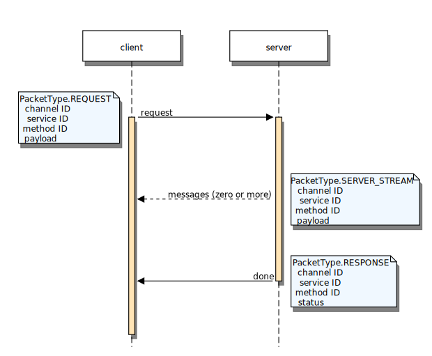
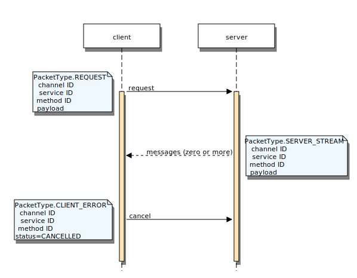
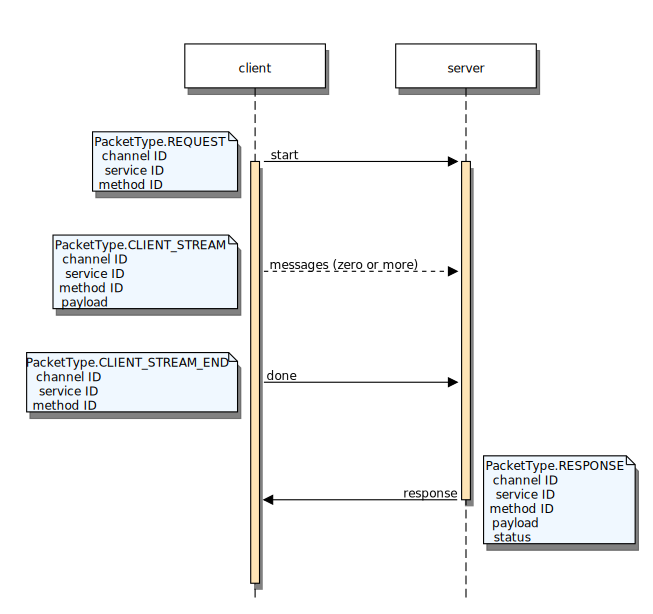
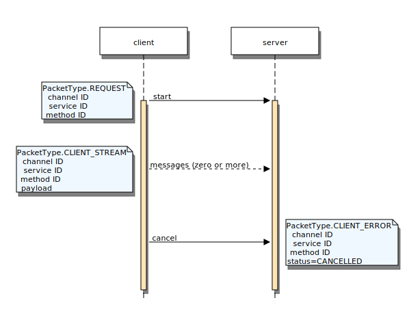
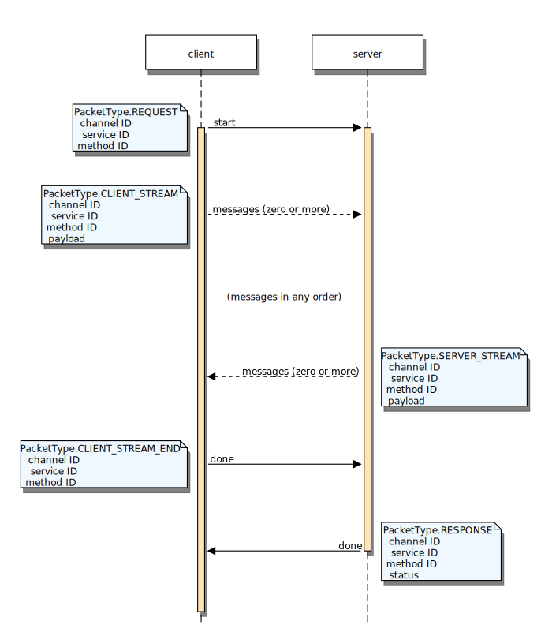
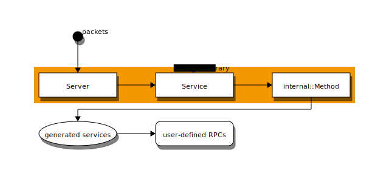
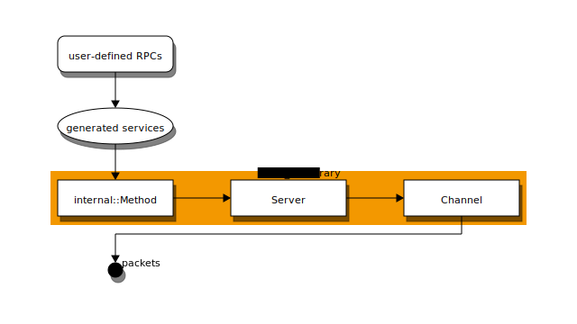

.. _module-pw_rpc:

------
pw_rpc
------
The ``pw_rpc`` module provides a system for defining and invoking remote
procedure calls (RPCs) on a device.

This document discusses the ``pw_rpc`` protocol and its C++ implementation.
``pw_rpc`` implementations for other languages are described in their own
documents:

.. toctree::
  :maxdepth: 1

  py/docs
  ts/docs

.. admonition:: Try it out!

  For a quick intro to ``pw_rpc``, see the
  :ref:`module-pw_hdlc-rpc-example` in the :ref:`module-pw_hdlc` module.

.. warning::

  This documentation is under construction. Many sections are outdated or
  incomplete. The content needs to be reorgnanized.

Implementations
===============
Pigweed provides several client and server implementations of ``pw_rpc``.

.. list-table::
  :header-rows: 1

  * - Language
    - Server
    - Client
  * - C++ (raw)
    - ✅
    - ✅
  * - C++ (Nanopb)
    - ✅
    - ✅
  * - C++ (pw_protobuf)
    - ✅
    - ✅
  * - Java
    -
    - in development
  * - Python
    -
    - ✅
  * - TypeScript
    -
    - in development

RPC semantics
=============
The semantics of ``pw_rpc`` are similar to `gRPC
<https://grpc.io/docs/what-is-grpc/core-concepts/>`_.

RPC call lifecycle
------------------
In ``pw_rpc``, an RPC begins when the client sends a request packet. The server
receives the request, looks up the relevant service method, then calls into the
RPC function. The RPC is considered active until the server sends a response
packet with the RPC's status. The client may terminate an ongoing RPC by
cancelling it.

Status codes
------------
``pw_rpc`` call objects (``ClientReaderWriter``, ``ServerReaderWriter``, etc.)
use certain status codes to indicate what occurred. These codes are returned
from functions like ``Write()`` or ``Finish()``.

* ``OK`` -- The operation succeeded.
* ``UNAVAILABLE`` -- The channel is not currently registered with the server or
  client.
* ``UNKNOWN`` -- Sending a packet failed due to an unrecoverable
  :cpp:func:`pw::rpc::ChannelOutput::Send` error.

Unrequested responses
---------------------
``pw_rpc`` supports sending responses to RPCs that have not yet been invoked by
a client. This is useful in testing and in situations like an RPC that triggers
reboot. After the reboot, the device opens the writer object and sends its
response to the client.

The C++ API for opening a server reader/writer takes the generated RPC function
as a template parameter. The server to use, channel ID, and service instance are
passed as arguments. The API is the same for all RPC types, except the
appropriate reader/writer class must be used.

.. code-block:: c++

  // Open a ServerWriter for a server streaming RPC.
  auto writer = RawServerWriter::Open<pw_rpc::raw::ServiceName::MethodName>(
      server, channel_id, service_instance);

  // Send some responses, even though the client has not yet called this RPC.
  CHECK_OK(writer.Write(encoded_response_1));
  CHECK_OK(writer.Write(encoded_response_2));

  // Finish the RPC.
  CHECK_OK(writer.Finish(OkStatus()));

Creating an RPC
===============

1. RPC service declaration
--------------------------
Pigweed RPCs are declared in a protocol buffer service definition.

* `Protocol Buffer service documentation
  <https://developers.google.com/protocol-buffers/docs/proto3#services>`_
* `gRPC service definition documentation
  <https://grpc.io/docs/what-is-grpc/core-concepts/#service-definition>`_

.. code-block:: protobuf

  syntax = "proto3";

  package foo.bar;

  message Request {}

  message Response {
    int32 number = 1;
  }

  service TheService {
    rpc MethodOne(Request) returns (Response) {}
    rpc MethodTwo(Request) returns (stream Response) {}
  }

This protocol buffer is declared in a ``BUILD.gn`` file as follows:

.. code-block:: python

  import("//build_overrides/pigweed.gni")
  import("$dir_pw_protobuf_compiler/proto.gni")

  pw_proto_library("the_service_proto") {
    sources = [ "foo_bar/the_service.proto" ]
  }

.. admonition:: proto2 or proto3 syntax?

  Always use proto3 syntax rather than proto2 for new protocol buffers. Proto2
  protobufs can be compiled for ``pw_rpc``, but they are not as well supported
  as proto3. Specifically, ``pw_rpc`` lacks support for non-zero default values
  in proto2. When using Nanopb with ``pw_rpc``, proto2 response protobufs with
  non-zero field defaults should be manually initialized to the default struct.

  In the past, proto3 was sometimes avoided because it lacked support for field
  presence detection. Fortunately, this has been fixed: proto3 now supports
  ``optional`` fields, which are equivalent to proto2 ``optional`` fields.

  If you need to distinguish between a default-valued field and a missing field,
  mark the field as ``optional``. The presence of the field can be detected
  with ``std::optional``, a ``HasField(name)``, or ``has_<field>`` member,
  depending on the library.

  Optional fields have some overhead --- if using Nanopb, default-valued fields
  are included in the encoded proto, and the proto structs have a
  ``has_<field>`` flag for each optional field. Use plain fields if field
  presence detection is not needed.

  .. code-block:: protobuf

    syntax = "proto3";

    message MyMessage {
      // Leaving this field unset is equivalent to setting it to 0.
      int32 number = 1;

      // Setting this field to 0 is different from leaving it unset.
      optional int32 other_number = 2;
    }

2. RPC code generation
----------------------
``pw_rpc`` generates a C++ header file for each ``.proto`` file. This header is
generated in the build output directory. Its exact location varies by build
system and toolchain, but the C++ include path always matches the sources
declaration in the ``pw_proto_library``. The ``.proto`` extension is replaced
with an extension corresponding to the protobuf library in use.

================== =============== =============== =============
Protobuf libraries Build subtarget Protobuf header pw_rpc header
================== =============== =============== =============
Raw only           .raw_rpc        (none)          .raw_rpc.pb.h
Nanopb or raw      .nanopb_rpc     .pb.h           .rpc.pb.h
pw_protobuf or raw .pwpb_rpc       .pwpb.h         .rpc.pwpb.h
================== =============== =============== =============

For example, the generated RPC header for ``"foo_bar/the_service.proto"`` is
``"foo_bar/the_service.rpc.pb.h"`` for Nanopb or
``"foo_bar/the_service.raw_rpc.pb.h"`` for raw RPCs.

The generated header defines a base class for each RPC service declared in the
``.proto`` file. A service named ``TheService`` in package ``foo.bar`` would
generate the following base class for pw_protobuf:

.. cpp:class:: template <typename Implementation> foo::bar::pw_rpc::pwpb::TheService::Service

3. RPC service definition
-------------------------
The serivce class is implemented by inheriting from the generated RPC service
base class and defining a method for each RPC. The methods must match the name
and function signature for one of the supported protobuf implementations.
Services may mix and match protobuf implementations within one service.

.. tip::

  The generated code includes RPC service implementation stubs. You can
  reference or copy and paste these to get started with implementing a service.
  These stub classes are generated at the bottom of the pw_rpc proto header.

  To use the stubs, do the following:

  #. Locate the generated RPC header in the build directory. For example:

     .. code-block:: sh

       find out/ -name <proto_name>.rpc.pwpb.h

  #. Scroll to the bottom of the generated RPC header.
  #. Copy the stub class declaration to a header file.
  #. Copy the member function definitions to a source file.
  #. Rename the class or change the namespace, if desired.
  #. List these files in a build target with a dependency on the
     ``pw_proto_library``.

A pw_protobuf implementation of this service would be as follows:

.. code-block:: cpp

  #include "foo_bar/the_service.rpc.pwpb.h"

  namespace foo::bar {

  class TheService : public pw_rpc::pwpb::TheService::Service<TheService> {
   public:
    pw::Status MethodOne(const Request::Message& request,
                         Response::Message& response) {
      // implementation
      response.number = 123;
      return pw::OkStatus();
    }

    void MethodTwo(const Request::Message& request,
                   ServerWriter<Response::Message>& response) {
      // implementation
      response.Write({.number = 123});
    }
  };

  }  // namespace foo::bar

The pw_protobuf implementation would be declared in a ``BUILD.gn``:

.. code-block:: python

  import("//build_overrides/pigweed.gni")

  import("$dir_pw_build/target_types.gni")

  pw_source_set("the_service") {
    public_configs = [ ":public" ]
    public = [ "public/foo_bar/service.h" ]
    public_deps = [ ":the_service_proto.pwpb_rpc" ]
  }

4. Register the service with a server
-------------------------------------
This example code sets up an RPC server with an :ref:`HDLC<module-pw_hdlc>`
channel output and the example service.

.. code-block:: cpp

  // Set up the output channel for the pw_rpc server to use. This configures the
  // pw_rpc server to use HDLC over UART; projects not using UART and HDLC must
  // adapt this as necessary.
  pw::stream::SysIoWriter writer;
  pw::rpc::FixedMtuChannelOutput<kMaxTransmissionUnit> hdlc_channel_output(
      writer, pw::hdlc::kDefaultRpcAddress, "HDLC output");

  // Allocate an array of channels for the server to use. If dynamic allocation
  // is enabled (PW_RPC_DYNAMIC_ALLOCATION=1), the server can be initialized
  // without any channels, and they can be added later.
  pw::rpc::Channel channels[] = {
      pw::rpc::Channel::Create<1>(&hdlc_channel_output)};

  // Declare the pw_rpc server with the HDLC channel.
  pw::rpc::Server server(channels);

  foo::bar::TheService the_service;
  pw::rpc::SomeOtherService some_other_service;

  void RegisterServices() {
    // Register the foo.bar.TheService example service and another service.
    server.RegisterService(the_service, some_other_service);
  }

  int main() {
    // Set up the server.
    RegisterServices();

    // Declare a buffer for decoding incoming HDLC frames.
    std::array<std::byte, kMaxTransmissionUnit> input_buffer;

    PW_LOG_INFO("Starting pw_rpc server");
    pw::hdlc::ReadAndProcessPackets(server, input_buffer);
  }

Channels
========
``pw_rpc`` sends all of its packets over channels. These are logical,
application-layer routes used to tell the RPC system where a packet should go.

Channels over a client-server connection must all have a unique ID, which can be
assigned statically at compile time or dynamically.

.. code-block:: cpp

  // Creating a channel with the static ID 3.
  pw::rpc::Channel static_channel = pw::rpc::Channel::Create<3>(&output);

  // Grouping channel IDs within an enum can lead to clearer code.
  enum ChannelId {
    kUartChannel = 1,
    kSpiChannel = 2,
  };

  // Creating a channel with a static ID defined within an enum.
  pw::rpc::Channel another_static_channel =
      pw::rpc::Channel::Create<ChannelId::kUartChannel>(&output);

  // Creating a channel with a dynamic ID (note that no output is provided; it
  // will be set when the channel is used.
  pw::rpc::Channel dynamic_channel;

Sometimes, the ID and output of a channel are not known at compile time as they
depend on information stored on the physical device. To support this use case, a
dynamically-assignable channel can be configured once at runtime with an ID and
output.

.. code-block:: cpp

  // Create a dynamic channel without a compile-time ID or output.
  pw::rpc::Channel dynamic_channel;

  void Init() {
    // Called during boot to pull the channel configuration from the system.
    dynamic_channel.Configure(GetChannelId(), some_output);
  }

Adding and removing channels
----------------------------
New channels may be registered with the ``OpenChannel`` function. If dynamic
allocation is enabled (:c:macro:`PW_RPC_DYNAMIC_ALLOCATION` is 1), any number of
channels may be registered. If dynamic allocation is disabled, new channels may
only be registered if there are availale channel slots in the span provided to
the RPC endpoint at construction.

A channel may be closed and unregistered with an endpoint by calling
``ChannelClose`` on the endpoint with the corresponding channel ID.  This
will terminate any pending calls and call their ``on_error`` callback
with the ``ABORTED`` status.

.. code-block:: cpp

  // When a channel is closed, any pending calls will receive
  // on_error callbacks with ABORTED status.
  client->CloseChannel(1);

Services
========
A service is a logical grouping of RPCs defined within a .proto file. ``pw_rpc``
uses these .proto definitions to generate code for a base service, from which
user-defined RPCs are implemented.

``pw_rpc`` supports multiple protobuf libraries, and the generated code API
depends on which is used.

Services must be registered with a server in order to call their methods.
Services may later be unregistered, which aborts calls for methods in that
service and prevents future calls to them, until the service is re-registered.

.. _module-pw_rpc-protobuf-library-apis:

Protobuf library APIs
=====================

.. toctree::
  :maxdepth: 1

  pwpb/docs
  nanopb/docs

Testing a pw_rpc integration
============================
After setting up a ``pw_rpc`` server in your project, you can test that it is
working as intended by registering the provided ``EchoService``, defined in
``echo.proto``, which echoes back a message that it receives.

.. literalinclude:: echo.proto
  :language: protobuf
  :lines: 14-

For example, in C++ with pw_protobuf:

.. code:: c++

  #include "pw_rpc/server.h"

  // Include the apporpriate header for your protobuf library.
  #include "pw_rpc/echo_service_pwpb.h"

  constexpr pw::rpc::Channel kChannels[] = { /* ... */ };
  static pw::rpc::Server server(kChannels);

  static pw::rpc::EchoService echo_service;

  void Init() {
    server.RegisterService(echo_service);
  }

Benchmarking and stress testing
-------------------------------

.. toctree::
  :maxdepth: 1
  :hidden:

  benchmark

``pw_rpc`` provides an RPC service and Python module for stress testing and
benchmarking a ``pw_rpc`` deployment. See :ref:`module-pw_rpc-benchmark`.

Naming
======

Reserved names
--------------
``pw_rpc`` reserves a few service method names so they can be used for generated
classes. The following names cannnot be used for service methods:

- ``Client``
- ``Service``
- Any reserved words in the languages ``pw_rpc`` supports (e.g. ``class``).

``pw_rpc`` does not reserve any service names, but the restriction of avoiding
reserved words in supported languages applies.

Service naming style
--------------------
``pw_rpc`` service names should use capitalized camel case and should not use
the term "Service". Appending "Service" to a service name is redundant, similar
to appending "Class" or "Function" to a class or function name. The
C++ implementation class may use "Service" in its name, however.

For example, a service for accessing a file system should simply be named
``service FileSystem``, rather than ``service FileSystemService``, in the
``.proto`` file.

.. code-block:: protobuf

  // file.proto
  package pw.file;

  service FileSystem {
      rpc List(ListRequest) returns (stream ListResponse);
  }

The C++ service implementation class may append "Service" to the name.

.. code-block:: cpp

  // file_system_service.h
  #include "pw_file/file.raw_rpc.pb.h"

  namespace pw::file {

  class FileSystemService : public pw_rpc::raw::FileSystem::Service<FileSystemService> {
    void List(ConstByteSpan request, RawServerWriter& writer);
  };

  }  // namespace pw::file

For upstream Pigweed services, this naming style is a requirement. Note that
some services created before this was established may use non-compliant
names. For Pigweed users, this naming style is a suggestion.

C++ payload sizing limitations
===============================
The individual size of each sent RPC request or response is limited by
``pw_rpc``'s ``PW_RPC_ENCODING_BUFFER_SIZE_BYTES`` configuration option when
using Pigweed's C++ implementation. While multiple RPC messages can be enqueued
(as permitted by the underlying transport), if a single individual sent message
exceeds the limitations of the statically allocated encode buffer, the packet
will fail to encode and be dropped.

This applies to all C++ RPC service implementations (nanopb, raw, and pwpb),
so it's important to ensure request and response message sizes do not exceed
this limitation.

As ``pw_rpc`` has some additional encoding overhead, a helper,
``pw::rpc::MaxSafePayloadSize()`` is provided to expose the practical max RPC
message payload size.

.. code-block:: cpp

  #include "pw_file/file.raw_rpc.pb.h"
  #include "pw_rpc/channel.h"

  namespace pw::file {

  class FileSystemService : public pw_rpc::raw::FileSystem::Service<FileSystemService> {
   public:
    void List(ConstByteSpan request, RawServerWriter& writer);

   private:
    // Allocate a buffer for building proto responses.
    static constexpr size_t kEncodeBufferSize = pw::rpc::MaxSafePayloadSize();
    std::array<std::byte, kEncodeBufferSize> encode_buffer_;
  };

  }  // namespace pw::file

Protocol description
====================
Pigweed RPC servers and clients communicate using ``pw_rpc`` packets. These
packets are used to send requests and responses, control streams, cancel ongoing
RPCs, and report errors.

Packet format
-------------
Pigweed RPC packets consist of a type and a set of fields. The packets are
encoded as protocol buffers. The full packet format is described in
``pw_rpc/pw_rpc/internal/packet.proto``.

.. literalinclude:: internal/packet.proto
  :language: protobuf
  :lines: 14-

The packet type and RPC type determine which fields are present in a Pigweed RPC
packet. Each packet type is only sent by either the client or the server.
These tables describe the meaning of and fields included with each packet type.

Client-to-server packets
^^^^^^^^^^^^^^^^^^^^^^^^
+-------------------+-------------------------------------+
| packet type       | description                         |
+===================+=====================================+
| REQUEST           | Invoke an RPC                       |
|                   |                                     |
|                   | .. code-block:: text                |
|                   |                                     |
|                   |   - channel_id                      |
|                   |   - service_id                      |
|                   |   - method_id                       |
|                   |   - payload                         |
|                   |     (unary & server streaming only) |
|                   |   - call_id (optional)              |
|                   |                                     |
+-------------------+-------------------------------------+
| CLIENT_STREAM     | Message in a client stream          |
|                   |                                     |
|                   | .. code-block:: text                |
|                   |                                     |
|                   |   - channel_id                      |
|                   |   - service_id                      |
|                   |   - method_id                       |
|                   |   - payload                         |
|                   |   - call_id (if set in REQUEST)     |
|                   |                                     |
+-------------------+-------------------------------------+
| CLIENT_STREAM_END | Client stream is complete           |
|                   |                                     |
|                   | .. code-block:: text                |
|                   |                                     |
|                   |   - channel_id                      |
|                   |   - service_id                      |
|                   |   - method_id                       |
|                   |   - call_id (if set in REQUEST)     |
|                   |                                     |
+-------------------+-------------------------------------+
| CLIENT_ERROR      | Abort an ongoing RPC                |
|                   |                                     |
|                   | .. code-block:: text                |
|                   |                                     |
|                   |   - channel_id                      |
|                   |   - service_id                      |
|                   |   - method_id                       |
|                   |   - status                          |
|                   |   - call_id (if set in REQUEST)     |
|                   |                                     |
+-------------------+-------------------------------------+

**Client errors**

The client sends ``CLIENT_ERROR`` packets to a server when it receives a packet
it did not request. If possible, the server should abort it.

The status code indicates the type of error. The status code is logged, but all
status codes result in the same action by the server: aborting the RPC.

* ``CANCELLED`` -- The client requested that the RPC be cancelled.
* ``ABORTED`` -- The RPC was aborted due its channel being closed.
* ``NOT_FOUND`` -- Received a packet for a service method the client does not
  recognize.
* ``FAILED_PRECONDITION`` -- Received a packet for a service method that the
  client did not invoke.
* ``DATA_LOSS`` -- Received a corrupt packet for a pending service method.
* ``INVALID_ARGUMENT`` -- The server sent a packet type to an RPC that does not
  support it (a ``SERVER_STREAM`` was sent to an RPC with no server stream).
* ``UNAVAILABLE`` -- Received a packet for an unknown channel.

Server-to-client packets
^^^^^^^^^^^^^^^^^^^^^^^^
+-------------------+-------------------------------------+
| packet type       | description                         |
+===================+=====================================+
| RESPONSE          | The RPC is complete                 |
|                   |                                     |
|                   | .. code-block:: text                |
|                   |                                     |
|                   |   - channel_id                      |
|                   |   - service_id                      |
|                   |   - method_id                       |
|                   |   - status                          |
|                   |   - payload                         |
|                   |     (unary & client streaming only) |
|                   |   - call_id (if set in REQUEST)     |
|                   |                                     |
+-------------------+-------------------------------------+
| SERVER_STREAM     | Message in a server stream          |
|                   |                                     |
|                   | .. code-block:: text                |
|                   |                                     |
|                   |   - channel_id                      |
|                   |   - service_id                      |
|                   |   - method_id                       |
|                   |   - payload                         |
|                   |   - call_id (if set in REQUEST)     |
|                   |                                     |
+-------------------+-------------------------------------+
| SERVER_ERROR      | Received unexpected packet          |
|                   |                                     |
|                   | .. code-block:: text                |
|                   |                                     |
|                   |   - channel_id                      |
|                   |   - service_id (if relevant)        |
|                   |   - method_id (if relevant)         |
|                   |   - status                          |
|                   |   - call_id (if set in REQUEST)     |
|                   |                                     |
+-------------------+-------------------------------------+

All server packets contain the same ``call_id`` that was set in the initial
request made by the client, if any.

**Server errors**

The server sends ``SERVER_ERROR`` packets when it receives a packet it cannot
process. The client should abort any RPC for which it receives an error. The
status field indicates the type of error.

* ``NOT_FOUND`` -- The requested service or method does not exist.
* ``FAILED_PRECONDITION`` -- A client stream or cancel packet was sent for an
  RPC that is not pending.
* ``INVALID_ARGUMENT`` -- The client sent a packet type to an RPC that does not
  support it (a ``CLIENT_STREAM`` was sent to an RPC with no client stream).
* ``RESOURCE_EXHAUSTED`` -- The request came on a new channel, but a channel
  could not be allocated for it.
* ``ABORTED`` -- The RPC was aborted due its channel being closed.
* ``INTERNAL`` -- The server was unable to respond to an RPC due to an
  unrecoverable internal error.
* ``UNAVAILABLE`` -- Received a packet for an unknown channel.

Inovking a service method
-------------------------
Calling an RPC requires a specific sequence of packets. This section describes
the protocol for calling service methods of each type: unary, server streaming,
client streaming, and bidirectional streaming.

The basic flow for all RPC invocations is as follows:

  * Client sends a ``REQUEST`` packet. Includes a payload for unary & server
    streaming RPCs.
  * For client and bidirectional streaming RPCs, the client may send any number
    of ``CLIENT_STREAM`` packets with payloads.
  * For server and bidirectional streaming RPCs, the server may send any number
    of ``SERVER_STREAM`` packets.
  * The server sends a ``RESPONSE`` packet. Includes a payload for unary &
    client streaming RPCs. The RPC is complete.

The client may cancel an ongoing RPC at any time by sending a ``CLIENT_ERROR``
packet with status ``CANCELLED``. The server may finish an ongoing RPC at any
time by sending the ``RESPONSE`` packet.

Unary RPC
^^^^^^^^^
In a unary RPC, the client sends a single request and the server sends a single
response.

The client may attempt to cancel a unary RPC by sending a ``CLIENT_ERROR``
packet with status ``CANCELLED``. The server sends no response to a cancelled
RPC. If the server processes the unary RPC synchronously (the handling thread
sends the response), it may not be possible to cancel the RPC.

Server streaming RPC
^^^^^^^^^^^^^^^^^^^^
In a server streaming RPC, the client sends a single request and the server
sends any number of ``SERVER_STREAM`` packets followed by a ``RESPONSE`` packet.

The client may terminate a server streaming RPC by sending a ``CLIENT_STREAM``
packet with status ``CANCELLED``. The server sends no response.

Client streaming RPC
^^^^^^^^^^^^^^^^^^^^
In a client streaming RPC, the client starts the RPC by sending a ``REQUEST``
packet with no payload. It then sends any number of messages in
``CLIENT_STREAM`` packets, followed by a ``CLIENT_STREAM_END``. The server sends
a single ``RESPONSE`` to finish the RPC.

The server may finish the RPC at any time by sending its ``RESPONSE`` packet,
even if it has not yet received the ``CLIENT_STREAM_END`` packet. The client may
terminate the RPC at any time by sending a ``CLIENT_ERROR`` packet with status
``CANCELLED``.

Bidirectional streaming RPC
^^^^^^^^^^^^^^^^^^^^^^^^^^^
In a bidirectional streaming RPC, the client sends any number of requests and
the server sends any number of responses. The client invokes the RPC by sending
a ``REQUEST`` with no payload. It sends a ``CLIENT_STREAM_END`` packet when it
has finished sending requests. The server sends a ``RESPONSE`` packet to finish
the RPC.

The server may finish the RPC at any time by sending the ``RESPONSE`` packet,
even if it has not received the ``CLIENT_STREAM_END`` packet. The client may
terminate the RPC at any time by sending a ``CLIENT_ERROR`` packet with status
``CANCELLED``.

.. image:: bidirectional_streaming_rpc_cancelled.svg

RPC server
==========
Declare an instance of ``rpc::Server`` and register services with it.

.. admonition:: TODO

  Document the public interface

Size report
-----------
The following size report showcases the memory usage of the core RPC server. It
is configured with a single channel using a basic transport interface that
directly reads from and writes to ``pw_sys_io``. The transport has a 128-byte
packet buffer, which comprises the plurality of the example's RAM usage. This is
not a suitable transport for an actual product; a real implementation would have
additional overhead proportional to the complexity of the transport.

.. include:: server_size

RPC server implementation
-------------------------

The Method class
^^^^^^^^^^^^^^^^
The RPC Server depends on the ``pw::rpc::internal::Method`` class. ``Method``
serves as the bridge between the ``pw_rpc`` server library and the user-defined
RPC functions. Each supported protobuf implementation extends ``Method`` to
implement its request and response proto handling. The ``pw_rpc`` server
calls into the ``Method`` implementation through the base class's ``Invoke``
function.

``Method`` implementations store metadata about each method, including a
function pointer to the user-defined method implementation. They also provide
``static constexpr`` functions for creating each type of method. ``Method``
implementations must satisfy the ``MethodImplTester`` test class in
``pw_rpc/internal/method_impl_tester.h``.

See ``pw_rpc/internal/method.h`` for more details about ``Method``.

Packet flow
^^^^^^^^^^^

Requests
~~~~~~~~

Responses
~~~~~~~~~

RPC client
==========
The RPC client is used to send requests to a server and manages the contexts of
ongoing RPCs.

Setting up a client
-------------------
The ``pw::rpc::Client`` class is instantiated with a list of channels that it
uses to communicate. These channels can be shared with a server, but multiple
clients cannot use the same channels.

To send incoming RPC packets from the transport layer to be processed by a
client, the client's ``ProcessPacket`` function is called with the packet data.

.. code:: c++

  #include "pw_rpc/client.h"

  namespace {

  pw::rpc::Channel my_channels[] = {
      pw::rpc::Channel::Create<1>(&my_channel_output)};
  pw::rpc::Client my_client(my_channels);

  }  // namespace

  // Called when the transport layer receives an RPC packet.
  void ProcessRpcPacket(ConstByteSpan packet) {
    my_client.ProcessPacket(packet);
  }

Note that client processing such as callbacks will be invoked within
the body of ``ProcessPacket``.

If certain packets need to be filtered out, or if certain client processing
needs to be invoked from a specific thread or context, the ``PacketMeta`` class
can be used to determine which service or channel a packet is targeting. After
filtering, ``ProcessPacket`` can be called from the appropriate environment.

.. _module-pw_rpc-making-calls:

Making RPC calls
----------------
RPC calls are not made directly through the client, but using one of its
registered channels instead. A service client class is generated from a .proto
file for each selected protobuf library, which is then used to send RPC requests
through a given channel. The API for this depends on the protobuf library;
please refer to the
:ref:`appropriate documentation<module-pw_rpc-protobuf-library-apis>`. Multiple
service client implementations can exist simulatenously and share the same
``Client`` class.

When a call is made, a ``pw::rpc::ClientCall`` object is returned to the caller.
This object tracks the ongoing RPC call, and can be used to manage it. An RPC
call is only active as long as its ``ClientCall`` object is alive.

.. tip::
  Use ``std::move`` when passing around ``ClientCall`` objects to keep RPCs
  alive.

Example
^^^^^^^
.. code-block:: c++

  #include "pw_rpc/echo_service_pwpb.h"

  namespace {
  // Generated clients are namespaced with their proto library.
  using EchoClient = pw_rpc::nanopb::EchoService::Client;

  // RPC channel ID on which to make client calls.
  constexpr uint32_t kDefaultChannelId = 1;

  EchoClient::EchoCall echo_call;

  // Callback invoked when a response is received. This is called synchronously
  // from Client::ProcessPacket.
  void EchoResponse(const EchoMessage::Message& response,
                    pw::Status status) {
    if (status.ok()) {
      PW_LOG_INFO("Received echo response: %s", response.msg);
    } else {
      PW_LOG_ERROR("Echo failed with status %d",
                   static_cast<int>(status.code()));
    }
  }

  }  // namespace

  void CallEcho(const char* message) {
    // Create a client to call the EchoService.
    EchoClient echo_client(my_rpc_client, kDefaultChannelId);

    EchoMessage::Message request{};
    pw::string::Copy(message, request.msg);

    // By assigning the returned ClientCall to the global echo_call, the RPC
    // call is kept alive until it completes. When a response is received, it
    // will be logged by the handler function and the call will complete.
    echo_call = echo_client.Echo(request, EchoResponse);
    if (!echo_call.active()) {
      // The RPC call was not sent. This could occur due to, for example, an
      // invalid channel ID. Handle if necessary.
    }
  }

RPC calls introspection
-----------------------
``pw_rpc`` provides ``pw_rpc/method_info.h`` header that allows to obtain
information about the generated RPC method in compile time.

For now it provides only two types: ``MethodRequestType<RpcMethod>`` and
``MethodResponseType<RpcMethod>``. They are aliases to the types that are used
as a request and response respectively for the given RpcMethod.

Example
^^^^^^^
We have an RPC service ``SpecialService`` with ``MyMethod`` method:

.. code-block:: protobuf

  package some.package;
  service SpecialService {
    rpc MyMethod(MyMethodRequest) returns (MyMethodResponse) {}
  }

We also have a templated Storage type alias:

.. code-block:: c++

  template <auto kMethod>
  using Storage =
     std::pair<MethodRequestType<kMethod>, MethodResponseType<kMethod>>;

``Storage<some::package::pw_rpc::pwpb::SpecialService::MyMethod>`` will
instantiate as:

.. code-block:: c++

  std::pair<some::package::MyMethodRequest::Message,
            some::package::MyMethodResponse::Message>;

.. note::

  Only nanopb and pw_protobuf have real types as
  ``MethodRequestType<RpcMethod>``/``MethodResponseType<RpcMethod>``. Raw has
  them both set as ``void``. In reality, they are ``pw::ConstByteSpan``. Any
  helper/trait that wants to use this types for raw methods should do a custom
  implemenation that copies the bytes under the span instead of copying just the
  span.

Client Synchronous Call wrappers
--------------------------------
If synchronous behavior is desired when making client calls, users can use one
of the ``SynchronousCall<RpcMethod>`` wrapper functions to make their RPC call.
These wrappers effectively wrap the asynchronous Client RPC call with a timed
thread notification and return once a result is known or a timeout has occurred.
These return a ``SynchronousCallResult<Response>`` object, which can be queried
to determine whether any error scenarios occurred and, if not, access the
response.

``SynchronousCall<RpcMethod>`` will block indefinitely, whereas
``SynchronousCallFor<RpcMethod>`` and ``SynchronousCallUntil<RpcMethod>`` will
block for a given timeout or until a deadline, respectively. All wrappers work
with both the standalone static RPC functions and the generated Client member
methods.

.. note:: Use of the SynchronousCall wrappers requires a TimedThreadNotification
   backend.
.. note:: Only nanopb and pw_protobuf Unary RPC methods are supported.

Example
^^^^^^^
.. code-block:: c++

  #include "pw_rpc/synchronous_call.h"

  void InvokeUnaryRpc() {
    pw::rpc::Client client;
    pw::rpc::Channel channel;

    RoomInfoRequest request;
    SynchronousCallResult<RoomInfoResponse> result =
      SynchronousCall<Chat::GetRoomInformation>(client, channel.id(), request);

    if (result.is_rpc_error()) {
      ShutdownClient(client);
    } else if (result.is_server_error()) {
      HandleServerError(result.status());
    } else if (result.is_timeout()) {
      // SynchronousCall will block indefinitely, so we should never get here.
      PW_UNREACHABLE();
    }
    HandleRoomInformation(std::move(result).response());
  }

  void AnotherExample() {
    pw_rpc::nanopb::Chat::Client chat_client(client, channel);
    constexpr auto kTimeout = pw::chrono::SystemClock::for_at_least(500ms);

    RoomInfoRequest request;
    auto result = SynchronousCallFor<Chat::GetRoomInformation>(
        chat_client, request, kTimeout);

    if (result.is_timeout()) {
      RetryRoomRequest();
    } else {
    ...
    }
  }

The ``SynchronousCallResult<Response>`` is also compatible with the PW_TRY
family of macros, but users should be aware that their use will lose information
about the type of error. This should only be used if the caller will handle all
error scenarios the same.

.. code-block:: c++

  pw::Status SyncRpc() {
    const RoomInfoRequest request;
    PW_TRY_ASSIGN(const RoomInfoResponse& response,
                  SynchronousCall<Chat::GetRoomInformation>(client, request));
    HandleRoomInformation(response);
    return pw::OkStatus();
  }

Client implementation details
-----------------------------

The ClientCall class
^^^^^^^^^^^^^^^^^^^^
``ClientCall`` stores the context of an active RPC, and serves as the user's
interface to the RPC client. The core RPC library provides a base ``ClientCall``
class with common functionality, which is then extended for RPC client
implementations tied to different protobuf libraries to provide convenient
interfaces for working with RPCs.

The RPC server stores a list of all of active ``ClientCall`` objects. When an
incoming packet is recieved, it dispatches to one of its active calls, which
then decodes the payload and presents it to the user.

ClientServer
============
Sometimes, a device needs to both process RPCs as a server, as well as making
calls to another device as a client. To do this, both a client and server must
be set up, and incoming packets must be sent to both of them.

Pigweed simplifies this setup by providing a ``ClientServer`` class which wraps
an RPC client and server with the same set of channels.

.. code-block:: cpp

  pw::rpc::Channel channels[] = {
      pw::rpc::Channel::Create<1>(&channel_output)};

  // Creates both a client and a server.
  pw::rpc::ClientServer client_server(channels);

  void ProcessRpcData(pw::ConstByteSpan packet) {
    // Calls into both the client and the server, sending the packet to the
    // appropriate one.
    client_server.ProcessPacket(packet);
  }

Testing
=======
``pw_rpc`` provides utilities for unit testing RPC services and client calls.

Client unit testing in C++
--------------------------
``pw_rpc`` supports invoking RPCs, simulating server responses, and checking
what packets are sent by an RPC client in tests. Raw, Nanopb and Pwpb interfaces
are supported. Code that uses the raw API may be tested with the raw test
helpers, and vice versa. The Nanopb and Pwpb APIs also provides a test helper
with a real client-server pair that supports testing of asynchronous messaging.

To test sychronous code that invokes RPCs, declare a ``RawClientTestContext``,
``PwpbClientTestContext``,  or ``NanopbClientTestContext``. These test context
objects provide a preconfigured RPC client, channel, server fake, and buffer for
encoding packets.

These test classes are defined in ``pw_rpc/raw/client_testing.h``,
``pw_rpc/pwpb/client_testing.h``, or ``pw_rpc/nanopb/client_testing.h``.

Use the context's ``client()`` and ``channel()`` to invoke RPCs. Use the
context's ``server()`` to simulate responses. To verify that the client sent the
expected data, use the context's ``output()``, which is a ``FakeChannelOutput``.

For example, the following tests a class that invokes an RPC. It checks that
the expected data was sent and then simulates a response from the server.

.. code-block:: cpp

  #include "pw_rpc/raw/client_testing.h"

  class ClientUnderTest {
   public:
    // To support injecting an RPC client for testing, classes that make RPC
    // calls should take an RPC client and channel ID or an RPC service client
    // (e.g. pw_rpc::raw::MyService::Client).
    ClientUnderTest(pw::rpc::Client& client, uint32_t channel_id);

    void DoSomethingThatInvokesAnRpc();

    bool SetToTrueWhenRpcCompletes();
  };

  TEST(TestAThing, InvokesRpcAndHandlesResponse) {
    RawClientTestContext context;
    ClientUnderTest thing(context.client(), context.channel().id());

    // Execute the code that invokes the MyService.TheMethod RPC.
    things.DoSomethingThatInvokesAnRpc();

    // Find and verify the payloads sent for the MyService.TheMethod RPC.
    auto msgs = context.output().payloads<pw_rpc::raw::MyService::TheMethod>();
    ASSERT_EQ(msgs.size(), 1u);

    VerifyThatTheExpectedMessageWasSent(msgs.back());

    // Send the response packet from the server and verify that the class reacts
    // accordingly.
    EXPECT_FALSE(thing.SetToTrueWhenRpcCompletes());

    context_.server().SendResponse<pw_rpc::raw::MyService::TheMethod>(
        final_message, OkStatus());

    EXPECT_TRUE(thing.SetToTrueWhenRpcCompletes());
  }

To test client code that uses asynchronous responses, encapsulates multiple
rpc calls to one or more services, or uses a custom service implemenation,
declare a ``NanopbClientServerTestContextThreaded`` or
``PwpbClientServerTestContextThreaded``. These test object are defined in
``pw_rpc/nanopb/client_server_testing_threaded.h`` and
``pw_rpc/pwpb/client_server_testing_threaded.h``.

Use the context's ``server()`` to register a ``Service`` implementation, and
``client()`` and ``channel()`` to invoke RPCs. Create a ``Thread`` using the
context as a ``ThreadCore`` to have it asycronously forward request/responses or
call ``ForwardNewPackets`` to synchronously process all messages. To verify that
the client/server sent the expected data, use the context's
``request(uint32_t index)`` and ``response(uint32_t index)`` to retrieve the
ordered messages.

For example, the following tests a class that invokes an RPC and blocks till a
response is received. It verifies that expected data was both sent and received.

.. code-block:: cpp

  #include "my_library_protos/my_service.rpc.pb.h"
  #include "pw_rpc/nanopb/client_server_testing_threaded.h"
  #include "pw_thread_stl/options.h"

  class ClientUnderTest {
   public:
    // To support injecting an RPC client for testing, classes that make RPC
    // calls should take an RPC client and channel ID or an RPC service client
    // (e.g. pw_rpc::raw::MyService::Client).
    ClientUnderTest(pw::rpc::Client& client, uint32_t channel_id);

    Status BlockOnResponse(uint32_t value);
  };

  class TestService final : public MyService<TestService> {
   public:
    Status TheMethod(const pw_rpc_test_TheMethod& request,
                        pw_rpc_test_TheMethod& response) {
      response.value = request.integer + 1;
      return pw::OkStatus();
    }
  };

  TEST(TestServiceTest, ReceivesUnaryRpcReponse) {
    NanopbClientServerTestContextThreaded<> ctx(pw::thread::stl::Options{});
    TestService service;
    ctx.server().RegisterService(service);
    ClientUnderTest client(ctx.client(), ctx.channel().id());

    // Execute the code that invokes the MyService.TheMethod RPC.
    constexpr uint32_t value = 1;
    const auto result = client.BlockOnResponse(value);
    const auto request = ctx.request<MyService::TheMethod>(0);
    const auto response = ctx.resonse<MyService::TheMethod>(0);

    // Verify content of messages
    EXPECT_EQ(result, pw::OkStatus());
    EXPECT_EQ(request.value, value);
    EXPECT_EQ(response.value, value + 1);
  }

Synchronous versions of these test contexts also exist that may be used on
non-threaded systems ``NanopbClientServerTestContext`` and
``PwpbClientServerTestContext``. While these do not allow for asynchronous
messaging they support the use of service implemenations and use a similar
syntax. When these are used ``.ForwardNewPackets()`` should be called after each
rpc call to trigger sending of queued messages.

For example, the following tests a class that invokes an RPC that is responded
to with a test service implemenation.

.. code-block:: cpp

  #include "my_library_protos/my_service.rpc.pb.h"
  #include "pw_rpc/nanopb/client_server_testing.h"

  class ClientUnderTest {
   public:
    ClientUnderTest(pw::rpc::Client& client, uint32_t channel_id);

    Status SendRpcCall(uint32_t value);
  };

  class TestService final : public MyService<TestService> {
   public:
    Status TheMethod(const pw_rpc_test_TheMethod& request,
                        pw_rpc_test_TheMethod& response) {
      response.value = request.integer + 1;
      return pw::OkStatus();
    }
  };

  TEST(TestServiceTest, ReceivesUnaryRpcReponse) {
    NanopbClientServerTestContext<> ctx();
    TestService service;
    ctx.server().RegisterService(service);
    ClientUnderTest client(ctx.client(), ctx.channel().id());

    // Execute the code that invokes the MyService.TheMethod RPC.
    constexpr uint32_t value = 1;
    const auto result = client.SendRpcCall(value);
    // Needed after ever RPC call to trigger forward of packets
    ctx.ForwardNewPackets();
    const auto request = ctx.request<MyService::TheMethod>(0);
    const auto response = ctx.resonse<MyService::TheMethod>(0);

    // Verify content of messages
    EXPECT_EQ(result, pw::OkStatus());
    EXPECT_EQ(request.value, value);
    EXPECT_EQ(response.value, value + 1);
  }

SendResponseIfCalled() helper
-----------------------------
``SendResponseIfCalled()`` function waits on ``*ClientTestContext*`` output to
have a call for the specified method and then responses to it. It supports
timeout for the waiting part (default timeout is 100ms).

.. code:: c++

  #include "pw_rpc/test_helpers.h"

  pw::rpc::PwpbClientTestContext client_context;
  other::pw_rpc::pwpb::OtherService::Client other_service_client(
      client_context.client(), client_context.channel().id());

  PW_PWPB_TEST_METHOD_CONTEXT(MyService, GetData)
  context(other_service_client);
  context.call({});

  ASSERT_OK(pw::rpc::test::SendResponseIfCalled<
            other::pw_rpc::pwpb::OtherService::GetPart>(
      client_context, {.value = 42}));

  // At this point MyService::GetData handler received the GetPartResponse.

Integration testing with ``pw_rpc``
-----------------------------------
``pw_rpc`` provides utilities to simplify writing integration tests for systems
that communicate with ``pw_rpc``. The integration test utitilies set up a socket
to use for IPC between an RPC server and client process.

The server binary uses the system RPC server facade defined
``pw_rpc_system_server/rpc_server.h``. The client binary uses the functions
defined in ``pw_rpc/integration_testing.h``:

.. cpp:var:: constexpr uint32_t kChannelId

  The RPC channel for integration test RPCs.

.. cpp:function:: pw::rpc::Client& pw::rpc::integration_test::Client()

 Returns the global RPC client for integration test use.

.. cpp:function:: pw::Status pw::rpc::integration_test::InitializeClient(int argc, char* argv[], const char* usage_args = "PORT")

  Initializes logging and the global RPC client for integration testing. Starts
  a background thread that processes incoming.

Module Configuration Options
============================
The following configurations can be adjusted via compile-time configuration of
this module, see the
:ref:`module documentation <module-structure-compile-time-configuration>` for
more details.

.. c:macro:: PW_RPC_CLIENT_STREAM_END_CALLBACK

  In client and bidirectional RPCs, pw_rpc clients may signal that they have
  finished sending requests with a CLIENT_STREAM_END packet. While this can be
  useful in some circumstances, it is often not necessary.

  This option controls whether or not include a callback that is called when
  the client stream ends. The callback is included in all ServerReader/Writer
  objects as a pw::Function, so may have a significant cost.

  This is disabled by default.

.. c:macro:: PW_RPC_NANOPB_STRUCT_MIN_BUFFER_SIZE

  The Nanopb-based pw_rpc implementation allocates memory to use for Nanopb
  structs for the request and response protobufs. The template function that
  allocates these structs rounds struct sizes up to this value so that
  different structs can be allocated with the same function. Structs with sizes
  larger than this value cause an extra function to be created, which slightly
  increases code size.

  Ideally, this value will be set to the size of the largest Nanopb struct used
  as an RPC request or response. The buffer can be stack or globally allocated
  (see ``PW_RPC_NANOPB_STRUCT_BUFFER_STACK_ALLOCATE``).

  This defaults to 64 Bytes.

.. c:macro:: PW_RPC_USE_GLOBAL_MUTEX

  Enable global synchronization for RPC calls. If this is set, a backend must
  be configured for pw_sync:mutex.

  This is enabled by default.

.. c:macro:: PW_RPC_DYNAMIC_ALLOCATION

  Whether pw_rpc should use dynamic memory allocation internally. If enabled,
  pw_rpc dynamically allocates channels and its encoding buffers. RPC users may
  use dynamic allocation independently of this option (e.g. to allocate pw_rpc
  call objects).

  The semantics for allocating and initializing channels change depending on
  this option. If dynamic allocation is disabled, pw_rpc endpoints (servers or
  clients) use an externally-allocated, fixed-size array of channels.
  That array must include unassigned channels or existing channels must be
  closed to add new channels.

  If dynamic allocation is enabled, an span of channels may be passed to the
  endpoint at construction, but these channels are only used to initialize its
  internal ``std::vector`` of channels. External channel objects are NOT used by
  the endpoint cannot be updated if dynamic allocation is enabled. No
  unassigned channels should be passed to the endpoint; they will be ignored.
  Any number of channels may be added to the endpoint, without closing existing
  channels, but adding channels will use more memory.

.. c:macro:: PW_RPC_DYNAMIC_CONTAINER(type)

  If :c:macro:`PW_RPC_DYNAMIC_ALLOCATION` is enabled, this macro must expand to
  a container capable of storing objects of the provided type. This container
  will be used internally be pw_rpc. Defaults to ``std::vector<type>``, but may
  be set to any type that supports the following ``std::vector`` operations:

  - Construction from iterators
  - ``emplace_back()``
  - ``pop_back()``
  - Range-based for loop iteration

.. c:macro:: PW_RPC_DYNAMIC_CONTAINER_INCLUDE

  If :c:macro:`PW_RPC_DYNAMIC_ALLOCATION` is enabled, this header file is
  included in files that use :c:macro:`PW_RPC_DYNAMIC_CONTAINER`. Defaults to
  ``<vector>``, but may be set in conjunction with
  :c:macro:`PW_RPC_DYNAMIC_CONTAINER` to use a different container type for
  dynamic allocations in pw_rpc.

.. c:macro:: PW_RPC_CONFIG_LOG_LEVEL

  The log level to use for this module. Logs below this level are omitted.

  This defaults to ``PW_LOG_LEVEL_INFO``.

.. c:macro:: PW_RPC_CONFIG_LOG_MODULE_NAME

  The log module name to use for this module.

  This defaults to ``"PW_RPC"``.

.. c:macro:: PW_RPC_NANOPB_STRUCT_BUFFER_STACK_ALLOCATE

  This option determines whether to allocate the Nanopb structs on the stack or
  in a global variable. Globally allocated structs are NOT thread safe, but
  work fine when the RPC server's ProcessPacket function is only called from
  one thread.

  This is enabled by default.

Sharing server and client code
==============================
Streaming RPCs support writing multiple requests or responses. To facilitate
sharing code between servers and clients, ``pw_rpc`` provides the
``pw::rpc::Writer`` interface. On the client side, a client or bidirectional
streaming RPC call object (``ClientWriter`` or ``ClientReaderWriter``) can be
used as a ``pw::rpc::Writer&``. On the server side, a server or bidirectional
streaming RPC call object (``ServerWriter`` or ``ServerReaderWriter``) can be
used as a ``pw::rpc::Writer&``.

Zephyr
======
To enable ``pw_rpc.*`` for Zephyr add ``CONFIG_PIGWEED_RPC=y`` to the project's
configuration. This will enable the Kconfig menu for the following:

* ``pw_rpc.server`` which can be enabled via ``CONFIG_PIGWEED_RPC_SERVER=y``.
* ``pw_rpc.client`` which can be enabled via ``CONFIG_PIGWEED_RPC_CLIENT=y``.
* ``pw_rpc.client_server`` which can be enabled via
  ``CONFIG_PIGWEED_RPC_CLIENT_SERVER=y``.
* ``pw_rpc.common` which can be enabled via ``CONFIG_PIGWEED_RPC_COMMON=y``.

Encoding and sending packets
============================
``pw_rpc`` has to manage interactions among multiple RPC clients, servers,
client calls, and server calls. To safely synchronize these interactions with
minimal overhead, ``pw_rpc`` uses a single, global mutex (when
``PW_RPC_USE_GLOBAL_MUTEX`` is enabled).

Because ``pw_rpc`` uses a global mutex, it also uses a global buffer to encode
outgoing packets. The size of the buffer is set with
``PW_RPC_ENCODING_BUFFER_SIZE_BYTES``, which defaults to 512 B.

Users of ``pw_rpc`` must implement the :cpp:class:`pw::rpc::ChannelOutput`
interface.

.. _module-pw_rpc-ChannelOutput:
.. cpp:class:: pw::rpc::ChannelOutput

  ``pw_rpc`` endpoints use :cpp:class:`ChannelOutput` instances to send packets.
  Systems that integrate pw_rpc must use one or more :cpp:class:`ChannelOutput`
  instances.

  .. cpp:member:: static constexpr size_t kUnlimited = std::numeric_limits<size_t>::max()

    Value returned from :cpp:func:`MaximumTransmissionUnit` to indicate an
    unlimited MTU.

  .. cpp:function:: virtual size_t MaximumTransmissionUnit()

    Returns the size of the largest packet the :cpp:class:`ChannelOutput` can
    send. :cpp:class:`ChannelOutput` implementations should only override this
    function if they impose a limit on the MTU. The default implementation
    returns :cpp:member:`kUnlimited`, which indicates that there is no MTU
    limit.

  .. cpp:function:: virtual pw::Status Send(span<std::byte> packet)

    Sends an encoded RPC packet. Returns OK if further packets may be sent, even
    if the current packet could not be sent. Returns any other status if the
    Channel is no longer able to send packets.

    The RPC system's internal lock is held while this function is called. Avoid
    long-running operations, since these will delay any other users of the RPC
    system.

    .. danger::

      No ``pw_rpc`` APIs may be accessed in this function! Implementations MUST
      NOT access any RPC endpoints (:cpp:class:`pw::rpc::Client`,
      :cpp:class:`pw::rpc::Server`) or call objects
      (:cpp:class:`pw::rpc::ServerReaderWriter`,
      :cpp:class:`pw::rpc::ClientReaderWriter`, etc.) inside the :cpp:func:`Send`
      function or any descendent calls. Doing so will result in deadlock! RPC APIs
      may be used by other threads, just not within :cpp:func:`Send`.

      The buffer provided in ``packet`` must NOT be accessed outside of this
      function. It must be sent immediately or copied elsewhere before the
      function returns.
