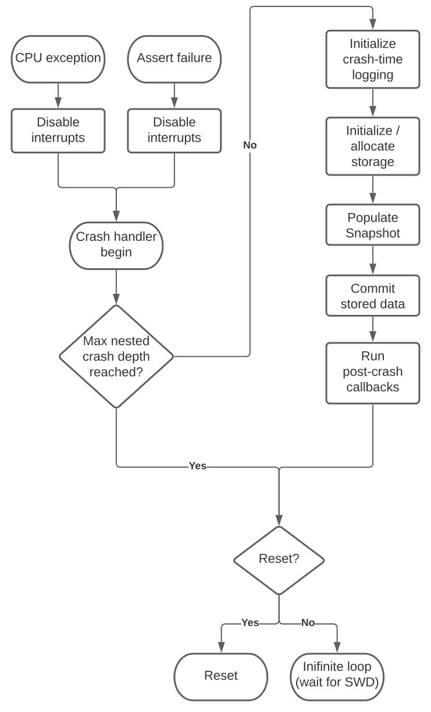

.. _module-pw_snapshot-setup:

==============================
Setting up a Snapshot Pipeline
==============================

-------------------
Crash Handler Setup
-------------------
The Snapshot proto was designed first and foremost as a crash reporting format.
This section covers how to set up a crash handler to capture Snapshots.

A typical crash handler has two entry points:

1. A software entry path through developer-written ASSERT() or CHECK() calls
   that indicate a device should go down for a crash if a condition is not met.
2. A hardware-triggered exception handler path that is initiated when a CPU
   encounters a fault signal (invalid memory access, bad instruction, etc.).

Before deferring to a common crash handler, these entry paths should disable
interrupts to force the system into a single-threaded execution mode. This
prevents other threads from operating on potentially bad data or clobbering
system state that could be useful for debugging.

The first step in a crash handler should always be a check for nested crashes to
prevent infinitely recursive crashes. Once it's deemed it's safe to continue,
the crash handler can re-initialize logging, initialize storage for crash report
capture, and then build a snapshot to later be retrieved from the device. Once
the crash report collection process is complete, some post-crash callbacks can
be run on a best-effort basis to clean up the system before rebooting. For
devices with debug port access, it's helpful to optionally hold the device in
an infinite loop rather than resetting to allow developers to access the device
via a hardware debugger.

Assert Handler Setup
====================
:ref:`pw_assert <module-pw_assert>` is Pigweed's entry point for software
crashes. Route any existing assert functions through pw_assert to centralize the
software crash path. You’ll need to create a :ref:`pw_assert backend
<module-pw_assert-backend_api>` or a custom :ref:`pw_assert_basic handler
<module-pw_assert_basic-custom_handler>` to pass collected information to a more
sophisticated crash handler. One way to do this is to collect the data into a
statically allocated struct that is passed to a common crash handler. It’s
important to immediately disable interrupts to prevent the system from doing
other things while in an impacted state.

.. code-block:: cpp

  // This can be be directly accessed by a crash handler
  static CrashData crash_data;
  extern "C" void pw_assert_basic_HandleFailure(const char* file_name,
                                                int line_number,
                                                const char* format,
                                                ...) {
    // Always disable interrupts first! How this is done depends
    // on your platform.
    __disable_irq();

    va_list args;
    va_start(args, format);
    crash_data.file_name = file_name;
    crash_data.line_number = line_number;
    crash_data.reason_fmt = format;
    crash_data.reason_args = &args;
    crash_data.cpu_state = nullptr;

    HandleCrash(crash_data);
    PW_UNREACHABLE;
  }

Exception Handler Setup
=======================
:ref:`pw_cpu_exception <module-pw_cpu_exception>` is Pigweed's recommended entry
point for CPU-triggered faults (divide by zero, invalid memory access, etc.).
You will need to provide a definition for pw_cpu_exception_DefaultHandler() that
passes the exception state produced by pw_cpu_exception to your common crash
handler.

.. code-block:: cpp

  static CrashData crash_data;
  // This helper turns a format string to a va_list that can be used by the
  // common crash handling path.
  void HandleExceptionWithString(pw_cpu_exception_State& state,
                                 const char* fmt,
                                 ...) {
    va_list args;
    va_start(args, fmt);
    crash_data.cpu_state = state;
    crash_data.file_name = nullptr;
    crash_data.reason_fmt = fmt;
    crash_data.reason_args = &args;

    HandleCrash(crash_data);
    PW_UNREACHABLE;
  }

  extern "C" void pw_cpu_exception_DefaultHandler(
      pw_cpu_exception_State* state) {
    // Always disable interrupts first! How this is done depends
    // on your platform.
    __disable_irq();

    crash_data.state = cpu_state;
    // The CFSR is an extremely useful register for understanding ARMv7-M and
    // ARMv8-M CPU faults. Other architectures should put something else here.
    HandleExceptionWithString(crash_data,
                              "Exception encountered, cfsr=0x%",
                              cpu_state->extended.cfsr);
  }

Common Crash Handler Setup
==========================
To minimize duplication of crash handling logic, it's good practice to route the
pw_assert and pw_cpu_exception handlers to a common crash handling codepath.
Ensure you can pass both pw_cpu_exception's CPU state and pw_assert's assert
information to the shared handler.

.. code-block:: cpp

  struct CrashData {
    pw_cpu_exception_State *cpu_state;
    const char *reason_fmt;
    const va_list *reason_args;
    const char *file_name;
    int line_number;
  };

  // This function assumes interrupts are properly disabled BEFORE it is called.
  [[noreturn]] void HandleCrash(CrashData& crash_info) {
    // Handle crash
  }

In the crash handler your project can re-initialize a minimal subset of the
system needed to safely capture a snapshot before rebooting the device. The
remainder of this section focuses on ways you can improve the reliability and
usability of your project's crash handler.

Check for Nested Crashes
------------------------
It’s important to include crash handler checks that prevent infinite recursive
nesting of crashes. Maintain a static variable that checks the crash nesting
depth. After one or two nested crashes, abort crash handling entirely and reset
the device or sit in an infinite loop to wait for a hardware debugger to attach.
It’s simpler to put this logic at the beginning of the shared crash handler, but
if your assert/exception handlers are complex it might be safer to inject the
checks earlier in both codepaths.

.. code-block:: cpp

  [[noreturn]] void HandleCrash(CrashData &crash_info) {
    static size_t crash_depth = 0;
    if (crash_depth > kMaxCrashDepth) {
      Abort(/*run_callbacks=*/false);
    }
    crash_depth++;
    ...
  }

Re-initialize Logging (Optional)
--------------------------------
Logging can be helpful for debugging your crash handler, but depending on your
device/system design may be challenging to safely support at crash time. To
re-initialize logging, you’ll need to re-construct C++ objects and re-initialize
any systems/hardware in the logging codepath. You may even need an entirely
separate logging pipeline that is single-threaded and interrupt-safe. Depending
on your system’s design, this may be difficult to set up.

Reinitialize Dependencies
-------------------------
It's good practice to design a crash handler that can run before C++ static
constructors have run. This means any initialization (whether manual or through
constructors) that your crash handler depends on should be manually invoked at
crash time. If an initialization step might not be safe, evaluate if it's
possible to omit the dependency.

System Cleanup
--------------
After collecting a snapshot, some parts of your system may benefit from some
cleanup before explicitly resetting a device. This might include flushing
buffers or safely shutting down attached hardware. The order of shutdown should
be deterministic, keeping in mind that any of these steps may have the potential
of causing a nested crash that skips the remainder of the handlers and forces
the device to immediately reset.

----------------------
Snapshot Storage Setup
----------------------
Use a storage class with a ``pw::stream::Writer`` interface to simplify
capturing a pw_snapshot proto. This can be a :ref:`pw::BlobStore
<module-pw_blob_store>`, an in-memory buffer that is flushed to flash, or a
:ref:`pw::PersistentBuffer <module-pw_persistent_ram-persistent_buffer>` that
lives in persistent memory. It's good practice to use lazy initialization for
storage objects used by your Snapshot capture codepath.

.. code-block:: cpp

  // Persistent RAM objects are highly available. They don't rely on
  // their constructor being run, and require no initialization.
  PW_PLACE_IN_SECTION(".noinit")
  pw::persistent_ram::PersistentBuffer<2048> persistent_snapshot;

  void CaptureSnapshot(CrashInfo& crash_info) {
    ...
    persistent_snapshot.clear();
    PersistentBufferWriter& writer = persistent_snapshot.GetWriter();
    ...
  }

----------------------
Snapshot Capture Setup
----------------------

.. note::

  These instructions do not yet use the ``pw::protobuf::StreamEncoder``.

Capturing a snapshot is as simple as encoding any other proto message. Some
modules provide helper functions that will populate parts of a Snapshot, which
eases the burden of custom work that must be set up uniquely for each project.

Capture Reason
==============
A snapshot's "reason" should be considered the single most important field in a
captured snapshot. If a snapshot capture was triggered by a crash, this should
be the assert string. Other entry paths should describe here why the snapshot
was captured ("Host communication buffer full!", "Exception encountered at
0x00000004", etc.).

.. code-block:: cpp

  Status CaptureSnapshot(CrashData& crash_info) {
    // Temporary buffer for encoding "reason" to.
    static std::byte temp_buffer[500];
    // Temporary buffer to encode serialized proto to before dumping to the
    // final ``pw::stream::Writer``.
    static std::byte proto_encode_buffer[512];
    ...
    pw::protobuf::NestedEncoder<kMaxDepth> proto_encoder(proto_encode_buffer);
    pw::snapshot::Snapshot::Encoder snapshot_encoder(&proto_encoder);
    size_t length = snprintf(temp_buffer,
                             sizeof(temp_buffer,
                             crash_info.reason_fmt),
                             *crash_info.reason_args);
    snapshot_encoder.WriteReason(temp_buffer, length));

    // Final encode and write.
    Result<ConstByteSpan> encoded_proto = proto_encoder.Encode();
    PW_TRY(encoded_proto.status());
    PW_TRY(writer.Write(encoded_proto.value()));
    ...
  }

Capture CPU State
=================
When using pw_cpu_exception, exceptions will automatically collect CPU state
that can be directly dumped into a snapshot. As it's not always easy to describe
a CPU exception in a single "reason" string, this captures the information
needed to more verbosely automatically generate a descriptive reason at analysis
time once the snapshot is retrieved from the device.

.. code-block:: cpp

  Status CaptureSnapshot(CrashData& crash_info) {
    ...

    proto_encoder.clear();

    // Write CPU state.
    if (crash_info.cpu_state) {
      PW_TRY(DumpCpuStateProto(snapshot_encoder.GetArmv7mCpuStateEncoder(),
                               *crash_info.cpu_state));

      // Final encode and write.
      Result<ConstByteSpan> encoded_proto = proto_encoder.Encode();
      PW_TRY(encoded_proto.status());
      PW_TRY(writer.Write(encoded_proto.value()));
    }
  }

-----------------------
Snapshot Transfer Setup
-----------------------
Pigweed’s pw_rpc system is well suited for retrieving a snapshot from a device.
Pigweed does not yet provide a generalized transfer service for moving files
to/from a device. When this feature is added to Pigweed, this section will be
updated to include guidance for connecting a storage system to a transfer
service.

----------------------
Snapshot Tooling Setup
----------------------
When using the upstream ``Snapshot`` proto, you can directly use
``pw_snapshot.process`` to process snapshots into human-readable dumps. If
you've opted to extend Pigweed's snapshot proto, you'll likely want to extend
the processing tooling to handle custom project data as well. This can be done
by creating a light wrapper around
``pw_snapshot.processor.process_snapshots()``.

.. code-block:: python

  def _process_hw_failures(serialized_snapshot: bytes) -> str:
      """Custom handler that checks wheel state."""
      wheel_state = wheel_state_pb2.WheelStateSnapshot()
      output = []
      wheel_state.ParseFromString(serialized_snapshot)

      if len(wheel_state.wheels) != 2:
          output.append(f'Expected 2 wheels, found {len(wheel_state.wheels)}')

      if len(wheel_state.wheels) < 2:
          output.append('Wheels fell off!')

      # And more...

      return '\n'.join(output)

  def process_my_snapshots(serialized_snapshot: bytes) -> str:
      """Runs the snapshot processor with a custom callback."""
      return pw_snapshot.processor.process_snapshots(
          serialized_snapshot, user_processing_callback=_process_hw_failures)
