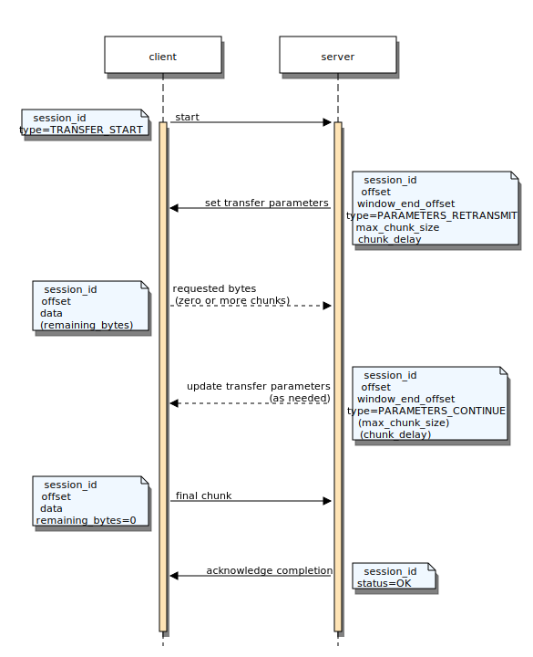

.. _module-pw_transfer:

===========
pw_transfer
===========
``pw_transfer`` is a reliable data transfer protocol which runs on top of
Pigweed RPC.

.. attention::

  ``pw_transfer`` is under construction and so is its documentation.

-----
Usage
-----

C++
===

Transfer thread
---------------
To run transfers as either a client or server (or both), a dedicated thread is
required. The transfer thread is used to process all transfer-related events
safely. The same transfer thread can be shared by a transfer client and service
running on the same system.

.. note::

   All user-defined transfer callbacks (i.e. the virtual interface of a
   ``Handler`` or completion function in a transfer client) will be
   invoked from the transfer thread's context.

In order to operate, a transfer thread requires two buffers:

- The first is a *chunk buffer*. This is used to stage transfer packets received
  by the RPC system to be processed by the transfer thread. It must be large
  enough to store the largest possible chunk the system supports.

- The second is an *encode buffer*. This is used by the transfer thread to
  encode outgoing RPC packets. It is necessarily larger than the chunk buffer.
  Typically, this is sized to the system's maximum transmission unit at the
  transport layer.

A transfer thread is created by instantiating a ``pw::transfer::Thread``. This
class derives from ``pw::thread::ThreadCore``, allowing it to directly be used
when creating a system thread. Refer to :ref:`module-pw_thread-thread-creation`
for additional information.

**Example thread configuration**

.. code-block:: cpp

   #include "pw_transfer/transfer_thread.h"

   namespace {

   // The maximum number of concurrent transfers the thread should support as
   // either a client or a server. These can be set to 0 (if only using one or
   // the other).
   constexpr size_t kMaxConcurrentClientTransfers = 5;
   constexpr size_t kMaxConcurrentServerTransfers = 3;

   // The maximum payload size that can be transmitted by the system's
   // transport stack. This would typically be defined within some transport
   // header.
   constexpr size_t kMaxTransmissionUnit = 512;

   // The maximum amount of data that should be sent within a single transfer
   // packet. By necessity, this should be less than the max transmission unit.
   //
   // pw_transfer requires some additional per-packet overhead, so the actual
   // amount of data it sends may be lower than this.
   constexpr size_t kMaxTransferChunkSizeBytes = 480;

   // Buffers for storing and encoding chunks (see documentation above).
   std::array<std::byte, kMaxTransferChunkSizeBytes> chunk_buffer;
   std::array<std::byte, kMaxTransmissionUnit> encode_buffer;

   pw::transfer::Thread<kMaxConcurrentClientTransfers,
                        kMaxConcurrentServerTransfers>
       transfer_thread(chunk_buffer, encode_buffer);

   }  // namespace

   // pw::transfer::TransferThread is the generic, non-templated version of the
   // Thread class. A Thread can implicitly convert to a TransferThread.
   pw::transfer::TransferThread& GetSystemTransferThread() {
     return transfer_thread;
   }

Transfer server
---------------
``pw_transfer`` provides an RPC service for running transfers through an RPC
server.

To know how to read data from or write data to device, a ``Handler`` interface
is defined (``pw_transfer/public/pw_transfer/handler.h``). Transfer handlers
represent a transferable resource, wrapping a stream reader and/or writer with
initialization and completion code. Custom transfer handler implementations
should derive from ``ReadOnlyHandler``, ``WriteOnlyHandler``, or
``ReadWriteHandler`` as appropriate and override Prepare and Finalize methods
if necessary.

A transfer handler should be implemented and instantiated for each unique
resource that can be transferred to or from a device. Each instantiated handler
must have a globally-unique integer ID used to identify the resource.

Handlers are registered with the transfer service. This may be done during
system initialization (for static resources), or dynamically at runtime to
support ephemeral transfer resources.

**Example transfer handler implementation**

.. code-block:: cpp

  #include "pw_stream/memory_stream.h"
  #include "pw_transfer/transfer.h"

  // A simple transfer handler which reads data from an in-memory buffer.
  class SimpleBufferReadHandler : public pw::transfer::ReadOnlyHandler {
   public:
    SimpleReadTransfer(uint32_t resource_id, pw::ConstByteSpan data)
        : ReadOnlyHandler(resource_id), reader_(data) {
      set_reader(reader_);
    }

   private:
    pw::stream::MemoryReader reader_;
  };

The transfer service is instantiated with a reference to the system's transfer
thread and registered with the system's RPC server.

**Example transfer service initialization**

.. code-block:: cpp

  #include "pw_transfer/transfer.h"

  namespace {

  // In a write transfer, the maximum number of bytes to receive at one time
  // (potentially across multiple chunks), unless specified otherwise by the
  // transfer handler's stream::Writer.
  constexpr size_t kDefaultMaxBytesToReceive = 1024;

  pw::transfer::TransferService transfer_service(
      GetSystemTransferThread(), kDefaultMaxBytesToReceive);

  // Instantiate a handler for the data to be transferred. The resource ID will
  // be used by the transfer client and server to identify the handler.
  constexpr uint32_t kMagicBufferResourceId = 1;
  char magic_buffer_to_transfer[256] = { /* ... */ };
  SimpleBufferReadHandler magic_buffer_handler(
      kMagicBufferResourceId, magic_buffer_to_transfer);

  }  // namespace

  void InitTransferService() {
    // Register the handler with the transfer service, then the transfer service
    // with an RPC server.
    transfer_service.RegisterHandler(magic_buffer_handler);
    GetSystemRpcServer().RegisterService(transfer_service);
  }

Transfer client
---------------
``pw_transfer`` provides a transfer client capable of running transfers through
an RPC client.

.. note::

   Currently, a transfer client is only capable of running transfers on a single
   RPC channel. This may be expanded in the future.

The transfer client provides the following two APIs for starting data transfers:

.. cpp:function:: pw::Status pw::transfer::Client::Read(uint32_t resource_id, pw::stream::Writer& output, CompletionFunc&& on_completion, pw::chrono::SystemClock::duration timeout = cfg::kDefaultChunkTimeout, pw::transfer::ProtocolVersion version = kDefaultProtocolVersion)

  Reads data from a transfer server to the specified ``pw::stream::Writer``.
  Invokes the provided callback function with the overall status of the
  transfer.

  Due to the asynchronous nature of transfer operations, this function will only
  return a non-OK status if it is called with bad arguments. Otherwise, it will
  return OK and errors will be reported through the completion callback.

.. cpp:function:: pw::Status pw::transfer::Client::Write(uint32_t resource_id, pw::stream::Reader& input, CompletionFunc&& on_completion, pw::chrono::SystemClock::duration timeout = cfg::kDefaultChunkTimeout, pw::transfer::ProtocolVersion version = kDefaultProtocolVersion)

  Writes data from a source ``pw::stream::Reader`` to a transfer server.
  Invokes the provided callback function with the overall status of the
  transfer.

  Due to the asynchronous nature of transfer operations, this function will only
  return a non-OK status if it is called with bad arguments. Otherwise, it will
  return OK and errors will be reported through the completion callback.

**Example client setup**

.. code-block:: cpp

   #include "pw_transfer/client.h"

   namespace {

   // RPC channel on which transfers should be run.
   constexpr uint32_t kChannelId = 42;

   pw::transfer::Client transfer_client(
       GetSystemRpcClient(), kChannelId, GetSystemTransferThread());

   }  // namespace

   Status ReadMagicBufferSync(pw::ByteSpan sink) {
     pw::stream::Writer writer(sink);

     struct {
       pw::sync::ThreadNotification notification;
       pw::Status status;
     } transfer_state;

     transfer_client.Read(
         kMagicBufferResourceId,
         writer,
         [&transfer_state](pw::Status status) {
           transfer_state.status = status;
           transfer_state.notification.release();
         });

     // Block until the transfer completes.
     transfer_state.notification.acquire();
     return transfer_state.status;
   }

Atomic File Transfer Handler
----------------------------
Transfers are handled using the generic `Handler` interface. A specialized
`Handler`, `AtomicFileTransferHandler` is available to handle file transfers
with atomic semantics. It guarantees that the target file of the transfer is
always in a correct state. A temporary file is written to prior to updating the
target file. If any transfer failure occurs, the transfer is aborted and the
target file is either not created or not updated.

Module Configuration Options
----------------------------
The following configurations can be adjusted via compile-time configuration of
this module, see the
:ref:`module documentation <module-structure-compile-time-configuration>` for
more details.

.. c:macro:: PW_TRANSFER_DEFAULT_MAX_RETRIES

  The default maximum number of times a transfer should retry sending a chunk
  when no response is received. This can later be configured per-transfer.

.. c:macro:: PW_TRANSFER_DEFAULT_MAX_LIFETIME_RETRIES

  The default maximum number of times a transfer should retry sending any chunk
  over the course of its entire lifetime.

  This number should be high, particularly if long-running transfers are
  expected. Its purpose is to prevent transfers from getting stuck in an
  infinite loop.

.. c:macro:: PW_TRANSFER_DEFAULT_TIMEOUT_MS

  The default amount of time, in milliseconds, to wait for a chunk to arrive
  before retrying. This can later be configured per-transfer.

.. c:macro:: PW_TRANSFER_DEFAULT_EXTEND_WINDOW_DIVISOR

  The fractional position within a window at which a receive transfer should
  extend its window size to minimize the amount of time the transmitter
  spends blocked.

  For example, a divisor of 2 will extend the window when half of the
  requested data has been received, a divisor of three will extend at a third
  of the window, and so on.

Python
======
.. automodule:: pw_transfer
  :members: ProgressStats, ProtocolVersion, Manager, Error

**Example**

.. code-block:: python

  import pw_transfer

  # Initialize a Pigweed RPC client; see pw_rpc docs for more info.
  rpc_client = CustomRpcClient()
  rpcs = rpc_client.channel(1).rpcs

  transfer_service = rpcs.pw.transfer.Transfer
  transfer_manager = pw_transfer.Manager(transfer_service)

  try:
    # Read the transfer resource with ID 3 from the server.
    data = transfer_manager.read(3)
  except pw_transfer.Error as err:
    print('Failed to read:', err.status)

  try:
    # Send some data to the server. The transfer manager does not have to be
    # reinitialized.
    transfer_manager.write(2, b'hello, world')
  except pw_transfer.Error as err:
    print('Failed to write:', err.status)

Typescript
==========
Provides a simple interface for transferring bulk data over pw_rpc.

**Example**

.. code-block:: typescript

   import { pw_transfer } from 'pigweedjs';
   const { Manager } from pw_transfer;

   const client = new CustomRpcClient();
   service = client.channel()!.service('pw.transfer.Transfer')!;

   const manager = new Manager(service, DEFAULT_TIMEOUT_S);

   manager.read(3, (stats: ProgressStats) => {
     console.log(`Progress Update: ${stats}`);
   }).then((data: Uint8Array) => {
     console.log(`Completed read: ${data}`);
   }).catch(error => {
     console.log(`Failed to read: ${error.status}`);
   });

   manager.write(2, textEncoder.encode('hello world'))
     .catch(error => {
       console.log(`Failed to read: ${error.status}`);
     });

Java
====
pw_transfer provides a Java client. The transfer client returns a
`ListenableFuture <https://guava.dev/releases/21.0/api/docs/com/google/common/util/concurrent/ListenableFuture>`_
to represent the results of a read or write transfer.

.. code-block:: java

  import dev.pigweed.pw_transfer.TransferClient;

  public class TheClass  {
    public void DoTransfer(MethodClient transferReadMethodClient,
                           MethodClient transferWriteMethodClient) {
      // Create a new transfer client.
      TransferClient client = new TransferClient(
          transferReadMethodClient,
          transferWriteMethodClient,
          TransferTimeoutSettings.builder()
              .setTimeoutMillis(TRANSFER_TIMEOUT_MS)
              .setMaxRetries(MAX_RETRIES)
              .build());

      // Start a read transfer.
      ListenableFuture<byte[]> readTransfer = client.read(123);

      // Start a write transfer.
      ListenableFuture<Void> writeTransfer = client.write(123, dataToWrite);

      // Get the data from the read transfer.
      byte[] readData = readTransfer.get();

      // Wait for the write transfer to complete.
      writeTransfer.get();
    }
  }

--------
Protocol
--------

Chunks
======
Transfers run as a series of *chunks* exchanged over an RPC stream. Chunks can
contain transferable data, metadata, and control parameters. Each chunk has an
associated type, which determines what information it holds and the semantics of
its fields.

The chunk is a protobuf message, whose definition can be found
:ref:`here <module-pw_transfer-proto-definition>`.

Resources and sessions
======================
Transfers are run for a specific *resource* --- a stream of data which can be
read from or written to. Resources have a system-specific integral identifier
defined by the implementers of the server-side transfer node.

The series of chunks exchanged in an individual transfer operation for a
resource constitute a transfer *session*. The session runs from its opening
chunk until either a terminating chunk is received or the transfer times out.
Sessions are assigned unique IDs by the transfer server in response to an
initiating chunk from the client.

Reliability
===========
``pw_transfer`` attempts to be a reliable data transfer protocol.

As Pigweed RPC is considered an unreliable communications system,
``pw_transfer`` implements its own mechanisms for reliability. These include
timeouts, data retransmissions, and handshakes.

.. note::

   A transfer can only be reliable if its underlying data stream is seekable.
   A non-seekable stream could prematurely terminate a transfer following a
   packet drop.

Opening handshake
=================
Transfers begin with a three-way handshake, whose purpose is to identify the
resource being transferred, assign a session ID, and synchronize the protocol
version to use.

A read or write transfer for a resource is initiated by a transfer client. The
client sends the ID of the resource to the server in a ``START`` chunk,
indicating that it wishes to begin a new transfer. This chunk additionally
encodes the protocol version which the client is configured to use.

Upon receiving a ``START`` chunk, the transfer server checks whether the
requested resource is available. If so, it prepares the resource for the
operation, which typically involves opening a data stream, alongside any
additional user-specified setup. The server generates a session ID, then
responds to the client with a ``START_ACK`` chunk containing the resource,
session, and configured protocol version for the transfer.

Transfer completion
===================
Either side of a transfer can terminate the operation at any time by sending a
``COMPLETION`` chunk containing the final status of the transfer. When a
``COMPLETION`` chunk is sent, the terminator of the transfer performs local
cleanup, then waits for its peer to acknowledge the completion.

Upon receving a ``COMPLETION`` chunk, the transfer peer cancels any pending
operations, runs its set of cleanups, and responds with a ``COMPLETION_ACK``,
fully ending the session from the peer's side.

The terminator's session remains active waiting for a ``COMPLETION_ACK``. If not
received after a timeout, it re-sends its ``COMPLETION`` chunk. The session ends
either following receipt of the acknowledgement or if a maximum number of
retries is hit.

.. _module-pw_transfer-proto-definition:

Server to client transfer (read)
================================
.. image:: read.svg

Client to server transfer (write)
=================================

Protocol buffer definition
==========================
.. literalinclude:: transfer.proto
  :language: protobuf
  :lines: 14-

Errors
======

Protocol errors
---------------
The following table describes the meaning of each status code when sent by the
sender or the receiver (see `Transfer roles`_).

.. cpp:namespace-push:: pw::stream

+-------------------------+-------------------------+-------------------------+
| Status                  | Sent by sender          | Sent by receiver        |
+=========================+=========================+=========================+
| ``OK``                  | (not sent)              | All data was received   |
|                         |                         | and handled             |
|                         |                         | successfully.           |
+-------------------------+-------------------------+-------------------------+
| ``ABORTED``             | The service aborted the transfer because the      |
|                         | client restarted it. This status is passed to the |
|                         | transfer handler, but not sent to the client      |
|                         | because it restarted the transfer.                |
+-------------------------+---------------------------------------------------+
| ``CANCELLED``           | The client cancelled the transfer.                |
+-------------------------+-------------------------+-------------------------+
| ``DATA_LOSS``           | Failed to read the data | Failed to write the     |
|                         | to send. The            | received data. The      |
|                         | :cpp:class:`Reader`     | :cpp:class:`Writer`     |
|                         | returned an error.      | returned an error.      |
+-------------------------+-------------------------+-------------------------+
| ``FAILED_PRECONDITION`` | Received chunk for transfer that is not active.   |
+-------------------------+-------------------------+-------------------------+
| ``INVALID_ARGUMENT``    | Received a malformed packet.                      |
+-------------------------+-------------------------+-------------------------+
| ``INTERNAL``            | An assumption of the protocol was violated.       |
|                         | Encountering ``INTERNAL`` indicates that there is |
|                         | a bug in the service or client implementation.    |
+-------------------------+-------------------------+-------------------------+
| ``PERMISSION_DENIED``   | The transfer does not support the requested       |
|                         | operation (either reading or writing).            |
+-------------------------+-------------------------+-------------------------+
| ``RESOURCE_EXHAUSTED``  | The receiver requested  | Storage is full.        |
|                         | zero bytes, indicating  |                         |
|                         | their storage is full,  |                         |
|                         | but there is still data |                         |
|                         | to send.                |                         |
+-------------------------+-------------------------+-------------------------+
| ``UNAVAILABLE``         | The service is busy with other transfers and      |
|                         | cannot begin a new transfer at this time.         |
+-------------------------+-------------------------+-------------------------+
| ``UNIMPLEMENTED``       | Out-of-order chunk was  | (not sent)              |
|                         | requested, but seeking  |                         |
|                         | is not supported.       |                         |
+-------------------------+-------------------------+-------------------------+

.. cpp:namespace-pop::

Transfer roles
==============
Every transfer has two participants: the sender and the receiver. The sender
transmits data to the receiver. The receiver controls how the data is
transferred and sends the final status when the transfer is complete.

In read transfers, the client is the receiver and the service is the sender. In
write transfers, the client is the sender and the service is the receiver.

Sender flow
-----------
.. mermaid::

  graph TD
    start([Client initiates transfer]) -->data_request
    data_request[Receive transfer parameters]-->send_chunk

    send_chunk[Send chunk]-->sent_all

    sent_all{Sent final chunk?} -->|yes|wait
    sent_all-->|no|sent_requested

    sent_requested{Sent all pending?}-->|yes|data_request
    sent_requested-->|no|send_chunk

    wait[Wait for receiver]-->is_done

    is_done{Received final chunk?}-->|yes|done
    is_done-->|no|data_request

    done([Transfer complete])

Receiver flow
-------------
.. mermaid::

  graph TD
    start([Client initiates transfer]) -->request_bytes
    request_bytes[Set transfer parameters]-->wait

    wait[Wait for chunk]-->received_chunk

    received_chunk{Received chunk by deadline?}-->|no|request_bytes
    received_chunk-->|yes|check_chunk

    check_chunk{Correct offset?} -->|yes|process_chunk
    check_chunk --> |no|request_bytes

    process_chunk[Process chunk]-->final_chunk

    final_chunk{Final chunk?}-->|yes|signal_completion
    final_chunk{Final chunk?}-->|no|received_requested

    received_requested{Received all pending?}-->|yes|request_bytes
    received_requested-->|no|wait

    signal_completion[Signal completion]-->done

    done([Transfer complete])

Legacy protocol
===============
``pw_transfer`` was initially released into production prior to several of the
reliability improvements of its modern protocol. As a result of this, transfer
implementations support a "legacy" protocol mode, in which transfers run without
utilizing these features.

The primary differences between the legacy and modern protocols are listed
below.

- There is no distinction between a transfer resource and session --- a single
  ``transfer_id`` field represents both. Only one transfer for a given resource
  can run at a time, and it is not possible to determine where one transfer for
  a resource ends and the next begins.
- The legacy protocol has no opening handshake phase. The client initiates with
  a transfer ID and starting transfer parameters (during a read), and the data
  transfer phase begins immediately.
- The legacy protocol has no terminating handshake phase. When either end
  completes a transfer by sending a status chunk, it does not wait for the peer
  to acknowledge. Resources used by the transfer are immediately freed, and
  there is no guarantee that the peer is notified of completion.

Transfer clients request the latest transfer protocol version by default, but
may be configured to request the legacy protocol. Transfer server and client
implementations detect if their transfer peer is running the legacy protocol and
automatically switch to it if required, even if they requested a newer protocol
version. It is **strongly** unadvised to use the legacy protocol in new code.

-----------------
Integration tests
-----------------
The ``pw_transfer`` module has a set of integration tests that verify the
correctness of implementations in different languages.
`Test source code <https://cs.pigweed.dev/pigweed/+/main:pw_transfer/integration_test/>`_.

To run the tests on your machine, run

.. code:: bash

  $ bazel test --features=c++17 \
        pw_transfer/integration_test:cross_language_small_test \
        pw_transfer/integration_test:cross_language_medium_test

.. note:: There is a large test that tests transfers that are megabytes in size.
  These are not run automatically, but can be run manually via the
  pw_transfer/integration_test:cross_language_large_test test. These are VERY
  slow, but exist for manual validation of real-world use cases.

The integration tests permit injection of client/server/proxy binaries to use
when running the tests. This allows manual testing of older versions of
pw_transfer against newer versions.

.. code:: bash

  # Test a newer version of pw_transfer against an old C++ client that was
  # backed up to another directory.
  $ bazel run pw_transfer/integration_test:cross_language_medium_test -- \
      --cpp-client-binary ../old_pw_transfer_version/cpp_client

Backwards compatibility tests
=============================
``pw_transfer`` includes a `suite of backwards-compatibility tests
<https://cs.pigweed.dev/pigweed/+/main:pw_transfer/integration_test/legacy_binaries_test.py>`_
that are intended to continuously validate a degree of backwards-compatibility
with older pw_transfer servers and clients. This is done by retrieving older
binaries hosted in CIPD and running tests between the older client/server
binaries and the latest binaries.

The CIPD package contents can be created with this command:

.. code::bash

  $ bazel build --features=c++17 pw_transfer/integration_test:server \
                                 pw_transfer/integration_test:cpp_client
  $ mkdir pw_transfer_test_binaries
  $ cp bazel-bin/pw_transfer/integration_test/server \
       pw_transfer_test_binaries
  $ cp bazel-bin/pw_transfer/integration_test/cpp_client \
       pw_transfer_test_binaries

To update the CIPD package itself, follow the `internal documentation for
updating a CIPD package <go/pigweed-cipd#installing-packages-into-cipd>`_.

CI/CQ integration
=================
`Current status of the test in CI <https://ci.chromium.org/p/pigweed/builders/ci/pigweed-integration-transfer>`_.

By default, these tests are not run in CQ (on presubmit) because they are too
slow. However, you can request that the tests be run in presubmit on your
change by adding to following line to the commit message footer:

.. code::

  Cq-Include-Trybots: luci.pigweed.try:pigweed-integration-transfer
