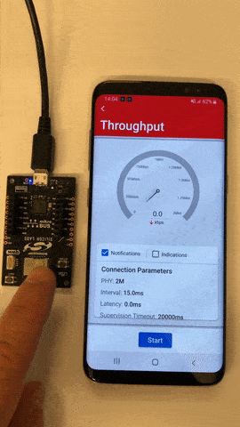

# SoC - Throughput

This example allows measuring data throughput between EFR32 devices as well as between an EFR32 and a smartphone running the EFR Connect mobile app.

> Note: this example expects a specific Gecko Bootloader to be present on your device. For details see the Troubleshooting section.

## Getting started

To get started with Silicon Labs Bluetooth and Simplicity Studio, see [QSG169: Bluetooth SDK v3.x Quick Start Guide](https://www.silabs.com/documents/public/quick-start-guides/qsg169-bluetooth-sdk-v3x-quick-start-guide.pdf).

This example implements a GATT service that can be used to measure application data throughput using acknowledged or unacknowledged transactions, namely indications or notifications.

This throughput measurement setup has three use cases:

1. EFR32 (SoC) <-> Mobile phone + EFR Connect
2. EFR32 (SoC) <-> EFR32 (SoC)
3. EFR32 (SoC) <-> EFR32 (NCP) + Host (typically PC)

The two last use cases require two Silicon Labs kits, such as [SLWSTK6021A](https://www.silabs.com/development-tools/wireless/efr32xg22-wireless-starter-kit), [SLTB010A](https://www.silabs.com/development-tools/thunderboard/thunderboard-bg22-kit) or [BGM220-EK4314A](https://www.silabs.com/development-tools/wireless/bluetooth/bgm220-explorer-kit).

To test throughput against a smartphone, install EFR Connect for [Android](https://play.google.com/store/apps/details?id=com.siliconlabs.bledemo&hl=en&gl=US) or [iOS](https://apps.apple.com/us/app/efr-connect/id1030932759). Source code for the mobile app is available on [Github](https://github.com/SiliconLabs?q=efrconnect&type=&language=&sort=).

### EFR32 (SoC) <-> Mobile phone + EFR Connect

For this use case only one kit is required. After flashing the example the firmware will boot as a peripheral by default, and the mobile phone acts as a central device.

Open EFR Connect, go to the demo view and select the Throughput demo. A pop-up shows all the devices that are running the **Bluetooth - SoC Throughput** firmware. Tap on the device to go into the Throughput demo view.

 

Data can be pushed to the smartphone by pressing PB0 (notifications) or PB1 (indications) on the mainboard. From the mobile app side data can be pushed to the EFR32 by tapping the Start button at the bottom. The data transfer type (notifications/indications) can be selected at the top of the connection parameters window.

The animation below showcases the demo running on a BGM220 Explorer Kit (BGM220-EK4314A) with the mobile app running on an Android device.

### EFR (SoC) <-> EFR32 (SoC)

For this use case the **Bluetooth - SoC Throughput** example must be flashed on both kits. By default the firmware boots in peripheral mode but it can boot in central mode by keeping PB0 pressed while resetting the device. The role can be read from the first line on the display.

Throughput testing can start as soon as the devices establish a connection and subscribe to indications/notifications on each other's GATT database. The status is indicated on the second line of the display. When both side show "ST: Subscribed" then testing is ready to start.

Notifications can be pushed by pressing PB0 and indications can be pushed by pressing PB1. The data can be pushed from either device since both have the throughput service on their GATT database and they subscribe to notifications/indications on the remote device's GATT.

Data will be sent for as long as the button is pressed on the device and the status will be "ST: Testing" during that time.

Once the button is released the average throughput will be calculated and shown on the display as well as how many packets were sent. This information is on the two last lines of the display.

### EFR32 (SoC) <-> EFR32 (NCP) + Host (typically PC)

The final use case consists of one kit flashed with **Bluetooth - SoC Throughput** example and a second kit flashed with an extended version of the **Bluetooth - NCP** example. To achieve that, create a **Bluetooth - NCP** example from the Laucher and under the Software Components tab, install the **LE Power Control** component. Finally build and flash the image to the target board.
The NCP device will be controlled by a dedicated host application which is located under *<SDK-installation-location>/app/bluetooth/example_host/bt_host_throughput*. 

To learn more about NCP firmware and how to build the host applications, see [AN1259: Using the v3.x Silicon Labs Bluetooth Stack in Network Co-Processor Mode](https://www.silabs.com/documents/public/application-notes/an1259-bt-ncp-mode-sdk-v3x.pdf).

In this setup data can only be sent from the SoC to the NCP device because the NCP firmware does not contain the Throughput service in its GATT server.

## Additional Notes

These next sections describe some more details about the example.

### Operation on 1-button boards

The **Bluetooth - SoC Throughput** example also runs on boards that only have 1 user button, such as [SLTB010A](https://www.silabs.com/development-tools/thunderboard/thunderboard-bg22-kit) or [BGM220-EK4314A](https://www.silabs.com/development-tools/wireless/bluetooth/bgm220-explorer-kit). The behavior is determined by the button press duration:
* Short press switches between sending notifications or indications. The default out of boot is sending notifications.
* Long press sends data.
* To boot into central mode instead of periperal, keep the button pressed while resetting the device.

### CLI (Command Line Interface)

The **Bluetooth - SoC Throughput** example has a CLI that is used to report activity as well as modify parameters in runtime. You can easily access the CLI with a terminal emulator such as Tera Term or from within [Simplicity Studio](https://www.silabs.com/developers/simplicity-studio) by right-clicking the debug adapter and selecting Launch Console. On the Serial 1 tab, type 'help' on the command prompt.

 

The available command set allows multiple options such as changing connection parameters, MTU size, TX power, among others.

On devices without display, the CLI is used for printing a virtual display which mimics the physical display on the mainboard.

 

## Troubleshooting

### Bootloader Issues

Note that Example Projects do not include a bootloader. However, Bluetooth-based Example Projects expect a bootloader to be present on the device in order to support device firmware upgrade (DFU). To get your application to work, you should either 
- flash the proper bootloader or
- remove the DFU functionality from the project.

**If you do not wish to add a bootloader**, then remove the DFU functionality by uninstalling the *Bootloader Application Interface* software component -- and all of its dependants. This will automatically put your application code to the start address of the flash, which means that a bootloader is no longer needed, but also that you will not be able to upgrade your firmware.

**If you want to add a bootloader**, then either 
- Create a bootloader project, build it and flash it to your device. Note that different projects expect different bootloaders:
  - for NCP and RCP projects create a *BGAPI UART DFU* type bootloader
  - for SoC projects on Series 1 devices create a *Bluetooth in-place OTA DFU* type bootloader or any *Internal Storage* type bootloader
  - for SoC projects on Series 2 devices create a *Bluetooth Apploader OTA DFU* type bootloader

- or run a precompiled Demo on your device from the Launcher view before flashing your application. Precompiled demos flash both bootloader and application images to the device. Flashing your own application image after the demo will overwrite the demo application but leave the bootloader in place. 
  - For NCP and RCP projects, flash the *Bluetooth - NCP* demo.
  - For SoC projects, flash the *Bluetooth - SoC Thermometer* demo.

**Important Notes:** 
- when you flash your application image to the device, use the *.hex* or *.s37* output file. Flashing *.bin* files may overwrite (erase) the bootloader.

- On Series 1 devices (EFR32xG1x), both first stage and second stage bootloaders have to be flashed. This can be done at once by flashing the *-combined.s37* file found in the bootloader project after building the project.

- On Series 2 devices SoC example projects require a *Bluetooth Apploader OTA DFU* type bootloader by default. This bootloader needs a lot of flash space and does not fit into the regular bootloader area, hence the application start address must be shifted. This shift is automatically done by the *Apploader Support for Applications* software component, which is installed by default. If you want to use any other bootloader type, you should remove this software component in order to shift the application start address back to the end of the regular bootloader area. Note, that in this case you cannot do OTA DFU with Apploader, but you can still implement application-level OTA DFU by installing the *Application OTA DFU* software component instead of *In-place OTA DFU*.

For more information on bootloaders, see [UG103.6: Bootloader Fundamentals](https://www.silabs.com/documents/public/user-guides/ug103-06-fundamentals-bootloading.pdf) and [UG489: Silicon Labs Gecko Bootloader User's Guide for GSDK 4.0 and Higher](https://cn.silabs.com/documents/public/user-guides/ug489-gecko-bootloader-user-guide-gsdk-4.pdf).

### Programming the Radio Board

Before programming the radio board mounted on the mainboard, make sure the power supply switch is in the AEM position (right side) as shown below.

## Resources

[Bluetooth Documentation](https://docs.silabs.com/bluetooth/latest/)

[UG103.14: Bluetooth LE Fundamentals](https://www.silabs.com/documents/public/user-guides/ug103-14-fundamentals-ble.pdf)

[QSG169: Bluetooth SDK v3.x Quick Start Guide](https://www.silabs.com/documents/public/quick-start-guides/qsg169-bluetooth-sdk-v3x-quick-start-guide.pdf)

[UG434: Silicon Labs Bluetooth ® C Application Developer's Guide for SDK v3.x](https://www.silabs.com/documents/public/user-guides/ug434-bluetooth-c-soc-dev-guide-sdk-v3x.pdf)

[Bluetooth Training](https://www.silabs.com/support/training/bluetooth)

## Report Bugs & Get Support

You are always encouraged and welcome to report any issues you found to us via [Silicon Labs Community](https://www.silabs.com/community).