## BLE Central (Main) Mode Tera Term Script
This application demonstrates how to connect with a remote BLE device in BLE central mode.

Before continuing, ensure the RS9116 EVK is plugged into your computer and Tera Term is connected as described in [Getting Started with PC using AT Commands](http://docs.silabs.com/rs9116-wiseconnect/2.4/wifibt-wc-getting-started-with-pc/). 

To run this example the user will be required to enter the Address type (0- for Public and 1- for random) of the remote device and remote device's BD address(XX-XX-XX-XX-XX-XX).

User needs to have BLE Peripheral. `"EFR Connect"` Mobile App some other Apps or devices of user's choice can be used for this. Refer the "Configuring Remote device as BLE Slave" section to configure the "EFR Connect" as "BLE Advertiser".

**STEP 1.** Reset the RS9116 EVK.

**STEP 2.** In the Tera Term menu select `Control->Macro`.

	
**STEP 3.** Navigate to the folder `<SDK>/examples/at_commands/teraterm/ble_central` and select the file `ble_central.ttl`.

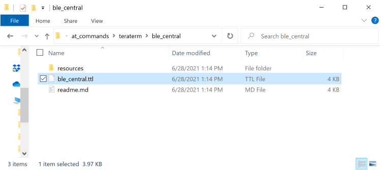

**STEP 4.** The script will perform the following command sequence: 

1. Opermode
2. Setlocalname
3. Get local address

**STEP 5.** After the "scan" command Tera Term will begin outputting advertising reports.

**STEP 6.** Advertise reports  come up with "Address" "RSSI" , "Adv data length" & "Adv data" .

**STEP 7.** Enter the address type user needs to enter the Address type(i.e. 0 - Public address and 1 - Random address)  as given below , we share here "Random Address".

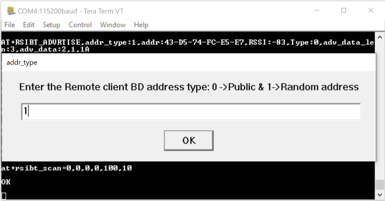

**STEP 8.** After address type selection user is prompted to enter the Remote BLE Device Address to connect to the Silabs BLE Central.

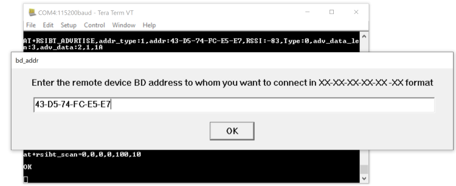

**STEP 9.** After entering the Remote BLE Device Address Silabs BLE Central device will initiate connection with the Remote BLE Device.

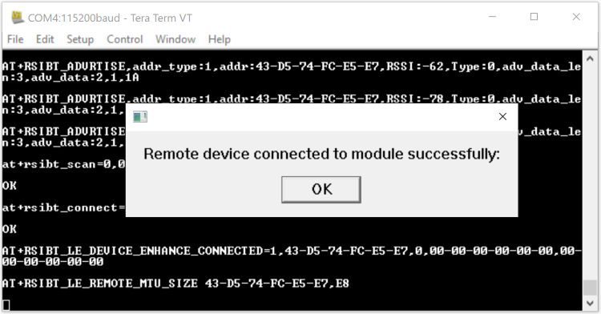

**STEP 10.** When Silabs BLE Central device is connected to the Remote device, the Silicon Labs BLE device will query the profiles  from the Remote device.

**STEP 11.** Next it will ask the input to enter the "Handle" to read the value on Remote device.

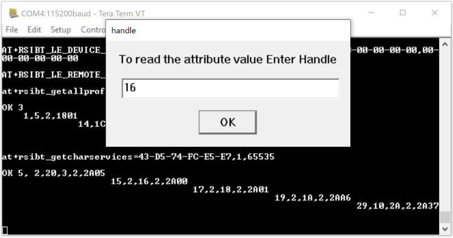

**STEP 12.** When we enter the "Handle" as input to read the value on Remote device, it will read the value.
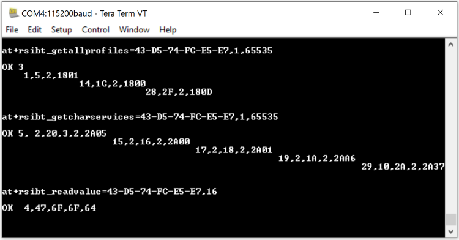

## Configuring Remote device as BLE Peripheral (Slave)

**STEP 1.** Open "EFR Connect" App in the Mobile device.

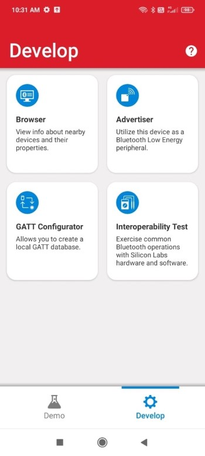

**STEP 2.** Go to the "GATT Configurator" to create the GATT server with services.

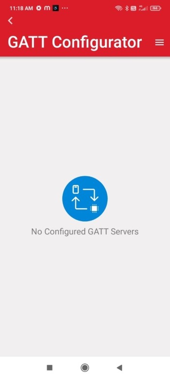

**STEP 3.** Create the GATT server and add services to that server.

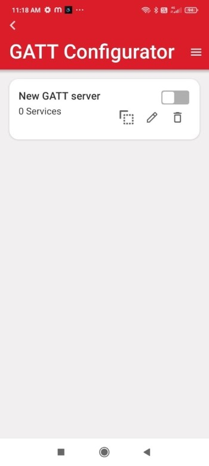

**STEP 4.** Click on the created Gatt Server and Add the services using the "Add Service" button.

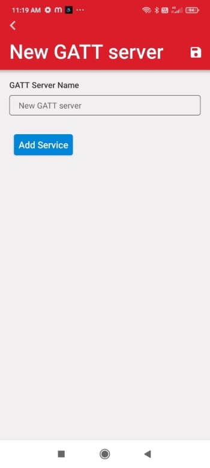

**STEP 5.** Once you click on the "Add service" button, we will get the window to add the service. Once you add the service, enable the "Add mandatory service requirements" and  save the configuration.

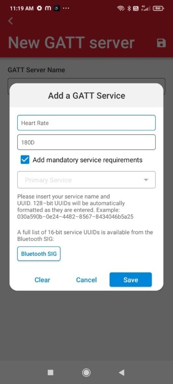

**STEP 6.** After saving the configuration, you can see the added service under the "GATT Server".

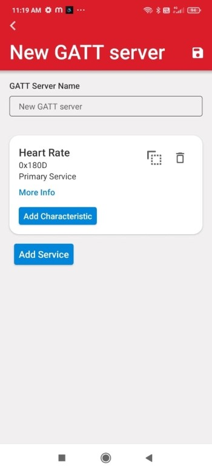

**STEP 7.** Now enable the created GATT server.

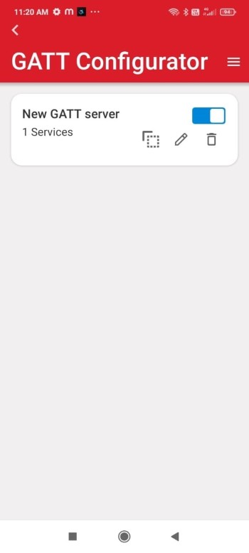

**STEP 8.** Come back to "home page" of EFR Connect app and open "Advertiser" and create the "Advertiser".

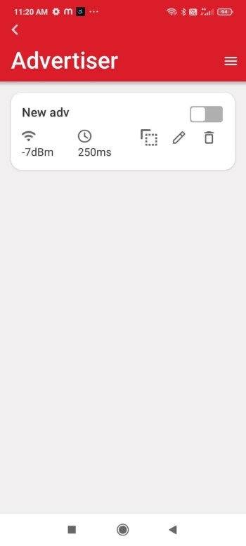

**STEP 9.** Open the created "Advertiser" add the required configuration, like "Addvertising Data", "Scan Response Data" etc, then save the configuration.

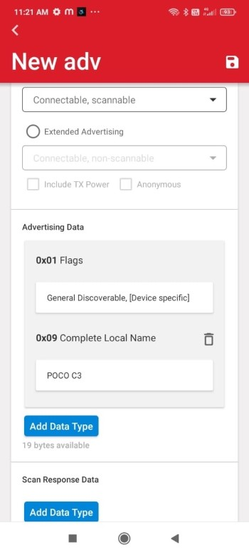

**STEP 10.** Click on the created "Advertiser" and see the added configuartion like "Advertising Type", "Flags" etc.

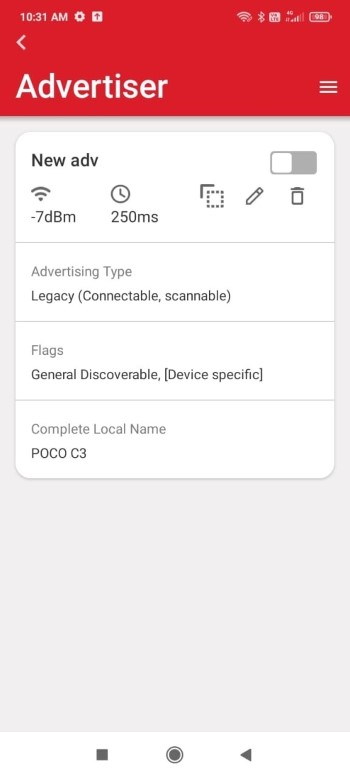

**STEP 11.** Now enable the created "Advertiser" to advertise the device, this device should now be visible to BLE scanners.

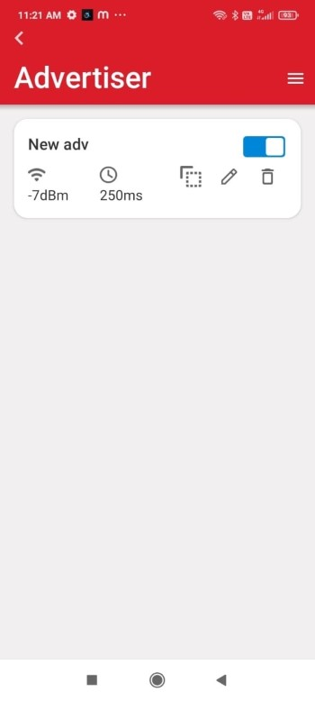