## BLE Heart Rate Profile Tera Term Script
This application demonstrates the BLE Heart Rate profile using the RS9116W via AT Commands over UART. The RS9116W is configured as a heart rate sensor; it sends notifications to a remote mobile device when (simulated) heart rate values change.

Before continuing, ensure the RS9116 EVK is plugged into your computer and Tera Term is connected as described in [Getting Started with PC using AT Commands](http://docs.silabs.com/rs9116-wiseconnect/latest/wifibt-wc-getting-started-with-pc/). 

**STEP 1.** Reset the RS9116 EVK.

**STEP 2.** In the Tera Term menu, select `Control->Macro`.
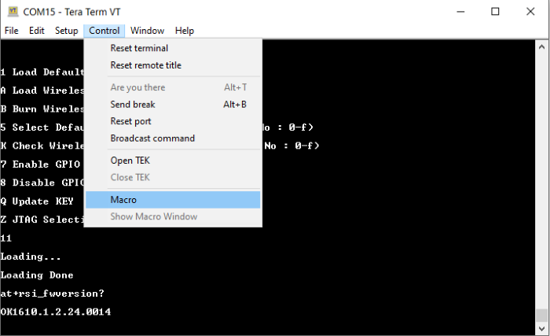
	
**STEP 3.** Navigate to the folder `<SDK>/examples/at_commands/teraterm` containing example scripts and select the file `ble_heart_rate_profile.ttl`.
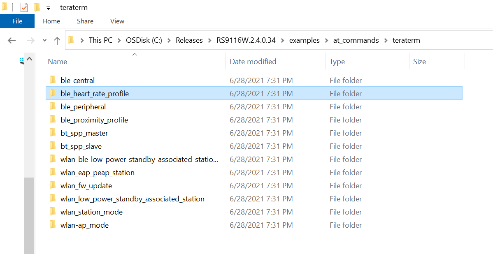

**STEP 4.** After running the `ble_heart_rate_profile.ttl` script, a pop-up shows. Select OK to continue.
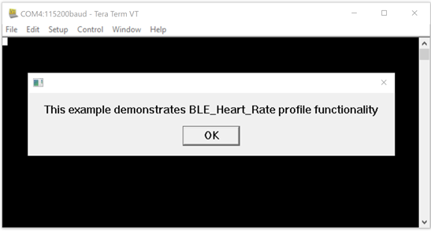

**STEP 5.** The autobaud process runs and shows a pop-up with the text 'Firmware Loading Done'. Select OK to continue.
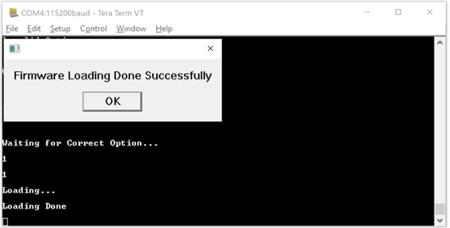
 	
**STEP 6.** The command sequence executes in turn, eventually putting the RS9116W into an advertising state.
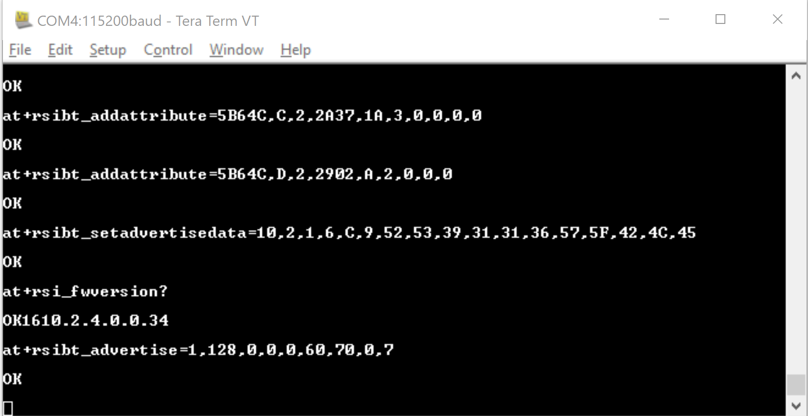

**STEP 7.**  Using a mobile app such as [Silabs EFR Connect](https://www.silabs.com/developers/efr-connect-mobile-app), scan for and connect to the RS9116W, see [Using EFR Connect](#using-efr-connect-on-a-mobile-device-with-rs9116-w). After connection, RS9116W fetches the app `MTU` and `LE data length update`.

**STEP 8.** After a successful connection, the script asks to enable notifications.
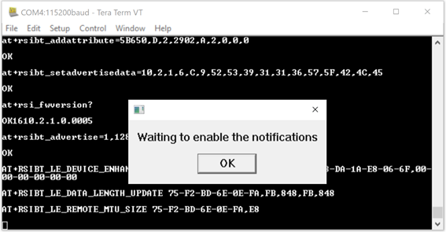

**STEP 9.** After notifications are enabled by EFR Connect, RS9116W sends data notifications 10 times and then asks to disable notifications.
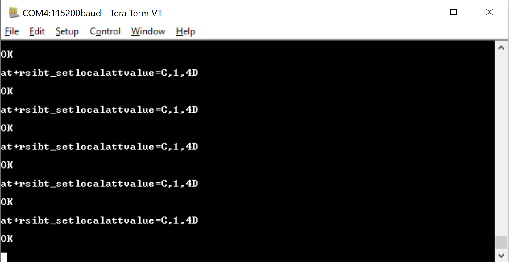

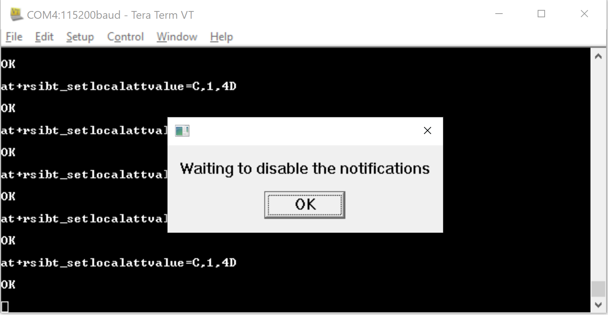

Steps 8 and 9 are repeated several times to demonstrate the notification process.

## Using EFR Connect on a Mobile Device with RS9116W

The [Silabs EFR Connect](https://www.silabs.com/developers/efr-connect-mobile-app) app can be used to connect to the RS9116W.

**STEP 1.** Open the 'EFR Connect' app, select 'Browser' and scan for the RS9116W device. 
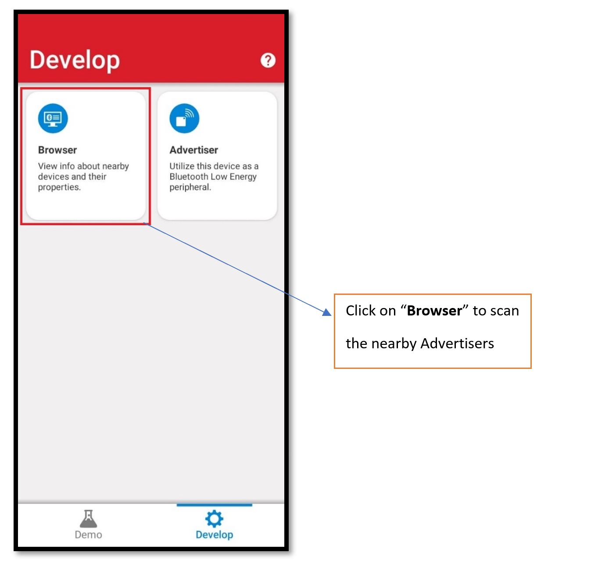

**STEP 2.** Select 'Connect' to connect with the RS9116W.
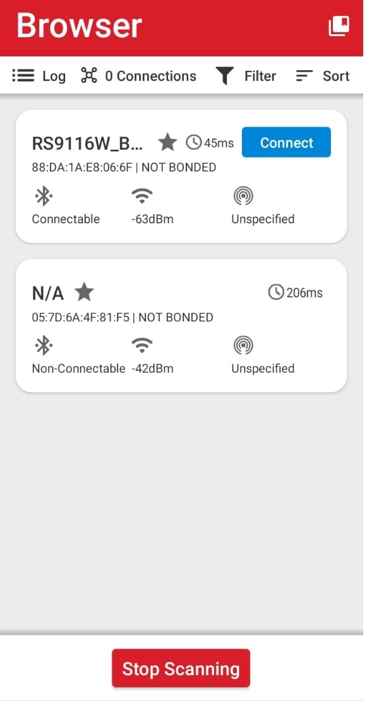

**STEP 3.** After connection is successful, a list of services shows including the Heart rate monitor service `0x180d`
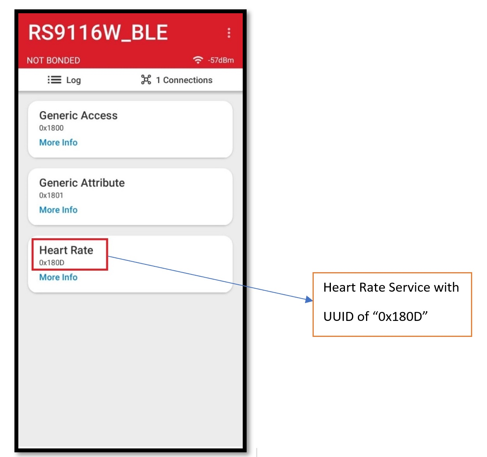

**STEP 4.** Select the heart rate monitor service to see the respective attribute and properties.
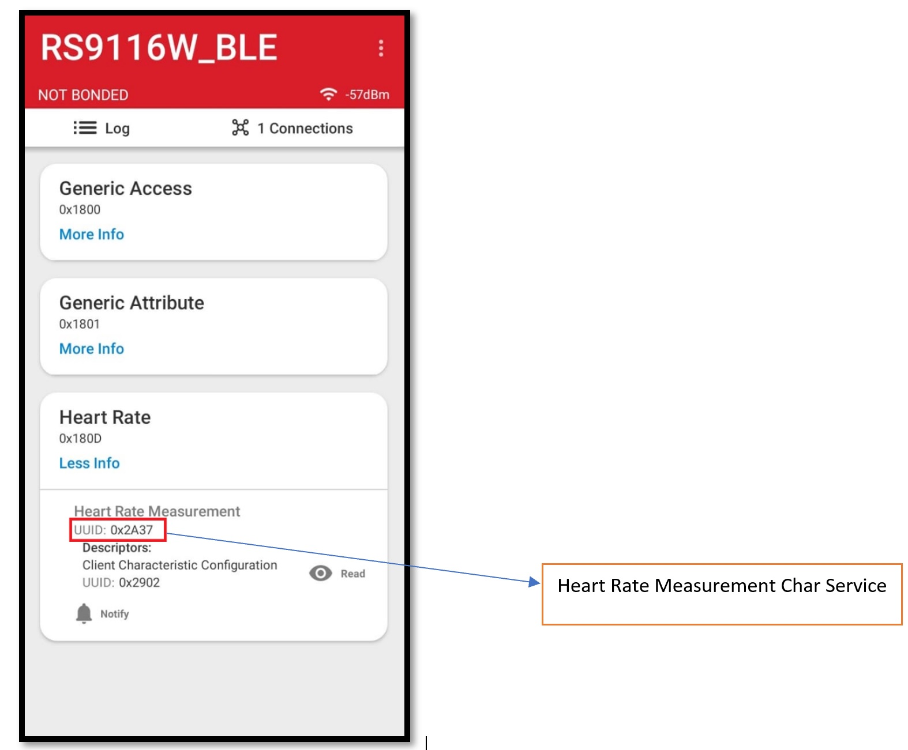

**STEP 5.** As noted in Step 8, the Tera Term script prompts to enable notifications after a successful connection. When notifications are enabled, the RS9116W sends the heart rate value.
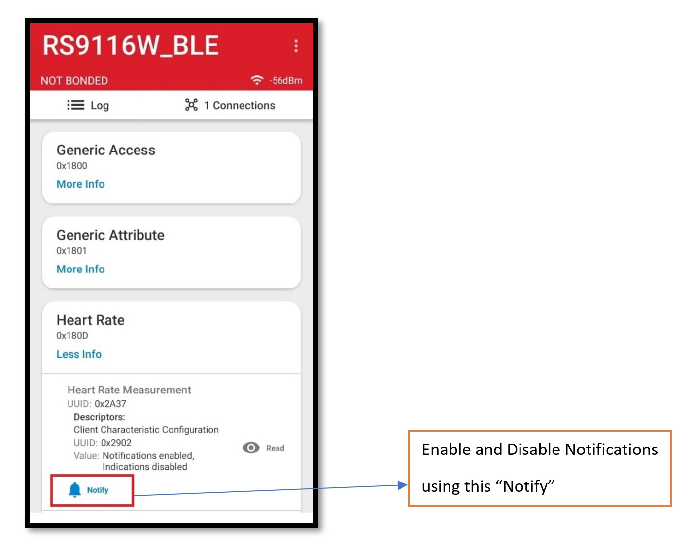