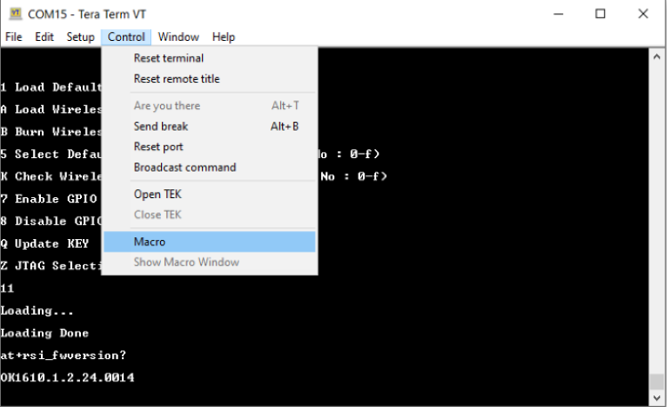
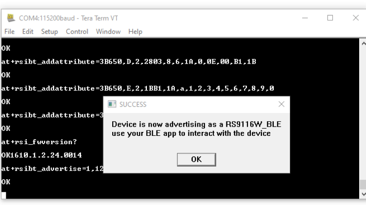
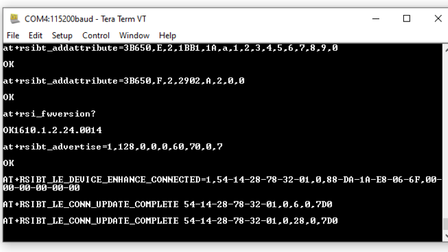

## BLE Peripheral Mode Tera Term Script
This application demonstrates how to configure the RS9116W Module in simple peripheral mode and how to get connected from the remote Central device.

Before continuing, ensure the RS9116 EVK is plugged into your computer and TeraTerm is connected as described in [Getting Started with PC using AT Commands](http://docs.silabs.com/rs9116-wiseconnect/2.4/wifibt-wc-getting-started-with-pc/). 

**STEP 1.** Reset the RS9116 EVK.

**STEP 2.** In the Tera Term menu select `Control->Macro`.

	
**STEP 3.** Navigate to the folder `<SDK>/examples/at_commands/teraterm/ble_peripheral` which contains the example script and select the file `ble_peripheral.ttl`.

**STEP 4.** To run this example, you will need the Silicon Labs 'EFR Connect' mobile BLE App available on the [App Store](https://apps.apple.com/us/app/efr-connect/id1030932759) for iOS, and on the [Google Play Store](https://play.google.com/store/apps/details?id=com.siliconlabs.bledemo) for Android.

**STEP 5.** Command sequence in this script:

1. Opermode
2. Set local name
3. Query local BD address
4. Set advertisement data
5. Add service
6. Add attribute
7. Add attribute
8. Add attribute
9. Query firmware version
10. Advertise

**Step 6.** After executing these commands, the Silabs device with the name "RS9116W_BLE" in Central device appears on the BLE App.

**Step 7.** When the Central device give the connect command, the RS9116 will receive Enhanced

**Step 8.** The connection update event is shown in the following text.

> AT+RSIBT_LE_DEVICE_ENHANCE_CONNECTED=1,6B-63-FE-FE-3D-FD,0,88-DA-1A-9E-81-55,00-00-00-00-00-00

**Step 9.** The data length update event may also appear as shown in teh following text.

> AT+RSIBT_LE_DATA_LENGTH_UPDATE 6B-63-FE-FE-3D-FD,7B,448,7B,448

**Step 10.** After this connection update events will come to the host.

`AT+RSIBT_LE_CONN_UPDATE_COMPLETE 6B-63-FE-FE-3D-FD,0,6,0,1F4`

`AT+RSIBT_LE_CONN_UPDATE_COMPLETE 6B-63-FE-FE-3D-FD,0,24,0,1F4`

**Step 11.** Once these events come it means Silabs module got connected to the Central device.

**Step 12.** Central can send the data to the Silabs module. And a host will get the event like below.

`AT+RSIBT_WRITE,6B-63-FE-FE-3D-FD,E,6,31,32,33,34,35,36`

Note: Here in this example we have added Service as a Device Information `0x180A` and attribute as a custom characteristic attribute `0x1AA1`. Users can change the services as well as attributes as per requirement. 

Refer to the [BLE Programming Reference Manual](docs.silabs.com/rs9116-wiseconnect/latest/wifibt-wc-programming-reference-manuals/) for further details on how to change the parameters.
