## BLE Proximity Profile Tera Term Script
This application demonstrates how to use the RS9116W BLE proximity profile with AT commands over UART. A mobile device running the [Silabs EFR Connect app](https://www.silabs.com/developers/efr-connect-mobile-app) is required for the demonstration.

Before continuing, ensure the RS9116 EVK is plugged into your computer and Tera Term is connected as described in [Getting Started with PC using AT Commands](http://docs.silabs.com/rs9116-wiseconnect/latest/wifibt-wc-getting-started-with-pc/). 

**STEP 1.** Reset the RS9116 EVK.

**STEP 2.** In the Tera Term menu, select `Control->Macro`.

	
**STEP 3.** Navigate to the folder `<SDK>/examples/at_commands/teraterm` containing example scripts and select the file `ble_proximity_profile.ttl`.

**STEP 4.** After running the `ble_proximity_profile.ttl` script, a pop-up appears. Select OK to continue.
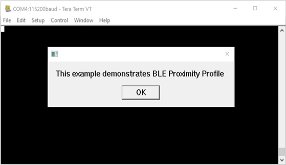

**STEP 5.** The autobaud process runs and shows a pop-up with the text "Firmware Loading Done". Select OK to continue.

**STEP 6.** The command sequence executes in turn, eventually putting the RS9116W into an advertising state.
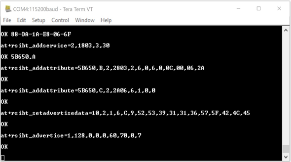

**STEP 7.** Using the [Silabs EFR Connect](#using-the-efr-connect-app) app, scan for and connect to the RS9116W
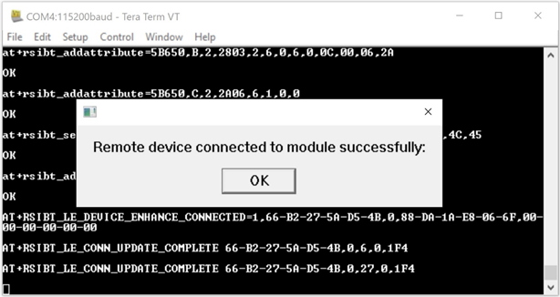

**STEP 8.** After a successful connection, the script waits for the 'Alert Level' to be set by the EFR Connect app. The alert level is used for proximity alert indication.
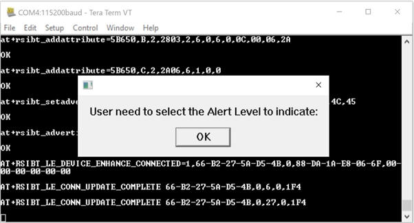

**STEP 9.** Using the EFR Connect app, the alert level can be set to: no alert, mild alert, or high alert. See [Using the EFR Connect App](#using-the-efr-connect-app).

**STEP 10.** After the alert level is set, the script runs in a loop. If the RS9116W moves too far from the mobile device running the EFR Connect app, an alert shows. The RSSI threshold configured in the script is `-60 dBm`. In the following example, the RSSI is `-52` which is higher than the threshold. In this case, the alert shows as `0x00` which means no alert.
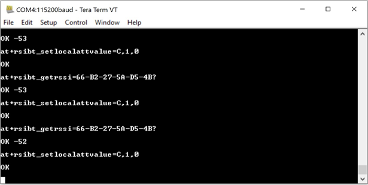

**STEP 11.** In the following example, the RSSI is `-62` which is lower than the threshold. In this case, the alert shows as `0x01` causing a mild alert to be generated.
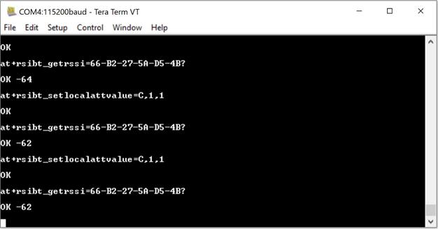

## Using the EFR Connect App
The [Silabs EFR Connect](https://www.silabs.com/developers/efr-connect-mobile-app) mobile app can be used to connect to the RS9116W.

**STEP 1.**  Open the 'EFR Connect' app, select 'Browser' and scan for the RS9116W device.

**STEP 2.** Select 'Connect' to connect with the RS9116W.

**STEP 3.**  Select the 'Link Loss' service. 
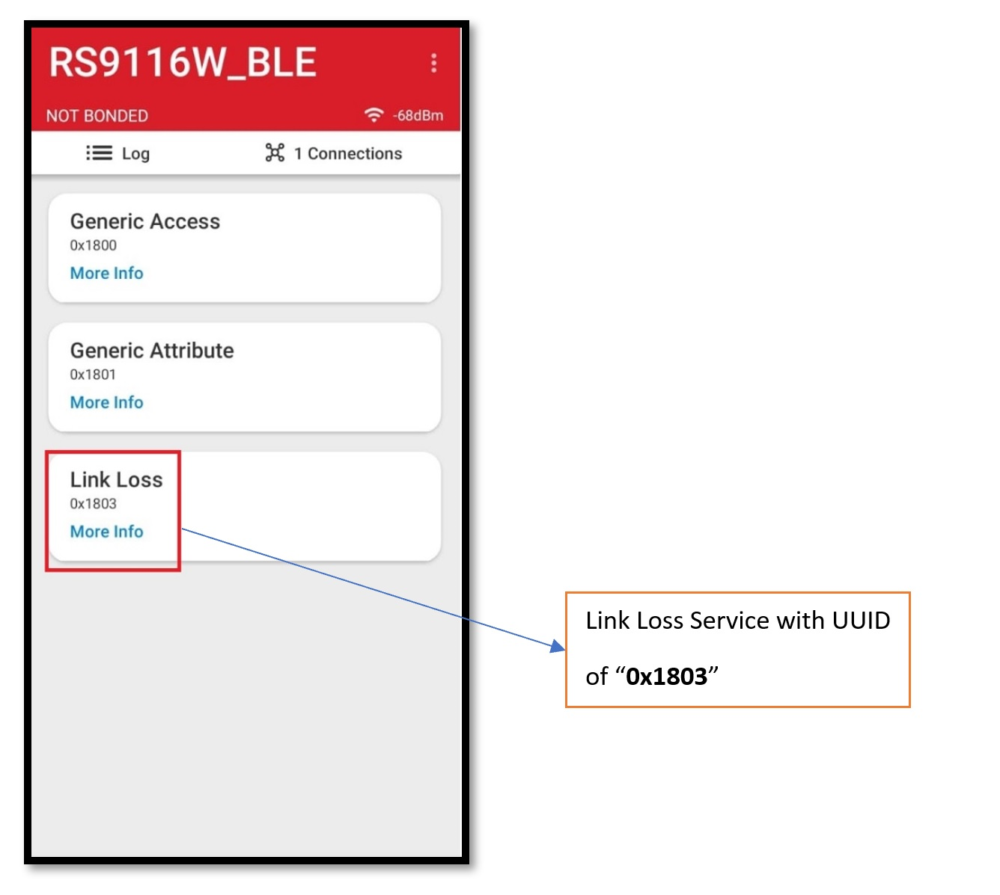

**STEP 4.** The 'Alert Level' characteristic shows.
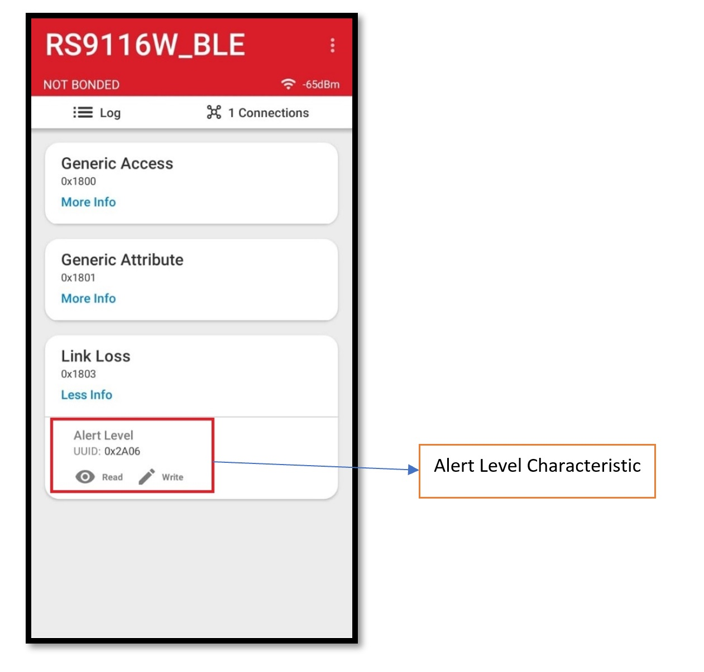

**STEP 5.** Select the desired alert level.
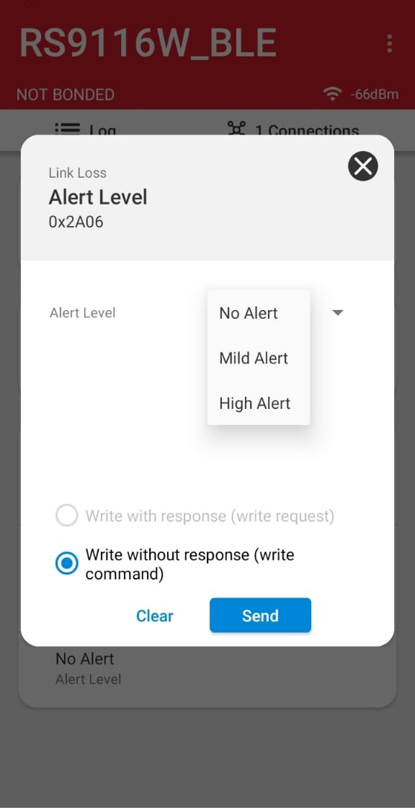

**STEP 6.**  In this example, a mild alert is selected.
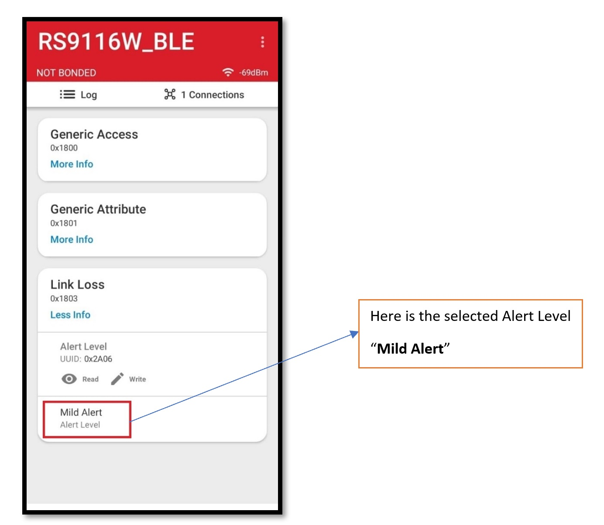

**STEP 7.**  As the RSSI increases and decreases, the alert level changes to indicate whether the distance between the RS9116W and mobile device running the EFR Connect app is exceeded.
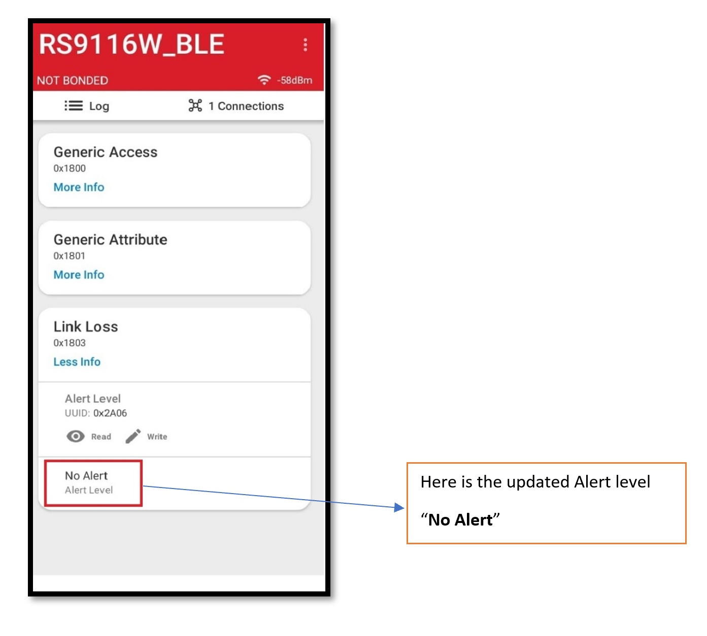