## BT SPP Master Tera Term Script
This example demonstrates how to configure the RS9116W in BT SPP Master mode to establish a SPP profile connection with a remote mobile device. Once connected, data can be exchanged between the two BT devices over SPP. This example uses an Android mobile device running a Bluetooth SPP Manager app. An example [Bluetooth SPP Manager App](https://play.google.com/store/apps/details?id=at.rtcmanager) is available from the Google Play store. To learn how to use the app, see [Using the Bluetooth SPP Manager App](#using-the-bluetooth-spp-manager-app). 

Before continuing, ensure the RS9116 EVK is plugged into your computer and Tera Term is connected as described in [Getting Started with PC using AT Commands](http://docs.silabs.com/rs9116-wiseconnect/latest/wifibt-wc-getting-started-with-pc/). 

**STEP 1.** Reset the RS9116 EVK.

**STEP 2.** In the Tera Term menu, select `Control->Macro`.

	
**STEP 3.** Navigate to the folder `<SDK>/examples/at_commands/teraterm/bt_spp_master` and select the file `spp_master.ttl`.
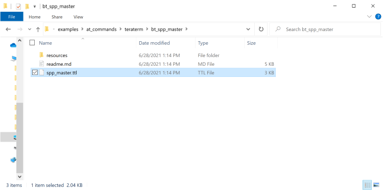

At startup, the RS9116W is configured using the following commands:
  1. Opermode
  2. Set connectable mode
  3. Set discoverable mode
  4. Set profile mode
  5. Set local name

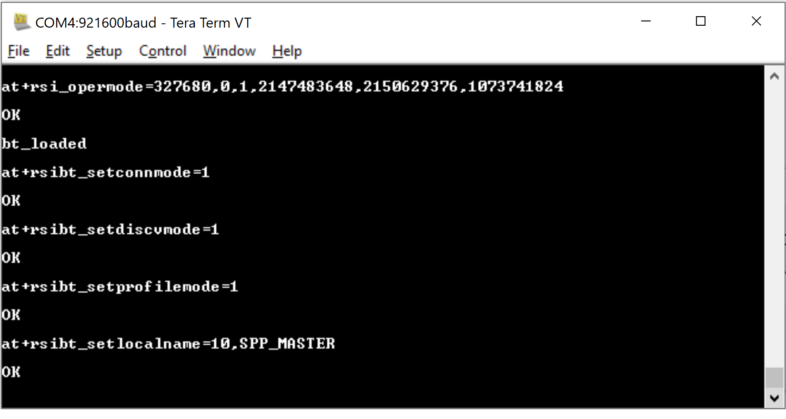

**STEP 4.** Configure the mobile device as a Bluetooth SPP slave, refer to the [Bluetooth SPP Manager App](https://play.google.com/store/apps/details?id=at.rtcmanager) documentation.

**STEP 5.** Ensure the mobile device is in connectable mode, then enter the BD address of the mobile device in the format `AA-BB-CC-DD-EE-FF`.
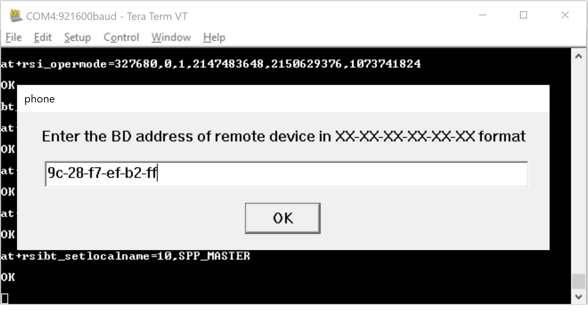

Note that the mobile BD address is available from the device settings page which is typically at:
  - `Settings -> About phone -> All spec -> Status -> Bluetooth Address`
  - `Settings -> About phone -> Status -> Bluetooth Address`
  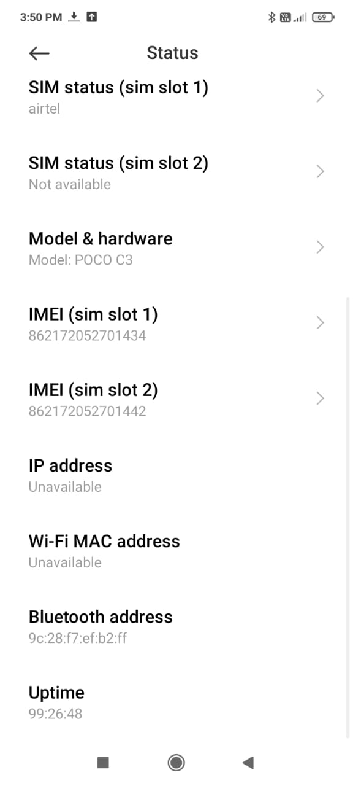

**STEP 6.** After the 'bond response' and 'link key' request event appears in Tera Term, a popup appears. Choose the 'User link key response' then select OK.
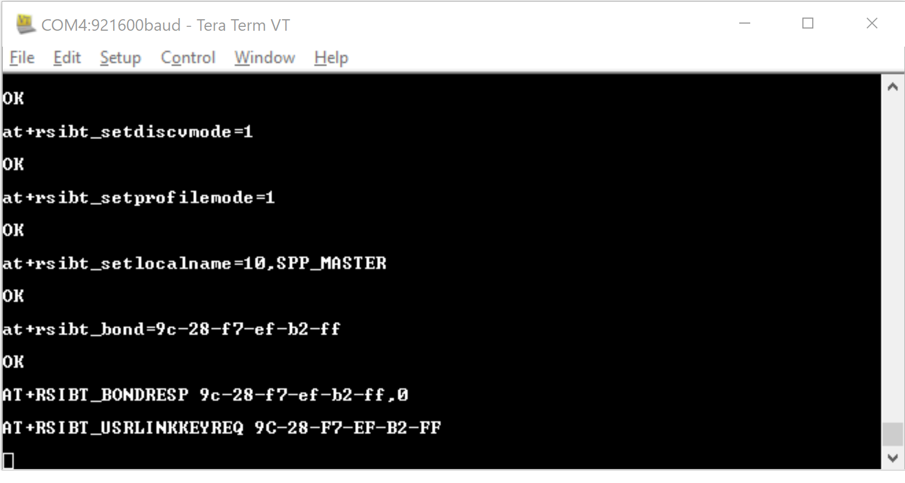
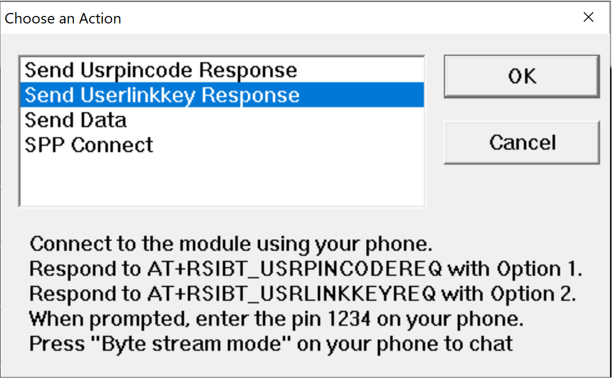

**STEP 7.** On the mobile app, enter the pin code `1234`

**STEP 8** After the 'pin code request' event appears in Tera Term, a popup appears. Choose the 'User pin code response' then select OK.
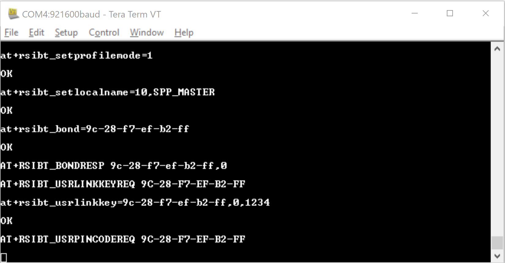
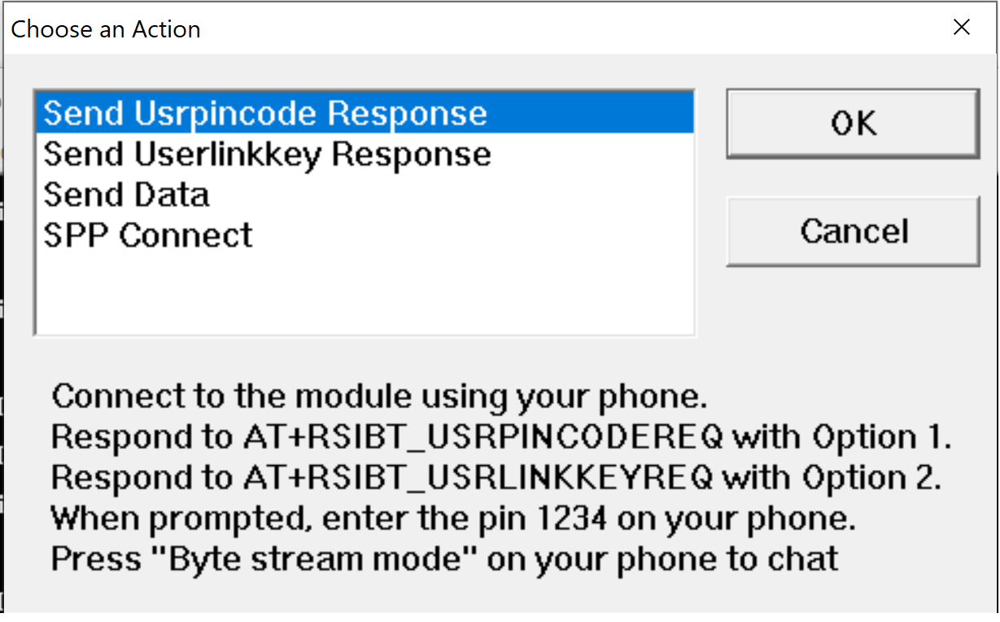

The mobile app is now paired with the RS9116W.

**STEP 9** In the Tera Term popup, choose the 'SPP Connect' command' The `AT+RSIBT_SPPCONNECTED` event appears in the Term Term window to indicate that the SPP connection was successful. Data can now be sent between the RS9116W and the mobile app.
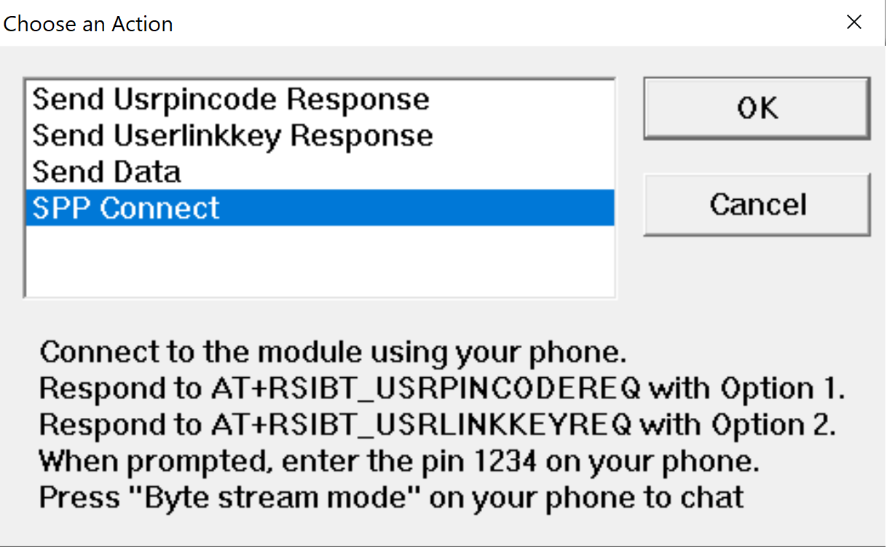
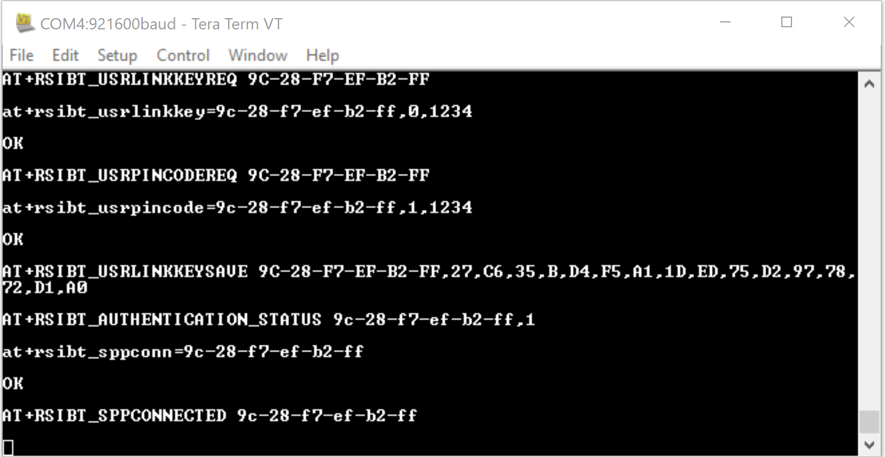

**STEP 10.** In the Tera Term popup, choose the 'Send Data' option to send characters from the RS9116W to the mobile app, then select OK. 
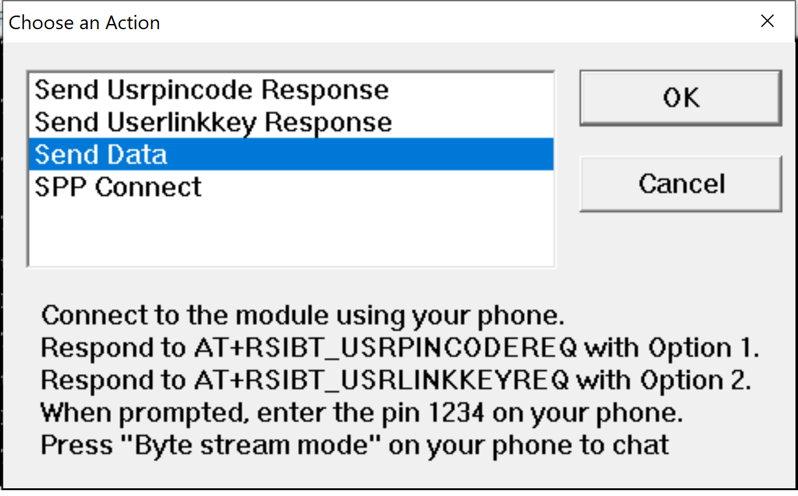
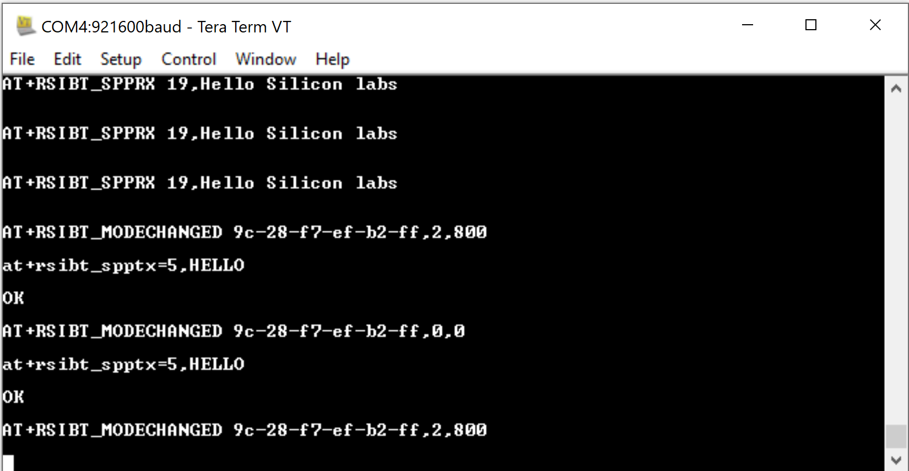

The characters sent by the RS9116W are displayed on the mobile app. 
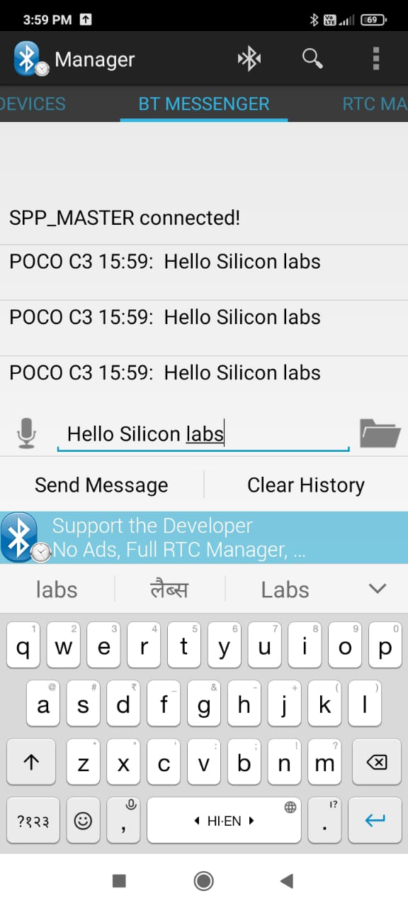
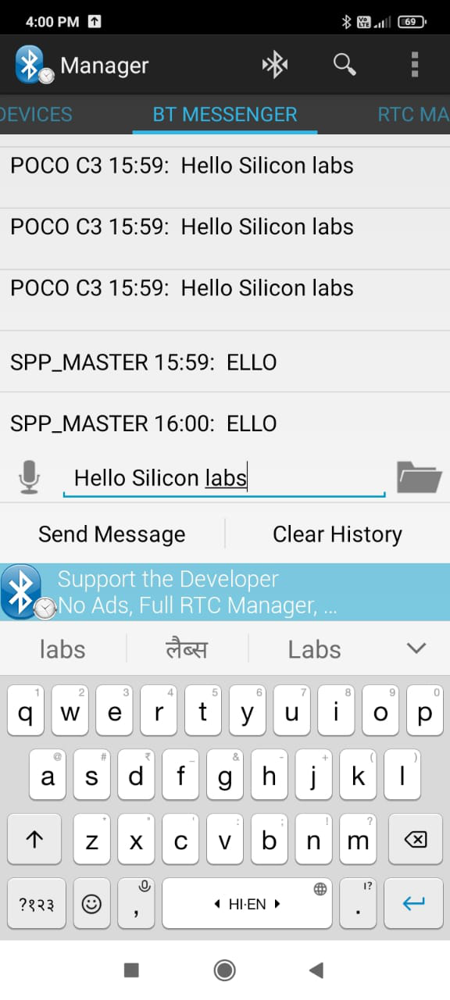

### Transmit and Receive Event Sequence

| Transmit Events                                |   | Receive Events                                |
| ---------------------------------------------- | - | ---------------------------------------- |
|                                                | ← | `AT+RSIBT_USRLINKKEYREQ C0-EE-FB-DA-49-7C` |
| `at+rsibt_usrlinkkey=C0-EE-FB-DA-49-7C,0,1234` | → |                                          |
|                                                | ← | `AT+RSIBT_USRPINCODEREQ C0-EE-FB-DA-49-7C` |
| `at+rsibt_usrpincode=C0-EE-FB-DA-49-7C,1,1234` | → |                                          |
|                                                | ← | `AT+RSIBT_USRLINKKEYSAVE C0-EE-FB-DA-49-7C,B2,6C,91,49,D7,27,60,82,68,2,78,2,60,78,F8,AE` |
|                                                | ← | `AT+RSIBT_AUTHENTICATION_STATUS C0-EE-FB-DA-49-7C,1` |
| `at+rsibt_sppconn=C0-EE-FB-DA-49-7C`           | → |                                          |
|                                                | ← | `AT+RSIBT_SPPCONNECTED C0-EE-FB-DA-49-7C`  |
| `at+rsibt_spptx=5,HELLO`                       | → |                                          |
|                                                | ← | `AT+RSIBT_SPPRX 1,1`                       |

## Using the Bluetooth SPP Manager App

**STEP 1.** Using your Android phone, turn on Bluetooth then open the `Bluetooth SPP Manager` app.
 
**STEP 2.** Select the menu option in the top-right corner of the app (three vertical dots) to open the menu.
 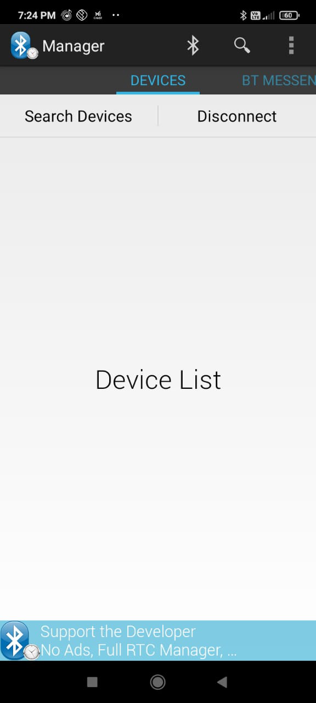

**STEP 3.** Select the 'Set Device Discoverable' option.
 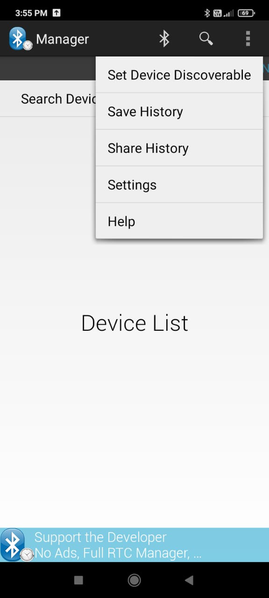
 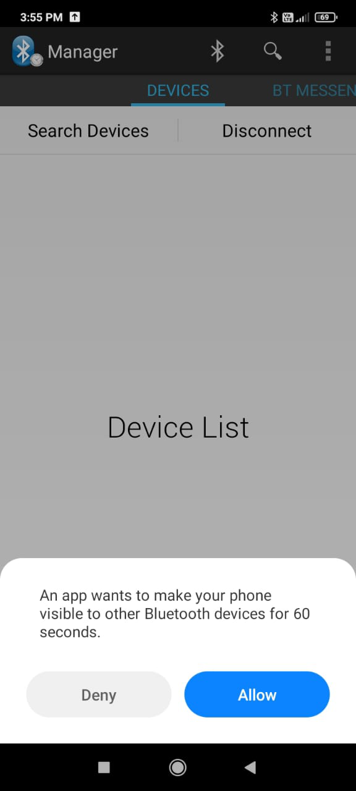
 
**STEP 4.** After the mobile app connects successfully with the RS9116W, data transfer occurs.
 
 
 