## BT SPP Slave Tera Term Script
This example demonstrates how to configure the RS9116W in Bluetooth SPP Slave mode to establish a SPP profile connection with a remote mobile device. Once connected, data can be exchanged between the two BT devices over SPP. This example uses an Android mobile device running a Bluetooth SPP Manager app. An example [Bluetooth SPP Manager App](https://play.google.com/store/apps/details?id=at.rtcmanager) is avalable from the Google Play store.

Before continuing, ensure the RS9116W is plugged into your computer and Tera Term is connected as described in [Getting Started with PC using AT Commands](http://docs.silabs.com/rs9116-wiseconnect/latest/wifibt-wc-getting-started-with-pc/). 

**STEP 1.** Reset the RS9116W EVK.

**STEP 2.** In the Tera Term menu, select `Control->Macro`.
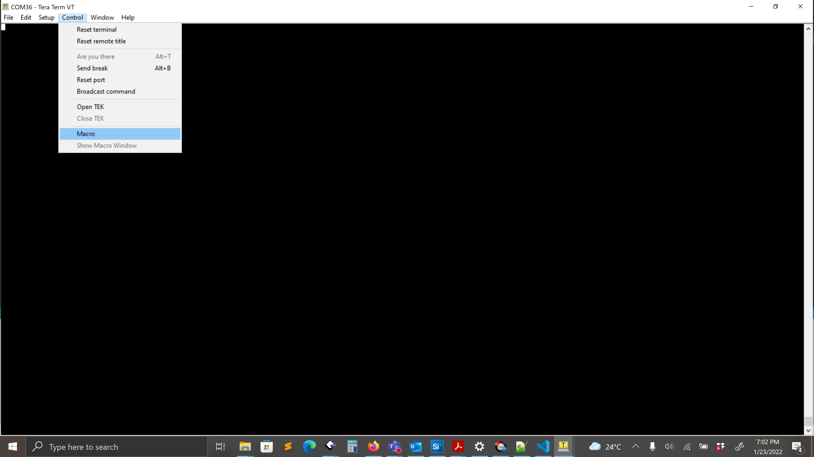

**STEP 3.** Navigate to the folder `<SDK>/examples/at_commands/teraterm/bt_spp_slave` and select the file `spp_slave.ttl`.
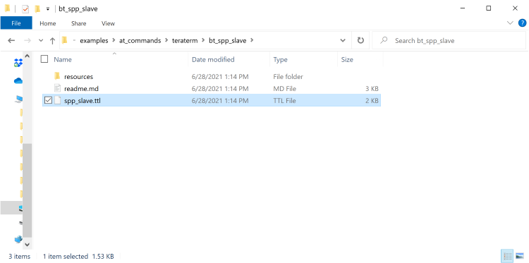

At startup, the RS9116W is configured using the following commands:
1. Opermode
2. Set connectable mode
3. Set discoverable mode
4. Set profile mode
5. Set local name

**STEP 4.** When complete, the RS9116W is discoverable by nearby bluetooth devices. Select OK to continue.
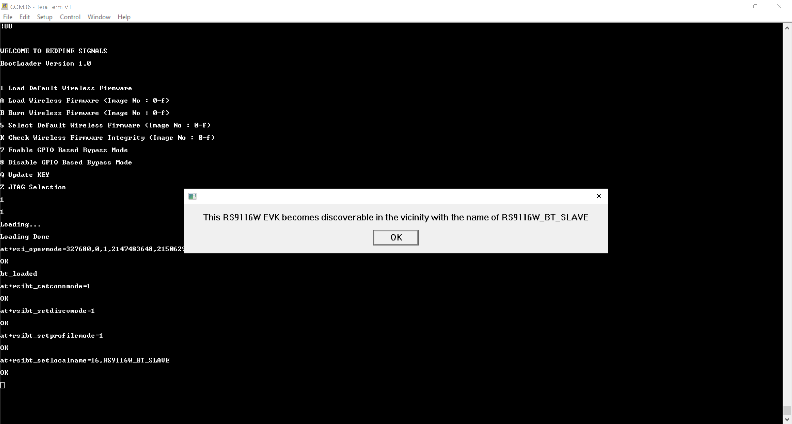

## Connecting RS9116W with an Android mobile via Bluetooth
There are two steps required to connect the RS9116W to a mobile device via Bluetooth using the SPP profile. Firstly, a Bluetooth connection is established, then a SPP connection over Bluetooth is established. These steps are explained in turn in the following sections.

## Establishing a Bluetooth Connection
**STEP 1.** On the mobile, find the settings page and enable Bluetooth. 

**STEP 2.** Scan for nearby Bluetooth devices, the RS9116W appears as `RS9116W_BT_SLAVE`. Select the `RS9116W_BT_SLAVE` to establish a Bluetooth connection with the RS9116W.
 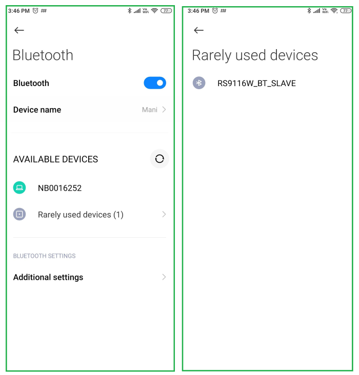
 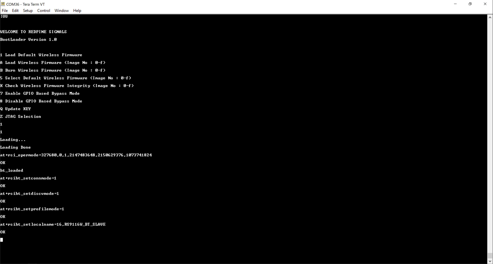

**STEP 3.** When prompted, enter the PIN `1234` as shown in the following example.

 
After entering the PIN, the RS9116W receives a `AT+RSIBT_USRPINCODEREQ` event as shown on the Tera Term console in the following example.
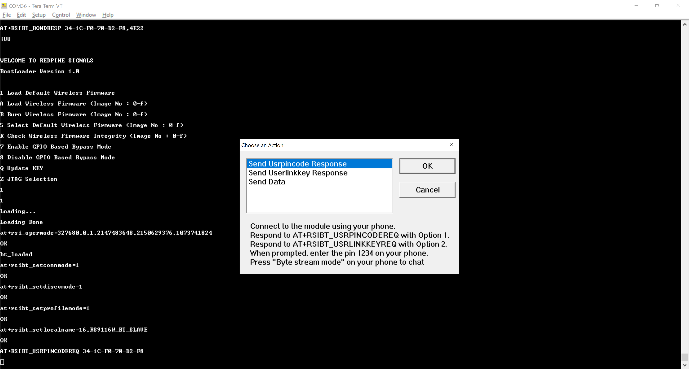
 
**STEP 4.** When the RS9116W receives the `AT+RSIBT_USRPINCODEREQ` event, a Tera Term pop-up appears. Choose the 'Send User Pincode' response and select OK to establish a Bluetooth link between the RS9116W and the mobile.
 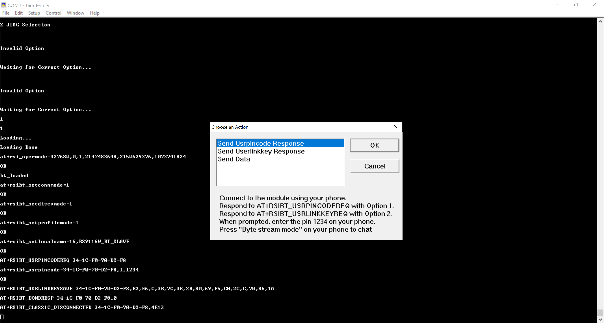
 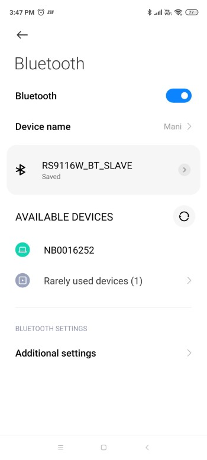

## Establishing a SPP Connection
**STEP 1.** Open the Bluetooth SPP Manager mobile app and scan for nearby devices. Choose the `RS9116W_BT_SLAVE` and select 'Pair'.
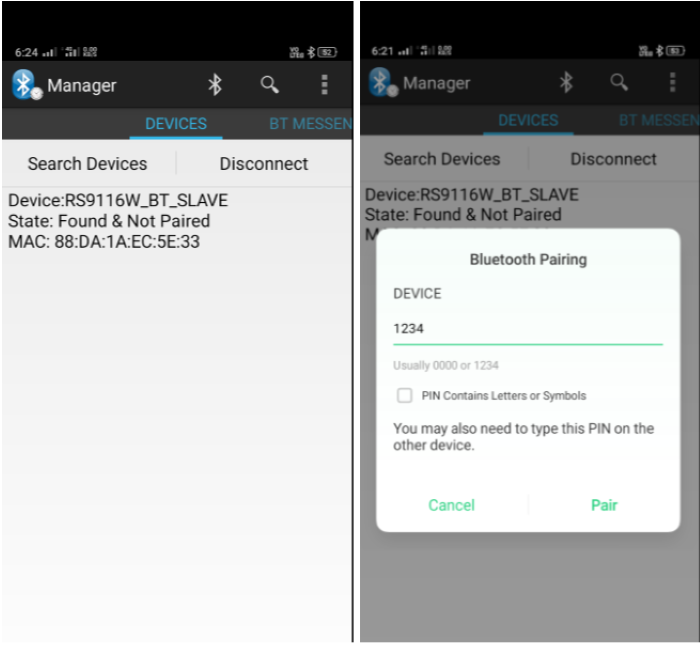

**STEP 2.** On the pop-up, choose the appropriate response according to the notification received in the Tera Term console as follows.

| Tera Term console event received | Pop-up Response |
| ------------------------ | --------------- |
| `RSIBT_USRLINKKEYREQ`    | Send User Link Key |
| `RSIBT_USRPINCODEREQ`    | Send User PIN Code |

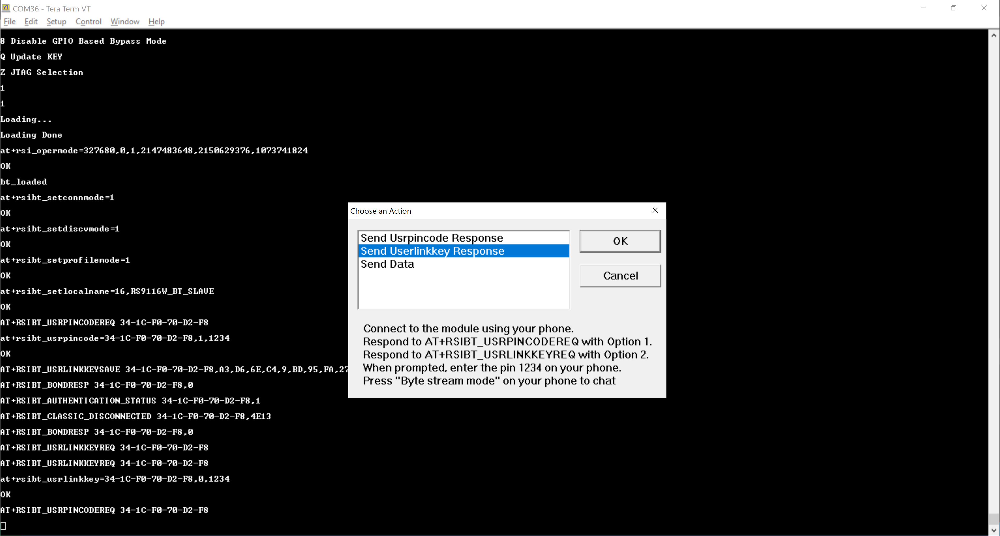
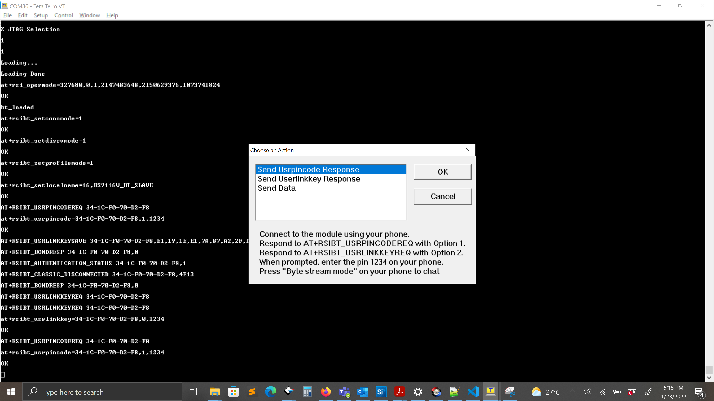

After the pairing process completes, the RS9116W receives a link key save event and the SPP connection is automatically initiated from the mobile with the 'Bluetooth SPP Manager' app. 
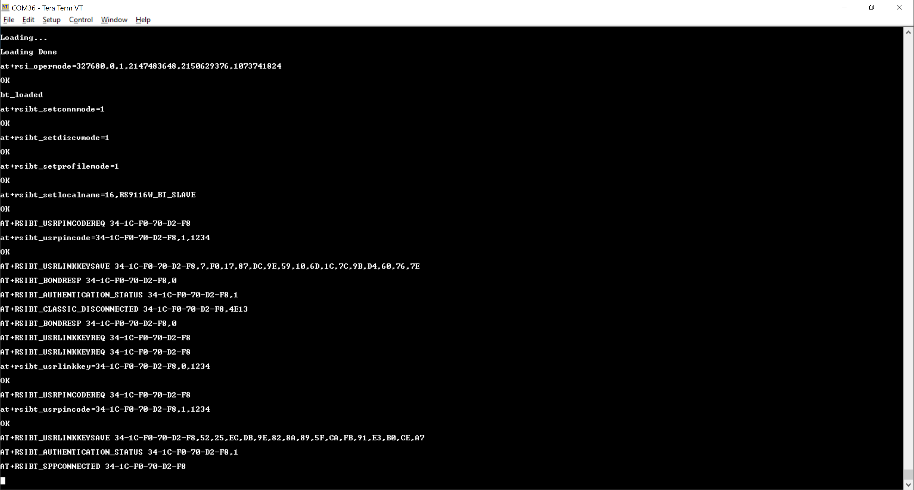

The RS9116W sends a `AT+RSI_SPPCONNECTED` event to Tera Term to indicate the connection is established and data can be sent across the link.

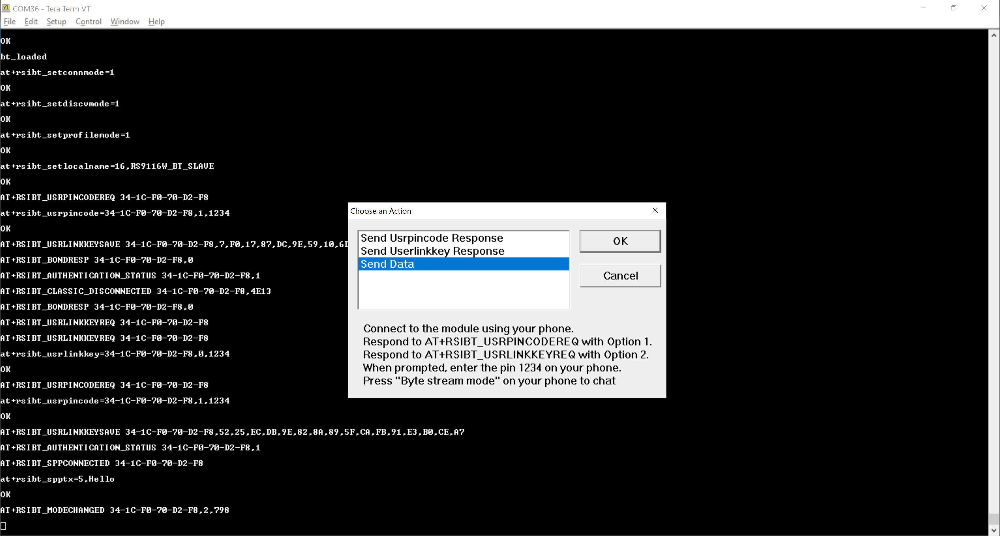
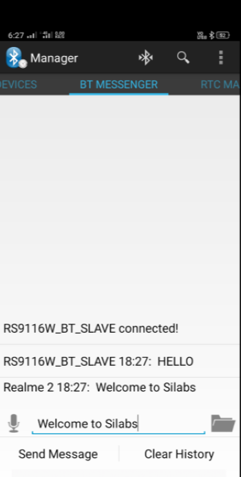
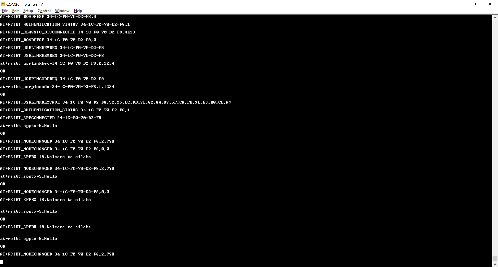

When the mobile disconnects the Bluetooth link, the RS9116W receives a disconnect event as `AT+RSIBT_CLASSIC_DISCONNECTED`.
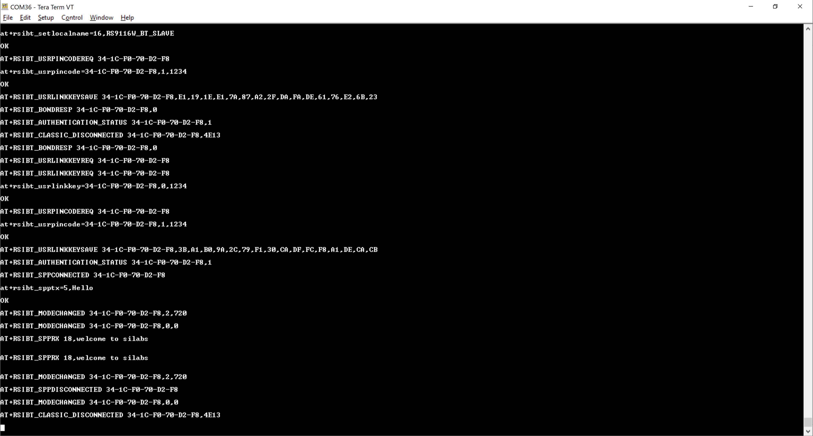

## Transmit and Receive Event Sequence

| TX Events                                      |   | RX Events                                  |
| ---------------------------------------------- | - | ------------------------------------------ |
|                                                | ← |  `AT+RSIBT_USRLINKKEYREQ 34-1C-F0-70-D2-F8`|
| `at+rsibt_usrlinkkey=34-1C-F0-70-D2-F8,0,1234` | → |                                            |
|                                                | ← | `AT+RSIBT_USRPINCODEREQ 34-1C-F0-70-D2-F8` |
| `at+rsibt_usrpincode=34-1C-F0-70-D2-F8,1,1234` | → |                                            |
|                                                | ← | `AT+RSIBT_USRLINKKEYSAVE 34-1C-F0-70-D2-F8,52,25,EC,DB,9E,82,8A,89,5F,CA,FB,91,E3,B0,CE,A7` |
|                                                | ← | `AT+RSIBT_AUTHENTICATION_STATUS 34-1C-F0-70-D2-F8,1` |
|                                                | ← | `AT+RSIBT_SPPCONNECTED 34-1C-F0-70-D2-F8`  |
| `at+rsibt_spptx=5,Hello`                       | → |                                            |
|                                                | ← | `AT+RSIBT_SPPRX 18,Welcome to silabs`      |