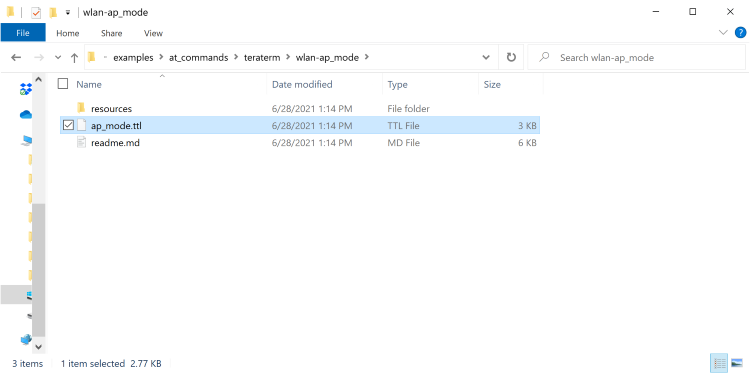
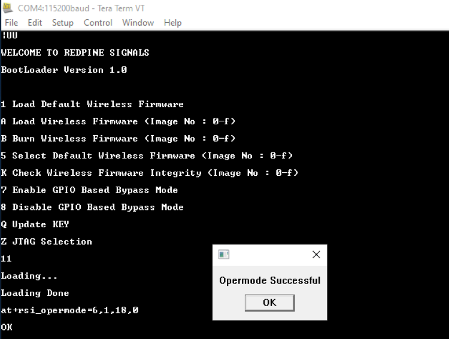
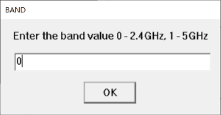
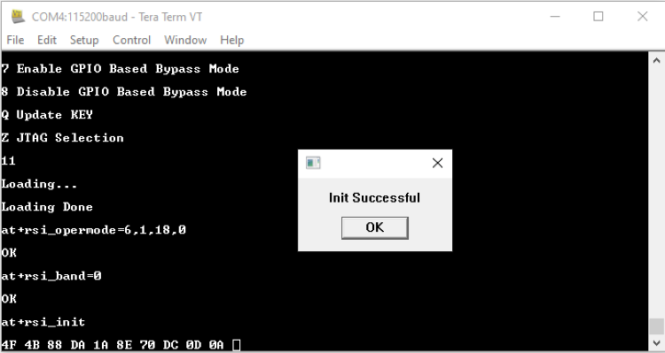
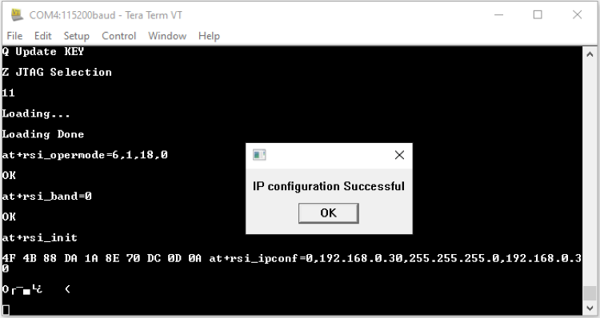
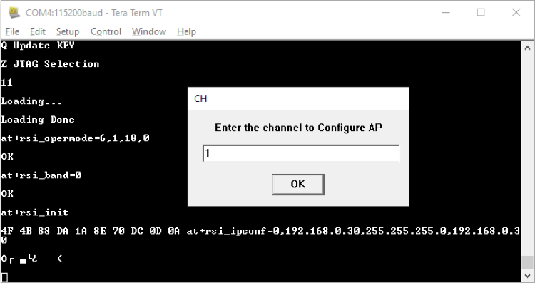
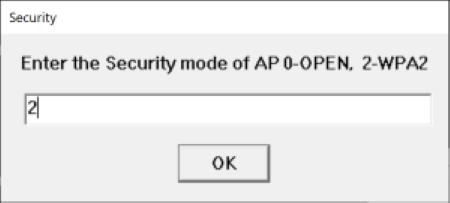
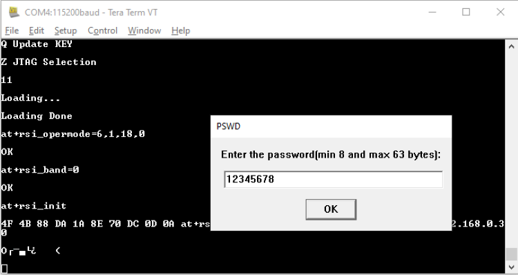
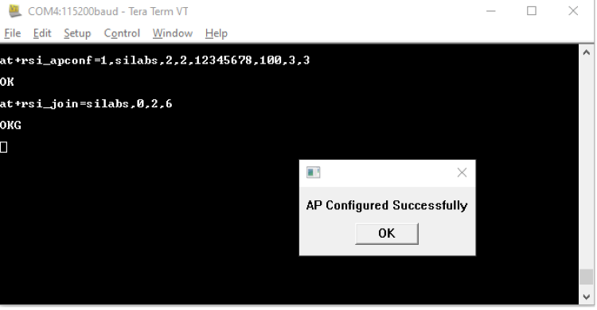
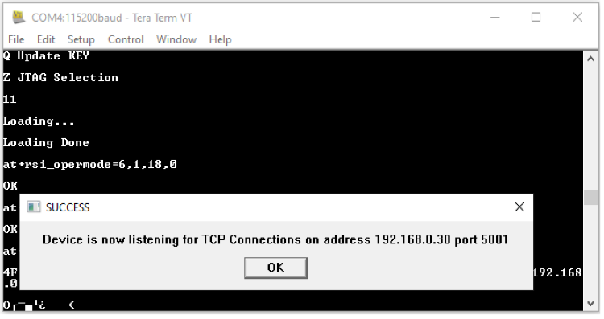

## Access Point Mode Tera Term script
This application configures an RS9116W device into Access Point mode and runs a DHCP server. This would allow Wi-Fi stations to connect to this AP and exchange data with other devices on that network.

Before continuing, ensure the RS9116 EVK is plugged into your computer and TeraTerm is connectedas described in [Getting Started with PC using AT Commands](http://docs.silabs.com/rs9116-wiseconnect/2.4/wifibt-wc-getting-started-with-pc/). 

**STEP 1.** Reset the RS9116 EVK.

**STEP 2.** In the Tera Term menu select control-> Macro .

**STEP 3.** Navigate to the folder `./RS9116W.x.x.xx/examples/at_commands/teraterm/wlan_ap_mode`  and select the file `ap_mode.ttl`.

**STEP 4.** Opermode command 

`at+rsi_opermode=6,1,18,0`
 

 This configures the EVB to function in AP mode. The module responds with “OK".

**STEP 5.** Tera Term gives a pop up for input (Band- 2.4 GHz or 5GHz) from the user, user needs to enter the band value(0) and hit 'ok',`at+rsi_band=0`)This configures the operating band 2.4 GHz.The module responds with "ok".

**STEP 6.** `at+rsi_init` command initializes the RF of the module. The module responds with ok<MAC_Address>.

**STEP 7.** Module configures to default subnet and gateway unless user sets his own. If a user wants to configure than ipconfig command has to be issued here. e.g.

`at_rsi_ipconfig=0,192.168.0.30,255.255.255.255.0,192.168.0.30`
 

This command configures the IP (192.168.0.30 in this example) of the AP. The module responds with "ok".

**STEP 8.** Tera term will pop up for input(operating channel) from user the user, user can enter any value between 1 to 11 e.g enter the channe(1)and hit 'OK' as shown:

**STEP 9.** Tera Term will now pop up to take input for SSID of the AP which user wants to set.(e.g silabs)and hit 'OK':

**STEP 10.** The next pop up is for input of security mode from the user,user needs to enter the security mode(2) and hit 'OK'

0 - Open Security 

2 - WPA2 PSK Security.

**STEP 11.** Tera Term will pop up for input(PSK of the AP)from the user, the user needs to enter the PSK(e.g. 12345678) and hit 'OK'.

**STEP 12.** The command will go as at+rsi_apconfig=1,silabs,2,2,12345678,100,3,3"The SSId is configured as "silabs" operate in channel 1 and the WPA2 PSK set is "12345678"

**STEP 13.** The next command will go as `at+rsi_join=silabs,0,2,6`.  This starts the Access point functionality in the module. The module is now configured as an access point. Its IP address is 192.168.0.30.
            
 A remote peer can now scan for networks and the SSID of module, "Silabs" will be displayed in the remote peer's list of scanned APs.  After the remote per connects to the AP, it acquires an IP address over DHCP.

**STEP 14.** It will open a TCP Server socket on the Wi-Fi client(EVB) side using the AT command `at+rsi_ltcp=5001`.

The module's response will look as follows:
`OK<ip_version><Socket_type><socket_handle><Lport><module_ipaddr>`

The pop up window will display "Device is now listening for TCP connections on address 192.168.0.30 and port 5001".

**STEP 15.** Open a TCP client socket on the remote peer(e.g.mobile or PC running iperf or any third-Party application) and connect to server socket by giving server IP and port number.

**STEP 16.** Observe that Teraterm on the Wi-Fi Client-side(EVB) prints the follwing message once the TCP connection is set up with the remote peer:

`AT+RSI_LTCP_CONNECT=<ip_version><socket_descriptor><dest_port_no><dest_ipaddr><mss><window_size><src_port_no>`

Note that the data received might have some unreadable characters because of ASCII conversion.

**STEP 17.** When the data is recived on the Wi-Fi client(EVB) side,you will see an asychronous response from the module as follows:

