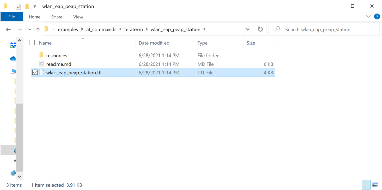
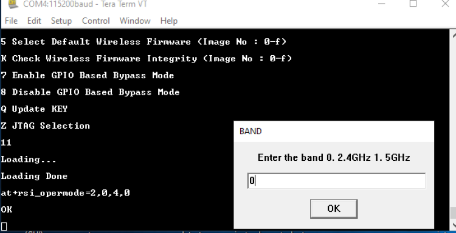
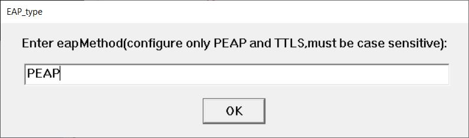
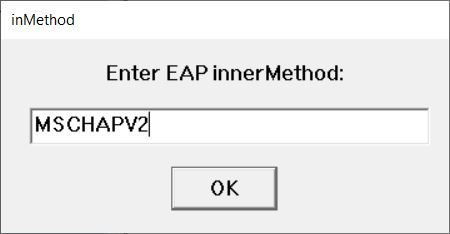
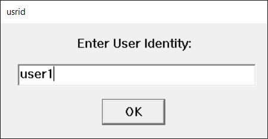
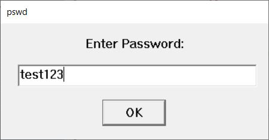
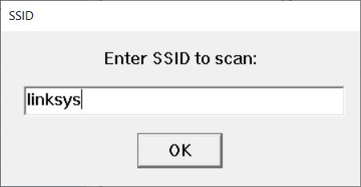
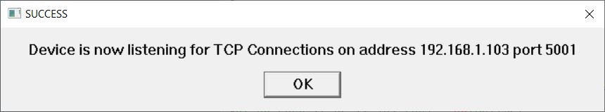

## Wi-Fi Client in Enterprise Security Mode Tera Term Script
This application demonstrates the procedure about how to configure the RS9116W Module in WLAN STA mode wher Access Point is configured with Enterprise Security (PEAP MSCHAPv2 Method).

Before continuing, ensure the RS9116 EVK is plugged into your computer and TeraTerm is connected as described in [Getting Started with PC using AT Commands](http://docs.silabs.com/rs9116-wiseconnect/2.4/wifibt-wc-getting-started-with-pc/). 

**STEP 1.** Reset the RS9116 EVK.

**STEP 2.** In the Tera Term menu select `Control->Macro`.

	
**STEP 3.** Navigate to the folder `<SDK>/examples/at_commands/teraterm/wlan_eap_peap_station` and select the file `wlan_eap_peap_station.ttl`.

For running this script user need to use wlan_eap_peap_station.ttl from the list.

**STEP 4.** The first command it will go as `at+rsi_opermode=2,0,4,0` after running the TTL script, This command configures the module as a Wi-Fi client (Enterprise security). The module responds with “OK”

Tera term will pop up for input (band) from the user, the user needs to enter the band and hit 'OK', (at+rsi_band=0)This command configures the operating band of the Wi-Fi client to 2.4GHz. The module responds with “OK”

**STEP 5.** The next command will go as `at+rsi_init`, This command initializes the Wi-Fi module in the EVB. The module responds with `OK <MAC_Address>`.

**STEP 6.** Tera term will pop up for input (eap method) from the user, the user needs to enter the EAP method and hit 'OK'.

**STEP 7.**  Tera term will pop up for input (EAP inner method) from the user, the user needs to enter the eap inner method and hit 'OK'.

**STEP 8.** Tera term will pop up for input (User identity) from the user, the user needs to enter the User identity and hit 'OK'.

**STEP 9.** Tera term will pop up for input (password) from the user, the user needs to enter the password and hit 'OK'.

**STEP 10.** The command will go as `at+rsi_eap=PEAP,MSCHAPV2,user1,test123` This command set the EAP mode for the module and set the authentication credentials (username and password).

**STEP 11.** Tera term will pop up for scan SSID input from the user, the user needs to enter the SSID to scan and hit 'OK', (`at+rsi_scan=0,linksys`) This command scans for particular Access Point operating in the 2.4 GHz band.

The module responds with information of the Access Points scanned. The data received might have some unreadable characters because of ASCII conversion.

**STEP 12.** The next command will go as `at+rsi_join=linksys,0,2,6`. This command connects the Wi-Fi client to the Access Point with SSID "linksys”. On successful association, the module responds with OK.

**STEP 13.** After join successful next command will go as `at+rsi_ipconf=1`, This command configures the IP address of the module.

**STEP 14.** It will open a TCP Server socket on the Wi-Fi Client (EVB) side using the following AT command `at+rsi_ltcp=5001`, The module’s response will look as follows:

`OK<ip_version><socket_type><socket_handle><Lport><module_ipaddr>`

The pop up window will display "Device is now listening for TCP connections on address x.x.x.x and port y" where x.x.x.x is the IP address and 'y' is the port number of the module socket.

**STEP 15.** Open a TCP client socket on a remote peer and connect to the Server socket by giving the server IP and port number.

**STEP 16.** Observe that the Teraterm on the Wi-Fi Client-side (EVB) prints the following message, once the TCP connection is set up with the remote peer.

`AT+RSI_LTCP_CONNECT=<ip_version><socket_descriptor><dest_port_no><dest_ipaddr><mss><window_size><src_port_no>`

Note that the data received might have some unreadable characters because of ASCII conversion

**STEP 17.** When the data is received on the Wi-Fi Client (EVB) side, you will see a response (asynchronous) from the module as follows:

  

