## Firmware Upgrade over WiFi Tera Term Script

The Wireless Firmware upgrade application demonstrates how RS9116W device can be configured as an Access point and runs a DHCP and HTTP Server (webserver). This allows another WiFi station to connect e.g. a PC where the firmware file is stored and update the firmware wirelessly through the modules' internal webpage.

Before continuing, ensure the RS9116 EVK is plugged into your computer and TeraTerm is connected as described in [Getting Started with PC using AT Commands](http://docs.silabs.com/rs9116-wiseconnect/2.4/wifibt-wc-getting-started-with-pc/). 

**STEP 1.** Reset the RS9116 EVK.

**STEP 2.** In the Tera Term menu select `Control->Macro`.

	
**STEP 3.** Navigate to the folder `<SDK>/examples/at_commands/teraterm/wlan_fw_update`  and select the file `fw_update_over_wifi.ttl`.

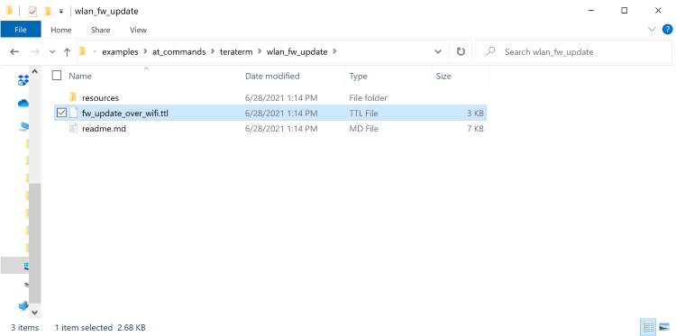

**STEP 4.** After running fw_update_over_wifi.ttl script, it will pop up as shown.

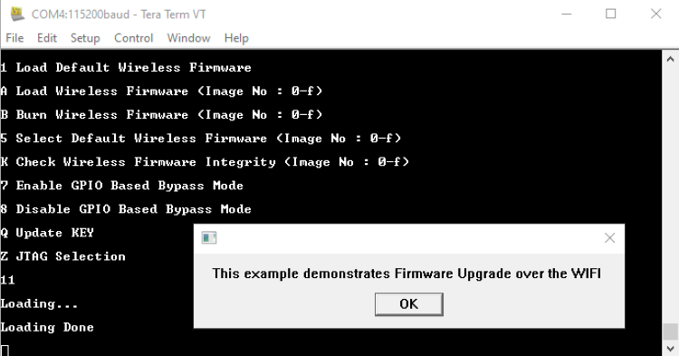

**STEP 5.** Next command is opermode command `at+rsi_opermode=6,1,18,0` , This configures the EVK to function in AP mode. The module responds with “OK”.

 	
**STEP 6.** Tera term will pop up for input (Band - 2.4 GHz or 5 GHz) from the user, user needs to enter the band value (0) and hit 'OK', (at+rsi_band=0) This configures the operating band 2.4 GHz of the EVK. The module responds with “OK”.

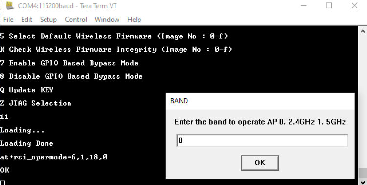

**STEP 7.**  `at+rsi_init` command initializes the RF of the module. The module responds with OK<MAC_Address>.

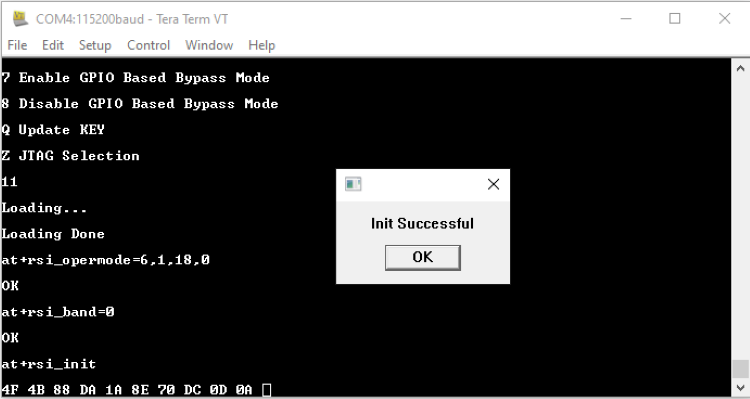

**STEP 8.** If a user wants to configure a different subnet and gateway than ipconf command has to be issued at this stage else AP will be configured to default subnet and gateway. e.g."at+rsi_ipconf=0,192.168.0.30,255.255.255.0,192.168.0.30", This command configures the IP (192.168.0.30 in this example) of the AP. The module responds with “OK”.

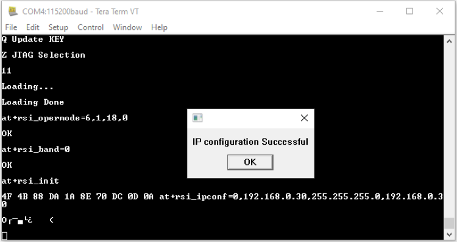

**STEP 9.**  Tera term will pop up for input (operating channel) from the user, user can enter any value between 1 to 11 e.g. enter the channel(1) and hit 'OK' as shown:

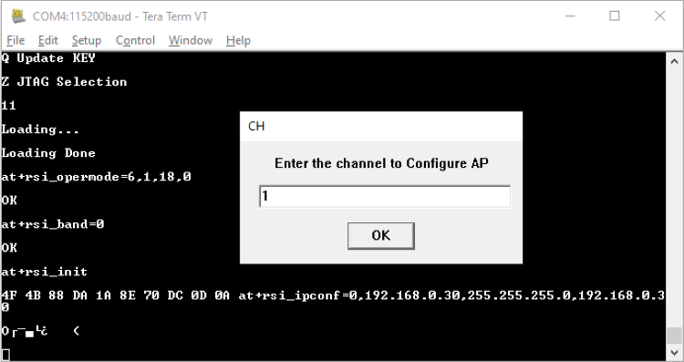

**STEP 10.** Tera term will now pop up for input (SSID of the AP) from the user, user needs to enter the SSID (e.g. Silabs) and hit 'OK'.

**STEP 11.** The next pop up is for input (security mode) from the user, user needs to enter the security mode(2) and hit 'OK',
0 - Open Security
2 - WPA2 PSK Security

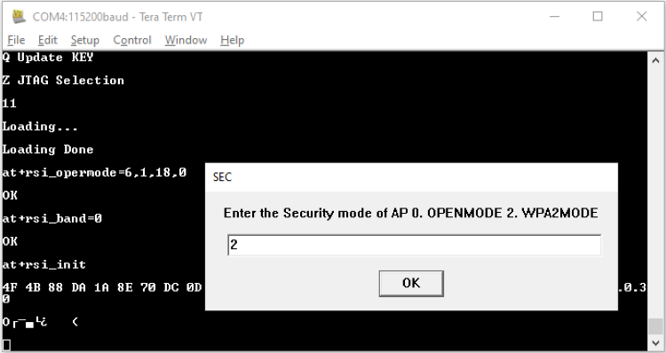

**STEP 12.** Tera term will pop up for input (PSK of the AP) from the user, the user needs to enter the PSK (12345678) and hit 'OK'.

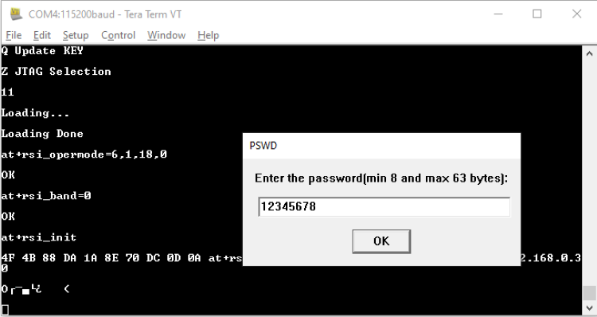

**STEP 13.** The command will go as `at+rsi_apconf=1,silabs,2,2,12345678,100,3,3`
The SSID is configured as “silabs” operate in channel 1 and the WPA2 PSK set is "12345678"

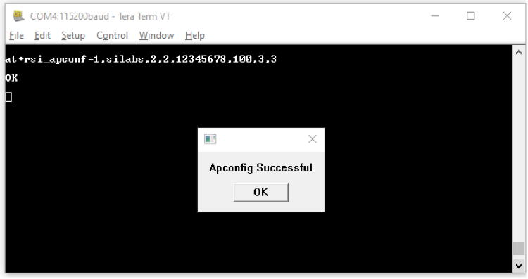

**STEP 14.** The next command  `at+rsi_join=silabs,0,2,6` starts the Access Point functionality. Observe **OKG** response. The module is now configured as an Access Point. It's IP address is 192.168.0.30.

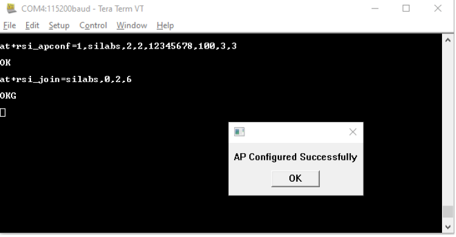

A remote peer can now scan for networks and the SSID of the module `“silabs”`. After the remote peer connects to the AP, it acquires an IP address over DHCP.

**STEP 15.**  Connect a Laptop which has the new firmware file (.rps extension) to the module.

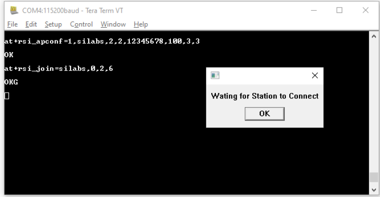

 
**STEP 16.**  Once a station is connected a pop up appears with “Waiting for the Firmware Upgrade Query from the module”

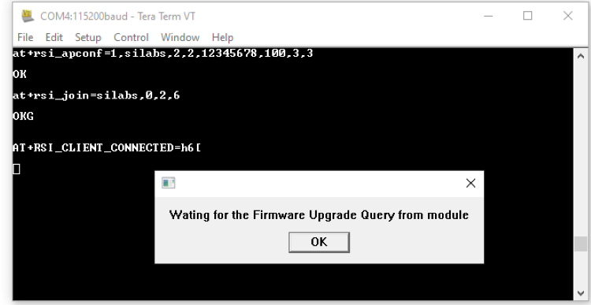

**STEP 17.**  Open the URL `http://<Module's IP address>` in the Laptop. For example, if the module is configured to have an IP of 192.168.0.30, then the URL is http://192.168.0.30. 

Note: Make sure the browser proxies are disabled. 

Once the webpage is opened select the `"ADMINISTRATION"` tab.

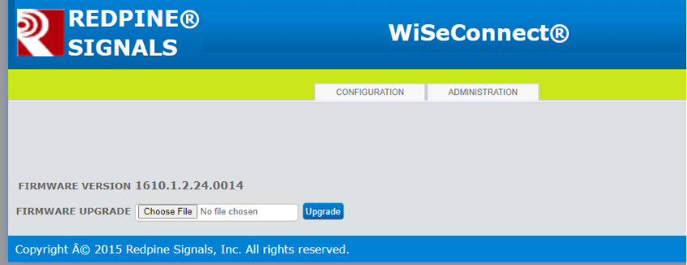

**STEP 18.**  Click on "Choose File" to navigate to the location of the firmware file (.rps extension), select the file and click "Open".  Next, click on "Upgrade".

**STEP 19.**  The module sends a response (AT+RSI_FWUPREQ) to the Host PC to confirm the Firmware Upgrade, as shown in the figure below. The Host sends the confirmation command (AT+RSI_FWUPOK) to start updating the firmware. 

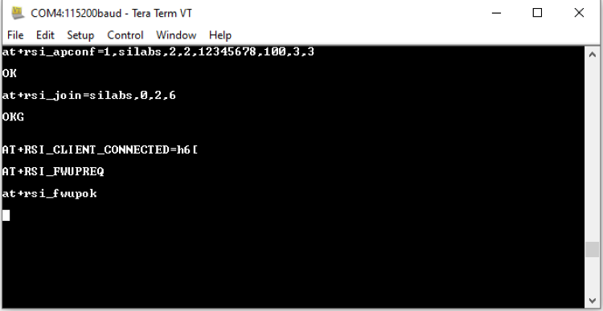

**STEP 20.**  Once the updation is done, a "Firmware Upgraded Successfully" pop up message is displayed in browser, as shown in the figure below. 

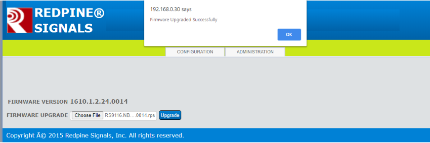

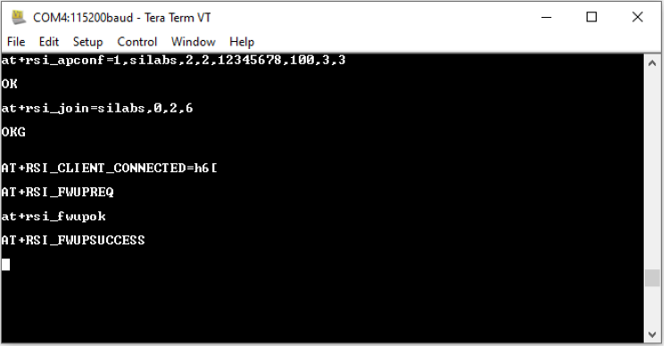

