## WLAN Low Power Standby Associated Station Tera Term Script

This application demonstrates the procedure to connect RS9116W to an Access Point. Once connected put the module in low power (WLAN standby associated) state.  
  

## Connecting the RS9116 EVK to your PC to the perform current measurements 

To do this you will perform the following:

1. Connect the EVK’s UART port to your PC using the included USB A to USB Micro cable.
2. Connect the EVK to your current meter through its “MEASUREMENT” port.

Note: To measure lowest possible power, it is recommended to use UART to issue commands. It allows device to go to its lowest power states. USB-CDC keeps the USB port alive, and USB is not a low power interface.

Your current meter’s positive and negative terminals should be connected as shown in the picture below. This picture also shows the connection of the USB cable between your PC and the EVK board

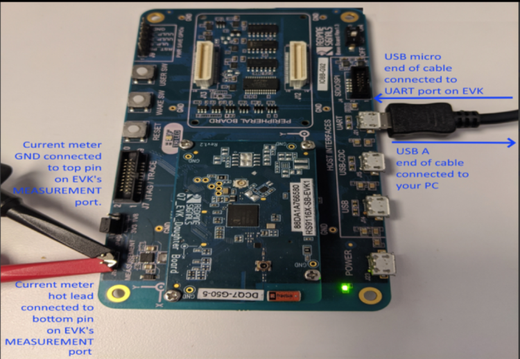

## Performing the current measurement

Before continuing, ensure the RS9116 EVK is plugged into your computer and TeraTerm is connected as described in [Getting Started with PC using AT Commands](http://docs.silabs.com/rs9116-wiseconnect/2.4/wifibt-wc-getting-started-with-pc/). 

After doing so, start your current meter in continuous DC current measurement mode with a range of 1 A.

As an example, the Keithley DMM6500 current meter was used. It is set as shown below using its PC-based Kickstart interface software.

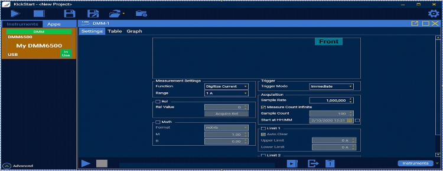

## Running the Example

**STEP 1.** Once the current meter is set to do the measurement, reset the RS9116 EVK.

**STEP 2.** In the Tera Term menu select `Control->Macro`.

	
**STEP 3.** Navigate to the folder `<SDK>/examples/at_commands/teraterm/wlan_low_power`  and select the file `low_power_station.ttl`.

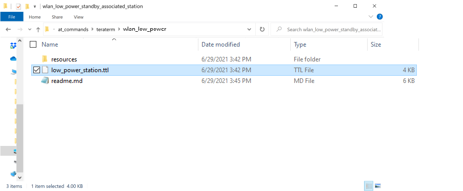

Note: The OPERMODE in this TTL script is configured default for EVK Version 1.4, if the user wants to run the same TTL script on  EVK version which is older than 1.4, then user has to comment 1.4 EVK Version OPERMODE and uncomment 1.3 EVK Version OPERMODE.

To identify the EVK is 1.3 or 1.4 Version you can check the J9 Connector on EVK, If J9 Connector has UULP_0 and UULP_2 then it is 1.4 version. Instead of UULP_0 if it has UULP_3 pin then it is 1.3 version.

**STEP 4.** After running wlan_low_power_station, it will pop up as shown.

**STEP 5.** Initially, the ABRD process will run and you will see a pop-up as “Firmware Loading Done “.

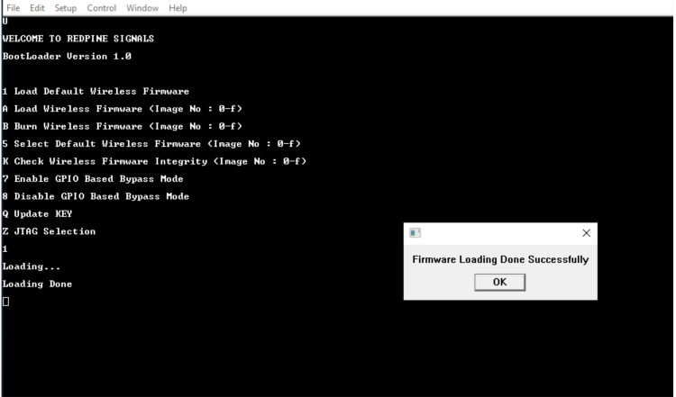
 	

**STEP 6.** You will see the following pop-up window

**STEP 7.**  You will see the following pop-up window. Enter “0” if you want your module to associate to an AP that is operating in the 2.4 GHz or “1” if you want your module to associate to an AP that is operating in the 5 GHz band. For the purpose of this document, we will select “0” to associate to an AP operating in the 2.4 GHz band as shown below

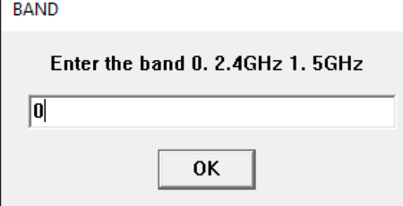

**STEP 8.** You will see the following pop-up and message in the Tera Term screen

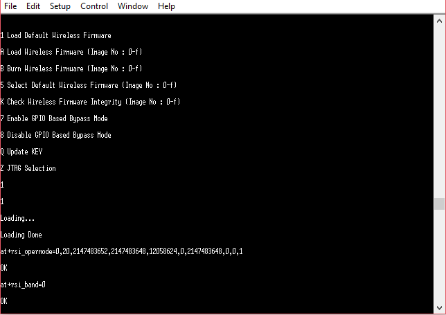

**STEP 9.** `at+rsi_init` command initializes the RF of the module. The module responds with OK<MAC_Address> (can be seen in Hex)

**STEP 10.** Pop up comes to provide input for SSID of the AP to be connected, select 'OK' to proceed (make sure SSID is entered correectly)

`at+rsi_scan=0,Silicon_labs`
 
This command scans for particular Access Point operating in all channels.
The module responds with information of the Access Points scanned.

 `The data received might have some unreadable characters because of ASCII conversion.`
 
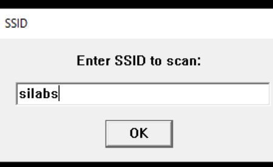

**STEP 11.** Once “scan successful” comes, select “OK”.
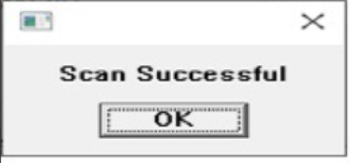
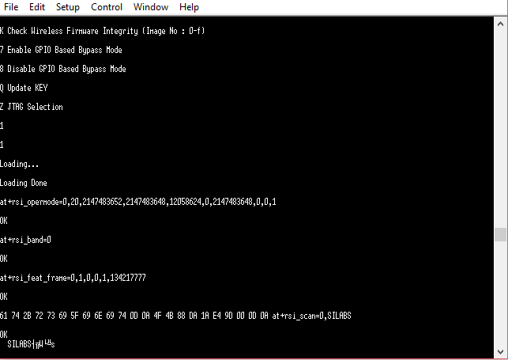

**STEP 12.** Next pop up asks for pre shared key (PSK) input from the user, enter the PSK of desired Access Point and hit 'OK', 

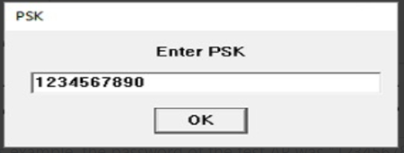

**STEP 13.** Now you will see the following pop-ups in succession (click “OK” on them)

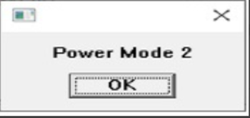

**STEP 14.** After the Tera Term macro completed, you will see a command sequence similar to the one shown below having been executed in Tera Term.
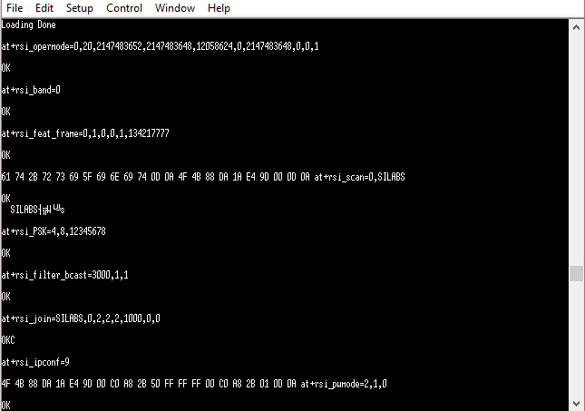

**STEP 15.** At this point the device is in power save (standby-associated) mode.

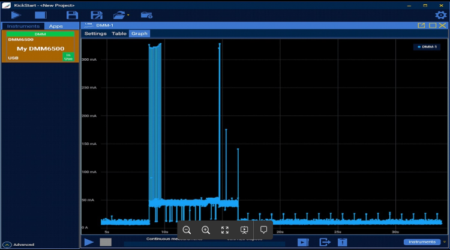

Note: The measured current may vary if the scenario is performed in Open Environment. AP to AP variation is also observed.