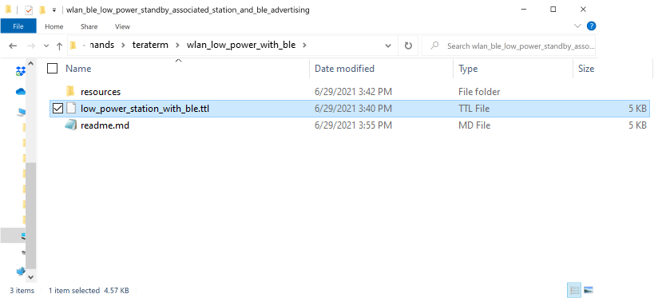
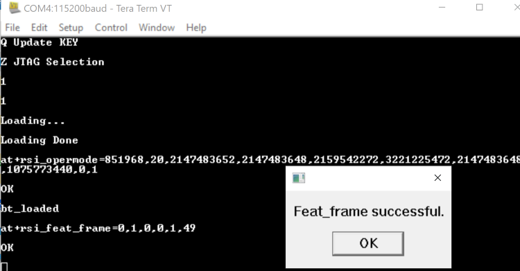
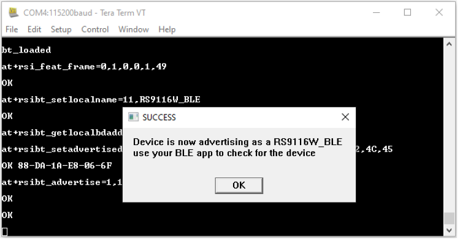
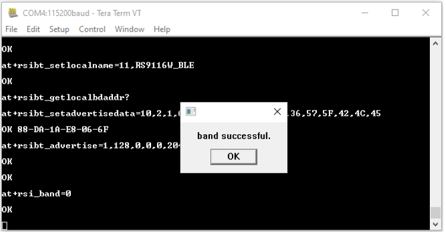
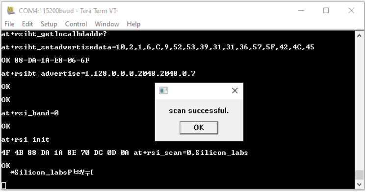

## Low Power Standby Associated Station and BLE Advertising Tera Term Script

This application demonstrates the procedure about how to configure the RS9116W Module in coex mode (WLAN STA + BLE)mode and putting module in low power (WLAN standby associated) state and ble connected power save.  

## Connecting the RS9116 EVK to your PC to the perform current measurements 

To do this you will perform the following:

1. Connect the EVK’s UART port to your PC using the included USB A to USB Micro cable.
2. Connect the EVK to your current meter through its “MEASUREMENT” port.

Note: To measure lowest possible power, it is recommended to use UART to issue commands. It allows device to go to its lowest power states. USB-CDC keeps the USB port alive, and USB is not a low power interface.

Your current meter’s positive and negative terminals should be connected as shown in the picture below. This picture also shows the connection of the USB cable between your PC and the EVK board

## Performing the current measurement

Before continuing, ensure the RS9116 EVK is plugged into your computer and TeraTerm is connected as described in [Getting Started with PC using AT Commands](http://docs.silabs.com/rs9116-wiseconnect/2.4/wifibt-wc-getting-started-with-pc/). 

After doing so, start your current meter in continuous DC current measurement mode with a range of 1 A.

As an example, the Keithley DMM6500 current meter was used. It is set as shown below using its PC-based Kickstart interface software.

## Running the Example

**STEP 1.** Reset the RS9116 EVK.

**STEP 2.** In the Tera Term menu select `Control->Macro`.

	
**STEP 3.** Navigate to the folder `<SDK>/examples/at_commands/teraterm/wlan_low_power_with_ble` and select the file `low_power_station_with_ble.ttl`.

**STEP 4.** Opermode command  configures the module as Wi-Fi Station and BLE operating mode. The module responds with “OK” & “bt_loaded”.

`at+rsi_opermode=851968,20,2147483652,2147483648,2159542272,3221225472,2147483648,1075773440,0,1`
 

**STEP 5.** Feat_frame command configures to use LP chain in standby associcated mode. Feat_frame Successful pop will come and you confirm by selecting “OK”

 	

Now Module will be configured to start BLE advertising using following commands. Once success, observe the pop up *“Device is now advertising as a RS9116W_BLE....."*. You can  use Silabs *"EFR Connect"* Mobile app to check for the same.

`1. Set Local Name`

`2. Get a local BD address.`

`3. Set Advertise Data`

`4. Advertise command.`

**STEP 7.**  Now we configure the WLAN Station starting with the 2.4GHz band configuration and the module responds with “OK”.

**STEP 8.** `at+rsi_init` command initializes the RF of the module. The module responds with OK<MAC_Address> (can be seen in Hex)

**STEP 9.**  Pop up comes to provide input for SSID of the AP to be connected, select 'OK' to proceed (make sure SSID is entered correectly), 

`at+rsi_scan=0,Silicon_labs`
 

This command scans for particular Access Point operating in all channels.
The module responds with information of the Access Points scanned.

 `The data received might have some unreadable characters because of ASCII conversion.`

**STEP 10.** Once “scan successful” comes, select “OK”.

**STEP 11.** Next pop up asks for pre shared key (PSK) input from the user, enter the PSK of desired Access Point and hit 'OK', 

**STEP 12.** 
 
 
`at+rsi_join=Silicon_labs,0,2,6`
 

 This command connects the Wi-Fi client to the Access Point with SSID "Silicon_labs”. On successful association, the module responds with OK.

**STEP 13.**  After join successful next command will get the IP address from the DHCP server running on AP. 
 
`at+rsi_ipconf=1` 

**STEP 14.** After successfully getting the IP address module can now enter in low power mode (Standby Associated Mode).
Power save success pop up will come. Go with "ok" response.

User can now measure the power consumption if power meter is connected on EVK Jumper J19 "Measurement".
  

