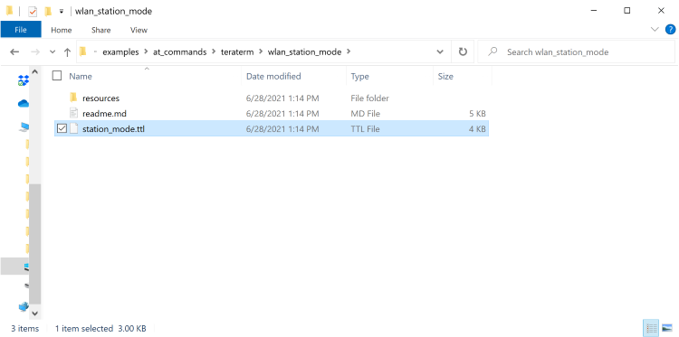
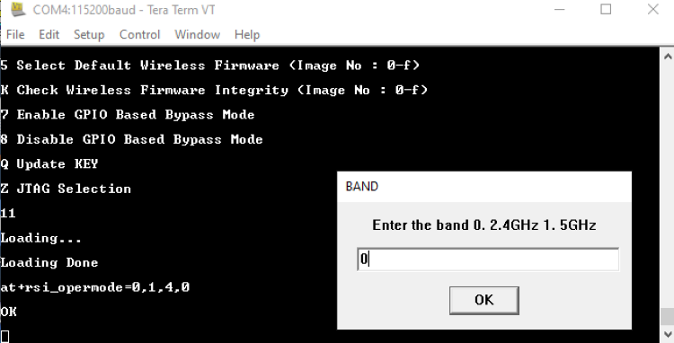
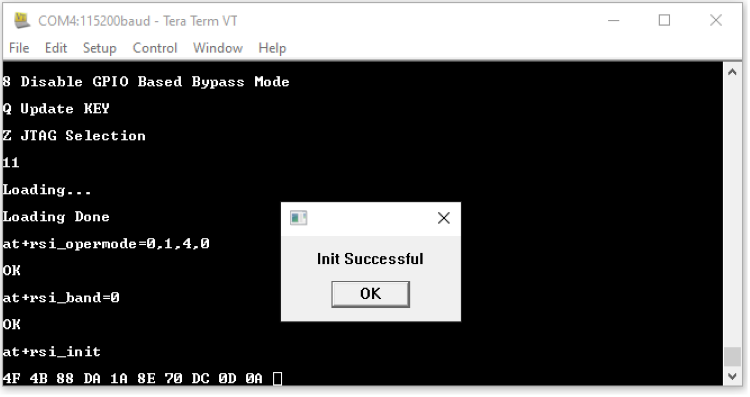
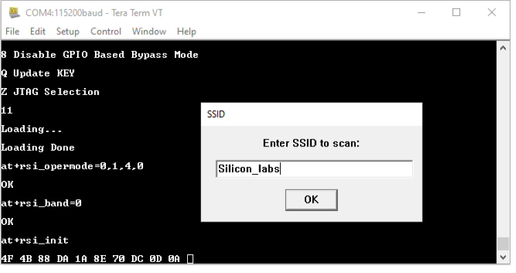
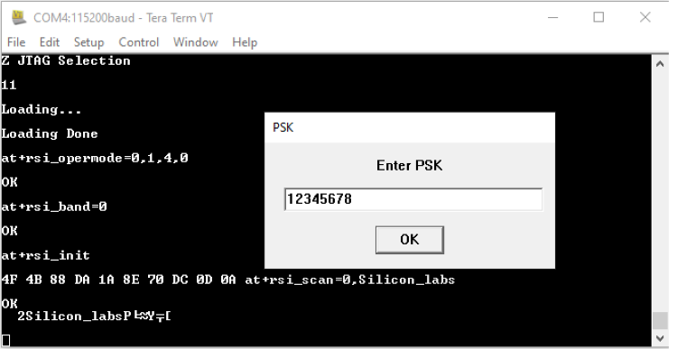
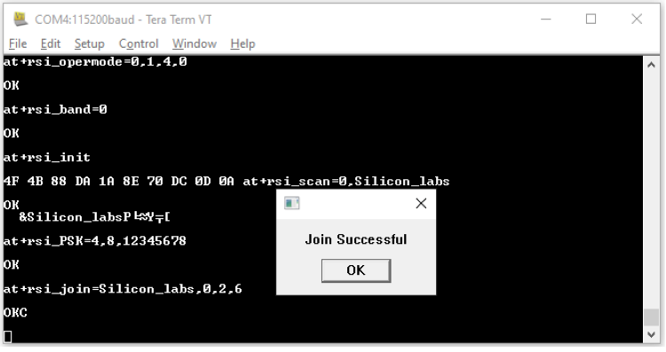
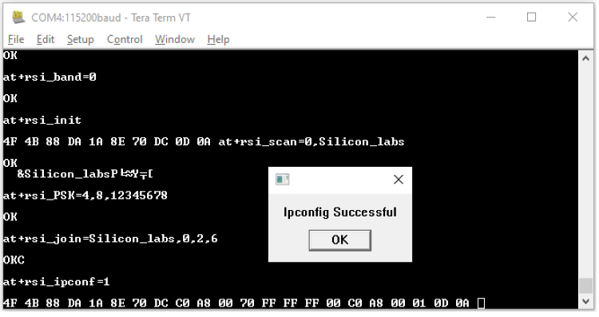
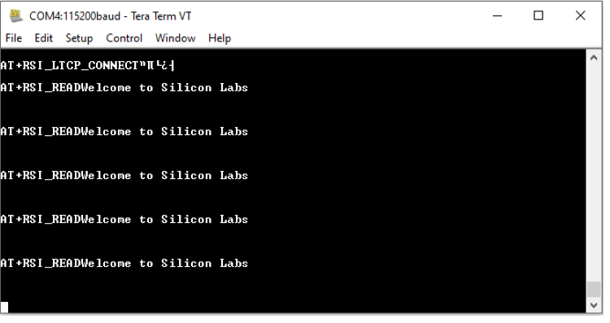

## Station Mode Tera Term Script
This application demonstrates the procedure to configure the RS9116W Module in WLAN STA mode.
The script takes the module through to a connection to a specified Access Point, getting an IP address assigned, and opening a TCP server port.

Before continuing, ensure that the RS9116 EVK is plugged into your computer and TeraTerm is configured as described in [Getting Started with PC using AT Commands](http://docs.silabs.com/rs9116-wiseconnect/2.4/wifibt-wc-getting-started-with-pc/). 

**STEP 1.** Reset the RS9116 EVK.

**STEP 2.** In the Tera Term menu select `Control -> Macro`.

	
**STEP 3.** Navigate to the folder `RS9116W.x.x.xx/examples/at_commands/teraterm/wlan_station_mode` which contains the example scripts and select the file `station_mode.ttl`.

**STEP 4.** Tera Term begins executing the station_mode.ttl script. 

**STEP 5** The Opermode command   `at+rsi_opermode=0,1,4,0` configures the module as a Wi-Fi client. The module responds with “OK”

**STEP 6.** In the pop-up that asks for desired band of operation, enter 0 for the 2.4 GHz band. The command (`at+rsi_band=0`) then configures the operating band of the Wi-Fi client to 2.4GHz. The module responds with "OK".

**STEP 7.** The script issues an `at+rsi_init` command to initialize the RF of the module in the EVK. The module responds with OK <MAC_Address>.
Here 4F 4B is for OK and the remaining data is the MAC Address, ending with a CR and LF.

**STEP 8.** In the next pop-up that requests for an SSID, enter the SSID of the desired AP to be scanned and hit 'OK', (`at+rsi_scan=0, Silicon_labs`). Make sure there is such an AP in range, and that it is set into WPA2-PSK mode. 
The module responds with information of the Access Point scanned. The data received might have some unreadable characters because of ASCII conversion.

**STEP 9.** Tera term will pop up a request for the PSK or password of the AP and that should be entered here. 

**STEP 10.** The next command issued would be `at+rsi_join=Silicon_labs,0,2,6` (or with the specific SSID entered). This command connects the Wi-Fi client to the Access Point with the specified SSID, in this example "Silicon_labs". On successful association, the module responds with OK.

**STEP 11.** After the join is successful, the next command issued would be `at+rsi_ipconf=1`. This command configures the IP address of the module.

**STEP 12.** The script then configures a TCP Server socket on port 5001 on the Wi-Fi Client (EVK) using the following AT command `at+rsi_ltcp=5001`, The module’s response will look as follows:

`OK<ip_version><socket_type><socket_handle><Lport><module_ipaddr>\r\n` 

The pop up window would display "Device is now listening for TCP connections on address x.x.x.x and port y". Here x.x.x.x Ip address of the Module and 'y' is the port number of the Module Socket.

**STEP 13.** Open a TCP client socket on a remote peer and connect to the server socket by giving the server IP and port number.

**STEP 14.** Observe that the following message is printed on the terminal window, once the TCP connection is set up with the remote peer.

`AT+RSI_LTCP_CONNECT=<ip_version><socket_descriptor><dest_port_no><dest_ipaddr><mss><window_size><src_port_no>\r\n`

The data received might have some unreadable characters because of ASCII conversion

**STEP 15.** When data is received by the EVK, the following response would be printed:

