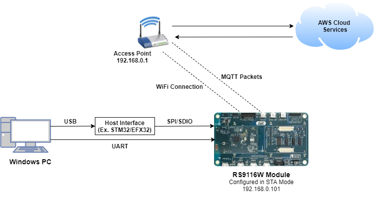
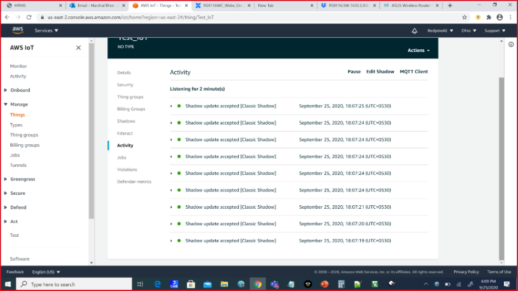
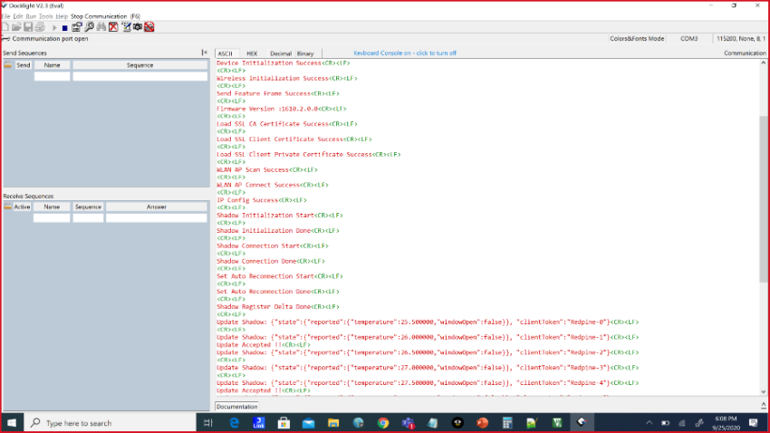
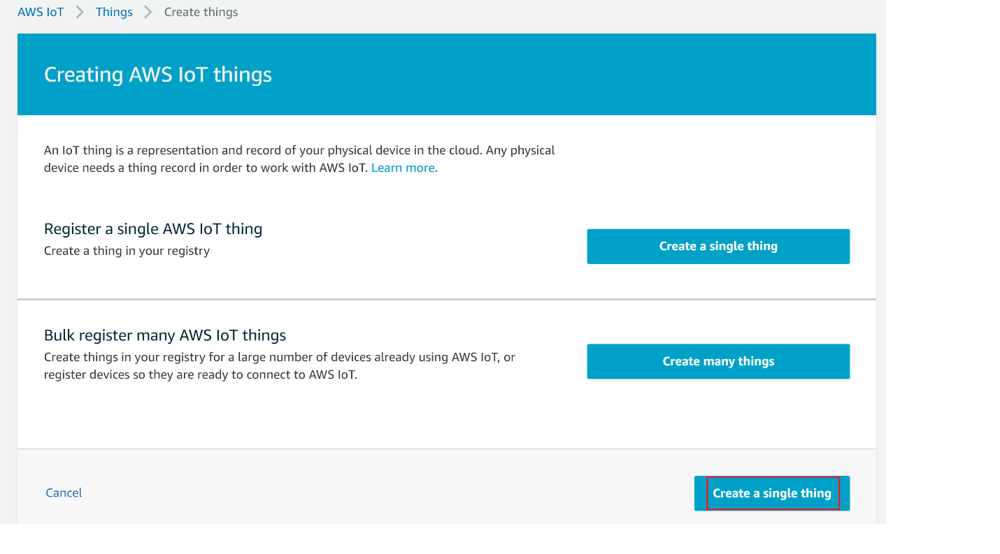
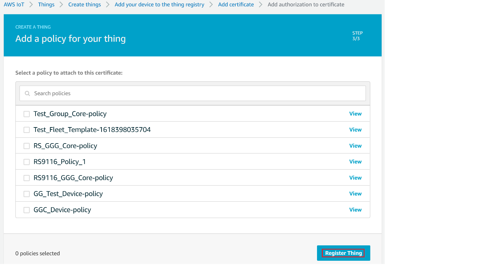

# AWS IoT Device Shadow

## Introduction

This application demonstrates how to securely connect a Silicon Labs RS911x Wi-Fi device to AWS IoT Core to send and receive data. 
To successfully use this application, developers should be familiar with the operation of [AWS IoT Core](https://docs.aws.amazon.com/iot/latest/developerguide/what-is-aws-iot.html) and the [AWS IoT Device Shadow Service](https://docs.aws.amazon.com/iot/latest/developerguide/iot-device-shadows.html).
If you are new to AWS IoT Core, we recommend running through the [AWS IoT Core Tutorial](https://docs.aws.amazon.com/iot/latest/developerguide/iot-tutorials.html) before proceeding.
In the following text, 'AWS IoT Core' is referred to as 'AWS' for brevity.

AWS refer to a 'Device Shadow' as a persistent, virtual representation of a device that can be accessed even if the physical device is offline.
The device state is captured in its 'shadow' and is represented as a JSON document.
The physical device can send commands using the MQTT protocol to get, update and delete the state of the shadow as well as receive notifications via MQTT about changes in the state pf the shadow.

The AWS IoT Device Shadow application publishes temperature and window open/close status on the topic `$aws/things/thingname/shadow/update`.
The room temperature and the window open/close status is available on the AWS cloud.

Additionally, the application subscribes to the shadow update topics:
```sh
  $aws/things/thingName/shadow/name/shadowName/update/accepted
  $aws/things/thingName/shadow/name/shadowName/update/rejected
  $aws/things/thingName/shadow/name/shadowName/update/delta
```

## Overview of AWS SDK

AWS IoT Core is a cloud platform that connects devices across AWS cloud services. AWS IoT provides an interface that allows devices to communicate securely and reliably in bi-directional ways to AWS touch-points, even when devices are offline.

The AWS IoT Device SDK allow applications to securely connect to the AWS IoT platform.


## Setting Up
To use this application, the following hardware, software and project setup is required.

### Hardware Requirements  
  - Windows PC with Host interface (UART / SPI/ SDIO).
  - Silicon Labs [RS9116 Wi-Fi Evaluation Kit](https://www.silabs.com/development-tools/wireless/wi-fi/rs9116x-sb-evk-development-kit)
  - Host MCU Eval Kit. This example has been tested with:
    - Silicon Labs [WSTK + EFR32MG21](https://www.silabs.com/development-tools/wireless/efr32xg21-bluetooth-starter-kit)
	- Silicon Labs [WSTK + EFM32GG11](https://www.silabs.com/development-tools/mcu/32-bit/efm32gg11-starter-kit)
    - STM32F411 Nucleo
  - Wi-Fi Access point with a connection to the internet



### Software Requirements
  - [Amazon AWS](https://aws.amazon.com/) account
  - [WiSeConnect SDK](https://github.com/SiliconLabs/wiseconnect-wifi-bt-sdk/)
  - [Python 3](https://www.python.org/downloads/) installation
  - Embedded Development Environment
    - For STM32, use licensed [Keil IDE](https://www.keil.com/demo/eval/arm.htm)
	- For Silicon Labs EFx32, use the latest version of [Simplicity Studio](https://www.silabs.com/developers/simplicity-studio)
   
### Cloud Setup
This example requires your RS911x Wi-Fi device to be provisioned on AWS; you will need the device certificate and private key. 
For brief provisioning instructions, see [AWS IoT Setup](#aws-iot-setup).

### Project Setup
  - **Silicon Labs EFx32 Host**. Follow the the [Getting Started with EFx32](https://docs.silabs.com/rs9116-wiseconnect/latest/wifibt-wc-getting-started-with-efx32/) to setup the example to work with EFx32 and Simplicity Studio.
  - **STM32F411 Host**. Follow the the [Getting Started with STM32](https://docs.silabs.com/rs9116-wiseconnect/latest/wifibt-wc-getting-started-with-stm32/) to setup the example to work with STM32 and Keil.

## Configuring the Application
The application can be configured to suit your requirements and development environment.
Read through the following sections and make any changes needed. 

### Host Interface
* By default, the application is configured to use the SPI bus for interfacing between Host platforms(STM32F411 Nucleo / EFR32MG21) and the RS9116W EVK.
* This application is also configured to use the SDIO bus for interfacing between Host platforms(EFM32GG11) and the RS9116W EVK.

### Bare Metal/RTOS Support
To select a bare metal configuration, see [Selecting bare metal](#selecting-bare-metal).

### Wi-Fi & Cloud Configuration
Configure the following parameters in [rsi_aws_device_shadow.c](https://github.com/SiliconLabs/wiseconnect-wifi-bt-sdk/tree/master/examples/featured/aws_device_shadow/rsi_aws_device_shadow.c) to enable your Silicon Labs Wi-Fi device to connect to your Wi-Fi network.

```c
#define SSID           "SILABS_AP"      // Wi-Fi Network Name
#define PSK            "1234567890"     // Wi-Fi Password
#define SECURITY_TYPE  RSI_WPA2         // Wi-Fi Security Type: RSI_OPEN / RSI_WPA / RSI_WPA2
```
    
Configure `AWS_IOT_MQTT_HOST` in the file [aws_iot_config.h](https://github.com/SiliconLabs/wiseconnect-wifi-bt-sdk/tree/master/examples/featured/aws_device_shadow/rsi_aws_iot_config.h) to match the endpoint for your device in AWS.

```c
#define AWS_IOT_MQTT_HOST "xxxxxxxxxxxxx-ats.iot.us-east-2.amazonaws.com"
```
### Power Save Configuration
Configure below parameter in [rsi_wlan_config.h](https://github.com/SiliconLabs/wiseconnect-wifi-bt-sdk/tree/master/examples/featured/aws_device_shadow/rsi_wlan_config.h) to enable power save mode

```c
#define ENABLE_POWER_SAVE 1
```

### Setting up Security Certificates
To authenticate and securely connect with AWS, your Wi-Fi device requires a unique x.509 security certificate and private key, as well as a CA certificate which is used to verify the AWS server. Security credentials need to be converted into a C-array rather than [PEM format](https://en.wikipedia.org/wiki/Privacy-Enhanced_Mail) provided by AWS; they also need to be added to your project. 

The WiSeConnect SDK provides a conversion script (written in Python 3) to make the conversion straightforward. The script is provided in the SDK 'resources' directory and is called [certificate_to_array.py](https://github.com/SiliconLabs/wiseconnect-wifi-bt-sdk/tree/master/resources/certificates/).

To convert the device certificate and private key to C arrays, open a system command prompt and use the script as indicated in the following examples.

```sh
$> python3 certificate_to_array.py <input filename> <output arrayname>

For example:
$> python3 certificate_to_array.py d8f3a44d3f.cert.pem    aws_client_certificate
$> python3 certificate_to_array.py d8f3a44d3f.private.key aws_client_private_certificate
```

After running the script on the certificate and private key, two new files are created.

```sh
aws_client_certificate.pem.crt.h
aws_client_private_key.pem.key.h
```

Before proceeding, copy both of the new files to the WiSeConnect directory: `<SDK>/resources/certificates`  
Go ahead and overwrite any existing files with the same name in that directory, the originals are not needed.

The Root CA certificate used by your Wi-Fi device to verify the AWS server is already included in the WiSeConnect SDK; no additional setup is required.
For reference, Amazon uses [Starfield Technologies](https://www.starfieldtech.com/) to secure the AWS website, the WiSeConnect SDK includes the [Starfield CA Certificate](https://github.com/SiliconLabs/wiseconnect-wifi-bt-sdk/tree/master/resources/certificates/aws_starfield_ca.pem.h).

# Testing the Application
After making any custom configuration changes, and updating the device certificate and private key, build, download and run the application as described in the [EFx32 Getting Started](https://docs.silabs.com/rs9116-wiseconnect/latest/wifibt-wc-getting-started-with-efx32/) or [STM32 Getting Started](https://docs.silabs.com/rs9116-wiseconnect/latest/wifibt-wc-getting-started-with-efx32/). 

After successful execution, device updates written to AWS can be observed in the AWS thing shadow.


The following debug prints are displayed when the application runs successfully.



----
# AWS IoT Setup

## Create an AWS Thing
Create a thing in the AWS IoT registry to represent your IoT Device.

In the [AWS IoT console](https://console.aws.amazon.com/iot/home), in the navigation pane, choose Manage, and then choose Things.


If a dialog box **"You don't have any things yet"** appears, choose **Register a thing**. Otherwise, choose **Create**.


On the **Creating AWS IoT things** page, choose **Create a single thing**.



On the **Add your device to the device registry** page, enter a name for your IoT thing (for example, **Test_IoT**), and then choose **Next**. You can't change the name of a thing after you create it. To change a thing's name, you must create a new thing, give it the new name, and then delete the old thing.


On the **Add a certificate for your thing page**, choose **Create certificate**.


Choose the **Download** links to download the certificate, private key, and root CA certificate.
    > **Warning:** This is the only instance you can download your certificate and private key. Make sure to save them safely. 

Choose **Activate**.

Choose **Attach a policy**.


Choose the Policy created and then choose **Register Thing**.

**Note!** If you don't have any policy created, follow the steps in **Create Policy** section in the below and then choose the created Policy

View list of devices as shown


## Create Policy
  1. Navigate to **AWS IoT console**
  2. Choose **Policies** under **Secure**

 

  3.  Click on **Create**


  4.  Give the **Name** to your Policy, Fill **Action** and **Resource ARN** as shown in below image, Click on **Allow** under **Effect** and click **Create**


# Selecting Bare Metal
The application has been designed to work with FreeRTOS and Bare Metal configurations. By default, the application project files (Keil and Simplicity studio) are configured with FreeRTOS enabled. The following steps demonstrate how to configure Simplicity Studio and Keil to test the application in a Bare Metal environment.

## Bare Metal with Simplicity Studio
> - Open the project in Simplicity Studio
> - Right click on the project and choose 'Properties'
> - Go to 'C/C++ Build' | 'Settings' | 'GNU ARM C Compiler' | 'Symbols' and remove macro 'RSI_WITH_OS=1'
> - Select 'Apply' and 'OK' to save the settings

 


## Bare Metal with Keil
> - Open the project in Keil and select 'Options for Target'
> - Go to the 'C/C++' tab and remove 'RSI_WITH_OS' macro present under Preprocessor Symbols
> - Select 'OK' to save the settings
      
 


## Compressed Debug Logging

To enable the compressed debug logging feature please refer to [Logging User Guide](https://docs.silabs.com/rs9116-wiseconnect/latest/wifibt-wc-sapi-reference/logging-user-guide)