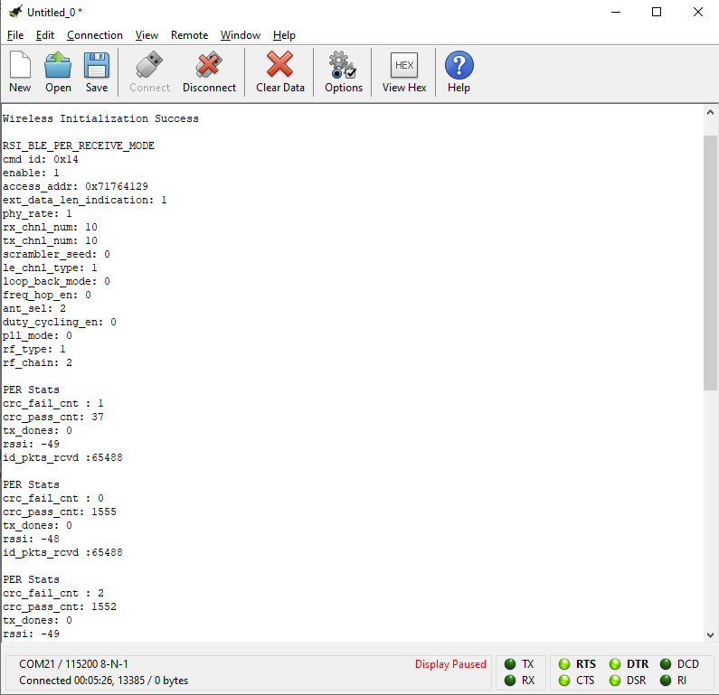
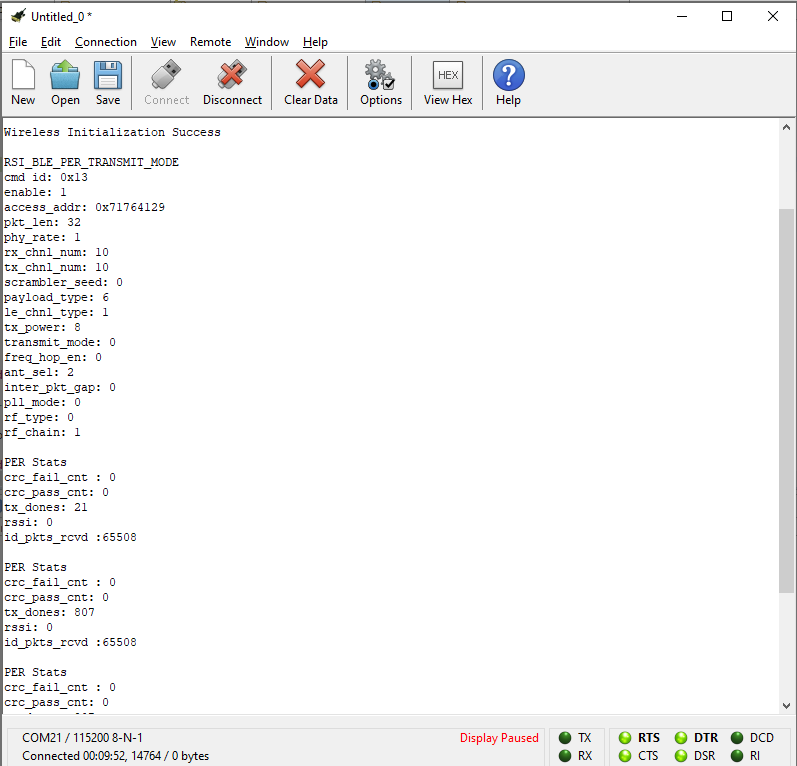
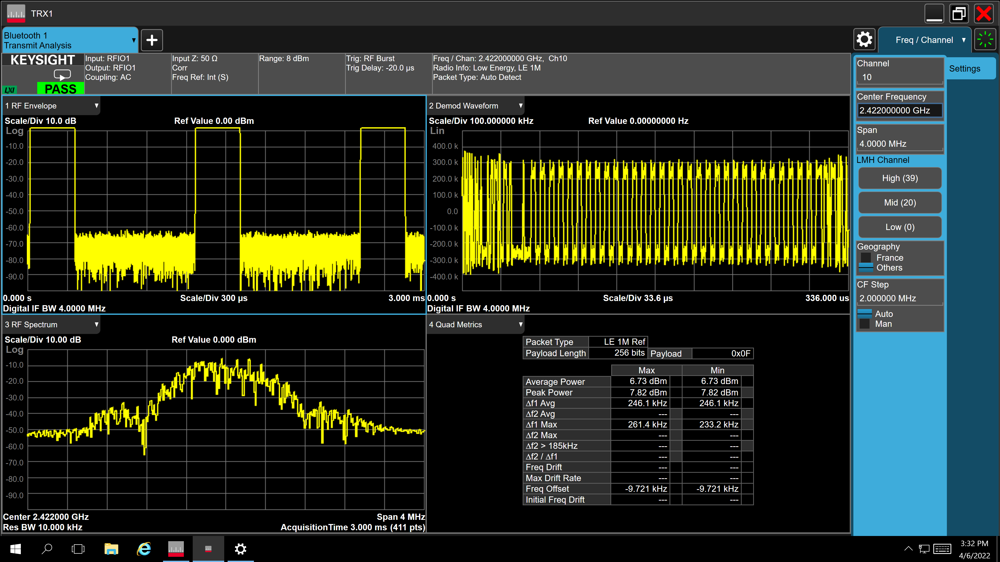

# BLE Packet Error Rate

## Introduction
This application demonstrates how to configure the necessary parameters to start transmitting or receiving BLE PER packets.

## Setting Up
To use this application, the following hardware, software and project setup is required.

### Hardware Requirements
- Windows PC with Host interface (UART / SPI / SDIO).
- Silicon Labs [RS9116 Wi-Fi Evaluation Kit](https://www.silabs.com/development-tools/wireless/wi-fi/rs9116x-sb-evk-development-kit)
- Host MCU Eval Kit. This example has been tested with:
   - Silicon Labs [WSTK + EFR32MG21](https://www.silabs.com/development-tools/wireless/efr32xg21-bluetooth-starter-kit)
   - Silicon Labs [WSTK + EFM32GG11](https://www.silabs.com/development-tools/mcu/32-bit/efm32gg11-starter-kit)
   - [STM32F411 Nucleo](https://st.com/)
- Spectrum Analyzer and/or Power Analyzer
  
 

### Software Requirements
  - [WiSeConnect SDK](https://github.com/SiliconLabs/wiseconnect-wifi-bt-sdk/)
  - Embedded Development Environment
    - For Silicon Labs EFx32, use the latest version of [Simplicity Studio](https://www.silabs.com/developers/simplicity-studio)
    - For STM32, use licensed [Keil IDE](https://www.keil.com/demo/eval/arm.htm)
   
## Application Build Environment

### Platform
The application is designed to run on any one of the following host platforms
  - [WSTK + EFR32MG21](https://www.silabs.com/development-tools/wireless/efr32xg21-bluetooth-starter-kit) 
  - [WSTK + EFM32GG11](https://www.silabs.com/development-tools/mcu/32-bit/efm32gg11-starter-kit)
  - [STM32F411 Nucleo](https://st.com/)

### Host Interface
  - By default, the application is configured to use the SPI bus for interfacing between host platforms EFR32MG21 or STM32F411 Nucleo and RS9116W EVK.
  - The application may also be configured to use the SDIO bus for interfacing between the host platform EFM32GG11 and RS9116W EVK.

### Project Configuration
The Application is provided with the project folder containing Simplicity Studio and Keil project files.

**Simplicity Studio**
  - The Simplicity Studio project is used to evaluate the application on EFR32MG21.
  - **EFR32 Host Platform**
    - If the radioboard is **BRD4180A** or **BRD4181A**, then access the path `<SDK>/examples/featured/ble_per/projects/ble_per-brd4180a-mg21.slsproj`
    - If the radioboard is **BRD4180B** or **BRD4181B**, then access the path `<SDK>/examples/featured/ble_per/projects/ble_per-brd4180b-mg21.slsproj` 
    - The radioboard version is shown in the following image 


  - **EFM32GG11 Host Platform**
    - The Simplicity Studio project is used to evaluate the application on EFM32GG11.
      - Project path `<SDK>/examples/featured/ble_per/projects/ble_per-brd2204a-gg11.slsproj`
    
**Keil Project**
  - The Keil project is used to evaluate the application on STM32.
  - Project path: `<SDK>/examples/featured/ble_per/projects/bt_per-nucleo-f411re.uvprojx`

### Bare Metal/RTOS Support
This application supports bare metal and RTOS environment. By default, the application project files (Simplicity Studio and Keil) are provided with bare metal configuration.

## Application Configuration Parameters
The application can be configured to suit your requirements and development environment. Read through the following sections and make any changes needed.

### Modifications to `rsi_ble_per.c`

**Transmit mode**
```c
  #define RSI_CONFIG_PER_MODE  RSI_BLE_PER_TRANSMIT_MODE
  #define BLE_TRANSMIT_CMD_ID  0x13
```

**Receive mode**
```c
  #define RSI_CONFIG_PER_MODE  RSI_BLE_PER_RECEIVE_MODE
  #define BLE_RECEIVE_CMD_ID   0x14
```

**Payload type**
```c
  #define DATA_PRBS9                  0x00
  #define DATA_FOUR_ONES_FOUR_ZEROES  0x01
  #define DATA_ALT_ONES_AND_ZEROES    0x02
  #define DATA_PRSB15                 0x03
  #define DATA_ALL_ONES               0x04
  #define DATA_ALL_ZEROES             0x05
  #define DATA_FOUR_ZEROES_FOUR_ONES  0x06
  #define DATA_ALT_ZEROES_AND_ONES    0x07
```

**Channel type**
```c
  #define LE_ADV_CHNL_TYPE  0   // Advertising channel
  #define LE_DATA_CHNL_TYPE 1   // Data channel
```

**Transmit Packet Length**
```c
  #define BLE_TX_PKT_LEN 32   // Length of Tx packet [0 .. 255]
```

**Channel numbers**
```c
  #define BLE_RX_CHNL_NUM  10   // Receive channel number [0 .. 39]
  #define BLE_TX_CHNL_NUM  10   // Transmit channel number [0 .. 39]
```

**BLE PHY Rate**
```c
  #define LE_ONE_MBPS        1
  #define LE_TWO_MBPS        2
  #define LE_125_KBPS_CODED  4
  #define LE_500_KBPS_CODED  8
  #define BLE_PHY_RATE       LE_ONE_MBPS
```

**Scrambler seed**
```c
  #define SCRAMBLER_SEED  0   // Seed for whitening. 0 = disable whitening.
```

**Transmit Mode**
```c
   #define BURST_MODE       0
   #define CONTINUOUS_MODE  1
   #define TX_MODE          BURST_MODE
```

**Hopping Type**
```c
  #define NO_HOPPING      0
  #define FIXED_HOPPING   1
  #define RANDOM_HOPPING  2
  #define HOPPING TYPE    NO_HOPPING
```

**Antenna select**
```c
  #define ONBOARD_ANT_SEL  2
  #define EXT_ANT_SEL      3
  #define ANT_SEL          EXT_ANT_SEL
```

**RF Type**
```c
   #define BLE_EXTERNAL_RF  0
   #define BLE_INTERNAL_RF  1
   #define RF_TYPE          BLE_INTERNAL_RF
```

**RF Chain**
```c
  #define NO_CHAIN_SEL       0
  #define WLAN_LP_CHAIN_BIT  1
  #define BT_HP_CHAIN_BIT    2
  #define BT_LP_CHAIN_BIT    3
  #define RF CHAIN           BT_HP_CHAIN_BIT
```

**PLL Mode**
```c
  #define PLL_MODE_0  0
  #define PLL_MODE_1  1
  #define PLL_MODE    PLL_MODE_0
```

**Loopback Mode**
```c
  #define LOOP_BACK_MODE_DISABLE  0
  #define LOOP_BACK_MODE_ENABLE   1
  #define LOOP_BACK_MODE          LOOP_BACK_MODE_DISABLE
```

**Memory Usage Requirements**
```c
   #define BT_GLOBAL_BUFF_LEN  15000  // The number of bytes required by the application and driver
```

### Modifications to `rsi_ble_config.h`
Modifications are not needed to run this example, the following is for informational purposes only.

```c
   #define RSI_BLE_PWR_INX           30
   #define RSI_BLE_PWR_SAVE_OPTIONS  BLE_DISABLE_DUTY_CYCLING
```

**Opermode command parameters**
```c
   #define RSI_FEATURE_BIT_MAP             FEAT_SECURITY_OPEN
   #define RSI_TCP_IP_BYPASS               RSI_DISABLE
   #define RSI_TCP_IP_FEATURE_BIT_MAP      TCP_IP_FEAT_DHCPV4_CLIENT
   #define RSI_CUSTOM_FEATURE_BIT_MAP      FEAT_CUSTOM_FEAT_EXTENTION_VALID
   #define RSI_EXT_CUSTOM_FEATURE_BIT_MAP  0
```
   

## Testing the Application

### Loading the RS9116W Firmware
See [Getting started with PC ](https://docs.silabs.com/rs9116/latest/wiseconnect-getting-started) to load the firmware into RS9116W EVK. The firmware binary is located in the directory `<SDK>/firmware/`

### Building the Application on the Host Platform

**EFX32 Platform**

Refer to [EFx32 Getting Started](https://docs.silabs.com/rs9116-wiseconnect/latest/wifibt-wc-getting-started-with-efx32/), to setup EFR32 & EFM32 host platforms.
  - Import the EFR32/EFM32 project from `<SDK>/examples/eatured/ble_per/projects`
    - Select the appropriate `.slsproj` project file to suit your EFRx32 radioboard OR select the `*.brd2204a-gg11.slsproj` project for the EFM32GG11 board.
  - Compile and flash the project to the EFx32
  - Debug the project and pause execution
  - If the RS9116W reset pin is **NOT** connected to the EFx32, press the RS9116W EVK Reset button
  - Free run the project
  - Proceed to [Verifying Operation](#verifying-operation)

**STM32 Platform**

Refer to [STM32 Getting Started](https://docs.silabs.com/rs9116-wiseconnect/latest/wifibt-wc-getting-started-with-efx32/)  
  - Open the project `<SDK>/examples/featured/ble_per/projects/ble_per-nucleo-f411re.uvprojx` in Keil IDE.
  - Build and Debug the project, pause execution
  - If the RS9116W reset pin is **NOT** connected to the STM32, press the RS9116W EVK reset button
  - Run the project on the STM32
  - Proceed to [Verifying Operation](#verifying-operation)

### Verifying Operation 
A terminal output shows the following text during receive testing. Receive PER statistics are regularly printed to the terminal.
 

A terminal output shows the following text during transmit testing. 


When transmitting, a spectrum analyser may be used to see transmitted packets (and the transmit spectrum) as shown in the following image.  


## Compressed Debug Logging

To enable the compressed debug logging feature please refer to [Logging User Guide](https://docs.silabs.com/rs9116-wiseconnect/latest/wifibt-wc-sapi-reference/logging-user-guide)