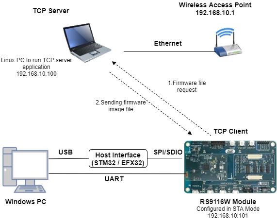
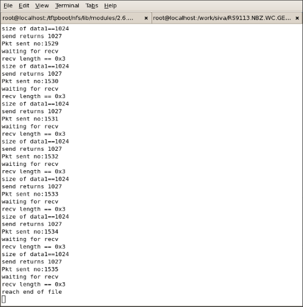
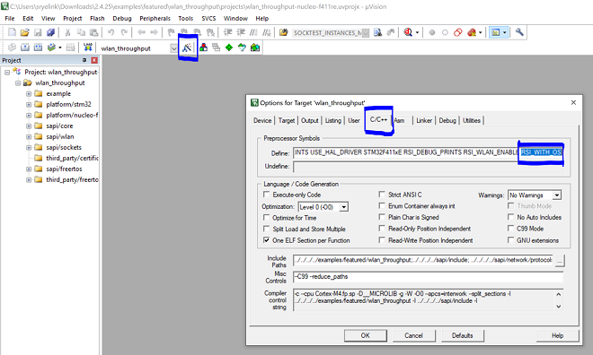

# Firmware Update

## Introduction

This application demonstrates how to update the RS9116W firmware via Wi-Fi by downloading an image from a remote TCP server. The TCP server may be hosted on a local PC (as demonstrated in this example), or alternately on a cloud service such as Amazon AWS or Microsoft Azure. The update process works as follows:
  - The RS9116W connects via Wi-Fi as a TCP client to a TCP update server
  - The RS9116W OTA application sends a firmware file request to the server
  - The server responds with the firmware file
  - The OTA application programs the firmware into the RS9116 flash memory and reboots

## Setting Up 
To use this application, the following hardware, software and project setup is required.

### Hardware Requirements	
  - Windows PC with Host interface (UART / SPI/ SDIO).
  - Linux PC or Cygwin on Windows (to build and run the TCP server source provided)
  - Silicon Labs [RS9116 Wi-Fi Evaluation Kit](https://www.silabs.com/development-tools/wireless/wi-fi/rs9116x-sb-evk-development-kit)
  - Host MCU Eval Kit. This example has been tested with:
    - Silicon Labs [WSTK + EFR32MG21](https://www.silabs.com/development-tools/wireless/efr32xg21-bluetooth-starter-kit)
    - STM32F411 Nucleo
  - Wi-Fi Access point with a connection to the internet



### Software Requirements
  - [WiSeConnect SDK](https://github.com/SiliconLabs/wiseconnect-wifi-bt-sdk/)
  - Embedded Development Environment
    - For Silicon Labs EFx32, use the latest version of [Simplicity Studio](https://www.silabs.com/developers/simplicity-studio).
    - For STM32, use [Keil](https://www.keil.com/demo/eval/arm.htm)
  - Installation of Build tools for Linux including the gcc compiler (or equivalent on PC or Mac)
    - For Ubuntu, use the following command for installation: `user@ubuntu:~$ sudo apt install build-essential`
	- If you don't have Linux, [Cygwin for Windows](https://www.cygwin.com/) may be used instead

### Project Setup
  - **Silicon Labs EFx32 Host**. Follow the the [Getting Started with EFx32](https://docs.silabs.com/rs9116-wiseconnect/latest/wifibt-wc-getting-started-with-efx32/) to setup the example to work with EFx32 and Simplicity Studio.
  - **STM32F411 Host**. Follow the the [Getting Started with STM32](https://docs.silabs.com/rs9116-wiseconnect/latest/wifibt-wc-getting-started-with-stm32/) to setup the example to work with STM32 and Keil.

## Configuring the Application
The application can be configured to suit your requirements and development environment.
Read through the following sections and make any changes needed. 

### Host Interface

* By default, the application is configured to use the SPI bus for interfacing between Host platforms(STM32F411 Nucleo / EFR32MG21) and the RS9116W EVK.

	 **Note:** This application is under development in EFM32 host platform.
	 
### Bare Metal/RTOS Support
To select a bare metal configuration, see [Selecting bare metal](#selecting-bare-metal).

### Wi-Fi Configuration
Configure the following parameters in [rsi_firmware_update_app.c](https://github.com/SiliconLabs/wiseconnect-wifi-bt-sdk/tree/master/examples/featured/firmware_update/rsi_firmware_update_app.c) to enable your Silicon Labs Wi-Fi device to connect to your Wi-Fi network.

```c
#define SSID           "SILABS_AP"      // Wi-Fi Network Name
#define PSK            "1234567890"     // Wi-Fi Password
#define SECURITY_TYPE  RSI_WPA2         // Wi-Fi Security Type: RSI_OPEN / RSI_WPA / RSI_WPA2
```

### TCP Configuration

```c
#define DEVICE_PORT        5001        // TCP client port of the local RS9116 TCP client
#define SERVER_PORT        5001        // TCP server port of the remote TCP server
#define SERVER_IP_ADDRESS  0x6400A8C0  // Server IP address in little endian byte order: 
                                       //   192.168.0.100 -> 0x64=100, 0x00=0, 0xA8=168, 0xC0=192
```

# Testing Firmware Udpates
Before a test of the RS9116 firwmare update application can be performed, the TCP server first needs to be setup and started.

## Build and run the TCP Server
  1. Copy the TCP server application [firmware_update_tcp_server.c](https://github.com/SiliconLabs/wiseconnect-wifi-bt-sdk/tree/master/examples/featured/firmware_update/firmware_update_tcp_server.c) provided with the application source to a Linux PC connected to the Wi-Fi access point. 
  2. Compile the application
> `user@linux:~$ gcc firmware_update_tcp_server.c` -o ota_server.bin
  3. Run the application providing the TCP port number (specified in the RS9116 app) together with the firmware file and path
> `user@linux:~$ ./ota_server.bin 5001 RS9116.NBZ.WC.GEN.OSI.x.x.x.rps`

... where [RS9116.NBZ.WC.GEN.OSI.x.x.x.rps](https://github.com/SiliconLabs/wiseconnect-wifi-bt-sdk/tree/master/firmware) is the firmware image to be sent to RS9116.

## Running the Application
After making any custom configuration changes requried, build, download and run the application as described in the [EFx32 Getting Started](https://docs.silabs.com/rs9116-wiseconnect/latest/wifibt-wc-getting-started-with-efx32/) or [STM32 Getting Started](https://docs.silabs.com/rs9116-wiseconnect/latest/wifibt-wc-getting-started-with-stm32/). 

When the application runs and connects to the TCP server, the firmware image transfer occurs in chunks. The app requests a firmware chunk, the server sends the chunk, the app requests the next chunk, the server sends the chunk, and so forth until the entire transfer completes. As the transfer proceeds, progress is printed to the serial console. On completion, the console prints 'reach end of file'.



When the firmware update completes, the RS9116 should be rebooted after which it may take a few minutes to overwrite the old firmware with the new firmware in flash memory.

# Selecting Bare Metal
The application has been designed to work with FreeRTOS and Bare Metal configurations. By default, the application project files (Keil and Simplicity studio) are configured with FreeRTOS enabled. The following steps demonstrate how to configure Simplicity Studio and Keil to test the application in a Bare Metal environment.

## Bare Metal with Simplicity Studio
> - Open the project in Simplicity Studio
> - Right click on the project and choose 'Properties'
> - Go to 'C/C++ Build' | 'Settings' | 'GNU ARM C Compiler' | 'Symbols' and remove macro 'RSI_WITH_OS=1'
> - Select 'Apply' and 'OK' to save the settings

 


## Bare Metal with Keil
> - Open the project in Keil and select 'Options for Target'
> - Go to the 'C/C++' tab and remove 'RSI_WITH_OS' macro present under Preprocessor Symbols
> - Select 'OK' to save the settings
      
 

## Compressed Debug Logging

To enable the compressed debug logging feature please refer to [Logging User Guide](https://docs.silabs.com/rs9116-wiseconnect/latest/wifibt-wc-sapi-reference/logging-user-guide)