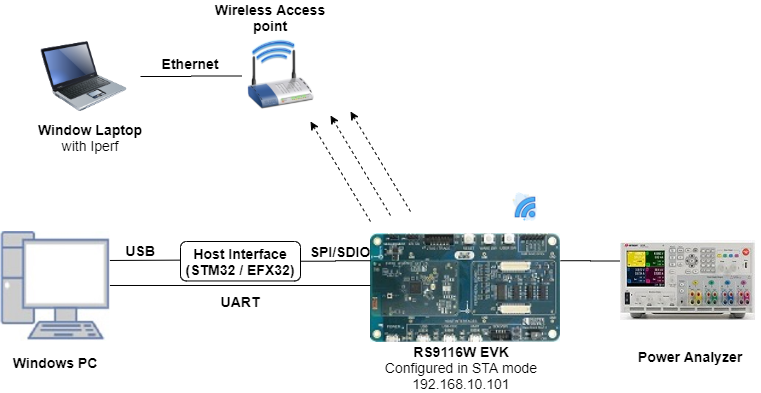
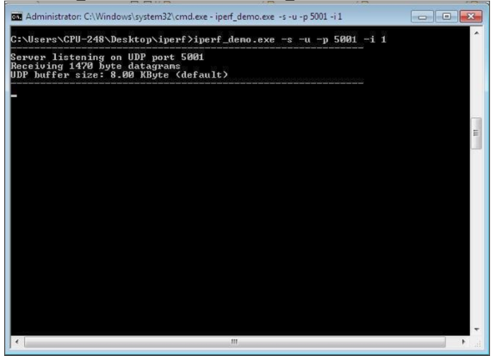
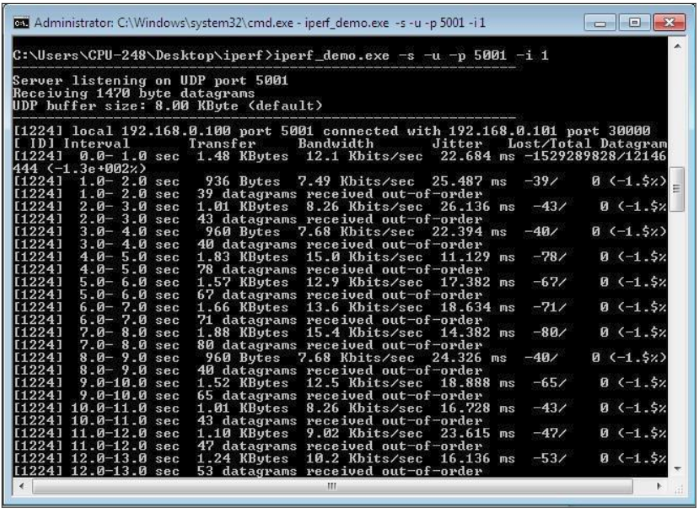
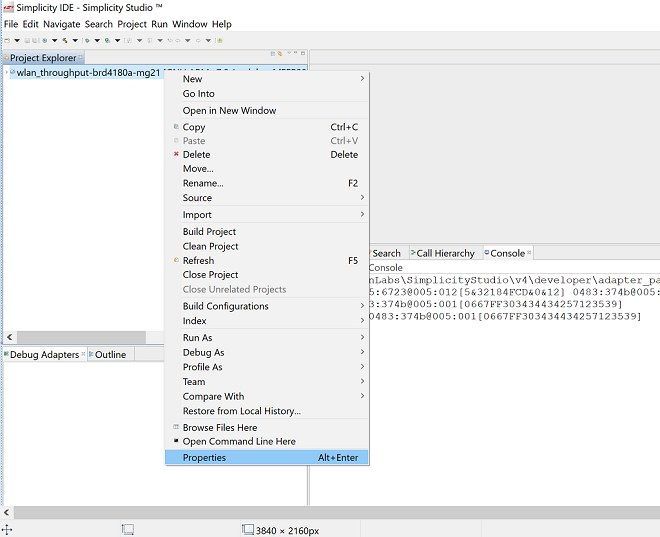

# Powersave Standby Associated

## Introduction

This application demonstrates the process for configuring the RS9116 WiSeConnect EVK in power save profile mode 2.
It provides steps to configure the RS9116W EVK in station mode and then initiate a connection to an Access point to send UDP data to a remote server in  power save mode.

The application enables analysis of various power save profiles using a power analyzer during the Associated state with data transfer via UDP.

## Setting Up 
To use this application, the following hardware, software and project setup is required.

### Hardware Requirements  
  - Windows PC with Host interface (UART / SPI/ SDIO).
  - Silicon Labs [RS9116 Wi-Fi Evaluation Kit](https://www.silabs.com/development-tools/wireless/wi-fi/rs9116x-sb-evk-development-kit)
  - Host MCU Eval Kit. This example has been tested with:
    - Silicon Labs [WSTK + EFR32MG21](https://www.silabs.com/development-tools/wireless/efr32xg21-bluetooth-starter-kit)
    - Silicon Labs [WSTK + EFM32GG11](https://www.silabs.com/development-tools/mcu/32-bit/efm32gg11-starter-kit)
	- [STM32F411 Nucleo](https://st.com/)
  - Wi-Fi Access point with a connection to the internet
  - PC2 (Remote PC) with UDP server application (iperf)
  - Power analyzer

 

### Software Requirements
  - [WiSeConnect SDK](https://github.com/SiliconLabs/wiseconnect-wifi-bt-sdk/)
  - Embedded Development Environment
    - For Silicon Labs EFx32, use the latest version of [Simplicity Studio](https://www.silabs.com/developers/simplicity-studio).
    - For STM32, use [Keil](https://www.keil.com/demo/eval/arm.htm)
  - [Iperf Application](https://iperf.fr/iperf-download.php)
   
### Project Setup
  - **Silicon Labs EFx32 Host**. Follow the the [Getting Started with EFx32](https://docs.silabs.com/rs9116-wiseconnect/latest/wifibt-wc-getting-started-with-efx32/) to setup the example to work with EFx32 and Simplicity Studio.
  - **STM32F411 Host**. Follow the the [Getting Started with STM32](https://docs.silabs.com/rs9116-wiseconnect/latest/wifibt-wc-getting-started-with-stm32/) to setup the example to work with STM32 and Keil.


## Configuring the Application
The application can be configured to suit your requirements and development environment.
Read through the following sections and make any changes needed. 

### Host Interface

* By default, the application is configured to use the SPI bus for interfacing between Host platforms(STM32F411 Nucleo / EFR32MG21) and the RS9116W EVK.
* This application is also configured to use the SDIO bus for interfacing between Host platforms(EFM32GG11) and the RS9116W EVK.

### Bare Metal/RTOS Support
To select a bare metal configuration, see [Selecting bare metal](#selecting-bare-metal).

### Wi-Fi Configuration
Configure the following parameters in [rsi_aws_device_shadow.c](https://github.com/SiliconLabs/wiseconnect-wifi-bt-sdk/tree/master/examples/featured/powersave_standby_associated/rsi_wlan_connected_sleep_app.c) to enable your Silicon Labs Wi-Fi device to connect to your Wi-Fi network.

```c
#define SSID           "SILABS_AP"      // Wi-Fi Network Name
#define PSK            "1234567890"     // Wi-Fi Password
#define SECURITY_TYPE  RSI_WPA2         // Wi-Fi Security Type: RSI_OPEN / RSI_WPA / RSI_WPA2
```

### Iperf Configuration
- `SERVER_PORT` is the remote UDP server port number on the PC running Iperf.
- `SERVER_IP_ADDRESS` is the remote UDP server IP address on the PC running Iperf. IP address should be in long format and in little endian byte order Example: To configure "192.168.10.100" as the IP address, update the macro `DEVICE_IP` as `0x640AA8C0`

```c
  #define SERVER_PORT        <remote port>
  #define SERVER_IP_ADDRESS  0x640AA8C0      // 192.168.10.100 => | 0x64 = 100 | 0x0A = 10 | 0xA8 = 168 | 0xC0 = 192 |
```

### Memory & Throughput
  - `NUMBER_OF_PACKETS` controls the number of packets sent to the remote UDP server.
  - `GLOBAL_BUFF_LEN` sets the application memory size (in bytes) used by the driver.

```c
  #define NUMBER_OF_PACKETS  <number of packets>
  #define GLOBAL_BUFF_LEN    15000
```


### RTOS Options
The following parameters are configured when FreeRTOS is used.

```c
  #define RSI_WLAN_TASK_PRIORITY        1   // Should be low priority
  #define RSI_DRIVER_TASK_PRIORITY      2   // Should be highest priority 
  #define RSI_WLAN_TASK_STACK_SIZE    500   
  #define RSI_DRIVER_TASK_STACK_SIZE  500
```   


### Major Powersave Options
The primary powersave settings are configured with `PSP_MODE` and `PSP_TYPE`. The default power save mode is set to low power mode 2 (`RSI_SLEEP_MODE_2`) with maximum power save (`RSI_MAX_PSP`) and with message based handshake as follows.

```c
  #define PSP_MODE  RSI_SLEEP_MODE_2
  #define PSP_TYPE  RSI_MAX_PSP
```

`PSP_MODE` refers to the power save profile mode. RS9116W EVK supports the following power modes:

  - `RSI_ACTIVE` : In this mode, RS9116W EVK is active and power save is disabled.
  - `RSI_SLEEP_MODE_1` : In this mode, RS9116W EVK goes to power save after association with the Access Point. In this sleep mode, SoC will never turn off, therefore no handshake is required before sending data to the RS9116W EVK.
  - `RSI_SLEEP_MODE_2` : In this mode, RS9116W EVK goes to power save after association with the Access Point. In this sleep mode, SoC will go to sleep based on GPIO hand shake or Message exchange, therefore handshake is required before sending data to the RS9116W EVK.
  - `RSI_SLEEP_MODE_8` : In this mode, RS9116W EVK goes to power save when it is not in associated state with the Access Point. In this sleep mode, SoC will go to sleep based on GPIO handshake or Message exchange, therefore handshake is required before sending the command to the RS9116W EVK.

---- 

**Note!**
  1. For `RSI_SLEEP_MODE_2` and `RSI_SLEEP_MODE_8` modes, GPIO or Message based handshake can be selected using `RSI_HAND_SHAKE_TYPE` macro which is defined in `rsi_wlan_config.h`.
  2. In this example, `RSI_SLEEP_MODE_2` can be verified with a Message-based handshake. To verify other power modes, change the application as well as GPIO handshake signals.

----

`PSP_TYPE` refers to power save profile type. RS9116W EVK supports following power save profile types:
  - `RSI_MAX_PSP` : In this mode, RS9116W EVK will be in Maximum power save mode. i.e device will wake up for every DTIM beacon and do data Tx and Rx.
  - `RSI_FAST_PSP` : In this mode, RS9116W EVK will disable power save for any Tx/Rx packet for monitor interval of time (monitor interval can be set through macro in `rsi_wlan_config.h` file, default value is 50 ms). If there is no data for monitor interval of time, then RS9116W EVK will again enable power save.
  - `RSI_UAPSD` : This `PSP_TYPE` is used to enable WMM power save.

----

**Note!**
  1. `PSP_TYPE` is valid only when `PSP_MODE` is set to `RSI_SLEEP_MODE_1` or `RSI_SLEEP_MODE_2` mode.
  2. `RSI_UAPSD` power profile type in `PSP_TYPE` is valid only when `RSI_WMM_PS_ENABLE` is enabled in `rsi_wlan_config.h` file.

----


### Additional Powersave Options
Additional powersave options may be configured in [rsi_wlan_config.h](https://github.com/SiliconLabs/wiseconnect-wifi-bt-sdk/tree/master/examples/powersave_standby_associated/rsi_wlan_config.h).
 
```c
  #define CONCURRENT_MODE                     RSI_DISABLE
  #define RSI_FEATURE_BIT_MAP                 (FEAT_SECURITY_OPEN | FEAT_AGGREGATION | FEAT_ULP_GPIO_BASED_HANDSHAKE)
  #define RSI_TCP_IP_BYPASS                   RSI_DISABLE
  #define RSI_TCP_IP_FEATURE_BIT_MAP          (TCP_IP_FEAT_EXTENSION_VALID | TCP_IP_FEAT_DHCPV4_CLIENT)
  #define RSI_CUSTOM_FEATURE_BIT_MAP          FEAT_CUSTOM_FEAT_EXTENTION_VALID
  #define RSI_EXT_CUSTOM_FEATURE_BIT_MAP      (EXT_FEAT_LOW_POWER_MODE | EXT_FEAT_XTAL_CLK_ENABLE)
  #define RSI_EXT_TCPIP_FEATURE_BITMAP        CONFIG_FEAT_EXTENTION_VALID
  #define RSI_CONFIG_FEATURE_BITMAP           RSI_FEAT_SLEEP_GPIO_SEL_BITMAP
  #define RSI_BAND                            RSI_BAND_2P4GHZ
  
  The default configuration of low power_save_mode_2 is:
  
  #define RSI_HAND_SHAKE_TYPE                 GPIO_BASED
  #define RSI_SELECT_LP_OR_ULP_MODE           RSI_ULP_WITH_RAM_RET
  #define RSI_DTIM_ALIGNED_TYPE               0
  #define RSI_MONITOR_INTERVAL                50
  #define RSI_WMM_PS_ENABLE                   RSI_DISABLE
  #define RSI_WMM_PS_TYPE                     0
  #define RSI_WMM_PS_WAKE_INTERVAL            20
  #define RSI_WMM_PS_UAPSD_BITMAP             15
```

The application defaults to the `RSI_SLEEP_MODE_2` configuration. Other powersave options are possible by choosing different powersave modes according to the following description.
- `RSI_HAND_SHAKE_TYPE` is used to select the hand shake type (GPIO or Message) in `RSI_SLEEP_MODE_2` and `RSI_SLEEP_MODE_8` modes.
- `RSI_SELECT_LP_OR_ULP_MODE` is used to select low power mode or ultra-low power mode. Valid configurations are 
  - `RSI_LP_MODE` - RS9116W will be in Ultra low power mode.
  - `RSI_ULP_WITH_RAM_RET` - RS9116W will be in Ultra low power mode and will remember the previous state after issuing the power save mode command.
  - `RSI_ULP_WITHOUT_RAM_RET` - RS9116W will be in Ultra low power mode and it will not remember the previous state after issuing power save mode command. After wakeup, RS9116W will give CARD READY indication and user has to issue commands from wireless initialization.
- `RSI_DTIM_ALIGNED_TYPE` is used to decide whether RS9116W has to wake up at normal beacon or DTIM beacon which is just before listen interval.
  - `RSI_DTIM_ALIGNED_TYPE = 0` - RS9116W will wake up at normal beacon which is just before listen interval.
  - `RSI_DTIM_ALIGNED_TYPE = 1` - RS9116W will wake up at DTIM beacon which is just before listen interval.
- `RSI_MONITOR_INTERVAL` refers to the amount of time (in ms) to wait for Tx or Rx before giving power save indication to the connected Access Point. This macro is applicable only when `PSP_TYPE` selected as `RSI_FAST_PSP`
- `RSI_WMM_PS_ENABLE` is used to enable or disable WMM power save.
- `RSI_WMM_PS_TYPE` is used to set Tx-based or Periodic-based WMM power save. Set `RSI_WMM_PS_TYPE = 0` for Tx based or `=1` for periodic based WMM power save.
- `RSI_WMM_PS_WAKE_INTERVAL` refers to the periodic time (in ms) in which the module has to wake up when `RSI_WMM_PS_TYPE` is selected as Periodic.
- `RSI_WMM_PS_UAPSD_BITMAP` refers to the UAPSD bitmap. If `RSI_WMM_PS_ENABLE` is enabled, then `PSP_TYPE` must be set to `RSI_UAPSD` in order to WMM power save to work.


# Testing the Application
After making any custom configuration changes required, build, download and run the application as described in the [EFx32 Getting Started](https://docs.silabs.com/rs9116-wiseconnect/latest/wifibt-wc-getting-started-with-efx32/) or [STM32 Getting Started](https://docs.silabs.com/rs9116-wiseconnect/latest/wifibt-wc-getting-started-with-efx32/). 

Open a command prompt on the remote PC connected to the Wi-Fi access point.
Start a UDP server using the below command in command prompt.

> `C:\ iperf.exe –s -u -p <SERVER_PORT> -i 1` 




When the powersave application runs, RS9116W scans and connect to the Wi-Fi access point and obtains an IP address. After a successful connection, the device goes into configured power save and sends configured number of UDP packets to the remote peer which is connected to access point. The following image shows active reception of UDP data on the UDP server.
 


# Selecting Bare Metal
The application has been designed to work with FreeRTOS and Bare Metal configurations. By default, the application project files (Keil and Simplicity studio) are configured with FreeRTOS enabled. The following steps demonstrate how to configure Simplicity Studio and Keil to test the application in a Bare Metal environment.

## Bare Metal with Simplicity Studio
> - Open the project in Simplicity Studio
> - Right click on the project and choose 'Properties'
> - Go to 'C/C++ Build' | 'Settings' | 'GNU ARM C Compiler' | 'Symbols' and remove macro 'RSI_WITH_OS=1'
> - Select 'Apply' and 'OK' to save the settings

 


## Bare Metal with Keil
> - Open the project in Keil and select 'Options for Target'
> - Go to the 'C/C++' tab and remove 'RSI_WITH_OS' macro present under Preprocessor Symbols
> - Select 'OK' to save the settings
      
 

## Compressed Debug Logging

To enable the compressed debug logging feature please refer to [Logging User Guide](https://docs.silabs.com/rs9116-wiseconnect/latest/wifibt-wc-sapi-reference/logging-user-guide)