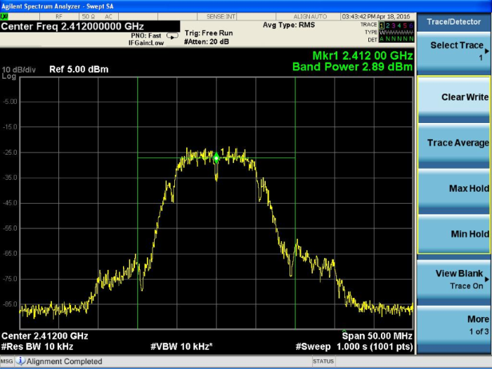
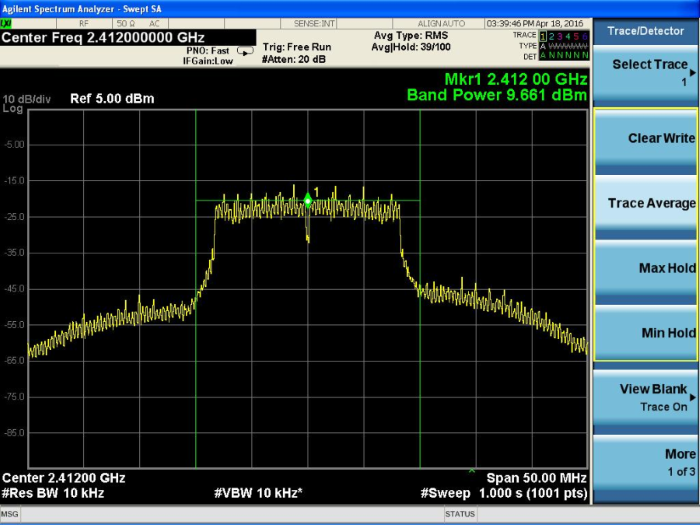

# WLAN RF Test

## Introduction
This application demonstrates how to configure the RS9116W to transmit Wi-Fi packets at varying data rates and power levels. The application can be used to assist with regulatory certification testing. 

## Setting Up
To use this application, the following hardware, software and project setup is required.

### Hardware Requirements  
- Windows PC with Host interface (UART / SPI/ SDIO).
- Silicon Labs [RS9116 Wi-Fi Evaluation Kit](https://www.silabs.com/development-tools/wireless/wi-fi/rs9116x-sb-evk-development-kit)
- Host MCU Eval Kit. This example has been tested with:
  - Silicon Labs [WSTK + EFR32MG21](https://www.silabs.com/development-tools/wireless/efr32xg21-bluetooth-starter-kit)
  - Silicon Labs [WSTK + EFM32GG11](https://www.silabs.com/development-tools/mcu/32-bit/efm32gg11-starter-kit)
  - [STM32F411 Nucleo](https://st.com/) 
- Spectrum Analyzer and/or Power Analyzer
 


### Software Requirements
- [WiSeConnect SDK](https://github.com/SiliconLabs/wiseconnect-wifi-bt-sdk/)
- Embedded Development Environment
  - For Silicon Labs EFx32, use the latest version of [Simplicity Studio](https://www.silabs.com/developers/simplicity-studio).
  - For STM32, use [Keil](https://www.keil.com/demo/eval/arm.htm)
	
### Project Setup
- **Silicon Labs EFx32 Host**. Follow the the [Getting Started with EFx32](https://docs.silabs.com/rs9116-wiseconnect/latest/wifibt-wc-getting-started-with-efx32/) to setup the example to work with EFx32 and Simplicity Studio.
- **STM32F411 Host**. Follow the the [Getting Started with STM32](https://docs.silabs.com/rs9116-wiseconnect/latest/wifibt-wc-getting-started-with-stm32/) to setup the example to work with STM32 and Keil.


## Configuring the Application
The application can be configured to suit your requirements and development environment.
Read through the following sections and make any changes needed. 

### Host Interface

* By default, the application is configured to use the SPI bus for interfacing between Host platforms(STM32F411 Nucleo / EFR32MG21) and the RS9116W EVK.
* This application is also configured to use the SDIO bus for interfacing between Host platforms(EFM32GG11) and the RS9116W EVK.

### Bare Metal/RTOS Support
To select a bare metal configuration, see [Selecting bare metal](#selecting-bare-metal).

### Wi-Fi Radio Configuration
Configure the following parameters in [rsi_wlan_rf_test.c](https://github.com/SiliconLabs/wiseconnect-wifi-bt-sdk/tree/master/examples/featured/wlan_rf_test/rsi_wlan_rf_test.c).

```c
  #define RSI_TX_TEST_POWER    4               // Tx RF power in the range [2:18] dBm
  #define RSI_TX_TEST_RATE     RSI_RATE_1      // WLAN data rate, see sapi/include/rsi_wlan_apis.h for details
  #define RSI_TX_TEST_LENGTH   30              // Tx packet length in the range [24:1500] bytes in burst mode, 
                                               //                               [24:260 ] bytes in continuous mode
  #define RSI_TX_TEST_MODE     RSI_BURST_MODE  // Selects burst mode or continuous mode
  #define RSI_TX_TEST_CHANNEL  1               // Channel number in 2.4 or 5 GHz
  #define RSI_ANTENNA          1               // 0 = RF_OUT2, 1 = RF_OUT1
  #define RSI_ANTENNA_GAIN_2G  0               // Gain in 2.4 GHz band in the range [0:10]
  #define RSI_ANTENNA_GAIN_5G  0               // Gain in 5 GHz band in the range [0:10]
```
Configure the following parameters in [rsi_wlan_config.h](https://github.com/SiliconLabs/wiseconnect-wifi-bt-sdk/tree/master/examples/featured/wlan_rf_test/rsi_wlan_config.h).
  
```c  
   #define RSI_TX_TEST_NUM_PKTS  0               // To configure number of packets to be sent.
                                                // If the macro is set as n, then n number of packets will be 
                                                // sent on-air, after that transmission will be stopped.
                                                // If this macro is set as 0 then packets will be sent 
                                                // continuously until user stops the transmission.
```
											
# Run the Application
After making any custom configuration changes required, build, download and run the application as described in the [EFx32 Getting Started](https://docs.silabs.com/rs9116-wiseconnect/latest/wifibt-wc-getting-started-with-efx32/) or [STM32 Getting Started](https://docs.silabs.com/rs9116-wiseconnect/latest/wifibt-wc-getting-started-with-efx32/). 

When the application runs, the RS9116W starts transmitting using the configuration settings. A power meter or spectrum analyzer may be used to monitor the RF output power and spectrum.

The following images provides example spectrums when the RS9116W is configured to transmit with the settings shown.

## Transmit Spectrum Example : +4 dBm, 1 Mbit/s (DSSS)
```c
  #define RSI_TX_TEST_POWER    4                // 4 dBm
  #define RSI_TX_TEST_RATE     1                // 1 Mbit/s
  #define RSI_TX_TEST_LENGTH   30               // 30 bytes
  #define RSI_TX_TEST_MODE     RSI_BURST_MODE   // Burst mode
  #define RSI_TX_TEST_CHANNEL  1                // Channel 1 = 2412 MHz
```



## Transmit Spectrum Example : +12 dBm, 6 Mbit/s (OFDM)
```c
#define RSI_TX_TEST_POWER    12               // 12 dBm  
#define RSI_TX_TEST_RATE     6                // 6 Mbit/s 
#define RSI_TX_TEST_LENGTH   30               // 30 bytes 
#define RSI_TX_TEST_MODE     RSI_BURST_MODE   // Burst mode 
#define RSI_TX_TEST_CHANNEL  1                // Channel 1 = 2412 MHz
```



# Selecting Bare Metal
The application has been designed to work with FreeRTOS and Bare Metal configurations. By default, the application project files (Keil and Simplicity studio) are configured with FreeRTOS enabled. The following steps demonstrate how to configure Simplicity Studio and Keil to test the application in a Bare Metal environment.

## Bare Metal with Simplicity Studio
> - Open the project in Simplicity Studio
> - Right click on the project and choose 'Properties'
> - Go to 'C/C++ Build' | 'Settings' | 'GNU ARM C Compiler' | 'Symbols' and remove macro 'RSI_WITH_OS=1'
> - Select 'Apply' and 'OK' to save the settings

 


## Bare Metal with Keil
> - Open the project in Keil and select 'Options for Target'
> - Go to the 'C/C++' tab and remove 'RSI_WITH_OS' macro present under Preprocessor Symbols
> - Select 'OK' to save the settings
      
 

## Compressed Debug Logging

To enable the compressed debug logging feature please refer to [Logging User Guide](https://docs.silabs.com/rs9116-wiseconnect/latest/wifibt-wc-sapi-reference/logging-user-guide)