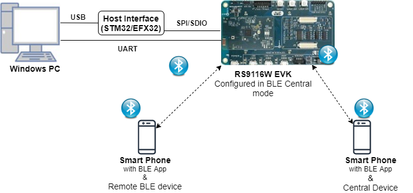
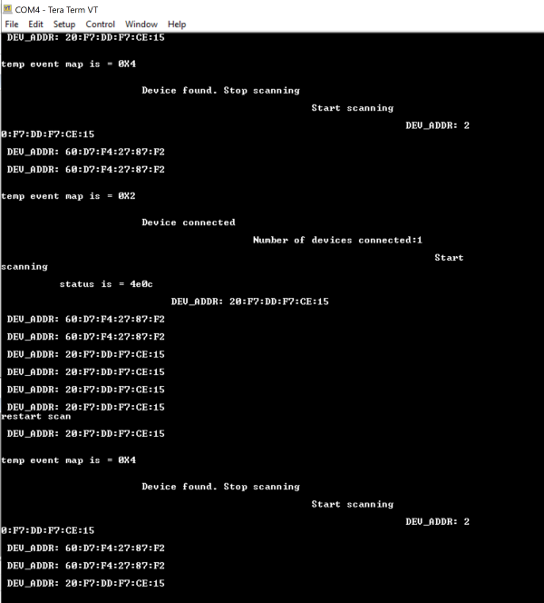

# BLE Dual Role

## 1. Purpose / Scope

This application demonstrates how to configure/connect RS9116W EVK with multiple peripherals in central mode and also configure/connect with multiple centrals in peripheral mode.

## 2. Prerequisites / Setup Requirements

Before running the application, the user will need the following things to setup.

### 2.1 Hardware Requirements

- Windows PC with Host interface(UART/ SPI/ SDIO).
- Silicon Labs [RS9116 Wi-Fi Evaluation Kit](https://www.silabs.com/development-tools/wireless/wi-fi/rs9116x-sb-evk-development-kit)
- Host MCU Eval Kit. This example has been tested with:
   - Silicon Labs [WSTK + EFR32MG21](https://www.silabs.com/development-tools/wireless/efr32xg21-bluetooth-starter-kit)
   - Silicon Labs [WSTK + EFM32GG11](https://www.silabs.com/development-tools/mcu/32-bit/efm32gg11-starter-kit)
   - [STM32F411 Nucleo](https://st.com/)
- BLE central devices.
   

   
### 2.2 Software Requirements

- [WiSeConnect SDK](https://github.com/SiliconLabs/wiseconnect-wifi-bt-sdk/)
    
- Embedded Development Environment

   - For STM32, use licensed [Keil IDE](https://www.keil.com/demo/eval/arm.htm)

   - For Silicon Labs EFx32, use the latest version of [Simplicity Studio](https://www.silabs.com/developers/simplicity-studio)
   
- Download and install the Silicon Labs [EFR Connect App](https://www.silabs.com/developers/efr-connect-mobile-app) in the android smart phones for testing BLE applications. Users can also use their choice of BLE apps available in Android/iOS smart phones.

## 3. Application Build Environment

### 3.1 Platform

The Application can be built and executed on below Host platforms
*	[STM32F411 Nucleo](https://st.com/)
*	[WSTK + EFR32MG21](https://www.silabs.com/development-tools/wireless/efr32xg21-bluetooth-starter-kit)
*   [WSTK + EFM32GG11](https://www.silabs.com/development-tools/mcu/32-bit/efm32gg11-starter-kit) 

### 3.2 Host Interface

* By default, the application is configured to use the SPI bus for interfacing between Host platforms(STM32F411 Nucleo / EFR32MG21) and the RS9116W EVK.
* This application is also configured to use the SDIO bus for interfacing between Host platforms(EFM32GG11) and the RS9116W EVK.

### 3.3 Project Configuration

The Application is provided with the project folder containing Keil and Simplicity Studio project files.

*	Keil Project
	- The Keil project is used to evaluate the application on STM32.
	- Project path:  `<SDK>/examples/snippets/ble/ble_dual_role/projects/ble_dual_role-nucleo-f411re.uvprojx`

*	Simplicity Studio
	- The Simplicity Studio project is used to evaluate the application on EFR32MG21.
	- Project path: 
		- If the Radio Board is **BRD4180A** or **BRD4181A**, then access the path `<SDK>/examples/snippets/ble/ble_dual_role/projects/ble_dual_role-brd4180a-mg21.slsproj`
		- If the Radio Board is **BRD4180B** or **BRD4181B**, then access the path `<SDK>/examples/snippets/ble/ble_dual_role/projects/ble_dual_role-brd4180b-mg21.slsproj` 
        - User can find the Radio Board version as given below 


  - EFM32GG11 platform
    - The Simplicity Studio project is used to evaluate the application on EFM32GG11.
      - Project path:`<SDK>/examples/snippets/ble/ble_dual_role/projects/ble_dual_role-brd2204a-gg11.slsproj`
		
### 3.4 Bare Metal/RTOS Support

This application supports bare metal and RTOS environment. By default, the application project files (Keil and Simplicity Studio) are provided with bare metal configuration. 

## 4. Application Configuration Parameterss

The application can be configured to suit your requirements and development environment. Read through the following sections and make any changes needed.

**4.1** Open `rsi_ble_dualrole.c` file and update/modify following macros,

**4.1.1** User must update the below parameters

   `RSI_BLE_LOCAL_NAME` refers the name of the Silicon Labs device to appear during scanning by remote devices.

```c
#define RSI_BLE_LOCAL_NAME                            "BLE_PERIPHERAL"       
```

   `RSI_BLE_DEV_ADDR_TYPE` refers address type of the remote device to connect.

```c
#define RSI_BLE_DEV_ADDR_TYPE                          LE_PUBLIC_ADDRESS
```

   Based on address type of remote device, valid configurations are

   LE_RANDOM_ADDRESS

   LE_PUBLIC_ADDRESS

   `RSI_BLE_DEV_ADDR` refers address of the remote device to connect.
     
```c
#define RSI_BLE_DEV_1_ADDR "00:1A:7D:DA:71:22"
#define RSI_BLE_DEV_2_ADDR "00:1A:7D:DA:71:73"
#define RSI_BLE_DEV_3_ADDR "00:1A:7D:DA:71:63"
#define RSI_BLE_DEV_4_ADDR "00:1A:7D:34:54:66"
#define RSI_BLE_DEV_5_ADDR "00:1A:7D:DA:71:48"
#define RSI_BLE_DEV_6_ADDR "00:1A:7D:DA:71:22"
#define RSI_BLE_DEV_7_ADDR "00:1A:7D:DB:71:21"
#define RSI_BLE_DEV_8_ADDR "00:1A:7D:DA:71:0C"
```

   **Power save configuration**

   By default, The Application is configured without power save.
	 
```c
#define ENABLE_POWER_SAVE 0
```

   If user wants to run the application in power save, modify the below configuration. 
	 
```c
#define ENABLE_POWER_SAVE 1
```

 **4.1.2** The desired parameters are provided below. User can also modify the parameters as per their needs and requirements.

 `RSI_BLE_LOCAL_NAME` refers the name of the Silicon Labs device to appear during scanning by remote devices.

```c
#define RSI_BLE_LOCAL_NAME                            "BLE_PERIPHERAL"   
```

   Following are the event numbers for advertising,connection, Disconnection events and scan restart events.

```c
#define RSI_APP_EVENT_ADV_REPORT                       0x01
#define RSI_APP_EVENT_CONNECTED                        0x02
#define RSI_APP_EVENT_DISCONNECTED                     0x03
#define RSI_BLE_SCAN_RESTART_EVENT                     0x04
```

   Following are the non-configurable macros in the application.

   `BT_GLOBAL_BUFF_LEN` refers Number of bytes required by the application and the driver

```c
#define GLOBAL_BUFF_LEN                             15000
```
   
**4.2** Open `rsi_ble_config.h` file and update/modify following macros,

```c
#define RSI_BLE_PWR_INX                                30
#define RSI_BLE_PWR_SAVE_OPTIONS                       BLE_DISABLE_DUTY_CYCLING
```

   To configure the Nbr of master and No of slaves to be connected
		
```c
#define RSI_BLE_MAX_NBR_SLAVES                         8
#define RSI_BLE_MAX_NBR_MASTERS                        2
```

   **Opermode command parameters**

```c
#define RSI_FEATURE_BIT_MAP                            FEAT_SECURITY_OPEN
#define RSI_TCP_IP_BYPASS                              RSI_DISABLE
#define RSI_TCP_IP_FEATURE_BIT_MAP                     TCP_IP_FEAT_DHCPV4_CLIENT
#define RSI_CUSTOM_FEATURE_BIT_MAP                     FEAT_CUSTOM_FEAT_EXTENTION_VALID
#define RSI_EXT_CUSTOM_FEATURE_BIT_MAP                 0
```

---
**Note!**
`rsi_ble_config.h` files are already set with desired configuration in respective example folders user need not change for each example.

---

## 5. Testing the Application

User has to follow the below steps for the successful execution of the application.

### 5.1 Loading the RS9116W Firmware

Refer [Getting started with PC ](https://docs.silabs.com/rs9116/latest/wiseconnect-getting-started) to load the firmware into RS9116W EVK. The firmware binary is located in `<SDK>/firmware/`


### 5.2 Building the Application on the Host Platform

#### 5.2.1 Using STM32

Refer [STM32 Getting Started](https://docs.silabs.com/rs9116-wiseconnect/latest/wifibt-wc-getting-started-with-efx32/)  

- Open the project `<SDK>/examples/snippets/ble/ble_dual_role/projects/ble_dual_role-nucleo-f411re.uvprojx` in Keil IDE.
- Build and Debug the project
- Check for the RESET pin:
	- If RESET pin is connected from STM32 to RS9116W EVK, then user need not press the RESET button on RS9116W EVK before free run.
	- If RESET pin is not connected from STM32 to RS9116W EVK, then user need to press the RESET button on RS9116W EVK before free run.
- Free run the project
- Then continue the common steps from **Section 5.3**


#### 5.2.2 Using EFX32

Refer [EFx32 Getting Started](https://docs.silabs.com/rs9116-wiseconnect/latest/wifibt-wc-getting-started-with-efx32/), for settin-up EFR & EFM host platforms

- Import the EFR32/EFM32 project from `<SDK>/examples/snippets/ble/ble_dual_role/projects/`
    - Select the appropriate .slsproj as per Radio Board type mentioned in **Section 3.3** for EFR32 board.
   (or)
    - Select the *.brd2204a-gg11.slsproj  for EFM32GG11 board.
- Compile and flash the project in to Host MCU
- Debug the project
- Check for the RESET pin:
	- If RESET pin is connected from STM32 to RS9116W EVK, then user need not press the RESET button on RS9116W EVK before free run
	- If RESET pin is not connected from STM32 to RS9116W EVK, then user need to press the RESET button on RS9116W EVK before free run
- Free run the project
- Then continue the common steps from **Section 5.3**

### 5.3 Common Steps

1. Configure the remote ble device in peripheral mode and put it in advertising mode.

2. After the program gets executed, Silicon Labs device tries to connect with the remote device address specified in the Macros

   **example: RSI_BLE_DEV_1_ADDR**

3. Silicon Labs device also in advertising mode,open an LE app scan and connect from another remote BLE Central device.

4. Observe that the connection is established between the desired device and Silicon Labs device.
 
6. After successful program execution, if Silcon Labs device connects to the remote BLE Central device the prints in teraterm looks as shown below.   

 
	
   **Note:** Maximum we can connect with 2 Remote BLE Centrals. 
   

   **Note:** Examples for ble peripherals: Blue tooth Dongle, mobile application, TA sensor tag


## Compressed Debug Logging

To enable the compressed debug logging feature please refer to [Logging User Guide](https://docs.silabs.com/rs9116-wiseconnect/latest/wifibt-wc-sapi-reference/logging-user-guide)
