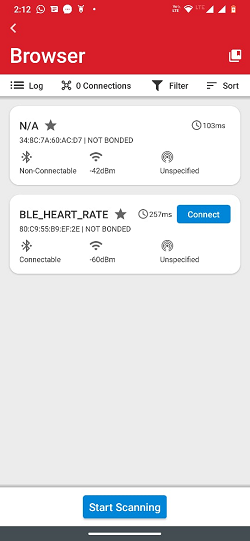
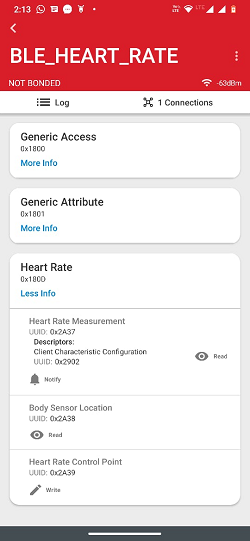
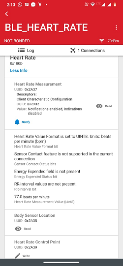
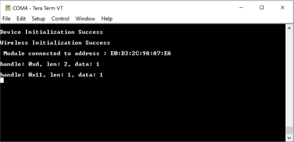

# BLE Heart Rate Profile

## 1. Purpose / Scope

This application demonstrates how to configure RS9116W EVK Heart rate as GATT server in BLE peripheral mode and explains how to do indicate operation with GATT server from connected remote device using GATT client.

Also configure module as GATT client in BLE central mode and enables indicate operation of Heart rate service of connected remote GATT server from GATT client. In this Application, Heart rate GATT server configures with heart rate service with indicate characteristic UUID. 

When connected remote device writes data to writable characteristic UUID, WiseConnect device receives the data which is received on writable characteristic UUID and writes the same data to readable characteristic UUID and sends indications to the connected device (or) remote device can read the same data using read characteristic UUID if indication enabled on client side.

## 2. Prerequisites / Setup Requirements

Before running the application, the user will need the following things to setup.

### 2.1 Hardware Requirements

- Windows PC with Host interface(UART/ SPI/ SDIO).
- Silicon Labs [RS9116 Wi-Fi Evaluation Kit](https://www.silabs.com/development-tools/wireless/wi-fi/rs9116x-sb-evk-development-kit)
- Host MCU Eval Kit. This example has been tested with:
   - Silicon Labs [WSTK + EFR32MG21](https://www.silabs.com/development-tools/wireless/efr32xg21-bluetooth-starter-kit)
   - Silicon Labs [WSTK + EFM32GG11](https://www.silabs.com/development-tools/mcu/32-bit/efm32gg11-starter-kit)
   - [STM32F411 Nucleo](https://st.com/)
- BLE Smart Phone with GATT client


  

### 2.2 Software Requirements

- [WiSeConnect SDK](https://github.com/SiliconLabs/wiseconnect-wifi-bt-sdk/)
    
- Embedded Development Environment

   - For STM32, use licensed [Keil IDE](https://www.keil.com/demo/eval/arm.htm)

   - For Silicon Labs EFx32, use the latest version of [Simplicity Studio](https://www.silabs.com/developers/simplicity-studio)
   
- Download and install the Silicon Labs [EFR Connect App](https://www.silabs.com/developers/efr-connect-mobile-app) in the android smart phones for testing the BLE applications. Users can also use their choice of BLE apps available in Android/iOS smart phones.

## 3. Application Build Environment

### 3.1 Platform

The Application can be built and executed on below Host platforms
*	[STM32F411 Nucleo](https://st.com/)
*	[WSTK + EFR32MG21](https://www.silabs.com/development-tools/wireless/efr32xg21-bluetooth-starter-kit) 
*   [WSTK + EFM32GG11](https://www.silabs.com/development-tools/mcu/32-bit/efm32gg11-starter-kit)

### 3.2 Host Interface

* By default, the application is configured to use the SPI bus for interfacing between Host platforms(STM32F411 Nucleo / EFR32MG21) and the RS9116W EVK.
* This application is also configured to use the SDIO bus for interfacing between Host platforms(EFM32GG11) and the RS9116W EVK.


### 3.3 Project Configuration

The Application is provided with the project folder containing Keil and Simplicity Studio project files.

*	Keil Project
	- The Keil project is used to evaluate the application on STM32.
	- Project path: `<SDK>/examples/snippets/ble/ble_heart_rate_profile/projects/ble_heart_rate_profile-nucleo-f411re.uvprojx`

*	Simplicity Studio
	- EFR32MG21 platform
		- The Simplicity Studio project is used to evaluate the application on EFR32MG21.
		- Project path: 
			- If the Radio Board is **BRD4180A** or **BRD4181A**, then access the path `<SDK>/examples/snippets/ble/ble_heart_rate_profile/projects/ble_heart_rate_profile-brd4180a-mg21.slsproj`
			- If the Radio Board is **BRD4180B** or **BRD4181B**, then access the path `<SDK>/examples/snippets/ble/ble_heart_rate_profile/projects/ble_heart_rate_profile-brd4180b-mg21.slsproj` 
			- User can find the Radio Board version as given below 


	
  - EFM32GG11 platform
    - The Simplicity Studio project is used to evaluate the application on EFM32GG11.
      - Project path:`<SDK>/examples/snippets/ble/ble_heart_rate_profile/projects/ble_heart_rate_profile-brd2204a-gg11.slsproj`
					
### 3.4 Bare Metal/RTOS Support

This application supports bare metal and RTOS environment. By default, the application project files (Keil and Simplicity Studio) are provided with bare metal configuration. 

## 4. Application Configuration Parameters

The application can be configured to suit your requirements and development environment. Read through the following sections and make any changes needed.

**4.1** Open `rsi_ble_heart_rate.c` file and update/modify following macros,

**4.1.1** User must update the below parameters

   **GATT\_ROLE** refers the role of the Silicon Labs module to be selected.

   If user configures, **SERVER**, Silicon Labs module will act as GATT SERVER, means will add heart rate profile.

   If user configures, **CLIENT**, Silicon Labs module will act as GATT CLIENT, means will connect to remote GATT server and get services and enable notify.

```c
#define GATT_ROLE                                     SERVER
```

   `RSI_BLE_DEV_ADDR_TYPE` refers address type of the remote device to connect.

```c
#define RSI_BLE_DEV_ADDR_TYPE                         LE_PUBLIC_ADDRESS
```

   Valid configurations based on address type of the remote device are

   LE_RANDOM_ADDRESS

   LE_PUBLIC_ADDRESS

   **Note:** Depends on the remote device, address type will be changed. 
   

   `RSI_BLE_DEV_ADDR` refers address of the remote device to connect.

```c
#define RSI_BLE_DEV_ADDR                              "00:23:A7:80:70:B9"
```

   `RSI_REMOTE_DEVICE_NAME` refers the name of remote device to which Silicon Labs device has to connect.

```c
#define RSI_REMOTE_DEVICE_NAME                        "SILABS_DEV"
```	

   **Note:**
   Silicon Labs module can connect to remote device by referring either RSI_BLE_DEV_ADDR or RSI_REMOTE_DEVICE_NAME of the remote device.

   **Power save configuration**

   By default, The Application is configured without power save.
	 
```c
#define ENABLE_POWER_SAVE 0
```

   If user wants to run the application in power save, modify the below configuration. 
	 
```c
#define ENABLE_POWER_SAVE 1 
```

**4.1.2** The desired parameters are provided below. User can also modify the parameters as per their needs and requirements
   
   `RSI_BLE_HEART_RATE_UUID` refers to the attribute value of the newly created service.

```c
#define RSI_BLE_HEART_RATE_SERVICE_UUID                0x180D
```

   `RSI_BLE_HEART_RATE_MEASUREMENT_UUID` refers to the attribute type of the first attribute under this service (RSI_BLE_HEART_RATE_SERVICE_UUID`).

```c
#define RSI_BLE_HEART_RATE_MEASUREMENT_UUID            0x2A37
```

   `RSI_BLE_SENSOR_LOCATION_UUID` refers to the attribute type of the second attribute under this service (RSI_BLE_HEART_RATE_SERVICE_UUID`).

```c
#define RSI_BLE_SENSOR_LOCATION_UUID                   0x2A38
```

   `RSI_BLE_HEART_RATE_CONTROL_POINT_UUID` refers to the attribute type of the second attribute under this service (`RSI_BLE_HEART_RATE_SERVICE_UUID`).

```c
#define RSI_BLE_HEART_RATE_CONTROL_POINT_UUID          0x2A39
```

   `RSI_BLE_MAX_DATA_LEN` refers to the Maximum length of the attribute data.

```c
#define RSI_BLE_MAX_DATA_LEN                           20
```

   `BLE_HEART_RATE_PROFILE` refers name of the Repine device to appear during scanning by remote devices.

```c
#define RSI_BLE_HEART_RATE_PROFILE                     "BLE_HEART_RATE_PROFILE"
```

   Following are the **non-configurable** macros in the application.

   `RSI_BLE_CHAR_SERV_UUID` refers to the attribute type of the characteristics to be added in a service.

```c
#define RSI_BLE_CHAR_SERV_UUID                         0x2803
```

   `RSI_BLE_CLIENT_CHAR_UUID` refers to the attribute type of the client characteristics descriptor to be added in a service.

```c
#define RSI_BLE_CLIENT_CHAR_UUID                       0x2902
```

   `RSI_BLE_ATT_PROPERTY_READ` is used to set the read property to an attribute value.

```c
#define RSI_BLE_ATT_PROPERTY_READ                      0x02
```

   `RSI_BLE_ATT_PROPERTY_WRITE` is used to set the WRITE property to an attribute value.

```c
#define RSI_BLE_ATT_PROPERTY_WRITE                     0x08
```

   `RSI_BLE_ATT_PROPERTY_NOTIFY` is used to set the NOTIFY property to an attribute value.

```c
#define RSI_BLE_ATT_PROPERTY_NOTIFY                    0x10
```

   `BT_GLOBAL_BUFF_LEN` refers Number of bytes required by the application and the driver.

```c
#define BT_GLOBAL_BUFF_LEN                             15000
```

**4.2** Open `rsi_ble_config.h` file and update/modify following macros,

```c
#define RSI_BLE_PWR_INX                               30
#define RSI_BLE_PWR_SAVE_OPTIONS                      0 
```

   Zero indicate to below macro.
   
```c
#define BLE_DISABLE_DUTY_CYCLING 0
#define BLE_DUTY_CYCLING         1
define BLR_DUTY_CYCLING          2
#define BLE_4X_PWR_SAVE_MODE     4
```

   **Opermode command parameters**

```c
#define RSI_FEATURE_BIT_MAP                            FEAT_SECURITY_OPEN
#define RSI_TCP_IP_BYPASS                              RSI_DISABLE
#define RSI_TCP_IP_FEATURE_BIT_MAP                     TCP_IP_FEAT_DHCPV4_CLIENT
#define RSI_CUSTOM_FEATURE_BIT_MAP                     FEAT_CUSTOM_FEAT_EXTENTION_VALID
#define RSI_EXT_CUSTOM_FEATURE_BIT_MAP                 0
```
---
**Note!**
`rsi_ble_config.h` files are already set with desired configuration in respective example folders user need not change for each example.

---

## 5. Testing the Application

User has to follow the below steps for the successful execution of the application.

### 5.1 Loading the RS9116W Firmware

Refer [Getting started with PC ](https://docs.silabs.com/rs9116/latest/wiseconnect-getting-started) to load the firmware into RS9116W EVK. The firmware binary is located in `<SDK>/firmware/`

### 5.2 Building the Application on the Host Platform

#### 5.2.1 Using STM32

Refer [STM32 Getting Started](https://docs.silabs.com/rs9116-wiseconnect/latest/wifibt-wc-getting-started-with-efx32/)  

- Open the project `<SDK>/examples/snippets/ble/ble_heart_rate_profile/projects/ble_heart_rate_profile-nucleo-f411re.uvprojx` in Keil IDE.
- Build and Debug the project
- Check for the RESET pin:
	- If RESET pin is connected from STM32 to RS9116W EVK, then user need not press the RESET button on RS9116W EVK before free run.
	- If RESET pin is not connected from STM32 to RS9116W EVK, then user need to press the RESET button on RS9116W EVK before free run.
- Free run the project
- Then continue the common steps from **Section 5.3**


#### 5.2.2 Using EFX32

Refer [EFx32 Getting Started](https://docs.silabs.com/rs9116-wiseconnect/latest/wifibt-wc-getting-started-with-efx32/), for settin-up EFR & EFM host platforms

- Import the EFR32/EFM32 project from `<SDK>/examples/snippets/ble/ble_heart_rate_profile/projects`
    - Select the appropriate .slsproj as per Radio Board type mentioned in **Section 3.3** for EFR32 board.
   (or)
    - Select the *.brd2204a-gg11.slsproj  for EFM32GG11 board.
- Compile and flash the project in to Host MCU
- Debug the project
- Check for the RESET pin:
	- If RESET pin is connected from EFX32 to RS9116W EVK, then user need not press the RESET button on RS9116W EVK before free run
	- If RESET pin is not connected from EFX32 to RS9116W EVK, then user need to press the RESET button on RS9116W EVK before free run
- Free run the project
- Then continue the common steps from **Section 5.3**

### 5.3 Common Steps

1. After the program gets executed, If Silicon Labs device is configured as **SERVER** specified in the macro **GATT_ROLE**, Silicon Labs will be in Advertising state.

2. Open a LE App in the Smartphone and do the scan.

3. In the App, Silicon Labs module device will appear with the name configured in the macro `RSI_BLE_HEART_RATE_PROFILE (Ex: "BLE_HEART_RATE_PROFILE")` or sometimes observed as Silicon Labs device as internal name "**SimpleBLEPeripheral**".



4. Initiate connection from the App.

5. After successful connection, LE scanner displays the supported services of Silicon Labs module.

6. Select the attribute service which is added `RSI_BLE_HEART_RATE_SERVICE_UUID`

7. Enable notify for the characteristic `RSI_BLE_HEART_RATE_MEASUREMENT_UUID`

   So that GATT server indicates when value updated in that particular attribute.

8. Whenever the value is updated at server it will be notified to the client which can be read at Heart_Rate_Measurement attribute.

9. Refer the below images for notify operation from remote device GATT client.





10. When Silicon Labs device is configured as **CLIENT** specified in the macro **GATT_ROLE**, scans for remote device and tries to connect with the remote device specified in `RSI_BLE_DEV_ADDR or RSI_REMOTE_DEVICE_NAME` macro.

11. Get all GATT profiles of remote device and Search for profile specified in the macro `RSI_BLE_HEART_RATE_SERVICE_UUID`. And get all characteristics of the heartrate service and verify the characteristic `RSI_BLE_HEART_RATE_MEASUREMENT_UUID` which has notify property.

12. Observe notify property is enabled in the GATT server and indicates to the GATT client whenever the value is updated at server .

13. Also observe the updated heart rate measurement value on the teraterm.

14. After successful program execution, if the module configured as SERVER the print in teraterm looks as shown below.



15. After successful program execution, if the module configured as CLIENT the print in teraterm looks as shown below.


## Compressed Debug Logging

To enable the compressed debug logging feature please refer to [Logging User Guide](https://docs.silabs.com/rs9116-wiseconnect/latest/wifibt-wc-sapi-reference/logging-user-guide)