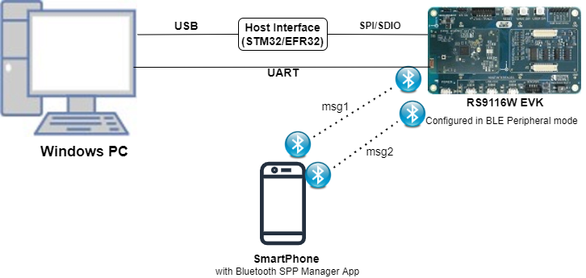
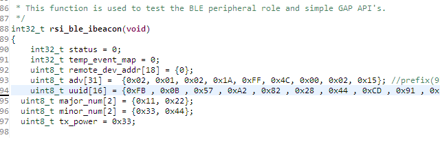
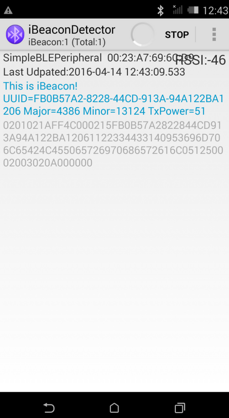

# iBeacon 

## 1. Purpose / Scope

This application demonstrates how to set the iBeacon data format in advertising parameters in  BLE peripheral mode.

## 2. Prerequisites / Setup Requirements

Before running the application, the user will need the following things to setup.

### 2.1 Hardware Requirements

- Windows PC with Host interface(UART/ SPI/ SDIO).
- Silicon Labs [RS9116 Wi-Fi Evaluation Kit](https://www.silabs.com/development-tools/wireless/wi-fi/rs9116x-sb-evk-development-kit)
  - Host MCU Eval Kit. This example has been tested with:
    - Silicon Labs [WSTK + EFR32MG21](https://www.silabs.com/development-tools/wireless/efr32xg21-bluetooth-starter-kit)
  - Silicon Labs [WSTK + EFM32GG11](https://www.silabs.com/development-tools/mcu/32-bit/efm32gg11-starter-kit)
    - [STM32F411 Nucleo](https://st.com/)
- Smart phone with ibeacon detector application
  



### 2.2 Software Requirements

- [WiSeConnect SDK](https://github.com/SiliconLabs/wiseconnect-wifi-bt-sdk/)
    
- Embedded Development Environment

   - For STM32, use licensed [Keil IDE](https://www.keil.com/demo/eval/arm.htm)

   - For Silicon Labs EFx32, use the latest version of [Simplicity Studio](https://www.silabs.com/developers/simplicity-studio)
   
- Download and install the [iBeaconDetector](https://play.google.com/stor/apps/details?id=youten.redo.ble.ibeacondetector) app in the android smart phones for testing BLE applications. Users can also use their choice of BLE apps available in Android/iOS smart phones.

**iBeacon Advertise Data Format**

   iBeacon prefix   UUID        Major Number   Minor Number    TX Power
   9Bytes           16bytes     2Bytes         2 Bytes         1bytes

   Adv Flags        Adv Header  Company ID   iBeacon Type    iBeacon Length
   3 Bytes          2 Bytes     2 Bytes      1Byte           1Bytes

   **iBeacon Prefix:**
   Vendor specific fixed value.
   Default iBeacon prefix values setting by application is,
   Prefix = {0x02, 0x01, 0x02, 0x1A, 0xFF, 0x4C, 0x00, 0x02, 0x15}

   **UUID:**
   User generated proximity UUID.
   Remote devices recognize which beacon they approach on the basis of UUID, major and minor numbers.
   Default UUID, Major and Minor values setting by application is,
   UUID = {0xFB , 0x0B , 0x57 , 0xA2 , 0x82 , 0x28 , 0x44 , 0xCD , 0x91 ,
   0x3A , 0x94 , 0xA1 , 0x22 , 0xBA , 0x12 , 0x06}
   major_num = {0x11, 0x22}
   minor_num = {0x33, 0x44}

   **TX Power** is used to calculate distance from iBeacon.
   Default TX power value setting by application is,
   TX Power = 0x33

   Note:
   If the user wants to change the prefix, UUID, Major number, Minor number and TX Power values, change the following values in rsi_ble_ibeacon.c_ file.

   For Prefix:
   `<span style="color: #005032">uint8_t</span> adv[31] = {0x02, 0x01, 0x02, 0x1A, 0xFF, 0x4C, 0x00, 0x02, 0x15}; //prefix(9bytes)`

   **For UUID:**

   uint8_t uuid[16] = {0xFB , 0x0B , 0x57 , 0xA2 , 0x82 , 0x28 , 0x44 , 0xCD , 0x91 , 0x3A , 0x94 , 0xA1 , 0x22 , 0xBA , 0x12 , 0x06};
   For Major Number:
   uint8_t major_num[2] = {0x11, 0x22};
   For Major Number:
   uint8_t minor_num[2] = {0x33, 0x44};
   For TX Power:
   uint8_t tx_power = 0x33;



## 3. Application Build Environment

### 3.1 Platform

The Application can be built and executed on below Host platforms
*  [STM32F411 Nucleo](https://st.com/)
*  [WSTK + EFR32MG21](https://www.silabs.com/development-tools/wireless/efr32xg21-bluetooth-starter-kit) 
*   [WSTK + EFM32GG11](https://www.silabs.com/development-tools/mcu/32-bit/efm32gg11-starter-kit)

### 3.2 Host Interface

* By default, the application is configured to use the SPI bus for interfacing between Host platforms(STM32F411 Nucleo / EFR32MG21) and the RS9116W EVK.
* This application is also configured to use the SDIO bus for interfacing between Host platforms(EFM32GG11) and the RS9116W EVK.

### 3.3 Project Configuration

The Application is provided with the project folder containing Keil and Simplicity Studio project files.

*  Keil Project
  - The Keil project is used to evaluate the application on STM32.
  - Project path: `<SDK>/examples/snippets/ble/ble_ibeacon/projects/ibeacon-nucleo-f411re.uvprojx`

*  Simplicity Studio
  - The Simplicity Studio project is used to evaluate the application on EFR32MG21.
  - Project path: 
    - If the Radio Board is **BRD4180A** or **BRD4181A**, then access the path `<SDK>/examples/snippets/ble/ble_ibeacon/projects/ibeacon-brd4180a-mg21.slsproj`
    - If the Radio Board is **BRD4180B** or **BRD4181B**, then access the path `<SDK>/examples/snippets/ble/ble_ibeacon/projects/ibeacon-brd4180b-mg21.slsproj` 
        - User can find the Radio Board version as given below 


  - EFM32GG11 platform
    - The Simplicity Studio project is used to evaluate the application on EFM32GG11.
      - Project path:`<SDK>/examples/snippets/ble/ble_ibeacon/projects/ble_ibeacon-brd2204a-gg11.slsproj`
    
### 3.4 Bare Metal/RTOS Support

This application supports bare metal and RTOS environment. By default, the application project files (Keil and Simplicity Studio) are provided with bare metal configuration. 

## 4. Application Configuration Parameters

The application can be configured to suit your requirements and development environment. Read through the following sections and make any changes needed.

**4.1** Open `rsi_ble_ibeacon.c` file and update/modify following macros:

   `RSI_BLE_LOCAL_NAME` refers name of the Silicon Labs device to appear during scanning by remote devices.

```c
#define RSI_BLE_LOCAL_NAME                     "ibeacon"
```

   Following are the event numbers for connection and Disconnection events,

```c
#define RSI_APP_EVENT_CONNECTED                1
#define RSI_APP_EVENT_DISCONNECTED             2
```

   Following are the **non-configurable** macros in the application.
   BT_GLOBAL_BUFF_LEN refers Number of bytes required by the application and the driver

```c
#define BT_GLOBAL_BUFF_LEN                     15000
```

**4.2** Open `rsi_ble_config.h` file and update/modify following macros,

```c
#define RSI_BLE_PWR_INX                        30
#define RSI_BLE_PWR_SAVE_OPTIONS               0
```

   **Opermode command parameters** 
```c
#define RSI_FEATURE_BIT_MAP                    FEAT_SECURITY_OPEN
#define RSI_TCP_IP_BYPASS                      RSI_DISABLE
#define RSI_TCP_IP_FEATURE_BIT_MAP             TCP_IP_FEAT_DHCPV4_CLIENT
#define RSI_CUSTOM_FEATURE_BIT_MAP             FEAT_CUSTOM_FEAT_EXTENTION_VALID
#define RSI_EXT_CUSTOM_FEATURE_BIT_MAP         EXT_FEAT_384K_MODE
```

---
**Note!**
`rsi_ble_config.h` files are already set with desired configuration in respective example folders user need not change for each example.

---
   
## 5. Testing the Application

User has to follow the below steps for the successful execution of the application.

### 5.1 Loading the RS9116W Firmware

Refer [Getting started with PC](https://docs.silabs.com/rs9116/latest/wiseconnect-getting-started) to load the firmware into RS9116W EVK. The firmware binary is located in `<SDK>/firmware/`

### 5.2 Building the Application on the Host Platform

### 5.2.1 Using STM32

Refer [STM32 Getting Started](https://docs.silabs.com/rs9116-wiseconnect/latest/wifibt-wc-getting-started-with-efx32/)  

- Open the project `<SDK>/examples/snippetsble/ble/ble_ibeacon/projects/ibeacon-nucleo-f411re.uvprojx` in Keil IDE.
- Build and Debug the project
- Check for the RESET pin:
  - If RESET pin is connected from STM32 to RS9116W EVK, then user need not press the RESET button on RS9116W EVK before free run.
  - If RESET pin is not connected from STM32 to RS9116W EVK, then user need to press the RESET button on RS9116W EVK before free run.
- Free run the project
- Then continue the common steps from **Section 5.3**


### 5.2.2 Using EFX32

Refer [EFx32 Getting Started](https://docs.silabs.com/rs9116-wiseconnect/latest/wifibt-wc-getting-started-with-efx32/), for settin-up EFR & EFM host platforms

- Import the EFR32/EFM32 project from `<SDK>/examples/snippets/ble/ble_ibeacon/projects`
    - Select the appropriate .slsproj as per Radio Board type mentioned in **Section 3.3** for EFR32 board.
   (or)
    - Select the *.brd2204a-gg11.slsproj  for EFM32GG11 board.
- Compile and flash the project in to Host MCU
- Debug the project
- Check for the RESET pin:
  - If RESET pin is connected from STM32 to RS9116W EVK, then user need not press the RESET button on RS9116W EVK before free run
  - If RESET pin is not connected from STM32 to RS9116W EVK, then user need to press the RESET button on RS9116W EVK before free run
- Free run the project
- Then continue the common steps from **Section 5.3**

### 5.3 Common Steps

1. After the program gets executed, Silicon Labs module would be in Advertising state.

2. Open iBeaconDetector app in the Smartphone and do Scan.

3. In the App, Silicon Labs module device would appear with the name configured in the macro **RSI\_BLE\_LOCAL\_NAME** (Ex: "ibeacon") or sometimes observed as "SimpleBLEPeripheral".

4. After successful scan, user can see the Silicon Labs device advertised data i.e UUID, Maximum Number, Minimum Number and TX Power in iBeaconDetector application.
   



## Compressed Debug Logging

To enable the compressed debug logging feature please refer to [Logging User Guide](https://docs.silabs.com/rs9116-wiseconnect/latest/wifibt-wc-sapi-reference/logging-user-guide)
