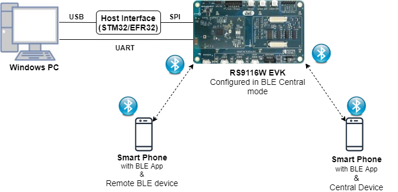
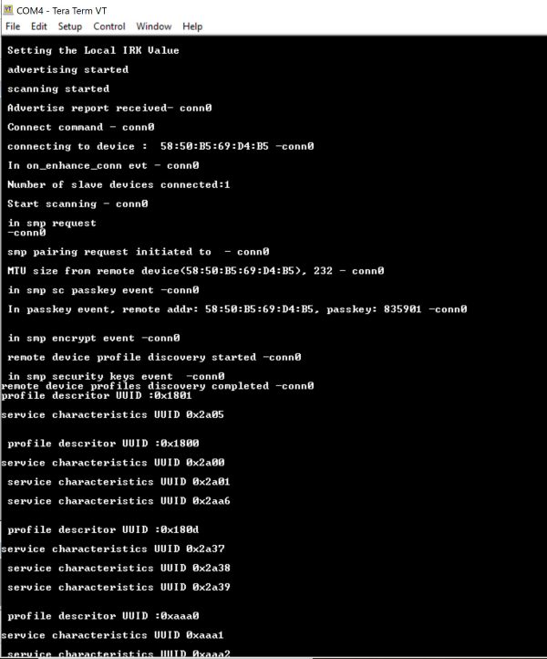
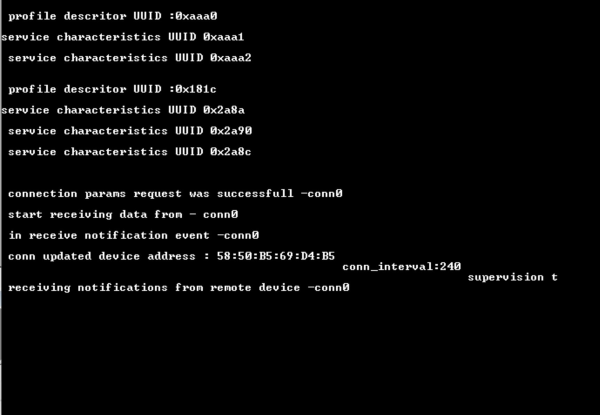
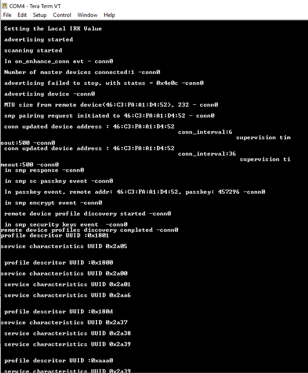
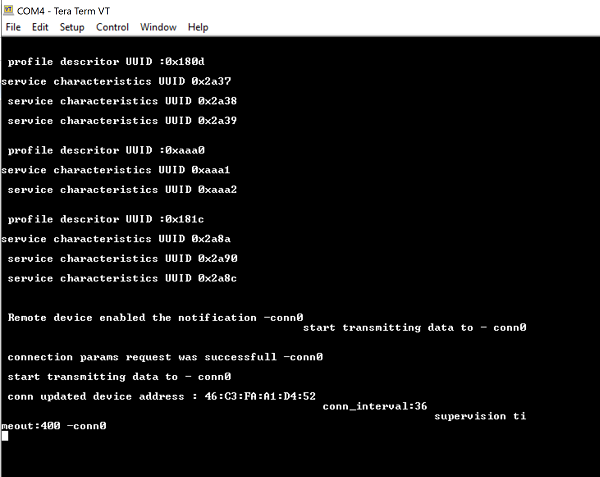

# BLE Multiconnection GATT Test

## 1. Purpose / Scope

The Application demonstrates how to configure RS9116W EVK in central/peripheral modes and then connect with multiple peripherals/centrals.

It provides user to configure secure connection with central and peripheral remote devices and support data transfers. 

This also displays all the remote GATT profiles and service characteristics logs of connected remote device.

## 2. Prerequisites / Setup Requirements

Before running the application, the user will need the following things to setup.

### 2.1 Hardware Requirements

- Windows PC with Host interface(UART/ SPI).
- Silicon Labs [RS9116 Wi-Fi Evaluation Kit](https://www.silabs.com/development-tools/wireless/wi-fi/rs9116x-sb-evk-development-kit)
- Host MCU Eval Kit. This example has been tested with:
   - Silicon Labs [WSTK + EFR32MG21](https://www.silabs.com/development-tools/wireless/efr32xg21-bluetooth-starter-kit)
   - [STM32F411 Nucleo](https://st.com/)
- Smart phone/tablet with BLE Application
- BLE peripheral device
- BLE central device

  

   
### 2.2 Software Requirements

- [WiSeConnect SDK](https://github.com/SiliconLabs/wiseconnect-wifi-bt-sdk/)
    
- Embedded Development Environment

  - For STM32, use licensed [Keil IDE](https://www.keil.com/demo/eval/arm.htm)

   - For Silicon Labs EFx32, use the latest version of [Simplicity Studio](https://www.silabs.com/developers/simplicity-studio)
   
- Download and install the Silicon Labs [EFR Connect App](https://www.silabs.com/developers/efr-connect-mobile-app) in the android smart phones for testing BLE applications. Users can also use their choice of BLE apps available in Android/iOS smart phones.

## 3. Application Build environment

### 3.1 Platform

The Application can be built and executed on below Host platforms
*	[STM32F411 Nucleo](https://st.com/)
*	[WSTK + EFR32MG21](https://www.silabs.com/development-tools/wireless/efr32xg21-bluetooth-starter-kit) 

### 3.2 Host Interface

* By default, the application is configured to use the SPI bus for interfacing between Host platforms and the RS9116W EVK.
* The SAPI driver provides APIs to enable other host interfaces if SPI is not suitable for your needs.

### 3.3 Project Configuration

The Application is provided with the project folder containing Keil and Simplicity Studio project files.

*	Keil Project
	- The Keil project is used to evaluate the application on STM32.
	- Project path: `<SDK>/examples/snippets/ble/ble_multiconnection_gatt_test/projects/ble_multiconnection_gatt_test-nucleo-f411re.uvprojx`

*	Simplicity Studio
	- The Simplicity Studio project is used to evaluate the application on EFR32MG21.
	- Project path: 
		- If the Radio Board is **BRD4180A** or **BRD4181A**, then access the path `<SDK>/examples/snippets/ble/ble_multiconnection_gatt_test/projects/ble_multiconnection_gatt_test-brd4180a-mg21.slsproj`
		- If the Radio Board is **BRD4180B** or **BRD4181B**, then access the path `<SDK>/examples/snippets/ble/ble_multiconnection_gatt_test/projects/ble_multiconnection_gatt_test-brd4180b-mg21.slsproj` 
        - User can find the Radio Board version as given below 


		

### 3.4 RTOS Support

This application supports only RTOS configuration. By default, the application project files (Keil and Simplicity studio) are provided with OS environment in the SDK.

## 4. Application Configuration Parameters

The application can be configured to suit your requirements and development environment. Read through the following sections and make any changes needed.

**4.1** open `rsi_ble_config.h` file provided in the SDK at `examples/snippets/ble/ble_multiconnection_gatt_test` update/modify following macros.

**4.1.1** User must update the below parameters

   To select number of BLE connections, configure below macros.

   Set below macro to required peripheral connections.

```c
#define RSI_BLE_MAX_NBR_SLAVES   1
```

   Set below macro to required master connections.

```c
#define RSI_BLE_MAX_NBR_MASTERS   1
 ```

   ` Note: Maximum no. of  RSI_BLE_MAX_NBR_MASTERS and RSI_BLE_MAX_NBR_SLAVES can be configured to max '3'.`


   If CONNECT_OPTION is set to CONN_BY_NAME, configure below macros.

```c
#define CONNECT_OPTION CONN_BY_NAME //CONN_BY_NAME or CONN_BY_ADDR
```

   To identify remote device with BD Address/device name.

   Add the remote BLE device name to connect

```c
#define RSI_REMOTE_DEVICE_NAME1                       "SILABS_DEV"
#define RSI_REMOTE_DEVICE_NAME2                       "slave22"
#define RSI_REMOTE_DEVICE_NAME3                       "slave3"
```

   If CONNECT_OPTION is set to CONN_BY_ADDR, configure the below macros.

   Configure the address type of remote device as either Public Address or Random Address

```c
#define RSI_BLE_DEV_ADDR_TYPE LE_PUBLIC_ADDRESS //!LE_PUBLIC_ADDRESS or LE_RANDOM_ADDRESS
```

   Add the BD Address of remote BLE device to connect

```c
#define RSI_BLE_DEV_1_ADDR "00:1A:7D:DA:71:16"
#define RSI_BLE_DEV_2_ADDR "00:1A:7D:DA:71:74"
#define RSI_BLE_DEV_3_ADDR "00:1A:7D:DA:73:13"
```

**4.1.2** The desired parameters are provided below. User can also modify the parameters as per their needs and requirements.

   Configure below macros to select each connection configurations,

   **Master1 configurations: (where XX=M1)**

   Set below macro to enable secure connection between Silicon Labs device(peripheral) and remote ble device(central)

```c
#define SMP_ENABLE_XX         0
```

   //By default this macro is set to '0'

   Set below macro to add remote device to whitelist

```c
#define ADD_TO_WHITELIST_XX     0
```

   //By default this macro is set to '0'

   Set below macro to discover remote profiles.

```c
#define PROFILE_QUERY_XX     1
```
   //By default this macro is set to '1'

   Set below macro to enable data transfer between devices

```c
#define DATA_TRANSFER_XX     1
```

   //By default this macro is set to '1'

   To select the type of data transfer configure below macros

   Set below macro to receive 'gatt notifications' from remote device.

```c
#define RX_NOTIFICATIONS_FROM_XX     0
```

   //By default this macro is set to '1'

Note: Make sure to set below macros to 0 #define  RX_INDICATIONS_FROM_XX  0 //Set this to 0 |
  

   Set below macro to receive 'gatt indications' from remote device.

```c
#define RX_INDICATIONS_FROM_XX     0
```

   //By default this macro is set to '0'

   Set below macro to Transmit 'gatt notifications' to remote device.

```c
#define TX_NOTIFICATIONS_TO_XX     1
```

   //By default this macro is set to '1'

   **Note:**
   Make sure to set below macros to 0
   
```c
#define  TX_WRITES_TO_XX        0 //Set this to 0
#define  TX_WRITES_NO_RESP_TO_XX    0 //Set this to 0
#define  TX_INDICATIONS_TO_XX    0 //Set this to 0 
```

   Set below macro to Transmit 'gatt write with response' to remote device.

```c
#define TX_WRITES_TO_XX     0
```

   //By default this macro is set to '0'

   Set below macro to Transmit 'gatt write without response' to remote device.

```c
#define TX_WRITES_NO_RESP_TO_XX     0
```

   //By default this macro is set to '0'

   Set below macro to Transmit 'gatt indications to remote device.

```c
#define TX_INDICATIONS_TO_XX       0
```

   //By default this macro is set to '0'

   To select data length extension for each connection configure below macro

   Set below macro to enable data length extension

```c
#define DLE_ON_XX             0
```

   //By default this macro is set to '0'

## 5. Testing the Application

User has to follow the below steps for the successful execution of the application.

### 5.1 Loading the RS9116W Firmware

Refer [Getting started with PC ](https://docs.silabs.com/rs9116/latest/wiseconnect-getting-started) to load the firmware into RS9116W EVK. The firmware binary is located in `<SDK>/firmware/`

### 5.2 Building the Application on the Host Platform

### 5.2.1 Using STM32

Refer [STM32 Getting Started](https://docs.silabs.com/rs9116-wiseconnect/latest/wifibt-wc-getting-started-with-efx32/)  

- Open the project `<SDK>/examples/snippets/ble/ble_multiconnection_gatt_test/projects/ble_multiconnection_gatt_test-nucleo-f411re.uvprojx` in Keil IDE.
- Build and Debug the project
- Check for the RESET pin:
	- If RESET pin is connected from STM32 to RS9116W EVK, then user need not press the RESET button on RS9116W EVK before free run.
	- If RESET pin is not connected from STM32 to RS9116W EVK, then user need to press the RESET button on RS9116W EVK before free run.
- Free run the project
- Then continue the common steps from **Section 5.3**

#### 5.2.2 Using EFX32

Refer [EFx32 Getting Started](https://docs.silabs.com/rs9116-wiseconnect/latest/wifibt-wc-getting-started-with-efx32/)

- Import the project from `<SDK>/examples/snippets/ble/ble_multiconnection_gatt_test/projects`
- Select the appropriate .slsproj as per Radio Board type mentioned in **Section 3.3**
- Compile and flash the project in to Host MCU
- Debug the project
- Check for the RESET pin:
	- If RESET pin is connected from STM32 to RS9116W EVK, then user need not press the RESET button on RS9116W EVK before free run
	- If RESET pin is not connected from STM32 to RS9116W EVK, then user need to press the RESET button on RS9116W EVK before free run
- Free run the project
- Then continue the common steps from **Section 5.3**

### 5.3 Common Steps
 
1. Configure the remote ble devices in peripheral and put it in advertising mode and/or in central and put in scanning mode.

2. Silicon Labs device is in scanning and advertising mode.

3. After the program gets executed, Silicon Labs device tries to connect with the remote device name specified in
   the macro **RSI_REMOTE_DEVICE_NAME1**or **RSI_BLE_DEV_1_ADDR**. 

4. Observe that the connection is established between the desired device and RS9116W EVK. 

5. Observe the listed remote device GATT profiles and characteristics logs displayed on the teraterm.

6. If user configures SMP pairing in the specified macro **SMP_ENABLE_XX** , after successful connection between module and remote device flow of commands are as below:

   a. Central device will initiate SMP pairing
		
   b. Peripheral device gives SMP response.
   For SMP success give ok for pairing request and enter the passkey displayed on host logs.

7. If SMP succeed, host receives SMP encrypt enabled event. If not success, Device sends SMP failure event to host.
8. After successful program execution, if the Silcon Labs device connects to remote BLE peripheral device, prints in teraterm looks as shown below.   
     

	 
	 


9. After successful program execution, if the Silcon Labs device connects to remote BLE central device, prints in teraterm looks as shown below.   
     

   
10. To check data transfer, enable Gatt notifications of Module on service characteristic having UUID 0x1AA1 

11. If enabled, module continuously transmits notifications which can be seen on remote device
	 


## Compressed Debug Logging

To enable the compressed debug logging feature please refer to [Logging User Guide](https://docs.silabs.com/rs9116-wiseconnect/latest/wifibt-wc-sapi-reference/logging-user-guide)
