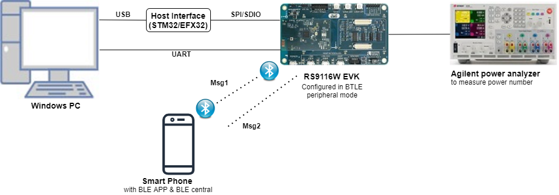
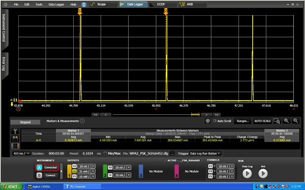
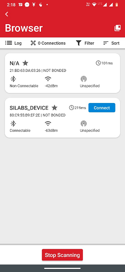
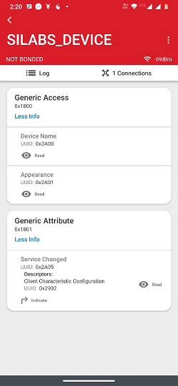
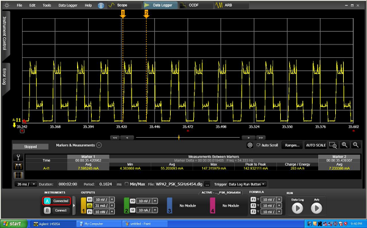

# BLE Powersave

## 1. Purpose / Scope

This application demonstrates how to configure RS9116W EVK in power save profile with Advertising mode.

## 2. Prerequisites / Setup Requirements

Before running the application, the user will need the following things to setup.

### 2.1 Hardware Requirements

- Windows PC with Host interface(UART/ SPI/ SDIO).
- Silicon Labs [RS9116 Wi-Fi Evaluation Kit](https://www.silabs.com/development-tools/wireless/wi-fi/rs9116x-sb-evk-development-kit)
- Host MCU Eval Kit. This example has been tested with:
   - Silicon Labs [WSTK + EFR32MG21](https://www.silabs.com/development-tools/wireless/efr32xg21-bluetooth-starter-kit)
   - Silicon Labs [WSTK + EFM32GG11](https://www.silabs.com/development-tools/mcu/32-bit/efm32gg11-starter-kit)
   - [STM32F411 Nucleo](https://st.com/)
- Agilent power analyzer
 

   
### 2.2 Software Requirements

- [WiSeConnect SDK](https://github.com/SiliconLabs/wiseconnect-wifi-bt-sdk/)
    
- Embedded Development Environment

   - For STM32, use licensed [Keil IDE](https://www.keil.com/demo/eval/arm.htm)

   - For Silicon Labs EFx32, use the latest version of [Simplicity Studio](https://www.silabs.com/developers/simplicity-studio)
   
- Download and install the Silicon Labs [EFR Connect App](https://www.silabs.com/developers/efr-connect-mobile-app) in the Android smart phones for testing BLE applications. Users can also use their choice of BLE apps available in Android/iOS smart phones.

## 3. Application Build Environment

### 3.1 Platform

The Application can be built and executed on below Host platforms
*  [STM32F411 Nucleo](https://st.com/)
*  [WSTK + EFR32MG21](https://www.silabs.com/development-tools/wireless/efr32xg21-bluetooth-starter-kit) 
*   [WSTK + EFM32GG11](https://www.silabs.com/development-tools/mcu/32-bit/efm32gg11-starter-kit)

### 3.2 Host Interface

* By default, the application is configured to use the SPI bus for interfacing between Host platforms(STM32F411 Nucleo / EFR32MG21) and the RS9116W EVK.
* This application is also configured to use the SDIO bus for interfacing between Host platforms(EFM32GG11) and the RS9116W EVK.

### 3.3 Project Configuration

The Application is provided with the project folder containing Keil and Simplicity Studio project files.

*  Keil Project
  - The Keil project is used to evaluate the application on STM32.
  - Project path: `<SDK>/examples/snippets/ble/ble_power_save/projects/ble_power_save-nucleo-f411re.uvprojx`

*  Simplicity Studio
  - The Simplicity Studio project is used to evaluate the application on EFR32MG21.
  - Project path: 
    - If the Radio Board is **BRD4180A** or **BRD4181A**, then access the path `<SDK>/examples/snippets/ble/ble_power_save/projects/ble_power_save-brd4180a-mg21.slsproj`
    - If the Radio Board is **BRD4180B** or **BRD4181B**, then access the path `<SDK>/examples/snippets/ble/ble_power_save/projects/ble_power_save-brd4180b-mg21.slsproj` 
        - User can find the Radio Board version as given below 


  - EFM32GG11 platform
    - The Simplicity Studio project is used to evaluate the application on EFM32GG11.
      - Project path:`<SDK>/examples/snippets/ble/ble_power_save/projects/ble_power_save-brd2204a-gg11.slsproj`

### 3.4 Bare Metal/RTOS Support

This application supports bare metal and RTOS environment. By default, the application project files (Keil and Simplicity Studio) are provided with bare metal configuration.
 
## 4. Application Configuration Parameters

The application can be configured to suit your requirements and development environment. Read through the following sections and make any changes needed.

**4.1** Open `rsi_ble_config.h` file and update/modify following macros

**4.1.1** User must update the below parameters

   `RSI_BLE_LOCAL_NAME` refers the name of the WiSeConnect device to appear during scanning by remote devices.

```c
#define RSI_BLE_LOCAL_NAME      "SILABS_DEVICE"
```

   Address of the device to connect
     
```c
#define RSI_BLE_DEV_ADDR "11:11:11:11:11:11"
```

   Remote Device Name to connect
     
```c
#define RSI_REMOTE_DEVICE_NAME "SLAVE"
#define SLAVE_MODE  0
#define MASTER_MODE 1
#define DUAL_MODE   2
```

   Configure the required mode using the above three macros 

```c
#define BLE_ROLE    SLAVE_MODE
```

   **To Enable Power Save**
   
   **PSP_MODE** refers power save profile mode. The WiseConnect device supports following power modes in BTLE,
   
   **RSI_ACTIVE (0):** In this mode, the module is active and power save is disabled.
   
   **RSI_SLEEP_MODE_2 (1):** This mode is applicable when the module is in Advertising state as well as in connected state. In this sleep mode, SoC will go to sleep based on GPIO handshake or Message exchange, therefore handshake is required before sending data to the module.
   
   **RSI_SLEEP_MODE_8 (8):** In this power mode, the module goes to power save when it is in the unassociated state with the remote device. In this sleep mode, SoC will go to sleep based on GPIO handshake or Message exchange, therefore handshake is required before sending the command to the module.

```c
#define PSP_MODE          RSI_SLEEP_MODE_2
```

---
**Note!**
For `RSI_SLEEP_MODE_2` and `RSI_SLEEP_MODE_8` modes, GPIO or Message based handshake can be selected using `RSI_HAND_SHAKE_TYPE` macro which is defined in `rsi_wlan_config.h`                                                                                                   

In this example,user can verify `RSI_SLEEP_MODE_2` with Message based handshake. If the user wants to verify other power modes,   
the user has to change the application as well as GPIO handshake signals                                                            **PSP_TYPE** refers power save profile type. The WiseConnect device supports following power save profile types in BTLE mode, **RSI_MAX_PSP (0):** In this mode, the WiSeConnect device will be in Maximum power save mode. i.e Device will wake up for every DTIM beacon and do data Tx and Rx.

---

```c
#define PSP_TYPE                                      RSI_MAX_PSP                    `
```

   **Following are the non-configurable macros in the application.**
  
   Following are the event numbers for advertising, connection and Disconnection events:
     
```c
#define RSI_APP_EVENT_ADV_REPORT                  0
#define RSI_APP_EVENT_CONNECTED                       1
#define RSI_APP_EVENT_DISCONNECTED                    2
```

   `BT_GLOBAL_BUFF_LEN` refers Number of bytes required by the application and the driver
    
```c
#define BT_GLOBAL_BUFF_LEN                            15000 `
```

   **Opermode command parameters**

```c
#define RSI_FEATURE_BIT_MAP                           FEAT_SECURITY_OPEN
#define RSI_TCP_IP_BYPASS                             RSI_DISABLE
#define RSI_TCP_IP_FEATURE_BIT_MAP                    TCP_IP_FEAT_DHCPV4_CLIENT
#define RSI_CUSTOM_FEATURE_BIT_MAP                    FEAT_CUSTOM_FEAT_EXTENTION_VALID
#define RSI_EXT_CUSTOM_FEATURE_BIT_MAP                (EXT_FEAT_384K_MODE|EXT_FEAT_XTAL_CLK_ENABLE |           EXT_FEAT_LOW_POWER_MODE)
```

   `RSI_HAND_SHAKE_TYPE` is used to select GPIO or Message based handshake in RSI_SLEEP_MODE_2 and RSI_SLEEP_MODE_8 modes.
   
```c
#define RSI_HAND_SHAKE_TYPE                           GPIO_BASED
```

   `RSI_SELECT_LP_OR_ULP_MODE` is used to select low power mode or ultra low power mode. Valid configurations are, RSI_LP_MODE or RSI_ULP_WITH_RAM_RET or RSI_ULP_WITHOUT_RAM_RET
   
   `RSI_LP_MODE `
   
   In this, the module will be in Low power mode.
   
   `RSI_ULP_WITH_RAM_RET `
   
   In this, the module will be in Ultra low power mode and it will remember the previous state after issuing power save mode command.

   `RSI_ULP_WITHOUT_RAM_RET `

   In this, the module will be in Ultra low power mode and it will not remember the previous state after issuing power save mode command. After wakeup, the module will give CARD READY indication and the user has to issue commands from wireless initialization.
  
```c
#define RSI_SELECT_LP_OR_ULP_MODE                     RSI_ULP_WITH_RAM_RET
```

## 5. Testing the Application

User has to follow the below steps for the successful execution of the application.

### 5.1 Loading the RS9116W Firmware

Refer [Getting started with PC ](https://docs.silabs.com/rs9116/latest/wiseconnect-getting-started) to load the firmware into RS9116W EVK. The firmware binary is located in `<SDK>/firmware/`

### 5.2 Building the Application on the Host Platform

### 5.2.1 Using STM32

Refer [STM32 Getting Started](https://docs.silabs.com/rs9116-wiseconnect/latest/wifibt-wc-getting-started-with-efx32/)  

- Open the project `<SDK>/examples/snippets/ble/ble_power_save/projects/ble_power_save-nucleo-f411re.uvprojx` in Keil IDE.
- Build and Debug the project
- Check for the RESET pin:
  - If RESET pin is connected from STM32 to RS9116W EVK, then user need not press the RESET button on RS9116W EVK before free run.
  - If RESET pin is not connected from STM32 to RS9116W EVK, then user need to press the RESET button on RS9116W EVK before free run.
- Free run the project
- Then continue the common steps from **Section 5.3**

#### 5.2.2 Using EFX32

Refer [EFx32 Getting Started](https://docs.silabs.com/rs9116-wiseconnect/latest/wifibt-wc-getting-started-with-efx32/), for settin-up EFR & EFM host platforms

- Import the EFR32/EFM32 project from `<SDK>/examples/snippets/ble/ble_power_save/projects`
    - Select the appropriate .slsproj as per Radio Board type mentioned in **Section 3.3** for EFR32 board.
   (or)
    - Select the *.brd2204a-gg11.slsproj  for EFM32GG11 board.
- Compile and flash the project in to Host MCU
- Debug the project
- Check for the RESET pin:
  - If RESET pin is connected from STM32 to RS9116W EVK, then user need not press the RESET button on RS9116W EVK before free run
  - If RESET pin is not connected from STM32 to RS9116W EVK, then user need to press the RESET button on RS9116W EVK before free run
- Free run the project
- Then continue the common steps from **Section 5.3**

### 5.3 Common Steps

1. After the program gets executed, the WiSeConnect module would be in Advertising state with configured power save the profile.
   
2. The WiseConnect device will go to sleep and wakes up for every advertising interval and goes back to sleep after advertising. Refer the given below image for power save cycle in advertising mode.
      

   
3. Open an LE App in the Smartphone and do Scan
   
4. In the App, WiSeConnect module device will appear with the name configured in the macro **RSI_BLE_LOCAL_NAME (Ex: "WLAN_BLE_SIMPLE")** or sometimes observed as the WiSeConnect device as the internal name **"SILABS_DEVICE".**
   

   
5. Initiate connection from the mobile App.
   
6. After successful connection, user can see the connected state in BLE scanner app and also check the supported services by the WiSeConnect device.
   

   
7. After successful connection, module goes to sleep and wakes up for every connection interval. Check the below image for power save cycle after connection.
   

   
8. After successful program execution, if the Silicon Labs device is configured in SLAVE_MODE , the prints in teraterm looks as shown below.   
      
    
   
   
Default configuration of connection interval of Central device (smartphone) is 18 ms. So, the WiSeConnect device will wake up for every 18ms sec and goes back to sleep after advertise.    

Above power save profile image capture when it is in the idle state after successful connection. 

So, the user may not get the same profile as shown in the above image. It will vary based on the traffic.

## Compressed Debug Logging

To enable the compressed debug logging feature please refer to [Logging User Guide](https://docs.silabs.com/rs9116-wiseconnect/latest/wifibt-wc-sapi-reference/logging-user-guide)