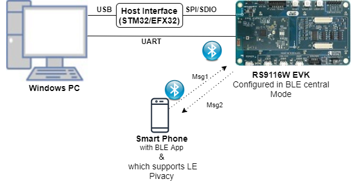
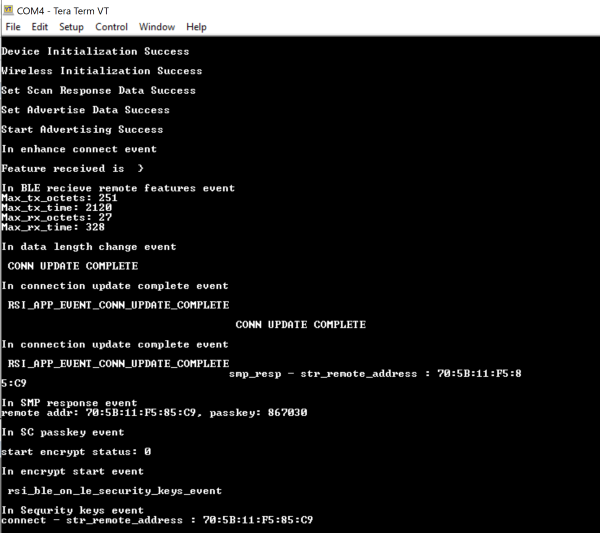
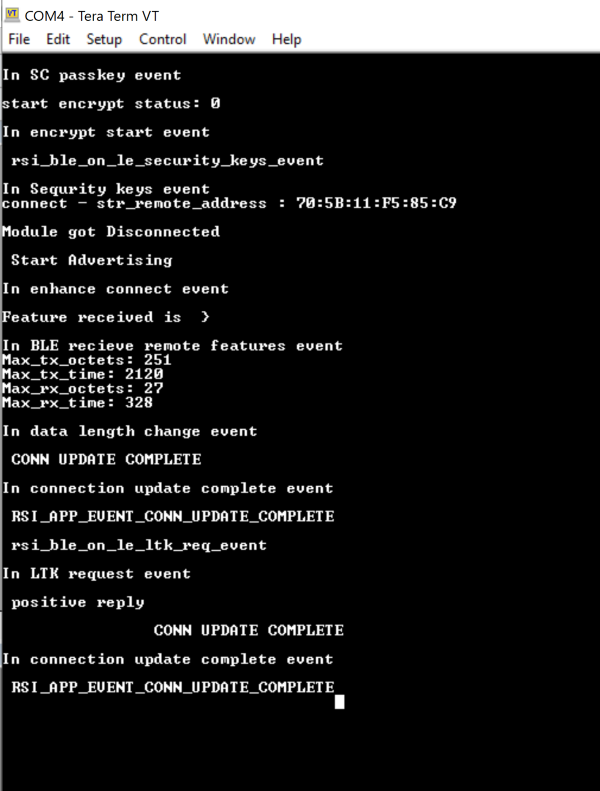
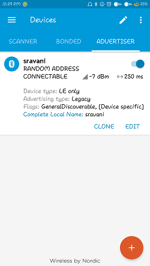
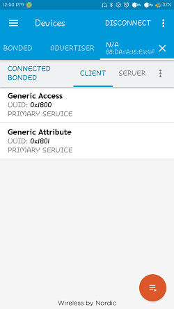
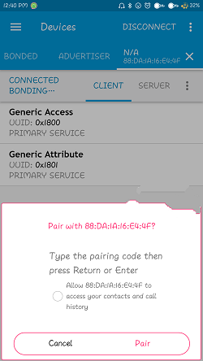
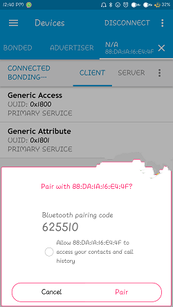

# BLE Privacy

## 1. Purpose / Scope

Bluetooth LE supports a feature that reduces the ability to track an LE device over a period of time by changing the Bluetooth device address on a frequent basis, called Privacy of that particular device.

The device address of the remote device referred to as the private address will be resolved by local device in order to connect to that device. The private address is generated by using Identity Resolving Key (IRK) exchange in between devices during SMP bonding procedure. Our local device will add the remote devices in one Resolving list(to maintain remote device identity addresses) along with that IRK's and enable the Resolution, sets privacy mode and connect to the remote device with remote identity address.

## 2. Prerequisites / Setup Requirements

Before running the application, the user will need the following things to setup.

### 2.1 Hardware Requirements

- Windows PC with Host interface(UART/ SPI/ SDIO).
- Silicon Labs [RS9116 Wi-Fi Evaluation Kit](https://www.silabs.com/development-tools/wireless/wi-fi/rs9116x-sb-evk-development-kit)
- Host MCU Eval Kit. This example has been tested with:
   - Silicon Labs [WSTK + EFR32MG21](https://www.silabs.com/development-tools/wireless/efr32xg21-bluetooth-starter-kit)
   - Silicon Labs [WSTK + EFM32GG11](https://www.silabs.com/development-tools/mcu/32-bit/efm32gg11-starter-kit)
   - [STM32F411 Nucleo](https://st.com/)
- BTLE peripheral device which supports privacy feature(Generally phones with the nRF Connect application)


   
   
### 2.2 Software Requirements

- [WiSeConnect SDK](https://github.com/SiliconLabs/wiseconnect-wifi-bt-sdk/)
    
- Embedded Development Environment

  - For STM32, use licensed [Keil IDE](https://www.keil.com/demo/eval/arm.htm)

   - For Silicon Labs EFx32, use the latest version of [Simplicity Studio](https://www.silabs.com/developers/simplicity-studio)
   
- Download and install the Silicon Labs [EFR Connect App](https://www.silabs.com/developers/efr-connect-mobile-app) in the android smart phones for testing the BLE applications. Users can also use their choice of BLE apps available in Android/iOS smart phones.

## 3. Application Build Environment

### 3.1 Platform

The Application can be built and executed on below Host platforms
*	[STM32F411 Nucleo](https://st.com/)
*	[WSTK + EFR32MG21](https://www.silabs.com/development-tools/wireless/efr32xg21-bluetooth-starter-kit) 
*   [WSTK + EFM32GG11](https://www.silabs.com/development-tools/mcu/32-bit/efm32gg11-starter-kit)

### 3.2 Host Interface

* By default, the application is configured to use the SPI bus for interfacing between Host platforms(STM32F411 Nucleo / EFR32MG21) and the RS9116W EVK.
* This application is also configured to use the SDIO bus for interfacing between Host platforms(EFM32GG11) and the RS9116W EVK.

### 3.3 Project Configuration

The Application is provided with the project folder containing Keil and Simplicity Studio project files.

*	Keil Project
	- The Keil project is used to evaluate the application on STM32.
	- Project path: `<SDK>/examples/snippets/ble/ble_privacy/projects/ble_privacy-nucleo-f411re.uvprojx`

*	Simplicity Studio
	- The Simplicity Studio project is used to evaluate the application on EFR32MG21.
	- Project path: 
		- If the Radio Board is **BRD4180A** or **BRD4181A**, then access the path `<SDK>/examples/snippets/ble/ble_privacy/projects/ble_privacy-brd4180a-mg21.slsproj`
		- If the Radio Board is **BRD4180B** or **BRD4181B**, then access the path `<SDK>/examples/snippets/ble/ble_privacy/projects/ble_privacy-brd4180b-mg21.slsproj`
        - User can find the Radio Board version as given below 


  - EFM32GG11 platform
    - The Simplicity Studio project is used to evaluate the application on EFM32GG11.
      - Project path:`<SDK>/examples/snippets/ble/ble_privacy/projects/ble_privacy-brd2204a-gg11.slsproj`

### 3.4 Bare Metal/RTOS Support

This application supports bare metal and RTOS environment. By default, the application project files (Keil and Simplicity Studio) are provided with bare metal configuration.

## 4. Application Configuration Parameters

The application can be configured to suit your requirements and development environment. Read through the following sections and make any changes needed.

**4.1** Open `rsi_ble_privacy.c` file and update/modify following macros:

**4.1.1** User must update the below parameters

   `RSI_BLE_DEVICE_NAME` refers the name of the Silicon Labs device to appear during scanning by remote devices.

```c
#define RSI_BLE_DEVICE_NAME                              "SIMPLE_PRIVACY"
```

   RSI_DEVICE_ROLE refers the role of the Silicon Labs device.

```c
#define RSI_DEVICE_ROLE                                  RSI_SLAVE
```

   `Note: RSI_DEVICE_ROLE should be RSI_MASTER`
   
   RSI_BLE_DEV_ADDR_TYPE` refers the address type of the remote device.

```c
#define RSI_BLE_REMOTE_ADDR_TYPE                         LE_PUBLIC_ADDRESS
```

   `RSI_BLE_DEV_ADDR_1` refers remote device address which has to connect.

```c
#define RSI_BLE_REMOTE_ADDR                              "00:23:A7:56:77:77"
```

   `RSI_REMOTE_DEVICE_NAME` refers the name of the Remote device to which Silicon Labs module initiate connection.

```c
#define RSI_REMOTE_DEVICE_NAME                           "BLE_SIMPLE_PRIVACY"
```
  
   RSI_BLE_SMP_IO_CAPABILITY refers the IO capability of Silicon Labs device for SMP, RSI_BLE_SMP_PASSKEY is smp passkey key from Silicon Labs device

```c
#define RSI_BLE_SMP_IO_CAPABILITY                        0x00
#define RSI_BLE_SMP_PASSKEY                              0
```

   **Power save configuration**

   By default, The Application is configured without power save.
	 
```c
#define ENABLE_POWER_SAVE 0
```

   If user wants to run the application in power save, modify the below configuration. 
	 
```c
#define ENABLE_POWER_SAVE 1 
```

**4.1.2** The desired parameters are provided below. User can also modify the parameters as per their needs and requirements.

   Following are the **non-configurable** macros in the application.

   Following are the event numbers for connection, Disconnection, and enhanced connection events.

```c
#define RSI_APP_EVENT_ADV_REPORT                         0x00
#define  RSI_BLE_CONN_EVENT                              0x01
#define  RSI_BLE_DISCONN_EVENT                           0x02
#define  RSI_BLE_SMP_REQ_EVENT                           0x03
#define  RSI_BLE_SMP_RESP_EVENT                          0x04
#define  RSI_BLE_SMP_PASSKEY_EVENT                       0x05
#define  RSI_BLE_SMP_FAILED_EVENT                        0x06
#define  RSI_BLE_ENCRYPT_STARTED_EVENT                   0x07
#define  RSI_BLE_SMP_PASSKEY_DISPLAY_EVENT               0x08
#define  RSI_BLE_SC_PASSKEY_EVENT                        0x09
#define  RSI_BLE_LTK_REQ_EVENT                           0x0A
#define  RSI_BLE_SECURITY_KEYS_EVENT                     0x0B
#define  RSI_BLE_ENHANCE_CONNECTED_EVENT                 0x0C
```

   `BT_GLOBAL_BUFF_LEN` refers Number of bytes required by the application and the driver.

```c
#define BT_GLOBAL_BUFF_LEN                               15000
```

   `RSI_BLE_SET_RESOLVABLE_PRIV_ADDR_TOUT` refers resolution timeout , that is the length of time the Controller uses a Resolvable Private Address before a new resolvable private address is generated and starts being used.

```c
#define RSI_BLE_SET_RESOLVABLE_PRIV_ADDR_TOUT           120
```

   Process type refers the operation to be performed on the resolving list. valid configurations for the process type are

```c
#define RSI_BLE_ADD_TO_RESOLVE_LIST                      1
#define RSI_BLE_REMOVE_FROM_RESOLVE_LIST                 2
#define RSI_BLE_CLEAR_RESOLVE_LIST                       3
```

   `RSI_BLE_PRIVACY_MODE` refers the privacy mode of local device

```c
#define RSI_BLE_PRIVACY_MODE                             RSI_BLE_DEVICE_PRIVACY_MODE
```

   `RSI_BLE_RESOLVING_LIST_SIZE` refers the resolving list size of Silicon Labs device.

```c
#define RSI_BLE_RESOLVING_LIST_SIZE                      5
```

**4.2** Open `rsi_ble_config.h` file and update/modify following macros

   `RSI_BLE_DEV_ADDR_RESOLUTION_ENABLE` refers address resolution is enable or not. It should be 1 to enable privacy feature.

```c
#define RSI_BLE_DEV_ADDR_RESOLUTION_ENABLE               1
```

   `RSI_BLE_ADV_DIR_ADDR_TYPE` refers the address type of remote device which use while advertising.

```c
#define RSI_BLE_ADV_DIR_ADDR_TYPE                        LE_PUBLIC_ADDRESS
```

   `RSI_BLE_ADV_DIR_ADDR` refers to which device the local device will advertise with private address, it should be one of the device in resolve list.

```c
#define RSI_BLE_ADV_DIR_ADDR                             "00:15:83:6A:64:17"
#define RSI_BLE_PWR_INX                                  30
#define RSI_BLE_PWR_SAVE_OPTIONS                         BLE_DISABLE_DUTY_CYCLING 
```

   **Opermode command parameters**


```c
#define RSI_FEATURE_BIT_MAP                              FEAT_SECURITY_OPEN
#define RSI_TCP_IP_BYPASS                                RSI_DISABLE
#define RSI_TCP_IP_FEATURE_BIT_MAP                       TCP_IP_FEAT_DHCPV4_CLIENT
#define RSI_CUSTOM_FEATURE_BIT_MAP                       FEAT_CUSTOM_FEAT_EXTENTION_VALID
#define RSI_EXT_CUSTOM_FEATURE_BIT_MAP                   0
```

---
**Note!**
`rsi_ble_config.h` files are already set with desired configuration in respective example folders user need not change for each example.

---

## 5. Testing the Application

User has to follow the below steps for the successful execution of the application.

### 5.1 Loading the RS9116W Firmware

Refer [Getting started with PC ](https://docs.silabs.com/rs9116/latest/wiseconnect-getting-started) to load the firmware into RS9116W EVK. The firmware binary is located in `<SDK>/firmware/`


### 5.2 Building the Application on the Host Platform

### 5.2.1 Using STM32

Refer [STM32 Getting Started](https://docs.silabs.com/rs9116-wiseconnect/latest/wifibt-wc-getting-started-with-efx32/)  

- Open the project `<SDK>/examples/snippets/ble/ble_privacy/projects/ble_privacy-nucleo-f411re.uvprojx` in Keil IDE.
- Build and Debug the project
- Check for the RESET pin:
	- If RESET pin is connected from STM32 to RS9116W EVK, then user need not press the RESET button on RS9116W EVK before free run.
	- If RESET pin is not connected from STM32 to RS9116W EVK, then user need to press the RESET button on RS9116W EVK before free run.
- Free run the project
- Then continue the common steps from **Section 5.3**


#### 5.2.2 Using EFX32

Refer [EFx32 Getting Started](https://docs.silabs.com/rs9116-wiseconnect/latest/wifibt-wc-getting-started-with-efx32/), for settin-up EFR & EFM host platforms

- Import the EFR32/EFM32 project from `<SDK>/examples/snippets/ble/ble_privacy/projects`
    - Select the appropriate .slsproj as per Radio Board type mentioned in **Section 3.3** for EFR32 board.
   (or)
    - Select the *.brd2204a-gg11.slsproj  for EFM32GG11 board.
- Compile and flash the project in to Host MCU
- Debug the project
- Check for the RESET pin:
	- If RESET pin is connected from STM32 to RS9116W EVK, then user need not press the RESET button on RS9116W EVK before free run
	- If RESET pin is not connected from STM32 to RS9116W EVK, then user need to press the RESET button on RS9116W EVK before free run
- Free run the project
- Then continue the common steps from **Section 5.3**

### 5.3 Common Steps

1. After the program gets executed, Silicon Labs module will be in Scanning state.

2. Advertise remote device,

3. If Silicon Labs module get device with name configured RSI_BLE_LOCAL_NAME or bd address with address configured in RSI_BLE_REMOTE_ADDR  in results ,local device will try to connect with remote device.

4. After connection Silicon Labs device which is in central mode will initiate SMP request

5. Give response from Remote device and passkey

6. After successful SMP connection security keys will exchanged between Remote device and Silicon Labs device.

7. Silicon Labs device will add remote device's IRK's and local IRK's in to resolve list and enable resolution

8. Give disconnect from remote device and keep in advertise mode.

9. Now Silicon Labs module will try to connect to remote device with identity address.

10. After successful connection, Silicon Labs module will give start encryption instead of SMP repairing.

11. Encryption will be enabled on both sides.

12. After successful program execution, if Silcon Labs device connects to the remote BLE central device the prints in teraterm looks as shown below.


   

	 
   Find following screen shots for reference.

1. Advertise remote device
      


2. Connection in between Silicon Labs module and remote device
      


3. Pairing confirmation
      


4. Passkey confirmation
      


## Compressed Debug Logging

To enable the compressed debug logging feature please refer to [Logging User Guide](https://docs.silabs.com/rs9116-wiseconnect/latest/wifibt-wc-sapi-reference/logging-user-guide)