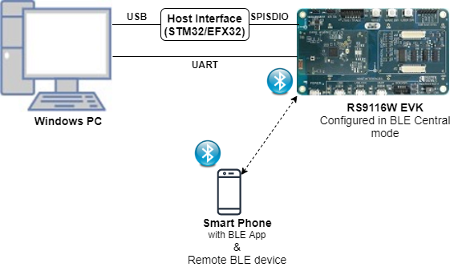
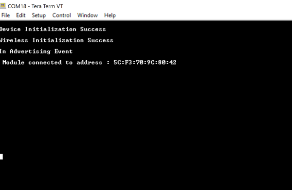

# BLE Whitelist

## 1. Purpose / Scope

This application is used to add a particular BD-Address to the White List. The device to connect is saved on the white list located in the LL block of the controller.

This enumerates the remote devices that are allowed to communicate with the local device. The White List can restrict which device are allowed to connect to other device.

If it is not, it wont connect. Once the address was saved, the connection with that device is going to be an auto connection establishment procedure. 

This means that the Controller autonomously establishes a connection with the device address that matches the address stored in the While List.

## 2. Prerequisites / Setup Requirements

Before running the application, the user will need the following things to setup.

### 2.1 Hardware Requirements

- Windows PC with Host interface(UART/ SPI/ SDIO).
- Silicon Labs [RS9116 Wi-Fi Evaluation Kit](https://www.silabs.com/development-tools/wireless/wi-fi/rs9116x-sb-evk-development-kit)
- Host MCU Eval Kit. This example has been tested with:
   - Silicon Labs [WSTK + EFR32MG21](https://www.silabs.com/development-tools/wireless/efr32xg21-bluetooth-starter-kit)
   - Silicon Labs [WSTK + EFM32GG11](https://www.silabs.com/development-tools/mcu/32-bit/efm32gg11-starter-kit)
   - [STM32F411 Nucleo](https://st.com/)
- BLE peripheral device


   
### 2.2 Software Requirements

- [WiSeConnect SDK](https://github.com/SiliconLabs/wiseconnect-wifi-bt-sdk/)
    
- Embedded Development Environment

   - For STM32, use licensed [Keil IDE](https://www.keil.com/demo/eval/arm.htm)

   - For Silicon Labs EFx32, use the latest version of [Simplicity Studio](https://www.silabs.com/developers/simplicity-studio)
   
- Download and install the Silicon Labs [EFR Connect App](https://www.silabs.com/developers/efr-connect-mobile-app) in the android smart phones for testing BLE applications. Users can also use their choice of BLE apps available in Android/iOS smart phones.

## 3. Application Build Environment

### 3.1 Platform

The Application can be built and executed on below Host platforms
*	[STM32F411 Nucleo](https://st.com/)
*	[WSTK + EFR32MG21](https://www.silabs.com/development-tools/wireless/efr32xg21-bluetooth-starter-kit) 
*   [WSTK + EFM32GG11](https://www.silabs.com/development-tools/mcu/32-bit/efm32gg11-starter-kit)

### 3.2 Host Interface

* By default, the application is configured to use the SPI bus for interfacing between Host platforms(STM32F411 Nucleo / EFR32MG21) and the RS9116W EVK.
* This application is also configured to use the SDIO bus for interfacing between Host platforms(EFM32GG11) and the RS9116W EVK.

### 3.3 Project Configuration

The Application is provided with the project folder containing Keil and Simplicity Studio project files.

*	Keil Project
	- The Keil project is used to evaluate the application on STM32.
	- Project path: `<SDK>/examples/snippets/ble/ble_white_list/projects/ble_white_list-nucleo-f411re.uvprojx`

*	Simplicity Studio
	- The Simplicity Studio project is used to evaluate the application on EFR32MG21.
	- Project path: 
		- If the Radio Board is **BRD4180A** or **BRD4181A**, then access the path `<SDK>/examples/snippets/ble/ble_white_list/projects/ble_white_list-brd4180a-mg21.slsproj`
		- If the Radio Board is **BRD4180B** or **BRD4181B**, then access the path `<SDK>/examples/snippets/ble/ble_white_list/projects/ble_white_list-brd4180b-mg21.slsproj` 
        - User can find the Radio Board version as given below 


  - EFM32GG11 platform
    - The Simplicity Studio project is used to evaluate the application on EFM32GG11.
      - Project path:`<SDK>/examples/snippets/ble/ble_white_list/projects/ble_white_list-brd2204a-gg11.slsproj`

### 3.4 Bare Metal//RTOS Support

This application supports bare metal and RTOS environment. By default, the application project files (Keil and Simplicity Studio) are provided with bare metal configuration. 

## 4. Application Configuration Parameters

The application can be configured to suit your requirements and development environment. Read through the following sections and make any changes needed.

**4.1** Open `rsi_ble_whitelist.c` file and update/modify following macros,

**4.1.1** User must update the below parameters

   `RSI_BLE_DEV_ADDR_TYPE` refers address type of the remote device to connect.

```c
#define RSI_BLE_DEV_ADDR_TYPE                          LE_PUBLIC_ADDRESS
```

   Based on address type of remote device, valid configurations are

   LE_RANDOM_ADDRESS

   LE_PUBLIC_ADDRESS

   `RSI_BLE_DEV_ADDR` refers address of the remote device to connect.

```c
#define RSI_BLE_DEV_ADDR                      "00:1A:7D:DA:71:48"
```

   `RSI_BLE_WHITELIST_DEV_ADDR1_TYPE`,`RSI_BLE_WHITELIST_DEV_ADDR1_TYPE` refers address of the remote devices to be whitelisted

```c
#define RSI_BLE_WHITELIST_DEV_ADDR1_TYPE              LE_PUBLIC_ADDRESS
#define RSI_BLE_WHITELIST_DEV_ADDR2_TYPE              LE_PUBLIC_ADDRESS 
```

   `RSI_REMOTE_DEVICE_NAME` refers the name of remote device to which Silicon Labs device has to connect

```c
#define RSI_REMOTE_DEVICE_NAME                    "SILABS_DEV"
```

   **Note:**
   user can configure either RSI_BLE_DEV_ADDR or RSI_REMOTE_DEVICE_NAME of the remote device.
   
   **Power save configuration**

   By default, the Application is configured without power save.
	 
```c
#define ENABLE_POWER_SAVE 0
```

   If user wants to run the application in power save, modify the below configuration. 
	 
```c
#define ENABLE_POWER_SAVE 1 
```

**4.1.2** The desired parameters are provided below. User can also modify the parameters as per their needs and requirements.

   Following are the event numbers for advertising, connection and Disconnection events,

```c
#define RSI_APP_EVENT_ADV_REPORT                       0
#define RSI_APP_EVENT_CONNECTED                        1
#define RSI_APP_EVENT_DISCONNECTED                     2 
```

   Following are the non-configurable macros in the application.

   **GLOBAL_BUFF_LEN** refers Number of bytes required by the application and the driver

```c
#define GLOBAL_BUFF_LEN                             15000
```
   	

**4.2** Open `rsi_ble_config.h` file and update/modify following macros,

```c
#define RSI_BLE_PWR_INX                                30
#define RSI_BLE_PWR_SAVE_OPTIONS                       0
#define RSI_BLE_SCAN_FILTER_TYPE                       SCAN_FILTER_TYPE_ONLY_WHITE_LIST
```

**Opermode command parameters**

```c
#define RSI_FEATURE_BIT_MAP                            FEAT_SECURITY_OPEN
#define RSI_TCP_IP_BYPASS                              RSI_DISABLE
#define RSI_TCP_IP_FEATURE_BIT_MAP                     TCP_IP_FEAT_DHCPV4_CLIENT
#define RSI_CUSTOM_FEATURE_BIT_MAP                     FEAT_CUSTOM_FEAT_EXTENTION_VALID
#define RSI_EXT_CUSTOM_FEATURE_BIT_MAP                 EXT_FEAT_384K_MODE
```

---
**Note!**
`rsi_ble_config.h` files are already set with desired configuration in respective example folders user need not change for each example. |

---

## 5. Testing the Application

User has to follow the below steps for the successful execution of the application.

### 5.1 Loading the RS9116W Firmware

Refer [Getting started with PC ](https://docs.silabs.com/rs9116/latest/wiseconnect-getting-started) to load the firmware into RS9116W EVK. The firmware binary is located in `<SDK>/firmware/`

### 5.2 Building the Application on the Host Platform

### 5.2.1 Using STM32

Refer [EFx32 Getting Started](https://docs.silabs.com/rs9116-wiseconnect/latest/wifibt-wc-getting-started-with-efx32/)

- Open the project `<SDK>/examples/snippets/ble/ble_white_list/projects/ble_white_list-nucleo-f411re.uvprojx` in Keil IDE.
- Build and Debug the project
- Check for the RESET pin:
	- If RESET pin is connected from STM32 to RS9116W EVK, then user need not press the RESET button on RS9116W EVK before free run.
	- If RESET pin is not connected from STM32 to RS9116W EVK, then user need to press the RESET button on RS9116W EVK before free run.
- Free run the project
- Then continue the common steps from **Section 5.3**

#### 5.2.2 Using EFX32

Refer [EFx32 Getting Started](https://docs.silabs.com/rs9116-wiseconnect/latest/wifibt-wc-getting-started-with-efx32/), for settin-up EFR & EFM host platforms

- Import the EFR32/EFM32 project from `<SDK>/examples/snippets/ble/ble_white_list/projects`
    - Select the appropriate .slsproj as per Radio Board type mentioned in **Section 3.3** for EFR32 board.
   (or)
    - Select the *.brd2204a-gg11.slsproj  for EFM32GG11 board.
- Compile and flash the project in to Host MCU
- Debug the project
- Check for the RESET pin:
	- If RESET pin is connected from STM32 to RS9116W EVK, then user need not press the RESET button on RS9116W EVK before free run
	- If RESET pin is not connected from STM32 to RS9116W EVK, then user need to press the RESET button on RS9116W EVK before free run
- Free run the project
- Then continue the common steps from **Section 5.3**

### 5.3 Common Steps

1. Configure the remote ble device in peripheral mode and put it in advertising mode.

2. After the program gets executed, it adds the configured remote device addresses to the whitelist, and Silicon Labs device tries to connect only with the whitelisted remote device specified in **RSI\_BLE\_DEV\_ADDR or RSI\_REMOTE\_DEVICE\_NAME** macro and ble_whitelist_addr1 array

3. Observe that the connection is established between the desired device and Silicon Labs device.

4. After successful program execution the print in teraterm looks as shown below.   
     

	 
     **Note:** Examples for ble peripherals: Blue tooth Dongle, mobile application, TA sensor tag


## Compressed Debug Logging

To enable the compressed debug logging feature please refer to [Logging User Guide](https://docs.silabs.com/rs9116-wiseconnect/latest/wifibt-wc-sapi-reference/logging-user-guide)
