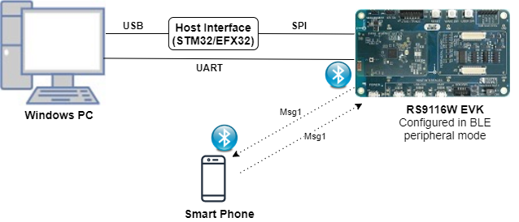
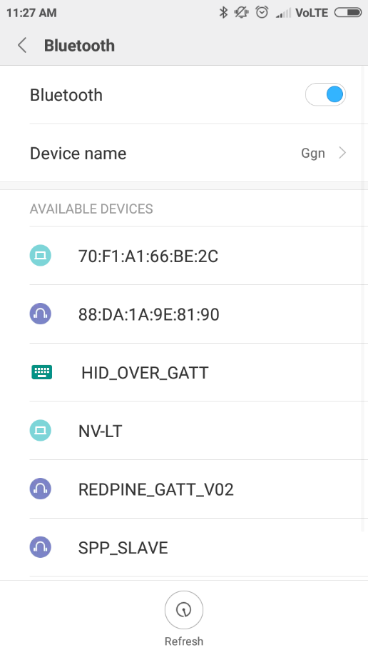
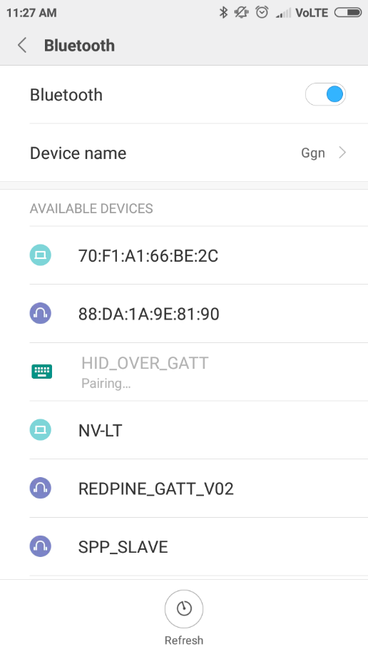
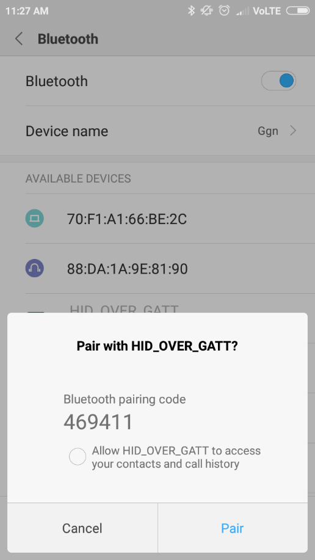
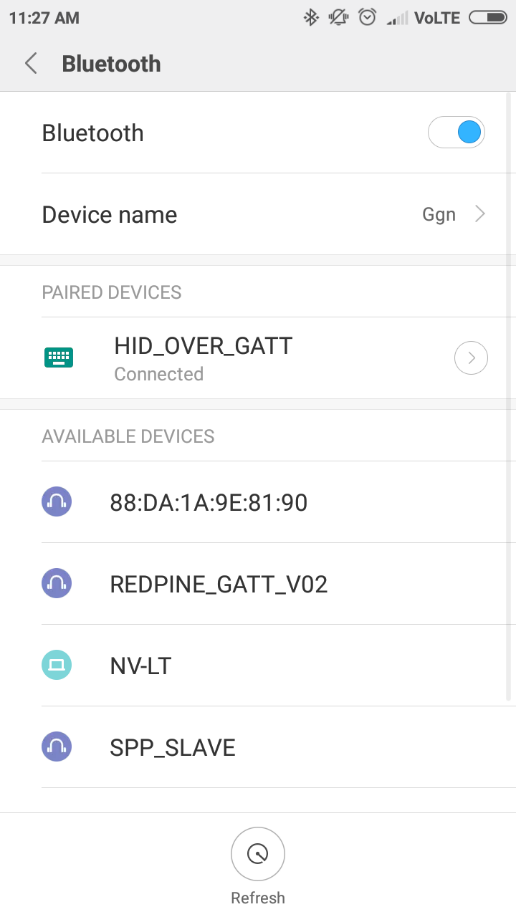
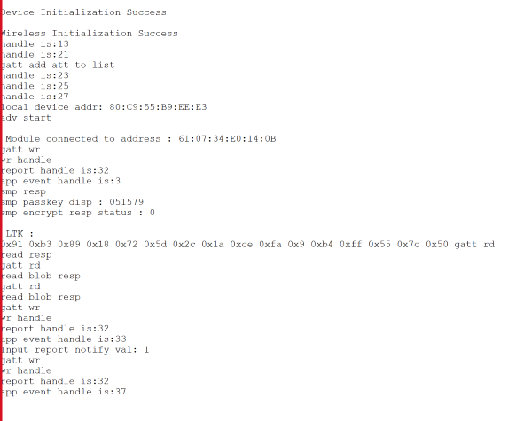

# HID on GATT

## 1. Purpose / Scope

This application demonstrates how to configure RS9116W EVK as GATT server in BLE peripheral mode and as GATT client in BLE central mode, and provides details of how to do read, notify and indicate operations with GATT server from connected remote device using GATT client and details of getting GATT information from remote GATT server in case of our module as client. 

HID (Human Interface Device) Service GATT server configures with HID service with notification characteristic UUID. When connected remote device writes data to writable characteristic UUID, module receives the data which is received on writable characteristic UUID and writes the same data to readable characteristic UUID and sends notifications to the connected device (or) remote device can read the same data using read characteristic UUID if notification enabled on client side.

HID Service GATT client will get HID service (primary service) , Report Map (characteristic service), and descriptors(client characteristic configuration and report reference) information from the remote GATT server. If remote device supports notify, our module will enable notify property and will be notified by the remote GATT server when value changed.

## 2. Prerequisites / Setup Requirements

Before running the application, the user will need the following things to setup.

### 2.1 Hardware Requirements

- Windows PC with Host interface(UART/ SPI/ SDIO).
- Silicon Labs [RS9116 Wi-Fi Evaluation Kit](https://www.silabs.com/development-tools/wireless/wi-fi/rs9116x-sb-evk-development-kit)
- Host MCU Eval Kit. This example has been tested with:
   - Silicon Labs [WSTK + EFR32MG21](https://www.silabs.com/development-tools/wireless/efr32xg21-bluetooth-starter-kit)
   - Silicon Labs [WSTK + EFM32GG11](https://www.silabs.com/development-tools/mcu/32-bit/efm32gg11-starter-kit)
   - [STM32F411 Nucleo](https://st.com/)
- BTLE supported Smart phone with GATT client in case of our module as GATT server
- BTLE supported Smart phone with GATT Human Interface Device server  in case of our module as GATT client
   

      
   **Note:** Use default Bluetooth application in smart phones which has BLE support.

### 2.2 Software Requirements

- [WiSeConnect SDK](https://github.com/SiliconLabs/wiseconnect-wifi-bt-sdk/)
    
- Embedded Development Environment

   - For STM32, use licensed [Keil IDE](https://www.keil.com/demo/eval/arm.htm)

   - For Silicon Labs EFx32, use the latest version of [Simplicity Studio](https://www.silabs.com/developers/simplicity-studio)
   
## 3. Application Build Environment

### 3.1 Platform

The Application can be built and executed on below Host platforms
*	[STM32F411 Nucleo](https://st.com/)
*	[WSTK + EFR32MG21](https://www.silabs.com/development-tools/wireless/efr32xg21-bluetooth-starter-kit) 
*   [WSTK + EFM32GG11](https://www.silabs.com/development-tools/mcu/32-bit/efm32gg11-starter-kit)

### 3.2 Host Interface

* By default, the application is configured to use the SPI bus for interfacing between Host platforms(STM32F411 Nucleo / EFR32MG21) and the RS9116W EVK.
* This application is also configured to use the SDIO bus for interfacing between Host platforms(EFM32GG11) and the RS9116W EVK.

### 3.3 Project Configuration

The Application is provided with the project folder containing Keil and Simplicity Studio project files.

*	Keil Project
	- The Keil project is used to evaluate the application on STM32.
	- Project path: `<SDK>/examples/snippets/ble/hid_on_gatt/projects/hid_on_gatt-nucleo-f411re.uvprojx`

*	Simplicity Studio
	- The Simplicity Studio project is used to evaluate the application on EFR32MG21.
	- Project path: 
		- If the Radio Board is **BRD4180A** or **BRD4181A**, then access the path `<SDK>/examples/snippets/ble/hid_on_gatt/projects/hid_on_gatt-brd4180a-mg21.slsproj`
		- If the Radio Board is **BRD4180B** or **BRD4181B**, then access the path `<SDK>/examples/snippets/ble/hid_on_gatt/projects/hid_on_gatt-brd4180b-mg21.slsproj` 
        - User can find the Radio Board version as given below 


  - EFM32GG11 platform
    - The Simplicity Studio project is used to evaluate the application on EFM32GG11.
      - Project path:`<SDK>/examples/snippets/ble/hid_on_gatt/projects/hid_on_gatt-brd2204a-gg11.slsproj`

### 3.4 Bare Metal/RTOS Support

This application supports bare metal and RTOS environment. By default, the application project files (Keil and Simplicity Studio) are provided with bare metal configuration. 

## 4. Application Configuration Parameters

The application can be configured to suit your requirements and development environment. Read through the following sections and make any changes needed.

**4.1** Open `rsi_ble_hid.c` file and update/modify following macros.

**4.1.1** User must update the below parameters

   **GATT\_ROLE** refers the role of the Silicon Labs module to be selected.

   If user configure **SERVER**, Silicon Labs module will act as GATT SERVER, means will add Human Interface Device service profile.

   If user configure **CLIENT**, Silicon Labs module will act as GATT CLIENT, means will connect to remote GATT server and get services.

```c
#define GATT_ROLE                                        SERVER 
```

   Valid configurations are SERVER and CLIENT.

   If user configure **CLIENT** role following macros should be configured.

   `RSI_BLE_REMOTE_BD_ADDRESS_TYPE` refers address type of the remote device to connect.

```c
#define RSI_BLE_REMOTE_BD_ADDRESS_TYPE                   RANDOM_ADDRESS 
```

   Valid configurations are RANDOM_ADDRESS and PUBLIC_ADDRESS.

   `RSI_BLE_REMOTE_BD_ADDRESS` refers address of the remote device to connect. Replace this with valid BD address.

```c
#define RSI_BLE_REMOTE_BD_ADDRESS                        "F5:64:91:A2:F6:6F"
```

   `RSI_REMOTE_DEVICE_NAME` refers the name of remote device to which Silicon Labs device has to connect

```c
#define RSI_REMOTE_DEVICE_NAME                           "Designer Keyboard"
```

   **Note:** User can configure either RSI_BLE_DEV_ADDR or RSI_REMOTE_DEVICE_NAME of the remote device.
   
   **Power save configuration**

   By default, The Application is configured without power save.
	 
```c
#define ENABLE_POWER_SAVE 0
```

   If user wants to run the application in power save, modify the below configuration. 
	 
```c
#define ENABLE_POWER_SAVE 1 
```

**4.1.2** The desired parameters are provided below. User can also modify the parameters as per their needs and requirements.

   `RSI_BLE_HID_SERVICE_UUID` refers to the attribute value of the newly created service.

```c
#define RSI_BLE_HID_SERVICE_UUID                         0x1812 
```

   `RSI_BLE_HID_PROTOCOL_MODE_UUID` refers to the attribute type of the first attribute under this above primary service.

   `RSI_BLE_HID_REPORT_UUID` refers to the attribute type of the second attribute under this above primary service.

   `RSI_BLE_HID_REPORT_MAP_UUID` refers to the attribute type of the third attribute under this above primary service.

   `RSI_BLE_HID_INFO_UUID` refers to the attribute type of the fourth attribute under this above primary service.

   `RSI_BLE_HID_CONTROL_POINT_UUID` refers to the attribute type of the fifth attribute under this above primary service.

```c
#define RSI_BLE_HID_PROTOCOL_MODE_UUID                   0x2A4E
#define RSI_BLE_HID_REPORT_UUID                          0x2A4D
#define RSI_BLE_HID_REPORT_MAP_UUID                      0x2A4B
#define RSI_BLE_HID_INFO_UUID                            0x2A4A
#define RSI_BLE_HID_CONTROL_POINT_UUID                   0x2A4C 
```

   `RSI_BLE_APP_HIDS` refers name of the Silicon Labs device to appear during scanning by remote devices.

```c
#define RSI_BLE_APP_HIDS                                 "HID_OVER_GATT" 
```

   Following are the non configurable macros related to attribute properties.

```c
#define RSI_BLE_ATT_PROP_RD                              0x02
#define RSI_BLE_ATT_PROP_WR_NO_RESP                      0x04
#define RSI_BLE_ATT_PROP_WR                              0x08
#define RSI_BLE_ATT_PROP_NOTIFY                          0x10
#define RSI_BLE_ATT_PROP_INDICATE                        0x20 
```

   Following are the **non-configurable** macros in the application.

   `RSI_BLE_CHAR_SERV_UUID` refers to the attribute type of the characteristics to be added in a service.

   `RSI_BLE_CLIENT_CHAR_UUID` refers to the attribute type of the client characteristics descriptor to be added in a service.

   `RSI_BLE_REPORT_REFERENCE_UUID` refers to the attribute type of the report reference descriptor to be added in a service.

```c
#define RSI_BLE_CHAR_SERV_UUID                           0x2803
#define RSI_BLE_CLIENT_CHAR_UUID                         0x2902
#define RSI_BLE_REPORT_REFERENCE_UUID                    0x2908 
```

   **GLOBAL_BUFF_LEN** refers Number of bytes required by the application and the driver

```c
#define GLOBAL_BUFF_LEN                               15000 
```
   

**4.2** Open `rsi_ble_config.h` file and update/modify following macros, #define RSI_BLE_PWR_INX 8
    
```c
#define RSI_BLE_PWR_INX                                  30
#define RSI_BLE_PWR_SAVE_OPTIONS                         BLE_DISABLE_DUTY_CYCLING 
```

**Opermode command parameters**  

```c
#define RSI_FEATURE_BIT_MAP                              FEAT_SECURITY_OPEN
#define RSI_TCP_IP_BYPASS                                RSI_DISABLE
#define RSI_TCP_IP_FEATURE_BIT_MAP                       TCP_IP_FEAT_DHCPV4_CLIENT 
#define RSI_CUSTOM_FEATURE_BIT_MAP                       FEAT_CUSTOM_FEAT_EXTENTION_VALID
#define RSI_EXT_CUSTOM_FEATURE_BIT_MAP                   EXT_FEAT_384K_MODE
```

---
**Note!** rsi_ble_config.h files are already set with desired configuration in respective example folders user need not change for each example.

---

## 5. Testing the Application

User has to follow the below steps for the successful execution of the application.

### 5.1 Loading the RS9116W Firmware

Refer [Getting started with PC ](https://docs.silabs.com/rs9116/latest/wiseconnect-getting-started) to load the firmware into RS9116W EVK. The firmware binary is located in `<SDK>/firmware/`

### 5.2 Building the Application on the Host Platform

### 5.2.1 Using STM32

Refer [STM32 Getting Started](https://docs.silabs.com/rs9116-wiseconnect/latest/wifibt-wc-getting-started-with-efx32/)  

- Open the project `<SDK>/examples/snippets/ble/hid_on_gatt/projects/hid_on_gatt-nucleo-f411re.uvprojx` in Keil IDE.
- Build and Debug the project
- Check for the RESET pin:
	- If RESET pin is connected from STM32 to RS9116W EVK, then user need not press the RESET button on RS9116W EVK before free run.
	- If RESET pin is not connected from STM32 to RS9116W EVK, then user need to press the RESET button on RS9116W EVK before free run.
- Free run the project
- Then continue the common steps from **Section 5.3**

#### 5.2.2 Using EFX32

Refer [EFx32 Getting Started](https://docs.silabs.com/rs9116-wiseconnect/latest/wifibt-wc-getting-started-with-efx32/), for settin-up EFR & EFM host platforms

- Import the EFR32/EFM32 project from `<SDK>/examples/snippets/ble/hid_on_gatt/projects`
    - Select the appropriate .slsproj as per Radio Board type mentioned in **Section 3.3** for EFR32 board.
   (or)
    - Select the *.brd2204a-gg11.slsproj  for EFM32GG11 board.
- Compile and flash the project in to Host MCU
- Debug the project
- Check for the RESET pin:
	- If RESET pin is connected from STM32 to RS9116W EVK, then user need not press the RESET button on RS9116W EVK before free run
	- If RESET pin is not connected from STM32 to RS9116W EVK, then user need to press the RESET button on RS9116W EVK before free run
- Free run the project
- Then continue the common steps from **Section 5.3**

#### 5.3 Common Steps

**Server role**

1. After the program gets executed, Silicon Labs module will be in Advertising state.

2. Open a default Bluetooth App and do the scan.

3. In the App, Silicon Labs module will appear with the name configured in the macro **RSI\_BLE\_APP\_HIDS (Ex: "HIDS")** or sometimes observed as Silicon Labs device as internal name "**SimpleBLEPeripheral**".

4. Initiate connection from the bt App and complete the paining process.

5. After successful connection, open note pad or any text editor in phone, you can see some text printing.

6. By default, application is sending some text (i.e. "hog ") in regular interval, which will come as a notification to smart phone.

7. While connection, smart phone will do service discovery and it will find the HID service with UUID **RSI\_BLE\_HID\_SERVICE\_UUID.** After that it will read report map and enables the notification.

8. Following are the screen shots of smart phone to test HID over GATT application.










9. After successful program execution, the prints in teraterm looks as shown below.   
   

	 
**Client role**

1. Advertise a LE device which supports Human Interface Device Service.

2. After the program gets executed, Silicon Labs module will connect to that remote device based on given BD address.

3. After successful connection Silicon Labs module will read the services from the remote GATT server.

4. If remote device support notify property Silicon Labs module will enable notify, and ready to receive notifications from remote device.

5. Whenever GATT server changes value and notifies that Silicon Labs module will receive that value.

## Compressed Debug Logging

To enable the compressed debug logging feature please refer to [Logging User Guide](https://docs.silabs.com/rs9116-wiseconnect/latest/wifibt-wc-sapi-reference/logging-user-guide)