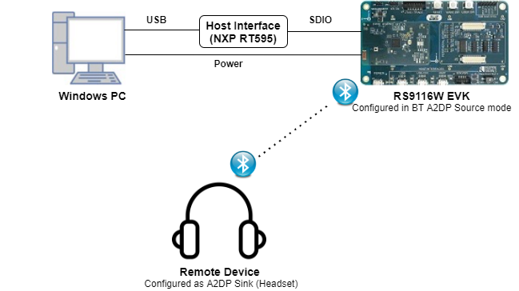

# BT A2DP Source with AVRCP

## 1. Purpose / Scope

This application demonstrates how to configure the RS9116W EVK with A2DP source profile with AVRCP. The module streams the audio data in SBC encoded format to the remote devices (like headesets) for playback the audio.

## 2. Prerequisites / Setup Requirements

Before running the application, the user will need the following things to setup.

### 2.1 Hardware Requirements

- Windows PC with Host interface(UART/ SDIO).
- Silicon Labs [RS9116 Wi-Fi Evaluation Kit](https://www.silabs.com/development-tools/wireless/wi-fi/rs9116x-sb-evk-development-kit)
- Host Interface - NXP RT595
- BT Remote device(A2DP sink device)



### 2.2 Software Requirements

- [WiSeConnect SDK](https://github.com/SiliconLabs/wiseconnect-wifi-bt-sdk/)
    
- Embedded Development Environment

   - Download and install IAR IDE from this link [IAR IDE](https://www.iar.com/products/architectures/arm/iar-embedded-workbench-for-arm/).
  
   - Get the license  of the  IAR Embedded Workbench IDE  to execute NXP RT595 Reference projects in the package.
     
## 3. Application Build Environment

### 3.1 Platform

The Application can be built and executed on below Host platform
* NXP RT595.

### 3.2 Host Interface

* By default, the application is configured to use the SDIO bus for interfacing between Host platforms and the RS9116W EVK.

### 3.3 Project Configuration

The Application is provided with the project folder containing IAR project files.

* IAR Project
  - The IAR project is used to evaluate the application on NXP RT595.
  - Project path: `<SDK>/examples/snippets/bt/bt_a2dp_source_with_avrcp/projects/iar/bt_a2dp_source.eww`
  
### 3.4 RTOS Support

This application supports only RTOS environment. By default, the application project files **IAR IDE** are provided with OS configuration in the SDK. 


## 4. Application Configuration Parameters

The application can be configured to suit your requirements and development environment. Read through the following sections and make any changes needed.

**4.1** Open `rsi_a2dp_source_avrcp.c` file and update/modify following macros,

   `RSI_BT_LOCAL_NAME` refers name of the Silicon Labs module to appear during scanning by remote devices.
   
```c
#define RSI_BT_LOCAL_NAME                                              "A2DP_AVRCP_SOURCE" 
```
   
   `RSI_BT_REMOTE_BD_ADDR` refers BD address of the Remote device to which Silicon Labs device has to connect.
   
```c
#define RSI_BT_REMOTE_BD_ADDR                                          "D0:8A:55:51:26:EB"
```
   
   **PIN\_CODE** refers four bytes string required for pairing process.
   
```c
#define PIN_CODE                                                       "0000"
```
   
   Following are the non-configurable macros in the application. BT_GLOBAL_BUFF_LEN refers to the number of bytes required by the \n 
   application and the driver.
   
```c
#define BT_GLOBAL_BUFF_LEN                                             15000
```
   
**4.2** Open `rsi_bt_config.h` file and update/modify following macros
   
   `RSI_AUDIO_DATA_TYPE` refers input audio file format. Select MP3_AUDIO for .mp3 format, PCM_AUDIO for .wav format, SBC_AUDIO for .sbc formate
   
```c
#define PCM_AUDIO                                                      1
#define ARRAY                                                          2
#define RSI_AUDIO_DATA_SRC                                             BIN_FILE
```
    
   `RSI_AUDIO_DATA_SRC` refers audio source type. Select BIN_FILE, if we have audio files and ARRAY if file system is \n 
   not supported in host, we can pass buffered data.
   
```c
#define BIN_FILE                                                       1
#define ARRAY                                                          2
#define RSI_AUDIO_DATA_SRC                                             BIN_FILE
```  
  
**4.3** Open `rsi_wlan_config.h` file and update/modify following macros:

```c
#define CONCURRENT_MODE                                                RSI_DISABLE
#define RSI_FEATURE_BIT_MAP                                            FEAT_SECURITY_OPEN
#define RSI_TCP_IP_BYPASS                                              RSI_ENABLE
#define RSI_TCP_IP_FEATURE_BIT_MAP                                     (TCP_IP_FEAT_DHCPV4_CLIENT)
#define RSI_CUSTOM_FEATURE_BIT_MAP                                     FEAT_CUSTOM_FEAT_EXTENTION_VALID
#if ENABLE_1P8V
#define RSI_EXT_CUSTOM_FEATURE_BIT_MAP                                 (EXT_FEAT_XTAL_CLK_ENABLE|EXT_FEAT_384K_MODE|EX
#else
#define RSI_EXT_CUSTOM_FEATURE_BIT_MAP                                 (EXT_FEAT_XTAL_CLK_ENABLE|EXT_FEAT_384K_MODE
#endif
#define RSI_BAND                                                       RSI_BAND_2P4GHZ
```

## 5.Testing the Application

Follow the steps below for the successful execution of the application.

### 5.1 Loading the RS9116W Firmware

Refer [Getting started with a PC](http://draft-docs.suds.silabs.net/rs9116-wiseconnect/2.4/wifibt-wc-getting-started-with-pc/) to load the firmware into RS9116W EVK. The firmware file is located in `<SDK>/firmware/`

### 5.1.1 Building the Application on the Host Platform

Refer getting started with IAR IDE, `<SDK>/examples/snippets/bt/bt_a2dp_source_with_avrcp/platforms/nxp/rt595RS9116W_with_NXP_RT595_User_Guide` 
- Open the project `<SDK>/examples/snippets/bt/bt_a2dp_source_with_avrcp/projects/iar/bt_a2dp_source.eww`
- Build the project in IAR IDE
- Debug the project
- Check for the RESET pin:
  - If RESET pin is connected from NXP RT595 to RS9116W EVK, then user need not press the RESET button on RS9116W EVK before free run.
  - If RESET pin is not connected as mentioned above, then user need to press the RESET button on RS9116W EVK before free run.
- Free run the project
- Then continue the application steps from **5.2**

### 5.2 Common Steps

   1. Keep Remote device in discover-able and connectable mode.
   
   2. Run the A2DP source AVRCP application
   
   3. Now Silicon Labs module is trying to connect with Remote device.
   
   4. After Successful connection, Silicon Labs device will connect with remote device in A2DP level and AVRCP level
   
   5. After Successful A2DP and AVRCP connections, Silicon Labs device will transfer the Audio data to remote device .
   
   6. Silicon Labs device will also acts as AVRCP target to support the pause and play options from the A2DP sink device(Remote device)

## 6. Compressed Debug Logging

To enable the compressed debug logging feature please refer to [Logging User Guide](https://docs.silabs.com/rs9116-wiseconnect/latest/wifibt-wc-sapi-reference/logging-user-guide)