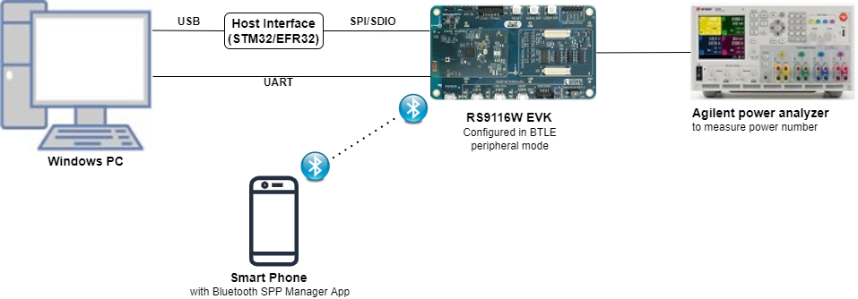
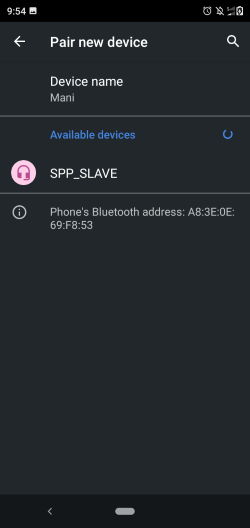
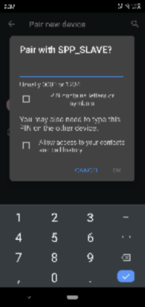
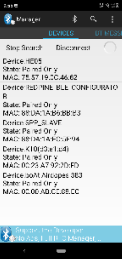
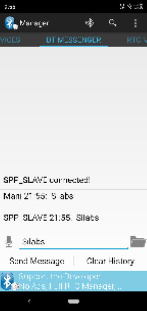

# BT Powersave

## 1. Purpose / Scope

This application demonstrates the process of configuring the device in power save in BT connected mode in bt_power_save example.

## 2. Prerequisites / Setup Requirements

Before running the application, the user will need the following things to setup.

### 2.1 Hardware Requirements

- Windows PC with Host interface(UART/ SPI/ SDIO).
- Silicon Labs [RS9116 Wi-Fi Evaluation Kit](https://www.silabs.com/development-tools/wireless/wi-fi/rs9116x-sb-evk-development-kit)
- Host MCU Eval Kit. This example has been tested with:
  - Silicon Labs [WSTK + EFR32MG21](https://www.silabs.com/development-tools/wireless/efr32xg21-bluetooth-starter-kit)
  - Silicon Labs [WSTK + EFM32GG11](https://www.silabs.com/development-tools/mcu/32-bit/efm32gg11-starter-kit)
  - [STM32F411 Nucleo](https://st.com/)
- Smartphone with spp manager app
- Agilent power analyzer
 
   



### 2.2 Software Requirements

- [WiSeConnect SDK](https://github.com/SiliconLabs/wiseconnect-wifi-bt-sdk/)
    
- Embedded Development Environment

   - For STM32, use licensed [Keil IDE](https://www.keil.com/demo/eval/arm.htm)

   - For Silicon Labs EFx32, use the latest version of [Simplicity Studio](https://www.silabs.com/developers/simplicity-studio)
   
- Download and install the Silicon Labs [Bluetooth SPP manager](https://play.google.com/store/apps/details?id=at.rtcmanager&hl=en_IN) in the android smart phones for testing BT applications. Users can also use their choice of BT apps available in Android/iOS smart phones.

## 3. Application Build Environment

### 3.1 Platform

The Application can be built and executed on below Host platforms
* [STM32F411 Nucleo](https://st.com/)
* [WSTK + EFR32MG21](https://www.silabs.com/development-tools/wireless/efr32xg21-bluetooth-starter-kit) 
* [WSTK + EFM32GG11](https://www.silabs.com/development-tools/mcu/32-bit/efm32gg11-starter-kit)

### 3.2 Host Interface

* By default, the application is configured to use the SPI bus for interfacing between Host platforms(STM32F411 Nucleo / EFR32MG21) and the RS9116W EVK.
* This application is also configured to use the SDIO bus for interfacing between Host platforms(EFM32GG11) and the RS9116W EVK.

### 3.3 Project Configuration

The Application is provided with the project folder containing Keil and Simplicity Studio project files.

* Keil Project
  - The Keil project is used to evaluate the application on STM32.
  - Project path: `<SDK>/examples/snippets/bt/bt_power_save/projects/bt_power_save-nucleo-f411re.uvprojx`

* Simplicity Studio
  - The Simplicity Studio project is used to evaluate the application on EFR32MG21.
  - Project path: 
    - If the Radio Board is **BRD4180A** or **BRD4181A**, then access the path `<SDK>/examples/snippets/bt/bt_power_save/projects/bt_power_save-brd4180a-mg21.slsproj`
    - If the Radio Board is **BRD4180B** or **BRD4181B**, then access the path `<SDK>/examples/snippets/bt/bt_power_save/projects/bt_power_save-brd4180b-mg21.slsproj`
        - User can find the Radio Board version as given below 


 - EFM32GG11 platform
    - The Simplicity Studio project is used to evaluate the application on EFM32GG11.
      - Project path:`<SDK>/examples/snippets/bt/bt_power_save/projects/bt_power_save-brd2204a-gg11.slsproj`
    
### 3.4 Bare Metal/RTOS Support

This application supports bare metal and RTOS environment. By default, the application project files (Keil and Simplicity Studio) are provided with bare metal configuration. 


## 4. Application Configuration Parameters

The application can be configured to suit your requirements and development environment. Read through the following sections and make any changes needed.

**4.1** `rsi_bt_power_save_profile.c` file and update/modify following macros.

   1. RSI_BT_LOCAL_NAME **-** Name of the Wyzbee (Master) device

   2. PIN_CODE - Four-byte string required for pairing process.

   3. PSP_TYPE – Power save profile type.

   **Note:** 1. PSP_TYPE is only valid RSI_SLEEP_MODE_2.
             2. RSI_MAXRSI_MAX_PSP is only valid in case of BT._PSP is only valid in case of BT.
   

   4. SNIFF_MAX_INTERVAL - Sniff Maximum interval value

   5. SNIFF_MIN_INTERVAL – Sniff Minimum interval value

   6. SNIFF_ATTEMPT - Sniff Attempt Value

   7. SNIFF_TIME_OUT – Sniff Timeout Value

   8. **To Enable Power Save**

   **PSP\_MODE** refers power save profile mode. The WiSeConnect device supports following power modes in BT

   **RSI\_ACTIVE (0):** In this mode, the module is active and power save is disabled.

   **RSI\_SLEEP\_MODE\_2 (1):** This mode is applicable when the module is connected state. In this sleep mode, SoC will go to sleep based on GPIO handshake or Message exchange, therefore handshake is required before sending data to the module.

   **RSI\_SLEEP\_MODE\_8 (8):** In this power mode, the module goes to power save when it is in the unassociated state with the remote device. In this sleep mode, SoC will go to sleep based on GPIO handshake or Message exchange, therefore handshake is required before sending the command to the module.

```c
#define PSP_MODE                                      RSI_SLEEP_MODE_2
```
   **Note:** For **RSI*****SLEEP\_MODE\_2*** *and* ***RSI\_SLEEP\_MODE\_8*** *modes****,*** *GPIO or Message based handshake can be selected using* ***RSI\_HAND\_SHAKE\_TYPE*** *macro which is defined in* ***rsi\_bt\_config.h***
   

   **Note:** In this example, user can verify RSI_SLEEP_MODE_2 with Message based handshake. If the user wants to verify other power modes, the user has to change the application as well as GPIO handshake signals
   

   **PSP\_TYPE** refers power save profile type. The WiSeConnect device supports following power save profile types in BT mode,

   RSI_MAX_PSP (0): In this mode, the WiSeConnect device will be in Maximum power save mode. i.e. Device wakes up for every DTIM beacon and does data Tx and Rx.

```c
#define PSP_TYPE                                      RSI_MAX_PSP
```
**4.2**  Open `rsi_bt_config.h` file and update/modify following macros,

```c
#define RSI_FEATURE_BIT_MAP                           FEAT_SECURITY_OPEN
#define RSI_TCP_IP_BYPASS                             RSI_DISABLE
#define RSI_TCP_IP_FEATURE_BIT_MAP                    TCP_IP_FEAT_DHCPV4_CLIENT
#define RSI_CUSTOM_FEATURE_BIT_MAP                    FEAT_CUSTOM_FEAT_EXTENTION_VALID
#define RSI_EXT_CUSTOM_FEATURE_BIT_MAP                (EXT_FEAT_LOW_POWER_MODE\|EXT_FEAT_XTAL_CLK_ENABLE\|EXT_FEAT_384K_MODE)

```

   `RSI_HAND_SHAKE_TYPE` is used to select GPIO or Message based handshake in `RS_SLEEP_MODE_2` and `RSI_SLEEP_MODE_8` modes**.**

```c
#define RSI_HAND_SHAKE_TYPE                           GPIO_BASED
```

## 5. Testing the Application

Follow the steps below for the successful execution of the application.

### 5.1 Loading the RS9116W Firmware

Refer [Getting started with PC ](https://docs.silabs.com/rs9116/latest/wiseconnect-getting-started) to load the firmware into RS9116W EVK. The firmware binary is located in `<SDK>/firmware/`

### 5.2 Building the Application on the Host Platform

### 5.2.1 Using STM32

Refer [STM32 Getting Started](https://docs.silabs.com/rs9116-wiseconnect/latest/wifibt-wc-getting-started-with-efx32/)  

- Open the project `<SDK>/examples/snippets/bt/bt_power_save/projects/bt_power_save-nucleo-f411re.uvprojx` in Keil IDE.
- Build and Debug the project
- Check for the RESET pin:
  - If RESET pin is connected from STM32 to RS9116W EVK, then user need not press the RESET button on RS9116W EVK before free run.
  - If RESET pin is not connected from STM32 to RS9116W EVK, then user need to press the RESET button on RS9116W EVK before free run.
- Free run the project
- Then continue the common steps from **Section 5.3**


#### 5.2.2 Using EFX32

Refer [EFx32 Getting Started](https://docs.silabs.com/rs9116-wiseconnect/latest/wifibt-wc-getting-started-with-efx32/), for settin-up EFR & EFM host platforms

- Import the project from `<SDK>/examples/snippets/bt/bt_power_save/projects`
- Select the appropriate .slsproj as per Radio Board type mentioned in **Section 3.3**
- Compile and flash the project in to Host MCU
- Debug the project
- Check for the RESET pin:
  - If RESET pin is connected from STM32 to RS9116W EVK, then user need not press the RESET button on RS9116W EVK before free run
  - If RESET pin is not connected from STM32 to RS9116W EVK, then user need to press the RESET button on RS9116W EVK before free run
- Free run the project
- Then continue the common steps from **Section 5.3**

## 5.3 Common Steps

1. After the program gets executed, Silicon Labs module initializes the SPP profile and waits for the incoming connection.

2. Open Bluetooth SPP manager app on mobile and do the scan until Silicon Labs module (Ex: "SPP_SLAVE") gets present in the scan list


3. After the successful scan, select the device and initiate pairing to Silicon Labs module.

4. After initiating pairing, Pairing request will pop-up at smartphone side and issue secret key which is given at Silicon Labs module (PIN_CODE) side.



5. After successful pair, initiate SPP connection to Silicon Labs module and give the secret key for receiving pairing request at remote device side.



6. After successful SPP Connection, Module go to sleep depending on the selected type of PSP TYPE.

7. Send some data (Ex: "Silicon Labs signals") from the remote device to Silicon Labs device and same data will send back from Silicon Labs device to remote device. Refer the given image for sending and receiving data from the remote device.



8. Note down power measurement by connecting the module to Agilent Power Meter.

## 6. Compressed Debug Logging

To enable the compressed debug logging feature please refer to [Logging User Guide](https://docs.silabs.com/rs9116-wiseconnect/latest/wifibt-wc-sapi-reference/logging-user-guide)