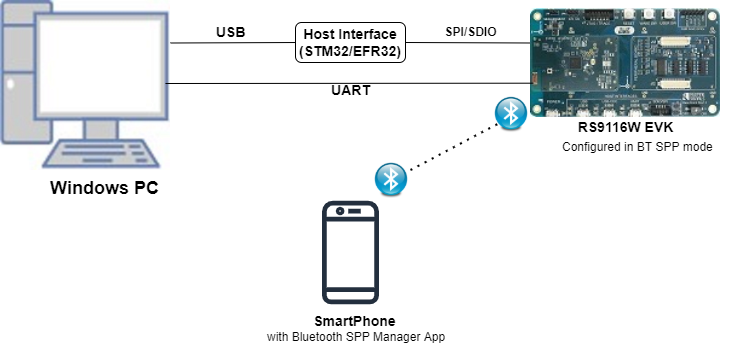
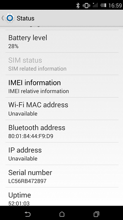
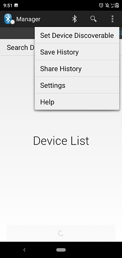
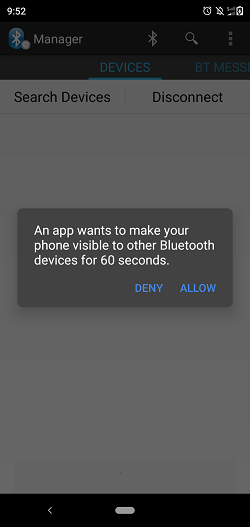
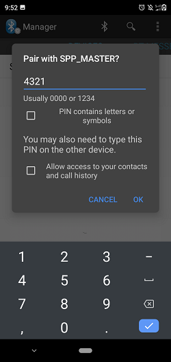
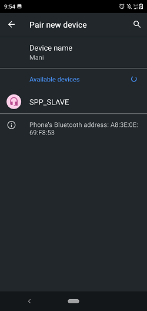
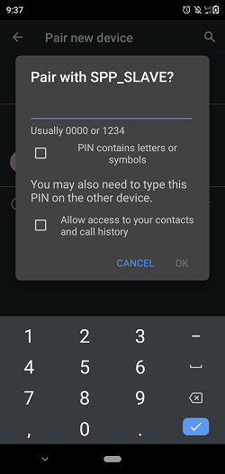
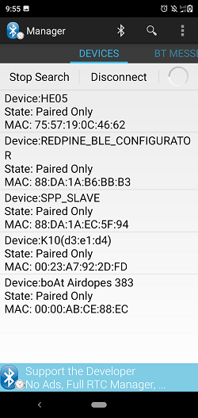
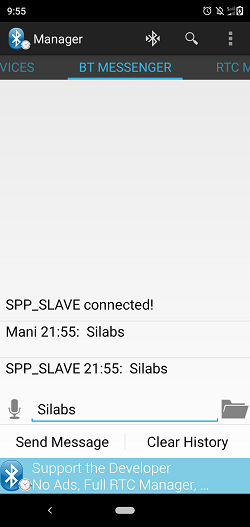

# BT SPP Dual Role with Secure Pairing

## 1. Purpose / Scope

This application demonstrates how to configure RS9116W EVK in Master/Slave mode and establish SPP profile connection with remote Master/Slave device using secure simple paring (SSP) and data exchange between two devices using SPP profile.

In this Application, the module configures in Master mode and waits to accept SPP profile level connection using secure simple pairing (SSP) from remote device. After successful SPP connection, Application will wait for data to receive from connected remote device. If remote device sends data to module, the module receives the data and send back the same data to remote device using SPP profile.

And also in this Application, the module configures in Slave mode and waits to accept SPP profile level connection using secure simple pairing (SSP) from remote device. After successful SPP connection, Application will wait for data to receive from connected remote device. If remote device sends data to module, the module receives the data and send back the same data to remote device using SPP profile.

## 2. Prerequisites / Setup Requirements

Before running the application, the user will need the following things to setup.

### 2.1 Hardware Requirements

- Windows PC with Host interface(UART/ SPI/ SDIO).
- Silicon Labs [RS9116 Wi-Fi Evaluation Kit](https://www.silabs.com/development-tools/wireless/wi-fi/rs9116x-sb-evk-development-kit)
- Host MCU Eval Kit. This example has been tested with:
   - Silicon Labs [WSTK + EFR32MG21](https://www.silabs.com/development-tools/wireless/efr32xg21-bluetooth-starter-kit)
   - Silicon Labs [WSTK + EFM32GG11](https://www.silabs.com/development-tools/mcu/32-bit/efm32gg11-starter-kit)
   - [STM32F411 Nucleo](https://st.com/)

   
  **Setup Diagram for BT SPP Master Example**


   
  **Setup Diagram for BT SPP Slave Example**


### 2.2 Software Requirements

- [WiSeConnect SDK](https://github.com/SiliconLabs/wiseconnect-wifi-bt-sdk/)
    
- Embedded Development Environment

   - For STM32, use licensed [Keil IDE](https://www.keil.com/demo/eval/arm.htm)

   - For Silicon Labs EFx32, use the latest version of [Simplicity Studio](https://www.silabs.com/developers/simplicity-studio)
   
- Download and install the Silicon Labs [Bluetooth SPP manager](https://play.google.com/store/apps/details?id=at.rtcmanager&hl=en_IN) in the android smart phones for testing BT applications. Users can also use their choice of BT apps available in Android/iOS smart phones.

## 3. Application Build Environment

### 3.1 Platform

The Application can be built and executed on below Host platforms
* [STM32F411 Nucleo](https://st.com/)
* [WSTK + EFR32MG21](https://www.silabs.com/development-tools/wireless/efr32xg21-bluetooth-starter-kit) 
* [WSTK + EFM32GG11](https://www.silabs.com/development-tools/mcu/32-bit/efm32gg11-starter-kit)

### 3.2 Host Interface

* By default, the application is configured to use the SPI bus for interfacing between Host platforms(STM32F411 Nucleo / EFR32MG21) and the RS9116W EVK.
* This application is also configured to use the SDIO bus for interfacing between Host platforms(EFM32GG11) and the RS9116W EVK.

### 3.3 Project Configuration

The Application is provided with the project folder containing Keil and Simplicity Studio project files.

* Keil Project
  - The Keil project is used to evaluate the application on STM32.
  - Project path: `<SDK>/examples/snippets/bt/bt_spp_dual_role_with_secure_pairing/projects/bt_spp_dual_role_with_secure_pairing-nucleo-f411re.uvprojx`

* Simplicity Studio
  - The Simplicity Studio project is used to evaluate the application on EFR32MG21.
  - Project path: 
    - If the Radio Board is **BRD4180A** or **BRD4181A**, then access the path `<SDK>/examples/snippets/bt/bt_spp_dual_role_with_secure_pairing/projects/bt_spp_dual_role_with_secure_pairing-brd4180a-mg21.slsproj`
    - If the Radio Board is **BRD4180B** or **BRD4181B**, then access the path `<SDK>/examples/snippets/bt/bt_spp_dual_role_with_secure_pairing/projects/bt_spp_dual_role_with_secure_pairing-brd4180b-mg21.slsproj`
        - User can find the Radio Board version as given below 


 - EFM32GG11 platform
    - The Simplicity Studio project is used to evaluate the application on EFM32GG11.
      - Project path:`<SDK>/examples/snippets/bt/bt_spp_dual_role_with_secure_pairing/projects/bt_spp_dual_role_with_secure_pairing-brd2204a-gg11.slsproj`
    
### 3.4 Bare Metal/RTOS Support

This application supports bare metal/RTOS environment. By default, the application project files (Keil and Simplicity Studio) are provided with bare metal configuration. 


## 4. Application Configuration Parameters

The application can be configured to suit your requirements and development environment. Read through the following sections and make any changes needed.

**4.1** Open `rsi_spp_master_slave.c` file and update/modify following macros,

**4.1.1** User must update the below parameters 
   
   **SPP\_MODE** refers to type of module mode, whether it's master/slave.

```c
#define SPP_SLAVE                      0
#define SPP_MASTER                     1

#define SPP_MODE                       SPP_MASTER
#if (SPP_MODE == SPP_MASTER)
#define RSI_BT_LOCAL_NAME             "SPP_MASTER"
#else
#define RSI_BT_LOCAL_NAME             "SPP_SLAVE"
#endif 
```


   **PIN\_CODE** refers four bytes string required for pairing process.

```c
#define PIN_CODE                                     "4321"
```

   `REMOTE_BD_ADDR` refers Remote device BD address to connect.

   Provide the Smart phone BD address,

```c
#define REMOTE_BD_ADDR                               "00:1B:DC:07:2C:F0"
```

   **Note:** In the smartphone, User Can check the BD address of Bluetooth device in the following location: Settings/About phone/status/Bluetooth Address



   `ENABLE_POWER_SAVE` refers Module to configure in power save mode
  
```c
#define ENABLE_POWER_SAVE                            0 
```
   
   **Note:** By default this macro is disabled. User can enable this macro to configure the module in power save.

   Following are the **non-configurable** macros in the application.

   `BT_GLOBAL_BUFF_LEN` refers the number of bytes required by the application and the driver

```c
#define BT_GLOBAL_BUFF_LEN                           15000
```

**4.1.2** Open `rsi_bt_config.h` file and update/modify following macros:

```c
#define RSI_FEATURE_BIT_MAP                          FEAT_SECURITY_OPEN
#define RSI_TCP_IP_BYPASS                            RSI_DISABLE
#define RSI_TCP_IP_FEATURE_BIT_MAP                   TCP_IP_FEAT_DHCPV4_CLIENT
#define RSI_CUSTOM_FEATURE_BIT_MAP                   FEAT_CUSTOM_FEAT_EXTENTION_VALID
#define RSI_EXT_CUSTOM_FEATURE_BIT_MAP               EXT_FEAT_384K_MODE                                     
```

   **Role Switch Configuration**

   Following 3 API's used to get the role, to set the role and to know the status of the role switch
   
   ```c
    //To know the role of the device rsi_bt_get_local_device_role((int8_t \*)str_conn_bd_addr, &device_state);
    //To set the device role to either Master or Slave.(set_role = 0 --\>Master,  set_role = 1 --\>Slave) rsi_bt_set_local_device_role((int8_t \*)str_conn_bd_addr, set_role, &device_state); 
    //To know the status of the Switch Role role_change (uint16_t resp_status, rsi_bt_event_role_change_t \*role_change_status1); 
   ```

   The status of the role_change function should return success for successful role switch, otherwise fail.
   


**4.2** Open `rsi_spp_master_slave.c` file and update/modify following macros,

**4.2.1** User must update the below parameters 

   **SPP\_MODE** refers to type of module mode, whether it's master/slave.

```c
#define SPP_MODE                       "SPP_SLAVE"
#if (SPP_MODE == SPP_MASTER)
#define RSI_BT_LOCAL_NAME             "SPP_MASTER"
#else
#define RSI_BT_LOCAL_NAME             "SPP_SLAVE"
#endif 
```


   **PIN\_CODE** refers four bytes string required for pairing process.

```c
#define PIN_CODE                                     "4321"
```
   
**4.2.2** The desired parameters are provided below. User can also modify the parameters as per their needs and requirements.
   Following are the **non-configurable** macros in the application.

   **BT_GLOBAL_BUFF_LEN** refers the number of bytes required by the application and the driver

```c
#define BT_GLOBAL_BUFF_LEN                           15000
```

**4.3** Open `rsi_bt_config.h` file and update/modify following macros:

```c
#define CONCURRENT_MODE                              RSI_DISABLE
#define RSI_FEATURE_BIT_MAP                          FEAT_SECURITY_OPEN
#define RSI_TCP_IP_BYPASS                            RSI_DISABLE
#define RSI_TCP_IP_FEATURE_BIT_MAP                   TCP_IP_FEAT_DHCPV4_CLIENT
#define RSI_CUSTOM_FEATURE_BIT_MAP                   FEAT_CUSTOM_FEAT_EXTENTION_VALID
#define RSI_EXT_CUSTOM_FEATURE_BIT_MAP               EXT_FEAT_384K_MODE
#define RSI_BAND                                     RSI_BAND_2P4GHZ
```

   **Role Switch Configuration**

   Following 3 API's used to get the role, to set the role and to know the status of the role switch
   
   ```c
    //To know the role of the device rsi_bt_get_local_device_role((int8_t \*)str_conn_bd_addr, &device_state);
    //To set the device role to either Master or Slave.(set_role = 0 --\>Master,  set_role = 1 --\>Slave) rsi_bt_set_local_device_role((int8_t \*)str_conn_bd_addr, set_role, &device_state);
    //To know the status of the Switch Role role_change (uint16_t resp_status, rsi_bt_event_role_change_t \*role_change_status1); |
   ```

   The status of the role_change function should return success for successful role switch, otherwise fail.

## 5. Testing the Application

User has to follow the below steps for the successful execution of the application.

### 5.1 Loading the RS9116W Firmware

Refer [Getting started with PC ](https://docs.silabs.com/rs9116/latest/wiseconnect-getting-started) to load the firmware into RS9116W EVK. The firmware binary is located in `<SDK>/firmware/`

### 5.2 Building the Application on the Host Platform

### 5.2.1 Using STM32

Refer [STM32 Getting Started](https://docs.silabs.com/rs9116-wiseconnect/latest/wifibt-wc-getting-started-with-efx32/)  

- Open the project `<SDK>/examples/snippets/bt/bt_spp_dual_role_with_secure_pairing/projects/bt_spp_dual_role_with_secure_pairing-nucleo-f411re.uvprojx` in Keil IDE.
- Build and Debug the project
- Check for the RESET pin:
  - If RESET pin is connected from STM32 to RS9116W EVK, then user need not press the RESET button on RS9116W EVK before free run.
  - If RESET pin is not connected from STM32 to RS9116W EVK, then user need to press the RESET button on RS9116W EVK before free run.
- Free run the project
- Then continue the common steps from **Section 5.3**


#### 5.2.2 Using EFX32

Refer [EFx32 Getting Started](https://docs.silabs.com/rs9116-wiseconnect/latest/wifibt-wc-getting-started-with-efx32/), for settin-up EFR & EFM host platforms

- Import the project from `<SDK>/examples/snippets/bt/bt_spp_dual_role_with_secure_pairing/projects`
- Select the appropriate .slsproj as per Radio Board type mentioned in **Section 3.3**
- Compile and flash the project in to Host MCU
- Debug the project
- Check for the RESET pin:
  - If RESET pin is connected from STM32 to RS9116W EVK, then user need not press the RESET button on RS9116W EVK before free run
  - If RESET pin is not connected from STM32 to RS9116W EVK, then user need to press the RESET button on RS9116W EVK before free run
- Free run the project
- Then continue the common steps from **Section 5.3**

### 5.3 Common Steps

**Executing the Application for Master Mode**

1. Power on Bluetooth in smart phone and put it in visible mode to all Bluetooth devices(Can be done through "Bluetooth SPP Manager" app. As shown in the below image.


   
2. Tap the "Set Device Discoverable" option in the App. By again tapping the "Allow/Yes" in the pop-up, the module will be discoverable for 60Seconds.
   

   
3. After the program gets executed, Silicon Labs module initiates basic connection with the remote device (Smart phone). User has to provide **PIN\_CODE** at remote device for successful connectivity. Find below images for connection at remote device.



4. After a successful physical level connection, in smartphone, "connection established" notification message will be displayed which means profile level connection is completed.
   
5. After successful SPP Connection in mobile side, go to BT_MESSENGER tab which is next to DEVICES tab. Write some data (Ex: "Silicon Labs signals") and call "Send Message" option in that app. we can see that the same message has been exchanged between two modules which is kind of loopback test.
   

   
**Executing the Application for Slave Mode**
  
1. After the program gets executed, the Silicon Labs module initializes the SPP profile and waits for the incoming connection.
  
2. Open the Bluetooth setting present in the mobile. Now scan for available devices in the settings menu until the Silicon Labs module (Ex: "SPP_SLAVE") gets listed in that scan list.
  

  
3. After the successful scan, select the device and initiate pairing to Silicon Labs module.
  
4. After initiating pairing, the Pairing request will pop-up at the smartphone side and issue a secret key which is given at the Silicon Labs module (PIN_CODE ) side. Then the module successfully establishes the physical level connection.
  

  
5. Open the "SPP Manager app", Tap on the "search devices" option visible in the app you will get scan results as shown below
  

  
6. After tapping on the SPP_SLAVE in that scan list, it will initiate profile level connection as it already paired through physical level process.

7. After successful SPP Connection in mobile side, go to BT_MESSENGER tab which is next to DEVICES tab. Write some data (Ex: "Silicon Labs signals") and call "Send Message" option in that app. we can see that the same message has been exchanged  between two modules which is kind of loopback test.
   


## 6. Compressed Debug Logging

To enable the compressed debug logging feature please refer to [Logging User Guide](https://docs.silabs.com/rs9116-wiseconnect/latest/wifibt-wc-sapi-reference/logging-user-guide)
  