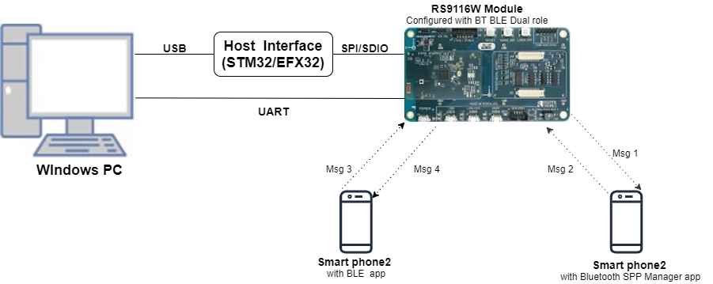

# BT/BLE Dual Mode

## 1. Purpose / Scope

This application demonstrates how information can be exchanged seamlessly using wireless protocols ( BT and BLE) running in the same device.

The BT BLE dual mode application demonstrates how information can be exchanged seamlessly using wireless protocols (BT and BLE) running in the same device.

## 2. Prerequisites / Setup Requirements

Before running the application, the user will need the following things to setup.

### 2.1 Hardware Requirements

- Windows PC with Host interface(UART/ SPI/ SDIO).
- Silicon Labs [RS9116 Wi-Fi Evaluation Kit](https://www.silabs.com/development-tools/wireless/wi-fi/rs9116x-sb-evk-development-kit)
- Host MCU Eval Kit. This example has been tested with:
   - Silicon Labs [WSTK + EFR32MG21](https://www.silabs.com/development-tools/wireless/efr32xg21-bluetooth-starter-kit)
   - Silicon Labs [WSTK + EFM32GG11](https://www.silabs.com/development-tools/mcu/32-bit/efm32gg11-starter-kit)
   - [STM32F411 Nucleo](https://st.com/)
- Smart phone/tablet with BT Application (Ex: Bluetooth SPP Pro)
- Smart phone/tablet with BLE Application (Ex: Light Blue APP for iPhone/BLE Connect APP for android)


  
  
### 2.2 Software Requirements

- [WiSeConnect SDK](https://github.com/SiliconLabs/wiseconnect-wifi-bt-sdk/)
    
- Embedded Development Environment

   - For STM32, use licensed [Keil IDE](https://www.keil.com/demo/eval/arm.htm)

   - For Silicon Labs EFx32, use the latest version of [Simplicity Studio](https://www.silabs.com/developers/simplicity-studio)
   
- Download and install the Silicon Labs [EFR Connect App](https://www.silabs.com/developers/efr-connect-mobile-app) in the android smart phones for testing BLE applications. Users can also use their choice of BLE apps available in Android/iOS smart phones. 

- Download and install the Silicon Labs [Bluetooth SPP manager](https://play.google.com/store/apps/details?id=at.rtcmanager&hl=en_IN) in the android smart phones for testing BT applications. Users can also use their choice of BT apps available in Android/iOS smart phones.

## 3. Application Build Environment

### 3.1 Platform

The Application can be built and executed on below Host platforms
* [STM32F411 Nucleo](https://st.com/)
* [WSTK + EFR32MG21](https://www.silabs.com/development-tools/wireless/efr32xg21-bluetooth-starter-kit) 
* [WSTK + EFM32GG11](https://www.silabs.com/development-tools/mcu/32-bit/efm32gg11-starter-kit)

### 3.2 Host Interface

* By default, the application is configured to use the SPI bus for interfacing between Host platforms(STM32F411 Nucleo / EFR32MG21) and the RS9116W EVK.
* This application is also configured to use the SDIO bus for interfacing between Host platforms(EFM32GG11) and the RS9116W EVK.

### 3.3 Project Configuration

The Application is provided with the project folder containing Keil and Simplicity Studio project files.

* Keil Project
  - The Keil project is used to evaluate the application on STM32.
  - Project path: `<SDK>/examples/snippets/bt_ble/bt_ble_dual_role/projects/bt_ble_dual_role-nucleo-f411re.uvprojx`

* Simplicity Studio
  - The Simplicity Studio project is used to evaluate the application on EFR32MG21.
  - Project path: 
    - If the Radio Board is **BRD4180A** or **BRD4181A**, then access the path `<SDK>/examples/snippets/bt_ble/bt_ble_dual_role/projects/bt_ble_dual_role-brd4180a-mg21.slsproj`
    - If the Radio Board is **BRD4180B** or **BRD4181B**, then access the path `<SDK>/examples/snippets/bt_ble/bt_ble_dual_role/projects/bt_ble_dual_role-brd4180b-mg21.slsproj` 
        - User can find the Radio Board version as given below 


  - EFM32GG11 platform
    - The Simplicity Studio project is used to evaluate the application on EFM32GG11.
      - Project path:`<SDK>/examples/snippets/ble/bt_ble_dual_role/projects/bt_ble_dual_role-brd2204a-gg11.slsproj`
    
### 3.4 Bare Metal/RTOS Support

This application supports bare metal/RTOS environment. By default, the application project files (Keil and Simplicity Studio) are provided with bare metal and RTOS configuration. 


## 4. Application Configuration Parameters

The application can be configured to suit your requirements and development environment. Read through the following sections and make any changes needed.

**4.1** `rsi_wlan_config.h` file and update/modify following macros,

**4.1.1** User must update the below parameters 
    
```c
#define CONCURRENT_MODE                    RSI_DISABLE
#define RSI_FEATURE_BIT_MAP                FEAT_SECURITY_OPEN
#define RSI_TCP_IP_BYPASS                  RSI_DISABLE
#define RSI_TCP_IP_FEATURE_BIT_MAP         TCP_IP_FEAT_DHCPV4_CLIENT
#define RSI_CUSTOM_FEATURE_BIT_MAP         FEAT_CUSTOM_FEAT_EXTENTION_VALID
#define RSI_EXT_CUSTOM_FEATURE_BIT_MAP     EXT_FEAT_384K_MODE 
```

**4.1.2** Open `rsi_bt_app.c` file and update/modify following macros:

 - RSI_BT_LOCAL_NAME **-** Name of the BT device

 - PIN_CODE - Four byte string required for pairing process.
 
**4.1.3** Open `rsi_ble_app.c` file and update/modify following macros,

 - RSI_BLE_NEW_SERVICE_UUID - The attribute value of the newly created service. Ex: 0xAABB

 - RSI_BLE_ATTRIBUTE_1_UUID - The attribute type of the first attribute under this Service. Ex: 0x1AA1

 - RSI_BLE_ATTRIBUTE_2_UUID - The attribute type of the second attribute under this Service. Ex: 0x1BB1

 - RSI_BLE_MAX_DATA_LEN - Maximum length of the attribute data(limited to max of 20 bytes)

 - RSI_BLE_APP_DEVICE_NAME - Name of the Silicon Labs device to appear during Scanning by peer devices.


**4.1.4** The desired parameters are provided below. User can also modify the parameters as per their needs and requirements.

**Configuring the BT task**

Following are the **non-configurable** Macros in the Application file.

 - RSI_APP_EVENT_CONNECTED - Event number to be set on connection establishment.

 - RSI_APP_EVENT_DISCONNECTED - Event number to be set on disconnection.

 - RSI_APP_EVENT_PINCODE_REQ - Event number to be set on Pincode request for pairing.

 - RSI_APP_EVENT_LINKKEY_SAVE - Event number to be set on link key save.

 - RSI_APP_EVENT_AUTH_COMPLT - Event number to be set on authentication complete.

 - RSI_APP_EVENT_LINKKEY_REQ - Event number to be set on link key request for connection.

 - RSI_APP_EVENT_SPP_CONN - Event number to be set on SPP connection.

 - RSI_APP_EVENT_SPP_DISCONN - Event number to be set on SPP disconnection.

 - RSI_APP_EVENT_SPP_RX - Event number to be set on SPP data received from Master.

**Configuring the BLE Application**


   Following are the **non-configurable** macros in the application.

 - RSI_BLE_ATT_PROPERTY_READ – Used to set read property to an attribute value.

 - RSI_BLE_ATT_PROPERTY_WRITE - Used to set write property to an attribute value.

 - RSI_BLE_ATT_PROPERTY_NOTIFY - Used to set notify property to an attribute value.

 - RSI_BLE_CHAR_SERV_UUID - The attribute type of the characteristics to be added in a service. Ex: 0x2803

 - RSI_BLE_CLIENT_CHAR_UUID - The attribute type of the client characteristics descriptor to be added in a service characteristic. Ex: 0x2902

 - BT_GLOBAL_BUFF_LEN – Number of bytes required for the Application and the Driver.


## 5. Testing the Application

Follow the steps below for the successful execution of the application.

### 5.1 Loading the RS9116W Firmware

Refer [Getting started with PC ](https://docs.silabs.com/rs9116/latest/wiseconnect-getting-started) to load the firmware into RS9116W EVK. The firmware binary is located in `<SDK>/firmware/`


### 5.2 Building the Application on the Host Platform

### 5.2.1 Using STM32

Refer [STM32 Getting Started](https://docs.silabs.com/rs9116-wiseconnect/latest/wifibt-wc-getting-started-with-efx32/)  

- Open the project `<SDK>/examples/snippets/bt_ble/bt_ble_dual_role/projects/bt_ble_dual_role-nucleo-f411re.uvprojx` in Keil IDE.
- Build and Debug the project
- Check for the RESET pin:
  - If RESET pin is connected from STM32 to RS9116W EVK, then user need not press the RESET button on RS9116W EVK before free run.
  - If RESET pin is not connected from STM32 to RS9116W EVK, then user need to press the RESET button on RS9116W EVK before free run.
- Free run the project
- Then continue the common steps from **Section 5.3**


#### 5.2.2 Using EFX32

Refer [EFx32 Getting Started](https://docs.silabs.com/rs9116-wiseconnect/latest/wifibt-wc-getting-started-with-efx32/), for settin-up EFR & EFM host platforms

- Import the EFR32/EFM32 project from `<SDK>/examples/snippets/bt_ble/bt_ble_dual_role/projects`
    - Select the appropriate .slsproj as per Radio Board type mentioned in **Section 3.3** for EFR32 board.
   (or)
    - Select the *.brd2204a-gg11.slsproj  for EFM32GG11 board.
- Compile and flash the project in to Host MCU
- Debug the project
- Check for the RESET pin:
  - If RESET pin is connected from STM32 to RS9116W EVK, then user need not press the RESET button on RS9116W EVK before free run
  - If RESET pin is not connected from STM32 to RS9116W EVK, then user need to press the RESET button on RS9116W EVK before free run
- Free run the project
- Then continue the common steps from **Section 5.3**

### 5.3 Common Steps

   1. Connect Silicon Labs device to the Windows PC running KEIL or IAR IDE

   2. Build and launch the application.

   3. After the program gets executed, Silicon Labs BT is in Discoverable state and BLE is in Advertising state.

   4. Now initiate connection from the SPP App running in the Smartphone1.

   5. In the App, Silicon Labs BT would appear with the name configured in the macro RSI_BT_LOCAL_NAME.

   6. After BT SPP connection is established, send a message from the App to Silicon Labs BT.

   7. Open a LE App in the Smartphone and do Scan.

   8. In the App, Silicon Labs BLE would appear with the name configured in the macro RSI_BLE_APP_DEVICE_NAME.

   9. Initiate BLE connection from the App.

   10. After BLE connection, user can write or read messages through BLE.

## Compressed Debug Logging

To enable the compressed debug logging feature please refer to [Logging User Guide](https://docs.silabs.com/rs9116-wiseconnect/latest/wifibt-wc-sapi-reference/logging-user-guide)