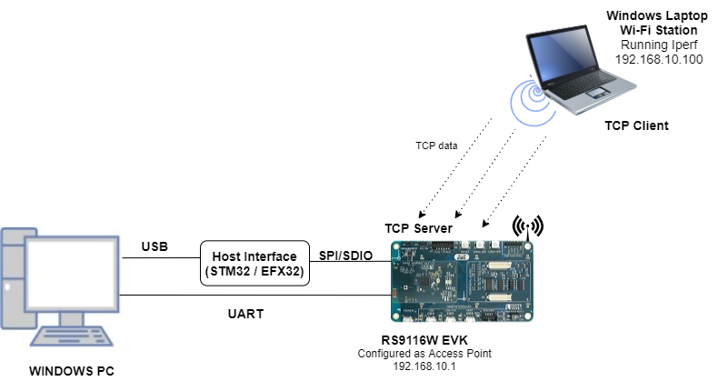
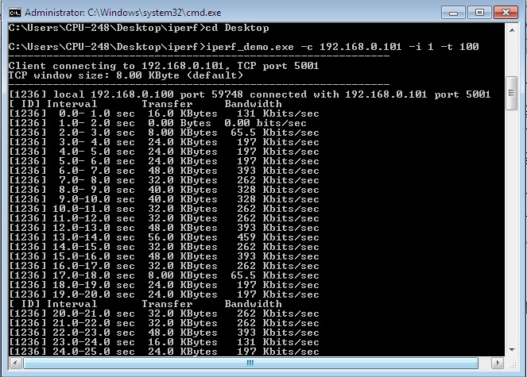

# Access Point

## 1. Purpose / Scope

This application demonstrates how to configure the RS9116W EVK as a soft Access point and allows stations to connect to it and enables TCP data transmission from the connected Wi-Fi station to Silicon Labs Access Point.

## 2. Prerequisites / Setup Requirements

Before running the application, the user will need the following things to setup.

### 2.1 Hardware Requirements 
  
* Windows PC with Host interface (UART / SPI/ SDIO).
* Silicon Labs [RS9116 Wi-Fi Evaluation Kit](https://www.silabs.com/development-tools/wireless/wi-fi/rs9116x-sb-evk-development-kit)
* Host MCU Eval Kit. This example has been tested with:
  - Silicon Labs [WSTK + EFR32MG21](https://www.silabs.com/development-tools/wireless/efr32xg21-bluetooth-starter-kit)
  - Silicon Labs [WSTK + EFM32GG11](https://www.silabs.com/development-tools/mcu/32-bit/efm32gg11-starter-kit)
  - [STM32F411 Nucleo](https://st.com/)
* Windows PC (Remote PC) with iperf application



### 2.2 Software Requirements

- [WiSeConnect SDK](https://github.com/SiliconLabs/wiseconnect-wifi-bt-sdk/).

- Embedded Development Environment.

   - For STM32, use licensed [Keil IDE](https://www.keil.com/demo/eval/arm.htm)

   - For Silicon Labs EFx32, use the latest version of [Simplicity Studio](https://www.silabs.com/developers/simplicity-studio).

   - [Iperf Application](https://iperf.fr/iperf-download.php) in Windows PC(Remote PC)

## 3. Application Build Environment

### 3.1 Platform

The Application can be built and executed on below Host platforms
* [STM32F411 Nucleo](https://st.com/)
* [WSTK + EFR32MG21](https://www.silabs.com/development-tools/wireless/efr32xg21-bluetooth-starter-kit) 
* [WSTK + EFM32GG11](https://www.silabs.com/development-tools/mcu/32-bit/efm32gg11-starter-kit)

### 3.2 Host Interface

* By default, the application is configured to use the SPI bus for interfacing between Host platforms(STM32F411 Nucleo / EFR32MG21) and the RS9116W EVK.
* This application is also configured to use the SDIO bus for interfacing between Host platforms(EFM32GG11) and the RS9116W EVK.

### 3.3 Project Configuration

The Application is provided with the project folder containing Keil and Simplicity Studio project files.

* Keil Project
  - The Keil project is used to evaluate the application on STM32.
  - Project path: `<SDK>/examples/snippets/wlan/access_point/projects/access_point-nucleo-f411re.uvprojx`

* Simplicity Studio
  - The Simplicity Studio project is used to evaluate the application on EFR32MG21.
  - Project path: 
    - If the Radio Board is **BRD4180A** or **BRD4181A**, then access the path `<SDK>/examples/snippets/wlan/access_point/projects/access_point-brd4180a-mg21.slsproj`
    - If the Radio Board is **BRD4180B** or **BRD4181B**, then access the path `<SDK>/examples/snippets/wlan/access_point/projects/access_point-brd4180b-mg21.slsproj`
    - User can find the Radio Board version as given below 


  - EFM32GG11 platform
    - The Simplicity Studio project is used to evaluate the application on EFM32GG11.
      - Project path:`<SDK>/examples/snippets/wlan/access_point/projects/access_point-brd2204a-gg11.slsproj`

### 3.4 Bare Metal/RTOS Support

This application supports bare metal and RTOS environment. By default, the application project files (Keil and Simplicity studio) are provided with bare metal configuration in the SDK. 

## 4. Application Configuration Parameters

The application can be configured to suit user requirements and development environment. Read through the following sections and make any changes needed.

### 4.1  Open rsi_ap_start.c file 

#### 4.1.1 The desired parameters are provided below. User can also modify the parameters as per their needs and requirements.

SSID refers to the name of the Access point to be created.

```c
#define SSID                                 "SILABS_AP"
```

CHANNEL_NO refers to the channel in which AP would be started

```c
#define CHANNEL_NO                           11
```

SECURITY_TYPE refers type of security. Access point supports Open, WPA, WPA2 securities.

   Valid configurations are:

   - RSI_OPEN - For OPEN security mode

   - RSI_WPA - For WPA security mode

   - RSI_WPA2 - For WPA2 security mode

```c
#define SECURITY_TYPE                        RSI_WPA2
```

ENCRYPTION_TYPE refers to the type of Encryption method. Access point supports OPEN, TKIP, CCMP encryption methods.

Valid configurations are:

   - RSI_CCMP - For CCMP encryption

   - RSI_TKIP - For TKIP encryption

   - RSI_NONE - For open encryption

```c
#define ENCRYPTION_TYPE                      RSI_CCMP
```

PSK refers to the secret key if the Access point to be configured in WPA/WPA2 security modes.

```c
#define PSK                      "1234567890"            
```

BEACON_INTERVAL refers to the time delay between two consecutive beacons in milliseconds. Allowed values are integers from 100 to 1000 which are multiples of 100.

```c
#define BEACON_INTERVAL                      100
```

DTIM_INTERVAL refers DTIM interval of the Access Point. Allowed values are from 1 to 255.

```c
#define DTIM_INTERVAL                        4
```

DEVICE_PORT port refers TCP server port number

```c
#define DEVICE_PORT                          5001
```

NUMEBR_OF_PACKETS refers how many packets to receive from remote TCP client.

```c
#define NUMBER_OF_PACKETS                    1000
```

GLOBAL_BUFF_LEN refers the memory length for driver

```c
#define GLOBAL_BUFF_LEN                      15000
```

RECV_BUFFER_SIZE refers receive data length

```c
#define RECV_BUFFER_SIZE                      1000
```

IP address to be configured to the device should be in long format and in little endian byte order.

   Example: To configure "192.168.10.1" as IP address, update the macro DEVICE_IP as 0x010AA8C0.

```c
#define DEVICE_IP                            0X010AA8C0
```

IP address of the gateway should also be in long format and in little endian byte order

   Example: To configure "192.168.10.1" as Gateway, update the macro GATEWAY as 0x010AA8C0

```c
#define GATEWAY                              0x010AA8C0
```

IP address of the network mask should also be in long format and in little endian byte order

   Example: To configure "255.255.255.0" as network mask, update the macro NETMASK as 0x00FFFFFF

```c
#define NETMASK                              0x00FFFFFF
```


### 4.2 Open rsi_wlan_config.h file. User can also modify the below parameters as per their needs and requirements.


```c
#define CONCURRENT_MODE                      RSI_DISABLE
#define RSI_FEATURE_BIT_MAP                  FEAT_SECURITY_PSK
#define RSI_TCP_IP_BYPASS                    RSI_DISABLE
#define RSI_TCP_IP_FEATURE_BIT_MAP           TCP_IP_FEAT_DHCPV4_SERVER
#define RSI_BAND                             RSI_BAND_2P4GHZ
```

## 5. Testing the Application

User has to follow the below steps for the successful execution of the application. 

### 5.1 Loading the RS9116W Firmware

Refer [Getting started with a PC](https://docs.silabs.com/rs9116/latest/wiseconnect-getting-started) to load the firmware into RS9116W EVK. The firmware file is located in `<SDK>/firmware/`


### 5.2 Building the Application on Host Platform

#### 5.2.1 Using STM32

Refer [Getting started with STM32](https://docs.silabs.com/rs9116-wiseconnect/latest/wifibt-wc-getting-started-with-stm32/)

- Open the project `<SDK>/examples/snippets/wlan/access_point/projects/access_point-nucleo-f411re.uvprojx`
- Build and Debug the project
- Check for the RESET pin:
  - If RESET pin is connected from STM32 to RS9116W EVK, then user need not press the RESET button on RS9116W EVK before free run.
  - If RESET pin is not connected from STM32 to RS9116 , then user need to press the RESET button on RS9116W EVK before free run.
- Free run the project
- Then continue the common steps from **5.3**

#### 5.2.2 Using EFX32

Refer [Getting started with EFX32](https://docs.silabs.com/rs9116-wiseconnect/latest/wifibt-wc-getting-started-with-efx32/), for settin-up EFR & EFM host platforms

- Open Simplicity Studio and import the EFR32/EFM32 project from `<SDK>/examples/snippets/wlan/access_point/projects`
    - Select the appropriate .slsproj as per Radio Board type mentioned in **Section 3.3** for EFR32 board.
   (or)
    - Select the *.brd2204a-gg11.slsproj  for EFM32GG11 board.
- Compile and flash the project in to Host MCU
- Debug the project
- Check for the RESET pin:
  - If RESET pin is connected from STM32 to RS9116W EVK, then user need not press the RESET button on RS9116W EVK before free run
  - If RESET pin is not connected from STM32 to Rs9116W EVK, then user need to press the RESET button on RS9116W EVK before free run
- Free run the project
- Then continue the common steps from **5.3**

### 5.3 Common Steps

1. After program gets executed, RS9116W EVK will be created as an Access Point with configured **SSID** ( Ex: "**SILABS_AP"**) and opens TCP server socket on **DEVICE_PORT** and waits for TCP connection request from TCP client. Now scan and connect to Device Access Point (Ex: "SILABS_AP" is the AP name) from Laptop.

2. After successful connection, open iperf application from remote PC command Prompt.

3. Connect to TCP Server running on RS9116W EVK using below command 

    `iperf.exe -c <DEVICE_IP> -p <DEVICE_PORT> -i 1 -t 100`


4. The RS9116W EVK accepts connection request and receives data on the TCP server port and exit after receiving configured NUMBER_OF_PACKETS



## Compressed Debug Logging

To enable the compressed debug logging feature please refer to [Logging User Guide](https://docs.silabs.com/rs9116-wiseconnect/latest/wifibt-wc-sapi-reference/logging-user-guide)